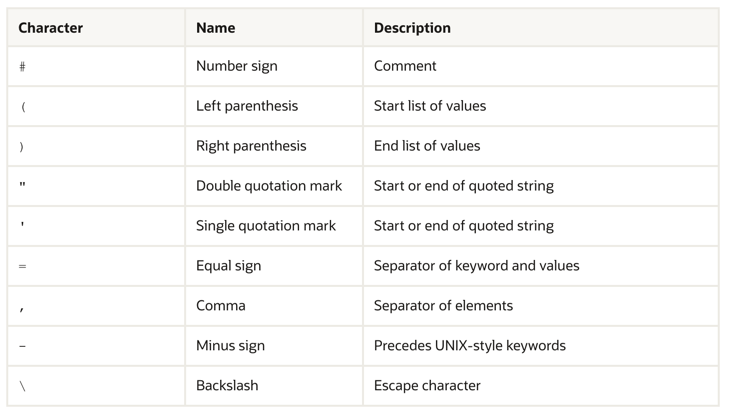

# 参数文件

一个参数文件是一个包含了初始化参数列表以及每一个参数所对应的值的文件.

你能够在反映你特定安装的参数文件中指定一个初始化参数。

Oracle 支持以下两种类型的参数文件:

- 服务器参数文件
- 初始化参数文件

# 服务器参数文件

一个服务器参数文件是一个二进制文件 - 能够作为初始化参数的仓库。

服务器参数文件能够留在计算机上 - Oracle数据库服务器所在计算机上。

服务器参数文件可以驻留在执行 Oracle 数据库服务器的计算机上。存储在服务器参数文件中的初始化参数是持久的，因为在实例运行时对参数所做的任何更改都可以在实例关闭和启动期间持续存在。
> 也可以查看：
> [Oracle 数据库管理员指南](https://docs.oracle.com/pls/topic/lookup?ctx=en/database/oracle/oracle-database/23/refrn&id=ADMIN00202) 了解介绍以及管理和使用服务器参数文件和初始化参数文件的详细信息。

# 初始化参数文件
一个初始化参数文件是一个文本文件 - 其中包含了初始化参数列表。
> 注意: 有关参数值的字符集信息 - 当在初始化参数文件中指定值所使用的字符集了解更多信息请查看[此文档](https://docs.oracle.com/en/database/oracle/oracle-database/23/refrn/parameter-files.html#GUID-3A2CEFD2-D391-4CD3-9767-C4FD0FA98F8A)。

以下是一个示例 - 在初始化参数文件中的条目:
```text
PROCESSES = 100
OPEN_LINKS = 12
GLOBAL_NAMES = true

```
初始化参数文件的名称因操作系统而异。例如，它可以是大小写混合或小写，或者可以具有逻辑名称或名称 init.ora 的变体。还提供了一个 initdw.ora 文件，其中包含数据仓库和数据集市的建议参数设置。数据库管理员可以为初始化参数文件选择不同的文件名。

为了了解初始化参数文件位于操作系统上的文件名称和默认位置 - 参考操作系统特定的Oracle文档 。

初始化参数文件将会被客户端工具读取被用来启动服务器(例如 SQL *Plus);

示例初始化参数文件在Oracle的每一个操作系统发行介质上提供. 一个示例文件对于最初使用是足够的,但是你可能想要修改文件去调整数据库达到最佳性能。
任何改变将是有效的 - 在你完全停止并重启服务器实例之后。

### 参数值的字符集

仅仅来自数据库平台的默认字符集在参数值中是支持的. 对于所有平台除了 IBM z/OS 以及 Fujitsu BS2000,默认的平台字符集是`US7ASCII` (7-bit ASCII);

数据库的行为是未定义的 - 当参数值使用了未支持的字符. 当使用`ALTER SYSTEM` 语句去在服务器参数文件中设置参数值的时候,确保仅仅只有支持的字符将被使用。

数据库并不总是会报告一个错误 - 当未支持字符的值指定了。

初始化参数文件是一个客户端文件, 当使用的时候它位于用来使用SQL *Plus去启动一个数据库实例的主机上,初始化参数文件必须基于客户端字符集来编写 - 字符集通过
客户端配置`NLS_LANG` 指定. 

然而,参数值应该不包含数据库默认字符集不支持的字符。

也就是说文件编码基于客户端配置,而参数值在文件正确读取之后,数据本身编码应该要符合数据库默认编码集。

### 初始化参数文件中指定值
这部分描述了在初始化参数文件中设置参数值的各个方面。
#### 规则调整初始化参数

这部分描述了在初始化参数文件中的参数的调整规范的规则:

- 一个初始化参数文件应该仅能包含参数和注释.  井号([Pound sign](https://zh.wikipedia.org/wiki/%C2%A3))作为注释行的开头,这行的其他内容将会被忽略。
- 注释必须使用参数值一样的字符集。
- 你能够以任何顺序指定 参数。
- 仅当大小写在主机操作系统上很重要时，文件名中的大小写（大写或小写）才有意义。
- 为了在一行中输入多个参数,在参数名和值之间使用空格,正如下所示:
    ```text
     PROCESSES = 100 CPU_COUNT = 1 OPEN_CURSORS = 10
    ```
- 某些参数,例如`ROLLBACK_SEGEMENTS`,接受多个值,下面给出了有效语法:
  - 多个值包括在一个括号中,并且通过逗号分隔。
      ```text
      ROLLBACK_SEGMENTS = (SEG1, SEG2, SEG3, SEG4, SEG5) 
      ```
  - 出现多个值而没有括号和逗号,例如 
    ```text
    ROLLBACK_SEGMENTS = SEG1 SEG2 SEG3 SEG4 SEG5
    ```
  - 出现多个值,一行一个,例如
    ```text
    ROLLBACK_SEGMENTS = SEG1
    ROLLBACK_SEGMENTS = SEG2
    ROLLBACK_SEGMENTS = SEG3
    ROLLBACK_SEGMENTS = SEG4
    ROLLBACK_SEGMENTS = SEG5
    ```
    如果你为一个参数输入的值出现了多行,那么这些条目必须是一个连续行,如果不是,那么第一项则可能不会正确处理,例如,下面的条目为SEG3以及SEG4设置将会覆盖
   SEG1 和SEG2
    ```text
    ROLLBACK_SEGMENTS = SEG1 SEG2
    OPEN_CURSORS = 10
    ROLLBACK_SEGMENTS = SEG3 SEG4
    ```
  - 反斜杠 (\)，也称为转义字符，表示参数规范的延续。如果反斜杠继续一行，则连续行不能有前导空格。例如：
    ```text
    ROLLBACK_SEGMENTS = (SEG1, SEG2, \
    SEG3, SEG4, SEG5)
    ```
  - 你能够使用`IFILE` 初始化参数去嵌入其他初始化参数文件到当前初始化文件中.
  - 将包含空格或制表符的任何参数值括在引号中。除非另有说明，您可以使用单引号或双引号。例如：
   
     ```text
      NLS_TERRITORY = 'CZECH REPUBLIC'
     ```
    > 注意到在初始化参数文件中以字符顺序列出的参数能够帮助你去发现它们并且能够帮助去确保每一个参数仅指定了一次。
  - 包含一个特殊字符的任何参数值必须包含在引号中。

> 查看:
> 查看特定操作系统的Oracle 文档了解初始化参数文件的更多信息.
> 
> [IFILE](https://docs.oracle.com/en/database/oracle/oracle-database/23/refrn/IFILE.html#GUID-F8AC6FC6-F456-481F-8997-3B0E906BB745)

#### 为参数值使用表达式

您可以指定一个表达式作为初始化参数的值。
初始化参数的最佳值可以取决于环境特征，例如系统配置、运行时决策和其他参数的值。在之前的版本中，设置初始化参数时需要指定绝对值，这意味着维持其最佳值需要手动监督和调整。从Oracle Database 21c开始，您可以指定表达式作为某些初始化参数的值，这使得数据库能够根据环境变化自动调整参数值。
为参数值指定表达式在 Oracle Real Application Cluster (Oracle RAC) 环境中也很有用。您可以在所有 Oracle RAC 实例中为参数值指定相同的表达式，但该表达式将利用当前实例的环境特征针对每个实例进行计算。这允许数据库微调每个 Oracle RAC 实例的参数值。
您只能为整数或大整数类型的初始化参数指定表达式。

初始化参数表达式可以包含以下结构：
1. 整数值

```text
OLAP_PAGE_POOL_SIZE = 1073741824
```
2. 小数值,但是仅当它作为数字计算的一部分

```text
CPU_COUNT = 8 * 0.6
```
如果操作评估为一个小数值,那么结果将会截断为一个整数值. 上面的示例中将会设置`CPU_COUNT` 为4.

3. 一个整数值能够跟随一个指示器 - 表示这个整数为 千字节(k/K),兆字节(M/m), (g/G),(t/T),(p/P) 或者 (e/E);
```text
OLAP_PAGE_POOL_SIZE = 900m
MEMORY_TARGET = 2G
```
4. 其他参数名称
```text
JOB_QUEUE_PROCESSES = PROCESSES
```
5. 二元操作符[加减乘除]
```text
SHARED_SERVERS = MAX_SHARED_SERVERS / 2
DATA_GUARD_MAX_LONGIO_TIME = DATA_GUARD_MAX_IO_TIME + 10 * 3
```
6. 括号,这允许你去覆盖操作符优先级
```text
SHARED_SERVERS = (MAX_SHARED_SERVERS - 1) / 2
DATA_GUARD_MAX_LONGIO_TIME = (DATA_GUARD_MAX_IO_TIME + 10) * 3
```
7. `MIN` 以及 `MAX` 函数,这些函数需要两个操作数并且返回最小值和最大值(分别的).
```text
AQ_TM_PROCESSES = MIN(40, PROCESSES * .1)
SESSIONS = MAX(200, PROCESSES * 1.5)
```
8. 环境变量值,必须通过$符号前导。
```text
CPU_COUNT = $SYSTEM_CPU/5
```
你能够指定一个表达式 - 当使用下面的任意方法去设置初始化参数时:
- 在服务器参数文件中(SPFILE)
- 在文本初始化参数文件中,例如 `initORACLE_SID.ora`

    注意你不能再客户端文本初始化参数文件中使用表达式(PFILE);
- 在SQL语句中`ALTER SESSION SET` 以及 `ALTER SYSTEM SET`. 在这种情况下你必须在单引号中包裹表达式。
    
    ```text
        ALTER SESSION SET AQ_TM_PROCESSES = 'MIN(40, PROCESSES * .1)';
        ALTER SYSTEM SET JOB_QUEUE_PROCESSES = 'PROCESSES' SCOPE=BOTH;
    ```
  
### 在参数值中使用特殊字符
如果参数值中包含特殊字符,那么特殊字符必须前导反斜杠或者整个参数值必须包括在引号中。

例如,你能够指定特殊字符 - 使用以下任意方式:
```text
DB_DOMAIN = 'JAPAN.ACME#.COM'

DB_DOMAIN = JAPAN.ACME\#.COM
```
table2-1 列出了能够在初始化参数文件中使用的特殊字符:


如果必须在初始化参数文件中按字面意思处理特殊字符，则它前面必须带有反斜杠字符，或者包含特殊字符的整个字符串必须用引号引起来。

### 使用转义字符
在初始化参数文件中，反斜杠 (\) 也可以表示行继续。如果反斜杠后跟字母数字字符，则反斜杠将被视为输入中的普通字符。

如果后面没有字母数字字符，则反斜杠将被视为反斜杠或连续字符。
> 也可以查看初始化参数文件的规则治理。

### 使用引号

引号可以在初始化参数文件中以两种方式嵌套。

- 第一种方法是在嵌套字符串中加两个引号。例如：
```text
NLS_DATE_FORMAT = '''Today is'' MM/DD/YYYY'
```
- 第二种方法是交替使用单引号和双引号。例如:
```text
NLS_DATE_FORMAT = '"Today is" MM/DD/YYYY'
```