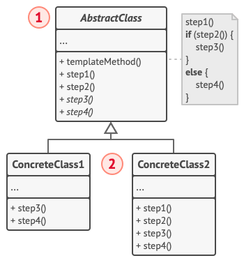

# 模版方法模式

## 意图

主要目的就是,提供一个功能的大体轮廓,然后通过继承的方式,来对功能的细节进行层层定制,但是在最外层,仅有一个模版方法将所有大致方法进行汇总
使用,但是在各个泛化子类中可能又会定义自己的模版方法 来实现设计模式复用,特点就是继承实现模版方法模式。。

参考其他人的解释:
模板方法模式 (Template Method) 是一种行为设计模式， 它在超类中定义了一个算法的框架， 允许子类在不修改结构的情况下重写算法的特定步骤。

模板方法模式是所有模式中最为常见的几个模式之一，是基于继承的代码复用的基本技术。，没有关联关系。 因此，在模板方法模式的类结构图中，只有继承关系。

模板方法模式需要开发抽象类和具体子类的设计师之间的协作。一个设计师负责给出一个算法的轮廓和骨架，另一些设计师则负责给出这个算法的各个逻辑步骤。

代表这些具体逻辑步骤的方法称做基本方法(primitive method)；而将这些基本方法汇总起来的方法叫做模板方法(template method)，这个设计模式的名字就是从此而来。

在模板方法模式中，首先父类会定义一个算法的框架，即实现算法所必须的所有方法。

其中，具有共性的代码放在父类的具体方法中。

各个子类特殊性的代码放在子类的具体方法中。但是父类中需要有对应抽象方法声明。

钩子方法可以让子类决定是否对算法的不同点进行挂钩。


## 适用场景

- 当你只希望客户端扩展某个特定算法步骤， 而不是整个算法或其结构时， 可使用模板方法模式。
- 当多个类的算法除一些细微不同之外几乎完全一样时， 你可使用该模式。 但其后果就是， 只要算法发生变化， 你就可能需要修改所有的类。


## 结构


### 结构说明
- 抽象类 （AbstractClass） 会声明作为算法步骤的方法， 以及依次调用它们的实际模板方法。 算法步骤可以被声明为 抽象类型， 也可以提供一些默认实现。
- 具体类 （ConcreteClass） 可以重写所有步骤， 但不能重写模板方法自身。

### 结构代码范式

- AbstractClass : 抽象类，定义并实现一个模板方法。这个模板方法定义了算法的骨架，而逻辑的组成步骤在相应的抽象操作中，推迟到子类去实现。顶级逻辑也有可能调用一些具体方法。
```java
abstract class AbstractClass {
    public abstract void PrimitiveOperation1();
    public abstract void PrimitiveOperation2();

    public void TemplateMethod() {
        PrimitiveOperation1();
        PrimitiveOperation2();
    }
}
```
- ConcreteClass : 实现实现父类所定义的一个或多个抽象方法 。
```java
class ConcreteClassA extends AbstractClass {
    @Override
    public void PrimitiveOperation1() {
        System.out.println("具体A类方法1");
    }

    @Override
    public void PrimitiveOperation2() {
        System.out.println("具体A类方法2");
    }
}

class ConcreteClassB extends AbstractClass {
    @Override
    public void PrimitiveOperation1() {
        System.out.println("具体B类方法1");
    }

    @Override
    public void PrimitiveOperation2() {
        System.out.println("具体B类方法2");
    }
}
```

- 客户端
```java
public class TemplateMethodPattern {
    public static void main(String[] args) {
        AbstractClass objA = new ConcreteClassA();
        AbstractClass objB = new ConcreteClassB();
        objA.TemplateMethod();
        objB.TemplateMethod();
    }
}
```

## 与其他模式的关系

- 工厂方法模式是模板方法模式的一种特殊形式。 同时， 工厂方法可以作为一个大型模板方法中的一个步骤。
- 模板方法基于继承机制： 它允许你通过扩展子类中的部分内容来改变部分算法。 策略模式基于组合机制： 你可以通过对相应行为提供不同的策略来改变对象的部分行为。 模板方法在类层次上运作， 因此它是静态的。 策略在对象层次上运作， 因此允许在运行时切换行为。

    但是通过策略模式 结合模版方法模式,会使得模版算法能够策略运作 ..
    
    或者说结合工厂方法模式(本质上为了灵活,内部也可以使用策略模式来策略生成对象) 和模版方法模式,使得模版算法能够策略运作 ..


## 主要参考文章

- https://github.com/dunwu/dunwu.github.io/blob/main/docs/03.%E8%AE%BE%E8%AE%A1/02.%E8%AE%BE%E8%AE%A1%E6%A8%A1%E5%BC%8F/14.%E6%A8%A1%E6%9D%BF%E6%96%B9%E6%B3%95%E6%A8%A1%E5%BC%8F.md

    写的不错