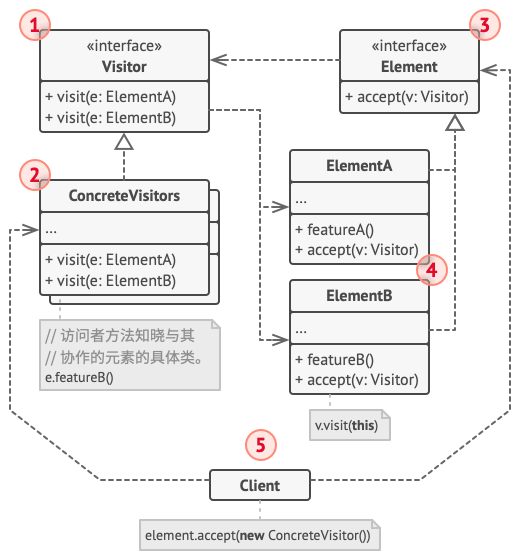

# 访问者模式
访问者模式（Visitor） 是一种行为设计模式， 它能将算法与其所作用的对象隔离开来。

另一方面也是为了解耦,为了不像中介者模式那样,将所有的逻辑留在中介者中,代码臃肿庞大 ..

这样做的目的也是为了让对应的业务逻辑存在于对应的类中,而不会和所作用的类耦合 ..

## 使用场景
- 对一个复杂的数据结构(例如对象树 或者抽象语法树)的所有元素执行某些操作,可以使用访问者模式 ..
- 使用访问者模式来清理辅助行为的业务逻辑 ...
    
    例如对一个对象的数据填充,完全可以放到单独的业务类中,而不是全部放到这个对象中,便于解耦,或者说这个对象需要一个另一个对象,
    但是此对象的构建过程(自建) 应该也许可以放到自己的业务类中,而不是当前类中,当前对象只需要传递自己而得到一个对象的引用来使用即可 ..

## 结构


此模式的重心就是访问者,本质上访问者不再强制关联自己需要访问的对象类型,而是被动的基于目标对象的业务处理而传递访问对象类型来实现对对象的访问 ..

- 访问者 （Visitor） 接口声明了一系列以对象结构的具体元素为参数的访问者方法。 如果编程语言支持重载， 这些方法的名称可以是相同的， 但是其参数一定是不同的。
- 具体访问者 （Concrete Visitor） 会为不同的具体元素类实现相同行为的几个不同版本。
- 元素 （Element） 接口声明了一个方法来 “接收” 访问者。 该方法必须有一个参数被声明为访问者接口类型。
- 具体元素 （Concrete Element） 必须实现接收方法。 该方法的目的是根据当前元素类将其调用重定向到相应访问者的方法。 请注意， 即使元素基类实现了该方法， 所有子类都必须对其进行重写并调用访问者对象中的合适方法。
- 客户端 （Client） 通常会作为集合或其他复杂对象 （例如一个组合树） 的代表。 客户端通常不知晓所有的具体元素类， 因为它们会通过抽象接口与集合中的对象进行交互。

这个过程就白话就是,访问者很懒,你只需要给我一个这样的东西就好了,我不想去寻找,而元素就说好吧,我有就给你 ...
这样就没有强制要求,元素必须给一个什么东西 ..

### 结构代码范式
- Visitor: 为该对象结构中 ConcreteElement 的每一个类声明一个 Visit 操作。
```java
abstract class Visitor {
    public abstract void VisitConcreteElementA(ConcreteElementA elementA);
    public abstract void VisitConcreteElementB(ConcreteElementB elementB);
}
```
- ConcreteVisitor : 实现每个由 Visitor 声明的操作。每个操作实现算法的一部分，而该算法片段乃是对应于结构中对象的类。
```java
class ConcreteVisitor1 extends Visitor {
    @Override
    public void VisitConcreteElementA(ConcreteElementA elementA) {
        System.out.println(this.getClass().getName() + " 访问 " + elementA.getClass().getName());
    }

    @Override
    public void VisitConcreteElementB(ConcreteElementB elementB) {
        System.out.println(this.getClass().getName() + " 访问 " + elementB.getClass().getName());
    }
}

class ConcreteVisitor2 extends Visitor {
    @Override
    public void VisitConcreteElementA(ConcreteElementA elementA) {
        System.out.println(this.getClass().getName() + " 访问 " + elementA.getClass().getName());
    }

    @Override
    public void VisitConcreteElementB(ConcreteElementB elementB) {
        System.out.println(this.getClass().getName() + " 访问 " + elementB.getClass().getName());
    }
}
```
- Element : 定义一个 Accpet 操作，它以一个访问者为参数。
```java
abstract class Element {
    public abstract void Accept(Visitor visitor);
}
```
- ConcreteElement : 实现 Element 声明的 Accept 操作。
```java
class ConcreteElementA extends Element {
    @Override
    public void Accept(Visitor visitor) {
        visitor.VisitConcreteElementA(this);
    }
}

class ConcreteElementB extends Element {
    @Override
    public void Accept(Visitor visitor) {
        visitor.VisitConcreteElementB(this);
    }
}
```
- ObjectStructure : 可以枚举它的元素，可以提供一个高层的接口以允许访问者访问它的元素。
这种表示一种复杂的数据对象结构 .. 从而实现批量的访问 ..
```java
class ObjectStructure {
    private List<Element> elements = new ArrayList<Element>();

    public void Attach(Element element) {
        elements.add(element);
    }

    public void Detach(Element element) {
        elements.remove(element);
    }

    public void Accept(Visitor visitor) {
        for (Element elem : elements) {
            elem.Accept(visitor);
        }
    }
}
```

- 客户端
```java
public class VisitorPattern {
    public static void main(String[] args) {
        ObjectStructure o = new ObjectStructure();
        o.Attach(new ConcreteElementA());
        o.Attach(new ConcreteElementB());

        ConcreteVisitor1 v1 = new ConcreteVisitor1();
        ConcreteVisitor2 v2 = new ConcreteVisitor2();

        o.Accept(v1);
        o.Accept(v2);
    }
}
```

从这种代码结构不难看出,它也很容易实现策略,以及去掉if-else ...

## 伪代码
下面的示例中通过访问者模式来实现对不同类型的几何图层 xml文件导出 ..

```groovy
// 元素接口声明了一个`accept（接收）`方法，它会将访问者基础接口作为一个参
// 数。
interface Shape is
    method move(x, y)
    method draw()
    method accept(v: Visitor)

// 每个具体元素类都必须以特定方式实现`accept`方法，使其能调用相应元素类的
// 访问者方法。
class Dot implements Shape is
    // ...

    // 注意我们正在调用的`visitDot（访问点）`方法与当前类的名称相匹配。
    // 这样我们能让访问者知晓与其交互的元素类。
    method accept(v: Visitor) is
        v.visitDot(this)

class Circle implements Shape is
    // ...
    method accept(v: Visitor) is
        v.visitCircle(this)

class Rectangle implements Shape is
    // ...
    method accept(v: Visitor) is
        v.visitRectangle(this)

class CompoundShape implements Shape is
    // ...
    method accept(v: Visitor) is
        v.visitCompoundShape(this)


// 访问者接口声明了一组与元素类对应的访问方法。访问方法的签名能让访问者准
// 确辨别出与其交互的元素所属的类。
interface Visitor is
    method visitDot(d: Dot)
    method visitCircle(c: Circle)
    method visitRectangle(r: Rectangle)
    method visitCompoundShape(cs: CompoundShape)

// 具体访问者实现了同一算法的多个版本，而且该算法能与所有具体类进行交互。
//
// 访问者模式在复杂对象结构（例如组合树）上使用时能发挥最大作用。在这种情
// 况下，它可以存储算法的一些中间状态，并同时在结构中的不同对象上执行访问
// 者方法。这可能会非常有帮助。
class XMLExportVisitor implements Visitor is
    method visitDot(d: Dot) is
        // 导出点（dot）的 ID 和中心坐标。

    method visitCircle(c: Circle) is
        // 导出圆（circle）的 ID 、中心坐标和半径。

    method visitRectangle(r: Rectangle) is
        // 导出长方形（rectangle）的 ID 、左上角坐标、宽和长。

    method visitCompoundShape(cs: CompoundShape) is
        // 导出图形（shape）的 ID 和其子项目的 ID 列表。


// 客户端代码可在不知晓具体类的情况下在一组元素上运行访问者操作。“接收”操
// 作会将调用定位到访问者对象的相应操作上。
class Application is
    field allShapes: array of Shapes

    method export() is
        exportVisitor = new XMLExportVisitor()

        foreach (shape in allShapes) do
            shape.accept(exportVisitor)
```

## 案例
这里是 Java 程序库代码中该模式的一些示例：

- javax.lang.model.element.AnnotationValue 和 AnnotationValueVisitor
- javax.lang.model.element.Element 和 ElementVisitor
- javax.lang.model.type.TypeMirror 和 TypeVisitor
- java.nio.file.FileVisitor 和 SimpleFileVisitor
- javax.faces.component.visit.VisitContext 和 VisitCallback


## 参考

### 与其他模式的关系
- 你可以将访问者模式视为命令模式的加强版本， 其对象可对不同类的多种对象执行操作。(因为访问者就像是被封装的执行的操作的对象,由元素来决定是否执行对应的某一个类型的方法调用) ..
- 你可以使用访问者对整个组合模式树执行操作。
- 可以同时使用访问者和迭代器模式来遍历复杂数据结构， 并对其中的元素执行所需操作， 即使这些元素所属的类完全不同。