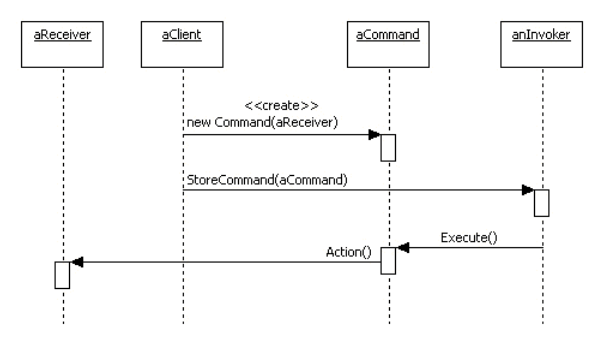
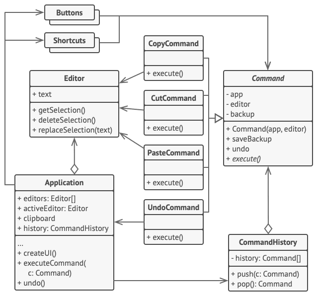

# 命令模式

## 意图
命令模式（Command） 是一种行为设计模式， 它可将请求转换为一个包含与请求相关的所有信息的独立对象。 该转换让你能根据不同的请求将方法参数化、 延迟请求执行或将其放入队列中， 且能实现可撤销操作。

    这个其实很类似于,例如方法反射调用(将调用过程封装为一个Invocation类,而这个类就是包含了所有与请求相关的所有信息的独立对象) ... 并且是否执行取决于策略,
    例如spring中的 AfterThrowingAdvice 根据是否抛出异常来决定执行通知 ..




其实在spring对aop的设计中,也可以看作是命令模式,它的advice执行是责任链模式,我们只需要看aop本身执行过程 - 大体流程可以分解为两部分,
1. 发送者封装命令执行所需参数,以及接受者(也就是目标业务执行方法,以及所需参数)
2. 客户端执行代码逻辑,判断invoker 是否执行命令(是否执行业务方法,也就是接受者的方法执行) ..

## 伪代码

剪切板就是一个最好的示例


有些命令会改变编辑器的状态 （例如剪切和粘贴）， 它们可在执行相关操作前对编辑器的状态进行备份。 命令执行后会和当前点备份的编辑器状态一起被放入命令历史 （命令对象栈）。 此后， 如果用户需要进行回滚操作， 程序可从历史记录中取出最近的命令， 读取相应的编辑器状态备份， 然后进行恢复。

在这个示例中,Application就是一个客户端,负责整个功能流程的调度 ...

其次,客户端代码也包括(GUI 元素和命令历史),它们总体被应用关联 ..

客户端代码 （GUI 元素和命令历史等） 没有和具体命令类相耦合， 因为它通过命令接口来使用命令。 这使得你能在无需修改已有代码的情况下在程序中增加新的命令。

```groovy
// 命令基类会为所有具体命令定义通用接口。
abstract class Command is
    protected field app: Application
    protected field editor: Editor
    protected field backup: text

    constructor Command(app: Application, editor: Editor) is
        this.app = app
        this.editor = editor

    // 备份编辑器状态。
    method saveBackup() is
        backup = editor.text

    // 恢复编辑器状态。
    method undo() is
        editor.text = backup

    // 执行方法被声明为抽象以强制所有具体命令提供自己的实现。该方法必须根
    // 据命令是否更改编辑器的状态返回 true 或 false。
    abstract method execute()


// 这里是具体命令。
class CopyCommand extends Command is
    // 复制命令不会被保存到历史记录中，因为它没有改变编辑器的状态。
    method execute() is
        app.clipboard = editor.getSelection()
        return false

class CutCommand extends Command is
    // 剪切命令改变了编辑器的状态，因此它必须被保存到历史记录中。只要方法
    // 返回 true，它就会被保存。
    method execute() is
        saveBackup()
        app.clipboard = editor.getSelection()
        editor.deleteSelection()
        return true

class PasteCommand extends Command is
    method execute() is
        saveBackup()
        editor.replaceSelection(app.clipboard)
        return true

// 撤销操作也是一个命令。
class UndoCommand extends Command is
    method execute() is
        app.undo()
        return false


// 全局命令历史记录就是一个堆桟。
class CommandHistory is
    private field history: array of Command

    // 后进...
    method push(c: Command) is
        // 将命令压入历史记录数组的末尾。

    // ...先出
    method pop():Command is
        // 从历史记录中取出最近的命令。


// 编辑器类包含实际的文本编辑操作。它会担任接收者的角色：最后所有命令都会
// 将执行工作委派给编辑器的方法。
class Editor is
    field text: string

    method getSelection() is
        // 返回选中的文字。

    method deleteSelection() is
        // 删除选中的文字。

    method replaceSelection(text) is
        // 在当前位置插入剪贴板中的内容。

// 应用程序类会设置对象之间的关系。它会担任发送者的角色：当需要完成某些工
// 作时，它会创建并执行一个命令对象。
class Application is
    field clipboard: string
    field editors: array of Editors
    field activeEditor: Editor
    field history: CommandHistory

    // 将命令分派给 UI 对象的代码可能会是这样的。
    method createUI() is
        // ...
        copy = function() { executeCommand(
            new CopyCommand(this, activeEditor)) }
        copyButton.setCommand(copy)
        shortcuts.onKeyPress("Ctrl+C", copy)

        cut = function() { executeCommand(
            new CutCommand(this, activeEditor)) }
        cutButton.setCommand(cut)
        shortcuts.onKeyPress("Ctrl+X", cut)

        paste = function() { executeCommand(
            new PasteCommand(this, activeEditor)) }
        pasteButton.setCommand(paste)
        shortcuts.onKeyPress("Ctrl+V", paste)

        undo = function() { executeCommand(
            new UndoCommand(this, activeEditor)) }
        undoButton.setCommand(undo)
        shortcuts.onKeyPress("Ctrl+Z", undo)

    // 执行一个命令并检查它是否需要被添加到历史记录中。
    method executeCommand(command) is
        if (command.execute)
            history.push(command)

    // 从历史记录中取出最近的命令并运行其 undo（撤销）方法。请注意，你并
    // 不知晓该命令所属的类。但是我们不需要知晓，因为命令自己知道如何撤销
    // 其动作。
    method undo() is
        command = history.pop()
        if (command != null)
            command.undo()
```

## 总结

它本质上,我认为和桥接模式很像,只不过它是动态桥接.. 

java.lang.Runnable 接口以及类似于这种将执行动作包裹起来形成对象,来传递、或者取消、或者在特定的客户端逻辑上执行,都属于命令模式 ..

- 责任链模式、 命令模式、 中介者模式和观察者模式用于处理请求发送者和接收者之间的不同连接方式：
  - 责任链按照顺序将请求动态传递给一系列的潜在接收者， 直至其中一名接收者对请求进行处理。
  - 命令在发送者和请求者之间建立单向连接。
  - 中介者清除了发送者和请求者之间的直接连接， 强制它们通过一个中介对象进行间接沟通。
  - 观察者允许接收者动态地订阅或取消接收请求。
- 责任链的管理者可使用命令模式实现。 在这种情况下， 你可以对由请求代表的同一个上下文对象执行许多不同的操作。 还有另外一种实现方式， 那就是请求自身就是一个命令对象。 在这种情况下， 你可以对由一系列不同上下文连接而成的链执行相同的操作。
- 你可以同时使用命令和备忘录模式来实现 “撤销”。 在这种情况下， 命令用于对目标对象执行各种不同的操作， 备忘录用来保存一条命令执行前该对象的状态。
命令和策略模式看上去很像， 因为两者都能通过某些行为来参数化对象。 但是， 它们的意图有非常大的不同。
- 你可以使用命令来将任何操作转换为对象。 操作的参数将成为对象的成员变量。 你可以通过转换来延迟操作的执行、 将操作放入队列、 保存历史命令或者向远程服务发送命令等。 
  - 另一方面， 策略通常可用于描述完成某件事的不同方式， 让你能够在同一个上下文类中切换算法。
- 原型模式可用于保存命令的历史记录。
- 你可以将访问者模式视为命令模式的加强版本， 其对象可对不同类的多种对象执行操作。