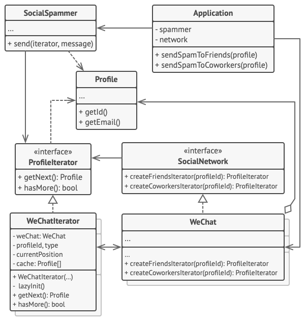

# 迭代器模式

## 理解

能够通过向外暴露一个迭代器接口来减少暴露内部复杂数据结构的一种方式,并且能够进行数据迭代 ..

也就是无关数据结构来访问内部的每一个元素的设计模式,但这种设计模式, 其实仅仅只是利用了迭代器特性 ...(但是非常常用,所以额外提出来) ..

大多数迭代器模式的使用方式,根据其他文章参考的结果应该是偏向于外观模式才对(一种特殊的外观模式,子系统应该是各种复杂的具有迭代性质的数据结构) ..

## 使用场景
- 当集合背后为复杂的数据结构， 且你希望对客户端隐藏其复杂性时 （出于使用便利性或安全性的考虑）， 可以使用迭代器模式。
- 使用该模式可以减少程序中重复的遍历代码。
- 如果你希望代码能够遍历不同的甚至是无法预知的数据结构， 可以使用迭代器模式。

## 伪代码
此迭代器模式用于遍历一个封装了访问微信好友关系功能的特殊集合。 该集合提供使用不同方式遍历档案资料的多个迭代器。


其实这种方式也和工厂方法模式相似,只是仅仅提供了默认的工厂来支持提供一些迭代器(迭代器是主体-主要用品) ..

当然,基于接口编程,可以通过扩展工厂来实现对迭代器的扩充,进行单一职责原则开发 ..

“好友 （friends）” 迭代器可用于遍历指定档案的好友。 “同事 （colleagues）” 迭代器也提供同样的功能， 但仅包括与目标用户在同一家公司工作的好友。 这两个迭代器都实现了同一个通用接口， 客户端能在不了解认证和发送 REST 请求等实现细节的情况下获取档案。

客户端仅通过接口与集合和迭代器交互， 也就不会同具体类耦合。 如果你决定将应用连接到全新的社交网络， 只需提供新的集合和迭代器类即可， 无需修改现有代码。

```groovy
// 集合接口必须声明一个用于生成迭代器的工厂方法。如果程序中有不同类型的迭
// 代器，你也可以声明多个方法。
interface SocialNetwork is
    method createFriendsIterator(profileId):ProfileIterator
    method createCoworkersIterator(profileId):ProfileIterator


// 每个具体集合都与其返回的一组具体迭代器相耦合。但客户并不是这样的，因为
// 这些方法的签名将会返回迭代器接口。
class WeChat implements SocialNetwork is
    // ...大量的集合代码应该放在这里...

    // 迭代器创建代码。
    method createFriendsIterator(profileId) is
        return new WeChatIterator(this, profileId, "friends")
    method createCoworkersIterator(profileId) is
        return new WeChatIterator(this, profileId, "coworkers")


// 所有迭代器的通用接口。
interface ProfileIterator is
    method getNext():Profile
    method hasMore():bool


// 具体迭代器类。
class WeChatIterator implements ProfileIterator is
    // 迭代器需要一个指向其遍历集合的引用。
    private field weChat: WeChat
    private field profileId, type: string

    // 迭代器对象会独立于其他迭代器来对集合进行遍历。因此它必须保存迭代器
    // 的状态。
    private field currentPosition
    private field cache: array of Profile

    constructor WeChatIterator(weChat, profileId, type) is
        this.weChat = weChat
        this.profileId = profileId
        this.type = type

    private method lazyInit() is
        if (cache == null)
            cache = weChat.socialGraphRequest(profileId, type)

    // 每个具体迭代器类都会自行实现通用迭代器接口。
    method getNext() is
        if (hasMore())
            currentPosition++
            return cache[currentPosition]

    method hasMore() is
        lazyInit()
        return currentPosition < cache.length


// 这里还有一个有用的绝招：你可将迭代器传递给客户端类，无需让其拥有访问整
// 个集合的权限。这样一来，你就无需将集合暴露给客户端了。
//
// 还有另一个好处：你可在运行时将不同的迭代器传递给客户端，从而改变客户端
// 与集合互动的方式。这一方法可行的原因是客户端代码并没有和具体迭代器类相
// 耦合。
class SocialSpammer is
    method send(iterator: ProfileIterator, message: string) is
        while (iterator.hasMore())
            profile = iterator.getNext()
            System.sendEmail(profile.getEmail(), message)


// 应用程序（Application）类可对集合和迭代器进行配置，然后将其传递给客户
// 端代码。
class Application is
    field network: SocialNetwork
    field spammer: SocialSpammer

    method config() is
        if working with WeChat
            this.network = new WeChat()
        if working with LinkedIn
            this.network = new LinkedIn()
        this.spammer = new SocialSpammer()

    method sendSpamToFriends(profile) is
        iterator = network.createFriendsIterator(profile.getId())
        spammer.send(iterator, "非常重要的消息")

    method sendSpamToCoworkers(profile) is
        iterator = network.createCoworkersIterator(profile.getId())
        spammer.send(iterator, "非常重要的消息")
```

## 总结

- 你可以使用迭代器模式来遍历组合模式树。
- 你可以同时使用工厂方法模式和迭代器来让子类集合返回不同类型的迭代器， 并使得迭代器与集合相匹配。
- 你可以同时使用备忘录模式和迭代器来获取当前迭代器的状态， 并且在需要的时候进行回滚。
- 可以同时使用访问者模式和迭代器来遍历复杂数据结构， 并对其中的元素执行所需操作， 即使这些元素所属的类完全不同。

## 参考
- https://github.com/dunwu/dunwu.github.io/blob/main/docs/03.%E8%AE%BE%E8%AE%A1/02.%E8%AE%BE%E8%AE%A1%E6%A8%A1%E5%BC%8F/16.%E8%BF%AD%E4%BB%A3%E5%99%A8%E6%A8%A1%E5%BC%8F.md