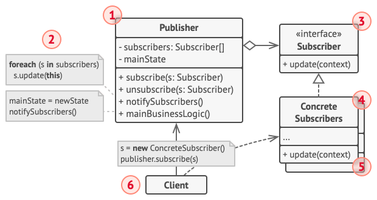

# 观察者模式

## 理解

主要提供了一种订阅发布的机制来实现数据交互 ..

## 使用场景

- 当一个对象发生变化时,其他对象需要被动联动改变的情况下,特别实用
- 业务回调(callback), 也可以改变为观察者模式,例如事件监听 ..

## 伪代码



- 发布者 （Publisher） 会向其他对象发送值得关注的事件。 事件会在发布者自身状态改变或执行特定行为后发生。 发布者中包含一个允许新订阅者加入和当前订阅者离开列表的订阅构架。
- 当新事件发生时， 发送者会遍历订阅列表并调用每个订阅者对象的通知方法。 该方法是在订阅者接口中声明的。
- 订阅者 （Subscriber） 接口声明了通知接口。 在绝大多数情况下， 该接口仅包含一个 update更新方法。 该方法可以拥有多个参数， 使发布者能在更新时传递事件的详细信息。
- 具体订阅者 （Concrete Subscribers） 可以执行一些操作来回应发布者的通知。 所有具体订阅者类都实现了同样的接口， 因此发布者不需要与具体类相耦合。
- 订阅者通常需要一些上下文信息来正确地处理更新。 因此， 发布者通常会将一些上下文数据作为通知方法的参数进行传递。 发布者也可将自身作为参数进行传递， 使订阅者直接获取所需的数据。
- 客户端 （Client） 会分别创建发布者和订阅者对象， 然后为订阅者注册发布者更新。


### 代码范式

常见代码范式是需要对一个具体的topic(主题进行订阅) ...
- Subject : 主题类，保存所有订阅此主题的观察者，观察者的 数量是任意的。定义 添加观察者 (Attach) 和 删除观察者 (Detach) 的接口。

```java
abstract class Subject {
    protected String name;
    protected String state;
    protected List<Observer> observers = new ArrayList<Observer>();

    public abstract String getState();
    public abstract void setState(String state);
    public abstract void Notify();

    public Subject(String name) {
        this.name = name;
    }

    public void Attach(Observer observer) {
        observers.add(observer);
    }

    public void Detach(Observer observer) {
        observers.remove(observer);
    }
}
```

你当然可以选择主题和发布者一起(不必分割) ...

- 观察者
用于在观察对象发生变化的时候,进行通知所有的callback(事件回调,也可以说是注册的观察者)
```java
class ConcreteSubject extends Subject {
    public ConcreteSubject(String name) {
        super(name);
    }

    @Override
    public String getState() {
        return state;
    }

    @Override
    public void setState(String state) {
        this.state = state;
    }

    @Override
    public void Notify() {
        System.out.println("======= " + this.name + "主题发布新消息 =======");
        for (Observer observer : observers) {
            observer.Update();
        }
    }
}
```

- ConcreteObserver 
具体的观察者类,主要负责在得到通知的时候,进行动作执行 .. 在这里是同步和主题一样的状态
```java
class ConcreteObserver extends Observer {
    private String state;
    public ConcreteObserver(String name, Subject subject) {
        super(name, subject);
    }

    @Override
    public void Update() {
        state = subject.getState();
        System.out.println(this.name + "收到当前状态：" + state);
    }
}
```
- 客户端

```java
public class ObserverPattern {
    public static void main(String[] args) {
        ConcreteSubject subject = new ConcreteSubject("天气");
        ConcreteObserver observer1 = new ConcreteObserver("张三", subject);
        ConcreteObserver observer2 = new ConcreteObserver("李四", subject);
        ConcreteObserver observer3 = new ConcreteObserver("王五", subject);

        subject.Attach(observer1);
        subject.Attach(observer2);
        subject.Attach(observer3);
        subject.setState("今天下雨");
        subject.Notify();

        subject.Detach(observer2);
        subject.setState("明天天晴");
        subject.Notify();
    }
}
```

组装主题和观察者的订阅,现在在基于spring框架的帮助下,采用SPI模式的订阅发布异常简单 ..

## 总结
- 责任链模式、 命令模式、 中介者模式和观察者模式用于处理请求发送者和接收者之间的不同连接方式：
  - 责任链按照顺序将请求动态传递给一系列的潜在接收者， 直至其中一名或者多名接收者对请求进行处理。
  - 命令在发送者和请求者之间建立单向连接。
  - 中介者清除了发送者和请求者之间的直接连接， 强制它们通过一个中介对象进行间接沟通。
  - 观察者允许接收者动态地订阅或取消接收请求。
- 中介者和观察者之间的区别往往很难记住。 在大部分情况下， 你可以使用其中一种模式， 而有时可以同时使用。 让我们来看看如何做到这一点。
  - 中介者的主要目标是消除一系列系统组件之间的相互依赖。 这些组件将依赖于同一个中介者对象。 观察者的目标是在对象之间建立动态的单向连接， 使得部分对象可作为其他对象的附属发挥作用。
  - 有一种流行的中介者模式实现方式依赖于观察者。 中介者对象担当发布者的角色， 其他组件则作为订阅者， 可以订阅中介者的事件或取消订阅。 当中介者以这种方式实现时， 它可能看上去与观察者非常相似。
  - 当你感到疑惑时， 记住可以采用其他方式来实现中介者。 例如， 你可永久性地将所有组件链接到同一个中介者对象。 这种实现方式和观察者并不相同， 但这仍是一种中介者模式。
  - 假设有一个程序， 其所有的组件都变成了发布者， 它们之间可以相互建立动态连接。 这样程序中就没有中心化的中介者对象， 而只有一些分布式的观察者。

有关这里的描述,我觉得中介者模式  有点像程序中见到的各种XXXManager, 例如可以用来管理其他组件的相互依赖 ... 或者说代理模式 将事情交给底层的内部对象处理 ...
所以,代理模式也不是强制要求接口一致,而装饰器要求接口类型一致 ...