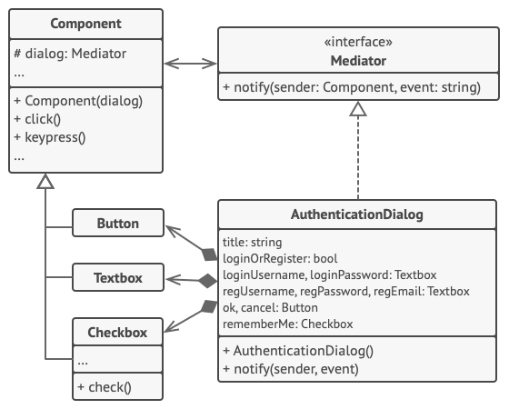

# 中介者模式

## 理解

本质上,中介者模式就是一个自然而然的组件协作组装模式 ...

所以,本质上就是组件的合作处理,根据业务来产生新的调解者来进行 业务逻辑处理 ... 所以真正能够复用的还是
中介者所指定的逻辑轮廓 以及对组件的接口抽象定义而已 ...

## 伪代码



用户触发的元素不会直接与其他元素交流， 即使看上去它们应该这样做。 相反， 元素只需让中介者知晓事件即可， 并能在发出通知时同时传递任何上下文信息。

本例中的中介者是整个认证对话框。 对话框知道具体元素应如何进行合作并促进它们的间接交流。 当接收到事件通知后， 对话框会确定负责处理事件的元素并据此重定向请求。

```groovy
// 中介者接口声明了一个能让组件将各种事件通知给中介者的方法。中介者可对这
// 些事件做出响应并将执行工作传递给其他组件。
interface Mediator is
    method notify(sender: Component, event: string)


// 具体中介者类可解开各组件之间相互交叉的连接关系并将其转移到中介者中。
class AuthenticationDialog implements Mediator is
    private field title: string
    private field loginOrRegisterChkBx: Checkbox
    private field loginUsername, loginPassword: Textbox
    private field registrationUsername, registrationPassword,
                  registrationEmail: Textbox
    private field okBtn, cancelBtn: Button

    constructor AuthenticationDialog() is
        // 创建所有组件对象并将当前中介者传递给其构造函数以建立连接。

    // 当组件中有事件发生时，它会通知中介者。中介者接收到通知后可自行处理，
    // 也可将请求传递给另一个组件。
    method notify(sender, event) is
        if (sender == loginOrRegisterChkBx and event == "check")
            if (loginOrRegisterChkBx.checked)
                title = "登录"
                // 1. 显示登录表单组件。
                // 2. 隐藏注册表单组件。
            else
                title = "注册"
                // 1. 显示注册表单组件。
                // 2. 隐藏登录表单组件。

        if (sender == okBtn && event == "click")
            if (loginOrRegister.checked)
                // 尝试找到使用登录信息的用户。
                if (!found)
                    // 在登录字段上方显示错误信息。
            else
                // 1. 使用注册字段中的数据创建用户账号。
                // 2. 完成用户登录工作。 …


// 组件会使用中介者接口与中介者进行交互。因此只需将它们与不同的中介者连接
// 起来，你就能在其他情境中使用这些组件了。
class Component is
    field dialog: Mediator

    constructor Component(dialog) is
        this.dialog = dialog

    method click() is
        dialog.notify(this, "click")

    method keypress() is
        dialog.notify(this, "keypress")

// 具体组件之间无法进行交流。它们只有一个交流渠道，那就是向中介者发送通知。
class Button extends Component is
    // ...

class Textbox extends Component is
    // ...

class Checkbox extends Component is
    method check() is
        dialog.notify(this, "check")
    // ...
```

但是这个模式确实特别类似于观察者模式 ...

## 总结
组件和其他组件之间的协作是基于协调者来的,也就是说,组件本身的功能仅仅是提供状态,数据流向通过协调者来
处理...