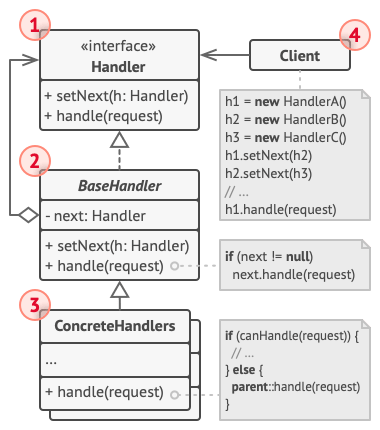

# 责任链模式

## 意图

职责链模式（Chain Of Responsibility） 是一种行为设计模式， 允许你将请求沿着处理者链进行发送。 收到请求后， 每个处理者均可对请求进行处理， 或将其传递给链上的下个处理者。

使多个对象都有机会处理请求，从而避免请求的发送者和接收者之间的耦合关系。 将这个对象连成一条链，并沿着这条链传递该请求，直到有一个对象处理它为止。

最典型的例子就是Spring的aop advice执行就是一个责任链模式 ...

## 适用场景
- 当程序需要使用不同方式处理不同种类请求， 而且请求类型和顺序预先未知时， 可以使用责任链模式。
- 当必须按顺序执行多个处理者时， 可以使用该模式。
- 如果所需处理者及其顺序必须在运行时进行改变， 可以使用责任链模式。

## 结构说明

- 处理者 （Handler） 声明了所有具体处理者的通用接口。 该接口通常仅包含单个方法用于请求处理， 但有时其还会包含一个设置链上下个处理者的方法。

- 基础处理者 （Base Handler） 是一个可选的类， 你可以将所有处理者共用的样本代码放置在其中。

    通常情况下， 该类中定义了一个保存对于下个处理者引用的成员变量。 客户端可通过将处理者传递给上个处理者的构造函数或设定方法来创建链。 该类还可以实现默认的处理行为： 确定下个处理者存在后再将请求传递给它。

- 具体处理者 （Concrete Handlers） 包含处理请求的实际代码。 每个处理者接收到请求后， 都必须决定是否进行处理， 以及是否沿着链传递请求。

    处理者通常是独立且不可变的， 需要通过构造函数一次性地获得所有必要地数据。

- 客户端 （Client） 可根据程序逻辑一次性或者动态地生成链。 值得注意的是， 请求可发送给链上的任意一个处理者， 而非必须是第一个处理者。

但是责任链模式的代码范式存在很多种,例如依次遍历,动态创建责任链,或者链式创建责任链 .. 又或是通过责任链管理器实现对责任链效果的创建 ..

## 总结

- 责任链模式、 命令模式、 中介者模式和观察者模式用于处理请求发送者和接收者之间的不同连接方式：

  - 责任链按照顺序将请求动态传递给一系列的潜在接收者， 直至其中一名接收者对请求进行处理。
  命令在发送者和请求者之间建立单向连接。
  - 中介者清除了发送者和请求者之间的直接连接， 强制它们通过一个中介对象进行间接沟通。
  - 观察者允许接收者动态地订阅或取消接收请求。
  - 责任链通常和组合模式结合使用。 在这种情况下， 叶组件接收到请求后， 可以将请求沿包含全体父组件的链一直传递至对象树的底部。

- 责任链的管理者可使用命令模式实现。 在这种情况下， 你可以对由请求代表的同一个上下文对象执行许多不同的操作。

  - 还有另外一种实现方式， 那就是请求自身就是一个命令对象。 在这种情况下， 你可以对由一系列不同上下文连接而成的链执行相同的操作。
        如果请求就是命令对象,那么它本身也可能需要加入执行,那么可以使用根据命令对象传递的上下文来实现 业务操作,传递给链中的下一个的时候,
        则是不同上下文(因为可能创建了不同的命令携带了不同的上下文 - 例如组合模式) ..

责任链和装饰模式的类结构非常相似。 两者都依赖递归组合将需要执行的操作传递给一系列对象。 但是， 两者有几点重要的不同之处。

责任链的管理者可以相互独立地执行一切操作， 还可以随时停止传递请求。 另一方面， 各种装饰可以在遵循基本接口的情况下扩展对象的行为。 此外， 装饰无法中断请求的传递。

## 参考

1. https://github.com/dunwu/dunwu.github.io/blob/main/docs/03.%E8%AE%BE%E8%AE%A1/02.%E8%AE%BE%E8%AE%A1%E6%A8%A1%E5%BC%8F/20.%E8%81%8C%E8%B4%A3%E9%93%BE%E6%A8%A1%E5%BC%8F.md

