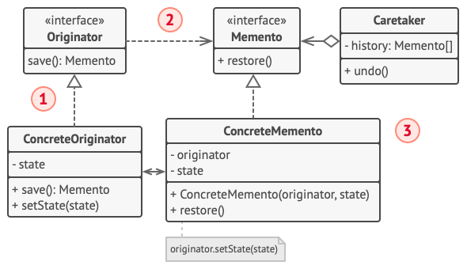

# 备忘录模式

备忘录模式（Memento） 是一种行为设计模式， 允许在不暴露对象实现细节的情况下保存和恢复对象之前的状态。

## 结构

### 基于嵌套类实现

1. 原发器 （Originator） 类可以生成自身状态的快照， 也可以在需要时通过快照恢复自身状态。

2. 备忘录 （Memento） 是原发器状态快照的值对象 （value object）。 通常做法是将备忘录设为不可变的， 并通过构造函数一次性传递数据。

3. 负责人 （Caretaker） 仅知道 “何时” 和 “为何” 捕捉原发器的状态， 以及何时恢复状态。

    负责人通过保存备忘录栈来记录原发器的历史状态。 当原发器需要回溯历史状态时， 负责人将从栈中获取最顶部的备忘录， 并将其传递给原发器的恢复 （restoration） 方法。

4. 在该实现方法中， 备忘录类将被嵌套在原发器中。 这样原发器就可访问备忘录的成员变量和方法， 即使这些方法被声明为私有。 另一方面， 负责人对于备忘录的成员变量和方法的访问权限非常有限： 它们只能在栈中保存备忘录， 而不能修改其状态。

一般情况下备忘录模式很少使用 ..
### 基于中间接口实现

- 这种就必须将原发器和备忘录分开,同时通过客户端来协调快照的产生和快照的存储以及回退 .. 但是它们都没有向外部暴露内部状态,只有一些业务方法 ..

- 在没有嵌套类的情况下， 你可以规定负责人仅可通过明确声明的中间接口与备忘录互动， 该接口仅声明与备忘录元数据相关的方法， 限制其对备忘录成员变量的直接访问权限。
- 另一方面， 原发器可以直接与备忘录对象进行交互， 访问备忘录类中声明的成员变量和方法。 这种方式的缺点在于你需要将备忘录的所有成员变量声明为公有。

    但是除非你真的需要,否则备忘录也不应该直接向Originator 暴露自身的成员变量(否则,这样做的原因是符合嵌套类实现方式).

### 更加严格的方式

但是这种方式和前面的中间类方式 差异不大,只是原发器独立于负责人,但是原发器的快照创建依旧需要其他人或者逻辑触发,同时中间接口已经满足了 状态访问控制 ..

## 伪代码

参考其他人的文章,命令模式加备忘录模式  来实现对编辑器的保存以及撤销 ..

- 命令 （command） 对象将作为负责人， 它们会在执行与命令相关的操作前获取编辑器的备忘录。 当用户试图撤销最近的命令时， 编辑器可以使用保存在命令中的备忘录来将自身回滚到之前的状态。

- 备忘录类没有声明任何公有的成员变量、 获取器 （getter） 和设置器， 因此没有对象可以修改其内容。 备忘录与创建自己的编辑器相连接， 这使得备忘录能够通过编辑器对象的设置器传递数据， 恢复与其相连接的编辑器的状态。 
  由于备忘录与特定的编辑器对象相连接， 程序可以使用中心化的撤销栈实现对多个独立编辑器窗口的支持。

## 总结
- 你可以同时使用命令模式和备忘录模式来实现 “撤销”。 在这种情况下， 命令用于对目标对象执行各种不同的操作， 备忘录用来保存一条命令执行前该对象的状态。
- 你可以同时使用备忘录和迭代器模式来获取当前迭代器的状态， 并且在需要的时候进行回滚。
- 有时候原型模式可以作为备忘录的一个简化版本， 其条件是你需要在历史记录中存储的对象的状态比较简单， 不需要链接其他外部资源， 或者链接可以方便地重建。
