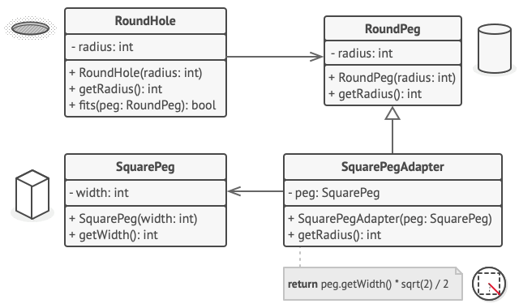

# 适配器模式
## 意图
**适配器模式 (Adapter)** 是一种结构型设计模式， 它能使不兼容的对象能够相互合作。

适配器模式通过封装对象将复杂的转换过程隐藏于幕后。 被封装的对象甚至察觉不到适配器的存在。

适配器不仅可以转换不同格式的数据， 其还有助于采用不同接口的对象之间的合作。 它的运作方式如下：

适配器实现与其中一个现有对象兼容的接口。
现有对象可以使用该接口安全地调用适配器方法。
适配器方法被调用后将以另一个对象兼容的格式和顺序将请求传递给该对象。

## 适用场景
1. 当你希望使用某个类， 但是其接口与其他代码不兼容时(也就是不想强耦合)， 可以使用适配器类。
2. 如果您需要复用这样一些类， 他们处于同一个继承体系， 并且他们又有了额外的一些共同的方法， 但是这些共同的方法不是所有在这一继承体系中的子类所具有的共性

## 结构
适配器实现了其中一个对象的接口， 并对另一个对象进行封装。


其中你能够发现,Client 消息传递关系于Client接口, 适配器实现了Client接口,并关联了Service接口 ...
也就是说,适配器通过实现一种兼容的接口来将其他不兼容的类型加以使用 ..(为现有对象实现兼容形式方法调用)

### 结构说明
1. 客户端 （Client） 是包含当前程序业务逻辑的类。
2. 客户端接口 （Client Interface） 描述了其他类与客户端代码合作时必须遵循的协议。
3. 服务 （Service） 中有一些功能类 （通常来自第三方或遗留系统）。 客户端与其接口不兼容， 因此无法直接调用其功能。
4. 适配器 （Adapter） 是一个可以同时与客户端和服务交互的类： 它在实现客户端接口的同时封装了服务对象。 适配器接受客户端通过适配器接口发起的调用， 并将其转换为适用于被封装服务对象的调用。
5. 客户端代码只需通过接口与适配器交互即可， 无需与具体的适配器类耦合。 因此， 你可以向程序中添加新类型的适配器而无需修改已有代码。 
6. 这在服务类的接口被更改或替换时很有用： 你无需修改客户端代码(或许还是需要更改少量代码)就可以创建新的适配器类。

### 结构代码范式
[Target]
定义用户实际需要的接口
```java
abstract class Target {
    public abstract void Request();
}
```
[Adaptee]
定义一个需要适配的具体类
```java
class Adaptee {
    public void SpecificRequest() {
        System.out.println("特殊请求");
    }
}
```
[Adapter]
适配器,包装需要被适配的具体类对象,将源接口的数据处理请求 转换到目标接口
```java
class Adapter extends Target {
    private Adaptee adaptee = new Adaptee();

    @Override
    public void Request() {
        adaptee.SpecificRequest();
    }
}
```
[客户端]
```java
public class AdapterPattern {
    public static void main(String[] args) {
        Target target = new Adapter();
        target.Request();
    }
}

```
[输出]
```text
特殊请求
```

## 伪代码

假设有一个圆孔类和圆钉类,适配器假扮成一个圆钉 （RoundPeg）， 其半径等于方钉 （SquarePeg） 横截面对角线的一半 （即能够容纳方钉的最小外接圆的半径）。
```groovy
// 假设你有两个接口相互兼容的类：圆孔（Round­Hole）和圆钉（Round­Peg）。
class RoundHole is
    constructor RoundHole(radius) { ... }

    method getRadius() is
        // 返回孔的半径。

    method fits(peg: RoundPeg) is
        return this.getRadius() >= peg.getRadius()

class RoundPeg is
    constructor RoundPeg(radius) { ... }

    method getRadius() is
        // 返回钉子的半径。


// 但还有一个不兼容的类：方钉（Square­Peg）。
class SquarePeg is
    constructor SquarePeg(width) { ... }

    method getWidth() is
        // 返回方钉的宽度。


// 适配器类让你能够将方钉放入圆孔中。它会对 RoundPeg 类进行扩展，以接收适
// 配器对象作为圆钉。
class SquarePegAdapter extends RoundPeg is
    // 在实际情况中，适配器中会包含一个 SquarePeg 类的实例。
    private field peg: SquarePeg

    constructor SquarePegAdapter(peg: SquarePeg) is
        this.peg = peg

    method getRadius() is
        // 适配器会假扮为一个圆钉，
        // 其半径刚好能与适配器实际封装的方钉搭配起来。
        return peg.getWidth() * Math.sqrt(2) / 2


// 客户端代码中的某个位置。
hole = new RoundHole(5)
rpeg = new RoundPeg(5)
hole.fits(rpeg) // true

small_sqpeg = new SquarePeg(5)
large_sqpeg = new SquarePeg(10)
hole.fits(small_sqpeg)

small_sqpeg_adapter = new SquarePegAdapter(small_sqpeg)
large_sqpeg_adapter = new SquarePegAdapter(large_sqpeg)
hole.fits(small_sqpeg_adapter) // true
hole.fits(large_sqpeg_adapter) // false
```
上述代码描述了 通过装饰器模式将 方钉也可以插入到圆孔中 ..

## 案例
java核心类库中有一些标准的适配器:
- java.util.Arrays#asList()
- java.util.Collections#list()
- java.util.Collections#enumeration()
- java.io.InputStreamReader(InputStream) （返回 Reader对象）
- java.io.OutputStreamWriter(OutputStream) （返回 Writer对象）
- javax.xml.bind.annotation.adapters.XmlAdapter#marshal() 和 #unmarshal()

其实装饰器模式就是一个很自然的关联关系(或者说消息传递关系)

方法识别:
适配器可以通过以不同抽象或接口类型实例为参数的构造函数来识别。 当适配器的任何方法被调用时， 
它会将参数转换为合适的格式， 然后将调用定向到其封装对象中的一个或多个方法。

## 与其他模式的关系
1. 桥接模式通常会于开发前期进行设计， 使你能够将程序的各个部分独立开来以便开发。 另一方面， 适配器模式通常在已有程序中使用， 让相互不兼容的类能很好地合作。
2. 适配器能为被封装对象提供不同的接口， 代理模式能为对象提供相同的接口， 装饰则能为对象提供加强的接口。
3. 外观模式为现有对象定义了一个新接口， 适配器则会试图运用已有的接口。 适配器通常只封装一个对象， 外观通常会作用于整个对象子系统上。
4. 桥接、 状态模式和策略模式 （在某种程度上包括适配器） 模式的接口非常相似。 实际上， 它们都基于组合模式——即将工作委派给其他对象， 不过也各自解决了不同的问题。 模式并不只是以特定方式组织代码的配方， 你还可以使用它们来和其他开发者讨论模式所解决的问题。
5. 它们的特性看起来就像是对象组合工作 ..


