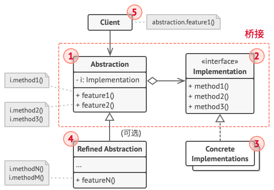
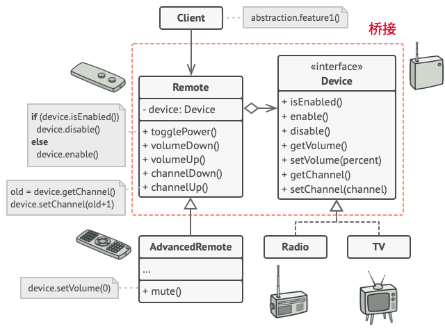

# 桥接模式
## 意图
桥接模式 (Bridge) 是一种结构型设计模式， 可将抽象部分与实现部分分离，使它们都可以独立的变化。

如果一个系统需要在构件的抽象化角色和具体化角色之间增加更多的灵活性，避免在两个层次之间建立静态的联系。抽象化角色和具体化角色都应该可以被子类扩展。在这种情况下，桥接模式可以灵活地组合不同的抽象化角色和具体化角色，并独立化地扩展。

设计要求实现化角色的任何改变不应当影响客户端，或者说实现化角色的改变对客户端是完全透明的。

## 适用场景
- 如果你想要拆分或者重组一个具有多重功能的庞杂类(例如能够和多个数据库服务器进行交互的类),可以使用桥接模式 ..
- 如果你希望在几个独立维度上扩展一个类,可使用该模式 ..
- 如果你需要在运行时切换不同实现方法,可使用桥接模式 ..
## 结构


上图中,定义了一个抽象(Abstraction), 它聚合了一个接口实现(桥接), 然后抽象有一个具体的泛化关系,同样实现也有具体的实现 ..
其实能够发现这种设计模式特别常见,无非就是基于接口编程,接口和接口之间存在聚合关系(或者说强依赖关系)

### 结构说明
1. 抽象部分(Abstraction) 提供顶层控制逻辑,依赖于底层完成实际工作的实现对象 ..
2. 实现部分(Implementation) 为所有具体实现声明通用接口 .. 抽象部分仅能通过这里声明的方法与实现对象进行交互 。。
    
    抽象部分可以列出和实现部分一样的方法,但是抽象部分通常声明一些复杂的行为,这些行为依赖于多种由实现部分声明的原语操作 .
3. 具体实现(Concrete Implementations) 中包括了特定于平台的代码
4. 精确抽象(Refined Abstraction) 提供了控制逻辑的变体.. 与父类一样,他通过通用实现接口与不同的实现进行交互 ..
5. 通常情况下,客户端(Client)仅仅关心如何与抽象部分合作,但是客户端需要将抽象对象与一个实现对象连接起来 ..（但是有了依赖注入,或许这个事情变得更加简单)

### 结构代码范式
[Implementor] 定义实现接口
```java
interface Implementor {
    // 实现抽象部分需要的某些具体功能
    public void operationImpl();
}
```
[Abstraction] 定义抽象接口
```java
abstract class Abstraction {
    // 持有一个 Implementor 对象，形成聚合关系
    protected Implementor implementor;

    public Abstraction(Implementor implementor) {
        this.implementor = implementor;
    }

    // 可能需要转调实现部分的具体实现
    public void operation() {
        implementor.operationImpl();
    }
}
```
[ConcreteImplementor] 实现Implementor 中定义的接口
```java
class ConcreteImplementorA implements Implementor {
    @Override
    public void operationImpl() {
        // 真正的实现
        System.out.println("具体实现A");
    }
}

class ConcreteImplementorB implements Implementor {
    @Override
    public void operationImpl() {
        // 真正的实现
        System.out.println("具体实现B");
    }
}
```
[RefinedAbstraction] 扩展Abstraction 类
````java
class RefinedAbstraction extends Abstraction {

    public RefinedAbstraction(Implementor implementor) {
        super(implementor);
    }

    public void otherOperation() {
        // 实现一定的功能，可能会使用具体实现部分的实现方法,
        // 但是本方法更大的可能是使用 Abstraction 中定义的方法，
        // 通过组合使用 Abstraction 中定义的方法来完成更多的功能。
    }
}
````
[客户端]
```java
public class BridgePattern {
    public static void main(String[] args) {
        Implementor implementor = new ConcreteImplementorA();
        RefinedAbstraction abstraction = new RefinedAbstraction(implementor);
        abstraction.operation();
        abstraction.otherOperation();
    }
}
```
上述客户端在目前基于spring ioc 依赖反转的情况下,可以实现自动注入并做特定的事情 。。
也就是上述代码将会写在具体的客户端中 ..


## 伪代码


遥控板基类声明了一个指向设备对象的引用成员变量,所有的遥控器通过通用设备接口和设备进行交互,使得同一个遥控器可以支持不同类型的设备 ..

也就是说,我们可以用通用遥控板来控制独立于设备类型进行操作 ... 如果需要增加额外功能,只需要新建一个遥控器子类即可 ..

例如基础遥控器可能只有两个按钮,但是我们可以在基础上扩展新的功能,比如额外的一节电池(增加续航)或者一块触摸屏 ..

那么增加扩展的新功能,相当于是一种新的遥控板,但是它们兼容已有的基础遥控板的功能 ..

客户端代码负责通过遥控板构造函数和特定的遥控器与设备对象进行关联起来即可 ..
(它们之间的桥梁,就是设备API),这是通过桥接模式将抽象与抽象实现(implementation)强关联起来的 ..
```java
// “抽象部分”定义了两个类层次结构中“控制”部分的接口。它管理着一个指向“实
// 现部分”层次结构中对象的引用，并会将所有真实工作委派给该对象。
class RemoteControl is
        protected field device: Device
        constructor RemoteControl(device: Device) is
        this.device = device
        method togglePower() is
        if (device.isEnabled()) then
        device.disable()
        else
        device.enable()
        method volumeDown() is
        device.setVolume(device.getVolume() - 10)
        method volumeUp() is
        device.setVolume(device.getVolume() + 10)
        method channelDown() is
        device.setChannel(device.getChannel() - 1)
        method channelUp() is
        device.setChannel(device.getChannel() + 1)


// 你可以独立于设备类的方式从抽象层中扩展类。
class AdvancedRemoteControl extends RemoteControl is
        method mute() is
        device.setVolume(0)


// “实现部分”接口声明了在所有具体实现类中通用的方法。它不需要与抽象接口相
// 匹配。实际上，这两个接口可以完全不一样。通常实现接口只提供原语操作，而
// 抽象接口则会基于这些操作定义较高层次的操作。
interface Device is
        method isEnabled()
        method enable()
        method disable()
        method getVolume()
        method setVolume(percent)
        method getChannel()
        method setChannel(channel)


// 所有设备都遵循相同的接口。
class Tv implements Device is
// ...

class Radio implements Device is
        // ...


// 客户端代码中的某个位置。
        tv = new Tv()
        remote = new RemoteControl(tv)
        remote.togglePower()

        radio = new Radio()
        remote = new AdvancedRemoteControl(radio)
```
现在,看了伪代码之后就可以理解前面所说的这种设计模式的意图了 ..

总结就是,抽象角色定义业务的大体关系(或者业务逻辑,仅仅定义通用 、 创建的业务关系),但是对应的实现(也就是具体做事的类，但是它们依旧有顶层抽象)它们仅仅定义动作原语,
然后具体实现实现自己基本的原语,并通过通用实现接口被 桥接模式的聚合者进行依赖关系确定(详细各种原语逻辑调用 ..)

## 案例
1. 使用示例: 桥接模式在处理跨平台应用,支持多种类型的数据库服务器与多个特定种类(例如云平台和社交网络等)API供应商协作时会特别有用 ..
2. 识别方法: 桥接可以通过一些控制实体以及其依赖的多个不同平台之间的明确关系来进行识别 ...(有点模糊)

例如Java中桥接模式应用最经典的无疑是日志组件slf4j的桥接jar包 .

假设,你正在开发应用程序所调用的组件当中已经使用了common-logging. 这是你需要jcl-over-slf4j.jar将日志信息重定向到slf4j-api ..

slf4j-api再去调用slf4j实际依赖的日志组件,这个过程称为桥接 ... 下图是官方的slf4j桥接策略图:

## 与其他模式的关系
1. 桥接模式通常会于开发前期进行设计， 使你能够将程序的各个部分独立开来以便开发。 另一方面， 适配器模式通常在已有程序中使用， 让相互不兼容的类能很好地合作。
2. 桥接、 状态模式和策略模式 （在某种程度上包括适配器） 模式的接口非常相似。 实际上， 它们都基于组合模式——即将工作委派给其他对象， 不过也各自解决了不同的问题。 模式并不只是以特定方式组织代码的配方， 你还可以使用它们来和其他开发者讨论模式所解决的问题。
3. 你可以将抽象工厂模式和桥接搭配使用。 如果由桥接定义的抽象只能与特定实现合作， 这一模式搭配就非常有用。 在这种情况下， 抽象工厂可以对这些关系进行封装， 并且对客户端代码隐藏其复杂性。
4. 你可以结合使用生成器模式和桥接模式： 主管类负责抽象工作， 各种不同的生成器负责实现工作。

这就是为什么spring ioc依赖翻转,其实等价于工厂模式 ..


