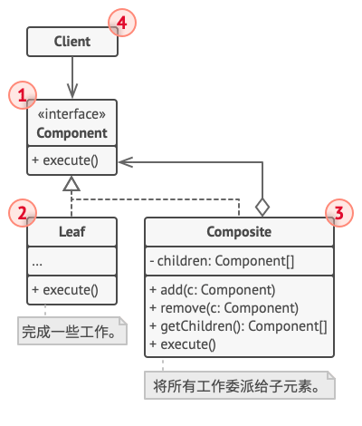
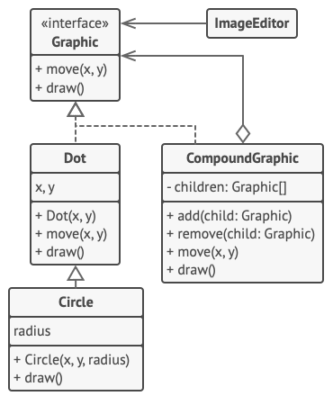

# 组合设计模式
## 意图
组合模式 (Component) 是一种结构型设计模式，将对象组合成树形结构以表示“部分-整体”的层次结构。

组合模式使得用户对单个对象和组合对象的使用具有唯一性。

## 适用场景
组合模式的适用场景：

- 想要表示对象的部分-整体层次结构。
- 想要客户端忽略组合对象与单个对象的差异，客户端将统一地使用组合结构中的所有对象。

关于分级数据结构的一个普遍性例子就是使用电脑时所遇到的文件系统 ..

文件系统由目录和文件组成 .. 每一个目录都可以装内容 .. 目录的内容可以是文件或者是目录 ..

但是注意主体是目录,而不是文件(它们都是一种表示具有共同属性的对象,但是目录并不是文件(指的是真正的文件)) ..

那么按照这种关系,计算机的文件系统就很好的表示了上面所说的意图,首先可以表示部分整体层次结构 .. 但是其次也可以表示为忽略组合对象和单个对象的差异 ..
因为使用方式完全等价于一个对象 ...(因为性质是递归结构)


## 伪代码


### 结构说明
首先,Component 接口定义了抽象,那么具有两种实现,第一种是具体工作对象(Leaf),第二种是容器对象(包含了更多可能被代理的叶子或者容器节点) ..

容器对象内部本质上是递归结构(但是递归结构是可以用代理模式,或者其他设计模式辅助的,比如装饰,代理,适配器) ..

1. 组件 （Component） 接口描述了树中简单项目和复杂项目所共有的操作。
2. 叶节点 （Leaf） 是树的基本结构， 它不包含子项目。一般情况下， 叶节点最终会完成大部分的实际工作， 因为它们无法将工作指派给其他部分。
3. 容器 （Container）——又名 “组合 （Composite）”——是包含叶节点或其他容器等子项目的单位。 容器不知道其子项目所属的具体类， 它只通过通用的组件接口与其子项目交互。容器接收到请求后会将工作分配给自己的子项目， 处理中间结果， 然后将最终结果返回给客户端。
4 .客户端 （Client） 通过组件接口与所有项目交互。 因此， 客户端能以相同方式与树状结构中的简单或复杂项目交互。

### 结构代码范式
[Component]
组合中的对象声明接口,在适当的情况下,实现所有类共有接口的默认行为(一个类只负责一个方面的事情,最好是可以实现多个接口),此接口需要含盖所有子部件的递归操作 ...

例如一个组件(它也可以实现它自己的子组件接口 - 为了表示组件的一部分) ..
```java
abstract class Component {
    protected String name;

    public Component(String name) {
        this.name = name;
    }

    public abstract void Add(Component c);
    public abstract void Remove(Component c);
    public abstract void Display(int depth);
}
```
[Leaf] 表示叶节点对象,叶子节点没有子节点
```java
class Leaf extends Component {

    public Leaf(String name) {
        super(name);
    }

    @Override
    public void Add(Component c) {
        System.out.println("Can not add to a leaf");
    }

    @Override
    public void Remove(Component c) {
        System.out.println("Can not remove from a leaf");
    }

    @Override
    public void Display(int depth) {
        String temp = "";
        for (int i = 0; i < depth; i++)
            temp += '-';
        System.out.println(temp + name);
    }

}
```
[Composite]: 定义枝节点行为，用来存储子部件，在 Component 接口中实现与子部件相关的操作。例如 Add 和 Remove。
```java
class Composite extends Component {

    private List<Component> children = new ArrayList<Component>();

    public Composite(String name) {
        super(name);
    }

    @Override
    public void Add(Component c) {
        children.add(c);
    }

    @Override
    public void Remove(Component c) {
        children.remove(c);
    }

    @Override
    public void Display(int depth) {
        String temp = "";
        for (int i = 0; i < depth; i++)
            temp += '-';
        System.out.println(temp + name);

        for (Component c : children) {
            c.Display(depth + 2);
        }
    }

}
```
当然Component接口不反过来实现,Composite使得代码结构更加清晰 .. 因为本质上Composite就是Component类型,只不过Composite接口的方法都作为了Component的方法,而进行实现 ..

接口实现的一念之差而已 ..

[Client]: 业务对象(负责调用这些实现)
```java
public class CompositePattern {

    public static void main(String[] args) {
        Composite root = new Composite("root");
        root.Add(new Leaf("Leaf A"));
        root.Add(new Leaf("Leaf B"));

        Composite compX = new Composite("Composite X");
        compX.Add(new Leaf("Leaf XA"));
        compX.Add(new Leaf("Leaf XB"));
        root.Add(compX);

        Composite compXY = new Composite("Composite XY");
        compXY.Add(new Leaf("Leaf XYA"));
        compXY.Add(new Leaf("Leaf XYB"));
        compX.Add(compXY);

        root.Display(1);
    }

}
```

### 具体示例


例如此图中 ImageEditor依赖于 图形接口 ..

然后图形接口存在两个实现(一个Dot,另一个是组合图形实现),而Dot 有一个泛化子类(圆).

组合图形CompoundGraphic 是一个容器， 它可以由多个包括容器在内的子图形构成。 组合图形与简单图形拥有相同的方法。 但是， 组合图形自身并不完成具体工作， 而是将请求递归地传递给自己的子项目， 然后 “汇总” 结果。

通过所有图形类所共有的接口， 客户端代码可以与所有图形互动。 因此， 客户端不知道与其交互的是简单图形还是组合图形。 客户端可以与非常复杂的对象结构进行交互， 而无需与组成该结构的实体类紧密耦合。

```groovy
// 组件接口会声明组合中简单和复杂对象的通用操作。
interface Graphic is
    method move(x, y)
    method draw()

// 叶节点类代表组合的终端对象。叶节点对象中不能包含任何子对象。叶节点对象
// 通常会完成实际的工作，组合对象则仅会将工作委派给自己的子部件。
class Dot implements Graphic is
    field x, y

    constructor Dot(x, y) { ... }

    method move(x, y) is
        this.x += x, this.y += y

    method draw() is
        // 在坐标位置(X,Y)处绘制一个点。

// 所有组件类都可以扩展其他组件。
class Circle extends Dot is
    field radius

    constructor Circle(x, y, radius) { ... }

    method draw() is
        // 在坐标位置(X,Y)处绘制一个半径为 R 的圆。

// 组合类表示可能包含子项目的复杂组件。组合对象通常会将实际工作委派给子项
// 目，然后“汇总”结果。
class CompoundGraphic implements Graphic is
    field children: array of Graphic

    // 组合对象可在其项目列表中添加或移除其他组件（简单的或复杂的皆可）。
    method add(child: Graphic) is
        // 在子项目数组中添加一个子项目。

    method remove(child: Graphic) is
        // 从子项目数组中移除一个子项目。

    method move(x, y) is
        foreach (child in children) do
            child.move(x, y)

    // 组合会以特定的方式执行其主要逻辑。它会递归遍历所有子项目，并收集和
    // 汇总其结果。由于组合的子项目也会将调用传递给自己的子项目，以此类推，
    // 最后组合将会完成整个对象树的遍历工作。
    method draw() is
        // 1. 对于每个子部件：
        //     - 绘制该部件。
        //     - 更新边框坐标。
        // 2. 根据边框坐标绘制一个虚线长方形。


// 客户端代码会通过基础接口与所有组件进行交互。这样一来，客户端代码便可同
// 时支持简单叶节点组件和复杂组件。
class ImageEditor is
    field all: CompoundGraphic

    method load() is
        all = new CompoundGraphic()
        all.add(new Dot(1, 2))
        all.add(new Circle(5, 3, 10))
        // ...

    // 将所需组件组合为复杂的组合组件。
    method groupSelected(components: array of Graphic) is
        group = new CompoundGraphic()
        foreach (component in components) do
            group.add(component)
            all.remove(component)
        all.add(group)
        // 所有组件都将被绘制。
        all.draw()
```
### 案例
例如在java代码中和图形打交道的用户图形界面 ..

下面是一些来自java标准程序库中的组合示例:
1. java.awt.Container#add(Component) （几乎广泛存在于 Swing 组件中）
    
    但是这里的add方法不会是Component的add方法 .. 因为这样,一个接口只干一个方面的事情,不能混杂 ..
2. javax.faces.component.UIComponent#getChildren() （几乎广泛存在于 JSF UI 组件中）

方法识别: 很简单,组合或者单个对象所呈现出来的方法行为是递归形式的 ..(且它们组合形式是树状的)

## 与其他模式的关系
- 由于它的厉害之处,可以发现责任链模式经常基于组合模式来完成 责任链的动作执行传递 ...
- 其次,由于它结构的树形结构,你可以发现可以通过迭代器模式或者访问者模式来对组合树执行操作 ..
- 组合和装饰模式的结构图很类似,两者都依赖递归组合来组织无线数量的对象 ..
    - 装饰类似于组合， 但其只有一个子组件。 此外还有一个明显不同： 装饰为被封装对象添加了额外的职责， 组合仅对其子节点的结果进行了 “求和”。
    - 但是， 模式也可以相互合作： 你可以使用装饰来扩展组合树中特定对象的行为。
- 你可以使用享元模式实现组合树的共享叶节点以节省内存。

- 大量使用组合和装饰的设计通常可以从原型(以什么为原型)模式的使用中受益,通过原型模式复制复杂结构,而非从零开始构造...


