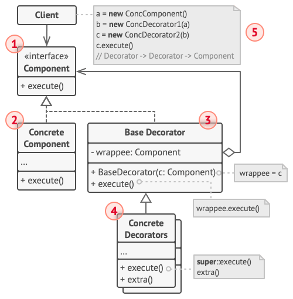

# 装饰器模式
## 意图
不需要修改接口方法来增强接口功能,在已有接口上进行功能增强 .. 且可以提供新的api 为新的功能进行输出 ...

装饰模式不需要修改对象结构就可以在外部附加功能且相比于继承,功能扩展更加简单 ...

装饰模式 (Decorator) 是一种结构型设计模式，动态地给一个对象添加一些额外的职责。就增加功能来说，Decorator 模式相比生成子类更为灵活。

装饰对象和真实对象有相同的接口。这样客户端对象就能以和真实对象相同的方式和装饰对象交互。
装饰对象包含一个真实对象的引用（reference）。
装饰对象接受所有来自客户端的请求。它把这些请求转发给真实的对象。
装饰对象可以在转发这些请求以前或以后增加一些附加功能。这样就确保了在运行时，不用修改给定对象的结构就可以在外部增加附加的功能。在面向对象的设计中，通常是通过继承来实现对给定类的功能扩展。

## 适合场景
1. 无需修改代码,且仅仅通过扩展的方式就可以在运行时为对象添加额外的行为 ...
2. 用继承难以实现或者根本不可行

## 结构

结构说明

- 部件 （Component） 声明封装器和被封装对象的公用接口。
- 具体部件 （Concrete Component） 类是被封装对象所属的类。 它定义了基础行为， 但装饰类可以改变这些行为。
- 基础装饰 （Base Decorator） 类拥有一个指向被封装对象的引用成员变量。 该变量的类型应当被声明为通用部件接口， 这样它就可以引用具体的部件和装饰。 装饰基类会将所有操作委派给被封装的对象。
- 具体装饰类 （Concrete Decorators） 定义了可动态添加到部件的额外行为。 具体装饰类会重写装饰基类的方法， 并在调用父类方法之前或之后进行额外的行为。
- 客户端 （Client） 可以使用多层装饰来封装部件， 只要它能使用通用接口与所有对象互动即可。

装饰器模式在java核心类库中,尤其是流相关的api中大量留存
## 案例
例如流 / Reader / Writer, 例如通过装饰器模式提供了缓冲区, 进度等相关的装饰器接口 ...

包括集合 相关的api,例如`java.util.Collections` 提供了大量的装饰器方法 .. 例如提供不可变对象,同步对象 ..

包括java servlet对http request / response的处理 ... 提供了包装器(或者说装饰器模式)

  javax.servlet.http.HttpServletRequestWrapper 和 HttpServletResponseWrapper

## 与其他模式的关系
- 适配器模式可以对已有对象的接口进行修改， 装饰模式则能在不改变对象接口的前提下强化对象功能。 此外， 装饰还支持递归组合， 适配器则无法实现。
- 适配器能为被封装对象提供不同的接口， 代理模式能为对象提供相同的接口， 装饰则能为对象提供加强的接口。

    简单来说,适配器为对象提供新的接口,给与了更多可能,代理模式复杂提供复杂的代理行为(类似于经纪人概念),装饰器负责增强接口功能 ..
- 装饰可让你更改对象的外表(仅仅是调用对象的不同而已,这只是外表,内部做事的人还是 原始对象)， 策略模式则让你能够改变其本质(而基于真正的策略进行处理)
- 大量使用组合和装饰的设计通常可从对于原型模式的使用中获益。 你可以通过该模式来复制复杂结构， 而非从零开始重新构造。
- 装饰和代理有着相似的结构， 但是其意图却非常不同。 这两个模式的构建都基于组合原则， 也就是说一个对象应该将部分工作委派给另一个对象。 两者之间的不同之处在于代理通常自行管理其服务对象的生命周期， 而装饰的生成则总是由客户端进行控制。

    确实,装饰所引用的目标对象的生命周期 由客户端控制,但是代理可以控制它所引用的目标对象的生命周期 ...

