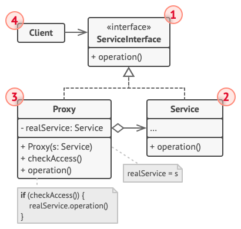

# 代理模式

## 说明
    为其他对象提供一种代理以控制对这个对象的访问。 这种访问控制 也可以称为拦截 ..
    只是说它只是拦截的一种形式,拦截可以有多种形式 ..
## 适用场景

- 延迟初始化(虚拟代理)
    
    如果存在一个偶尔使用的重量级服务对象,一直保持该对象运行会消耗系统资源时,可以使用代理模式 ..
- 访问控制(保护代理)

    只希望特定的客户端使用服务对象,这里的对象可以是操作系统中非常重要的部分 .. 而客户端则是各种已启动的程序(包括恶意程序),此时可以
    使用代理模式
- 本地执行远程服务(远程代理)

    例如各种rpc框架(dubbo grpc),适用于服务对象位于远程服务器的情景..

- 记录日志请求(日志记录代理)

    适用于当你需要保存对于服务对象的请求历史记录时,代理可以在向服务传递请求前进行记录 ..
- 智能引用

    可以控制在合适的时间销毁内部对象,从而节约内存..

## 结构

- 服务接口 （Service Interface） 声明了服务接口。 

  代理必须遵循该接口才能伪装成服务对象。
- 服务 （Service） 类提供了一些实用的业务逻辑。
- 代理 （Proxy） 类包含一个指向服务对象的引用成员变量。 代理完成其任务 （例如延迟初始化、 记录日志、 访问控制和缓存等） 后会将请求传递给服务对象。 通常情况下， 代理会对其服务对象的整个生命周期进行管理。
- 客户端 （Client） 能通过同一接口与服务或代理进行交互， 所以你可在一切需要服务对象的代码中使用代理。

## 总结

- 适配器模式能为被封装对象提供不同的接口， 代理模式能为对象提供相同的接口， 装饰模式则能为对象提供加强的接口。
- 外观模式与代理的相似之处在于它们都缓存了一个复杂实体并自行对其进行初始化。 代理与其服务对象遵循同一接口， 使得自己和服务对象可以互换， 在这一点上它与外观不同。
- 装饰和代理有着相似的结构， 但是其意图却非常不同。 这两个模式的构建都基于组合原则， 也就是说一个对象应该将部分工作委派给另一个对象。 两者之间的不同之处在于代理通常自行管理其服务对象的生命周期， 而装饰的生成则总是由客户端进行控制。

装饰和代理,在一般情况下 不需要区分,但是装饰的生成一般是 客户端生成的原因是,一般是提供各种装饰器让客户端自行组装并使用 ...

而代理是,提供服务,通过策略来应对客户端的需求 ...(例如 Bufferedxxx流的类采用装饰器模式,包括其他Reader ,这让我们也能够自行实现 流的传输速率和进度)

