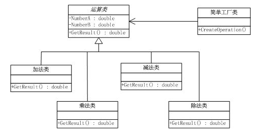
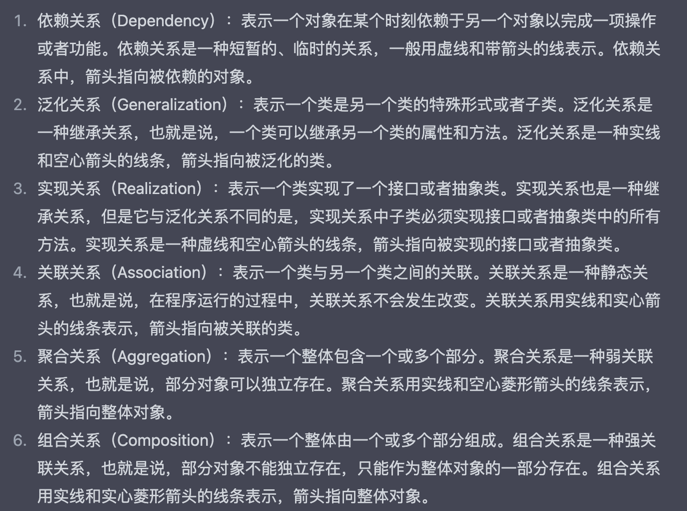

## 简单工厂模式思想
简单工厂模式(simple Factory) 叫做静态工厂方法(Static Factory Method)模式 ..

简单工厂模式通常是定义一个工厂类,这个类可以根据不同变量返回不同类的产品实例 ...
简单工厂模式是一种对象创建型模式,但是简单工厂模式不属于23中Gof设计模式之一 ..

## 模式要点
### 优点
简单工厂模式的工厂类是整个模式的关键,其中包含了必要的逻辑判断,根据外部信息,决定究竟应该创建那个具体类的对象,通常使用简单工厂模式,用户无需对象如何创建,
只需要传入必要的信息即可 ..

### 缺点
工厂类集中了所有实例的创建逻辑,违背了高内聚责任分配的原理,随着系统中具体产品类不断增多,势必要不断修改工厂类,不易维护和扩展. 同时违背了开放封闭原则 ..
> 开放封闭原则：一个软件实体如类、模块和函数应该对扩展开放，对修改关闭。

## 实例
如何设计一个具有加减乘除基本功能的计算器?[引用参考](https://github.com/dunwu/blog/blob/master/source/_posts/03.%E8%AE%BE%E8%AE%A1/02.%E8%AE%BE%E8%AE%A1%E6%A8%A1%E5%BC%8F/01.%E7%AE%80%E5%8D%95%E5%B7%A5%E5%8E%82%E6%A8%A1%E5%BC%8F.md)

对于这四种运算来说,都需要两个操作符,差别仅在于返回的结果不同.

由此,我们可以抽象化它们的共性,提炼出一个父类. 这个类包含了两个操作数,一个返回结果方法,这个方法期待在子类中得以实现 ..

以下通过具体代码来说明:


我们先理解 类图中的依赖关系


< 实线 标识类之间的消息传递关系(表示一个类向另一个类发送消息或者调用方法)

<------ 标识依赖关系

<|实线 泛化关系

<|----- 实现关系

<> 实线 聚合关系

<>实心 实线 组合关系


首先理解,产品角色,简单工厂模式包含所有创建的对象的父类,它负责描述所有实例所共有的公共接口 ..

产品的公共抽象: 
```java
// Product角色，所有实例所共有的公共接口
abstract class Operation {
    public int numA;
    public int numB;
    public abstract int GetResult();
}
```
具体产品组
```java
// ConcreteProduct 角色，实现 Product 中的接口
class Add extends Operation {
    @Override
    public int GetResult() {
        return numA + numB;
    }
}

//ConcreteProduct 角色，实现 Product 中的接口
class Sub extends Operation {
    @Override
    public int GetResult() {
        return numA - numB;
    }
}

//ConcreteProduct 角色，实现 Product 中的接口
class Mul extends Operation {
    @Override
    public int GetResult() {
        return numA * numB;
    }
}

//ConcreteProduct 角色，实现 Product 中的接口
class Div extends Operation {
    @Override
    public int GetResult() {
        if (numB == 0) {
            System.out.println("ERROR!");
            return -1;
        }
        return numA / numB;
    }
}
```

### 工厂(OperationFactory)
工厂是这个模式的核心,简单工厂模式的核心,它负责实现创建所有实例的內部逻辑,工厂类的创建产品类的方法可以被外界直接调用,创建所需的产品对象..

```java
// 工厂角色，简单工厂模式的核心，它负责实现创建所有实例的内部逻辑
class OperationFactory {
    public static Operation CreateOperation (char operate) {
        Operation oper = null;
        switch(operate) {
        case '+':
            oper = new Add();
            break;
        case '-':
            oper = new Sub();
            break;
        case '*':
            oper = new Mul();
            break;
        case '/':
            oper = new Div();
            break;
        default:
            break;
        }
        return oper;
    }
}
```
这个工厂內部的实现也就证明 为什么叫做静态工厂方法模式.. 具有可见的公共静态方法 ..
且內部实现是静态的,当具有新的实现或者扩展时,需要修改內部代码结构,这违背了开闭原则 ..
本质上 也就是基于公共的接口抽象来基于条件的出具体的对象生成 ..
```java
public class SimpleFactoryPattern {
    public static void main(String[] args) {
        int numA = 10;
        int numB = 3;
        int result = 0;
        Operation oper = OperationFactory.CreateOperation('+');
        oper.numA = numA;
        oper.numB = numB;
        result = oper.GetResult();
        System.out.println(numA + " + " + numB + " = " + result);
    }
}
```
