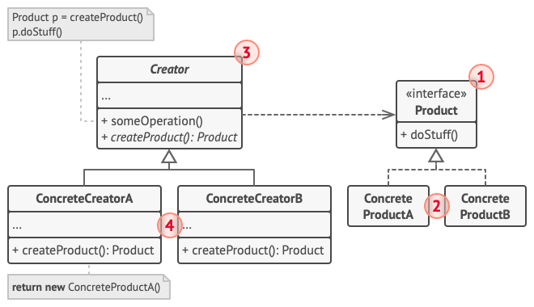
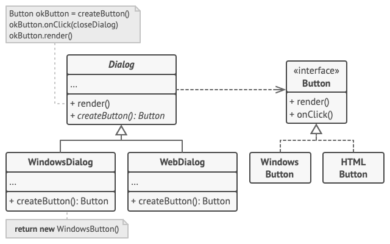

## 工厂方法模式
工厂方法模式 (Factory Method)是一种创建型设计模式， 其在父类中提供一个创建对象的方法， 让子类决定实例化对象的类型。

工厂模式中，增加一种产品类，就要增加一个工厂类：因为每个工厂类只能创建一种产品的实例。
工厂模式遵循“开放-封闭原则”：工厂模式中，新增一种产品并不需要修改原有类，仅仅是扩展。
简单工厂模式相比于工厂方法模式

优点: 工厂类中包含必要的逻辑判断,可以根据客户端的选择条件动态实例化需要的类,也就是说客户端只需要根据需要选择对应的具体实现(失去了具体产品的依赖)..
缺点: 违背开放封闭原则,每当添加一个新的产品,都需要对原有的类进行修改,增加维护成本,且不易于维护 ..
> 开放封闭原则：一个软件实体如类、模块和函数应该对扩展开放，对修改关闭。

## 适用场景
- 当你在编写代码的过程中， 如果无法预知对象确切类别及其依赖关系时， 可使用工厂方法。
- 如果你希望用户能扩展你软件库或框架的内部组件， 可使用工厂方法。
- 如果你希望复用现有对象来节省系统资源， 而不是每次都重新创建对象， 可使用工厂方法。

## 结构


产品 （Product） 将会对接口进行声明。 对于所有由创建者及其子类构建的对象， 这些接口都是通用的。
具体产品 （Concrete Products） 是产品接口的不同实现。
创建者 （Creator） 类声明返回产品对象的工厂方法。 该方法的返回对象类型必须与产品接口相匹配。
你可以将工厂方法声明为抽象方法， 强制要求每个子类以不同方式实现该方法。 或者， 你也可以在基础工厂方法中返回默认产品类型。
注意， 尽管它的名字是创建者， 但他最主要的职责并不是创建产品。 一般来说， 创建者类包含一些与产品相关的核心业务逻辑。 工厂方法将这些逻辑处理从具体产品类中分离出来。 打个比方， 大型软件开发公司拥有程序员培训部门。 但是， 这些公司的主要工作还是编写代码， 而非生产程序员。
具体创建者 （Concrete Creators） 将会重写基础工厂方法， 使其返回不同类型的产品。 注意， 并不一定每次调用工厂方法都会创建新的实例。 工厂方法也可以返回缓存、 对象池或其他来源的已有对象。

> 这个设计模式的含义就是,抛弃了静态工厂方法的局限性,它针对某一个具体的创建者可以有不同的功能逻辑设计,它于简单工厂的最大区别就是,它是动态的,也就是
抛弃了与具体的实例的紧密关联,通过具体实现创建者来管理如何创建示例 ..
> 也就是具有更多的扩展性,而不是单单针对一个静态工厂方法內部的方法进行扩展和修改 ..
> 而是可以通过实现具体的创建者来进行扩展 ..
> 但是存在不足是,一般需要基于策略来使用具体的创建者,所有在使用这个工厂模式的时候,一般也可以结合简单工厂模式使用创建者 ..

### 结构代码范式
#### 产品
假设产品抽象
```java
abstract class Product {
    public abstract void use();
}
```
具体产品
```java
class ConcreteProduct extends Product {
    public ConcreteProduct() {
        System.out.println("创建 ConcreteProduct 产品");
    }

    @Override
    public void Use() {
        System.out.println("使用 ConcreteProduct 产品");
    }
}
```
#### 创建者
创建者
```java
interface Creator {
    public Product factoryMethod();
}
```
可以实现`factoryMethod` 方法, `factoryMethod()` 可以返回一个默认的具体产品类型
```java
interface Creator {
    public Product factoryMethod();
}
```
具体Creator 实现
```java
class ConcreteCreator implements Creator {
    @Override
    public Product factoryMethod() {
        return new ConcreteProduct();
    }
}
```
#### 代码调用
```java
public class factoryMethodPattern {
    public static void main(String[] args) {
        Creator factory = new ConcreteCreator();
        Product product = factory.factoryMethod();
        product.Use();
    }
}
```
或者有一个依赖于创建者的类,它依赖于创建者创建的产品来实现订单管理,但是它并不关心产品如何创建  或者存在那些产品,又或者产品上架 ..

## 更具体的示例
以下示例演示了如何使用工厂方法开发跨平台 UI （用户界面） 组件， 并同时避免客户代码与具体 UI 类之间的耦合。


基础对话框类使用不同的 UI 组件渲染窗口。 在不同的操作系统下， 这些组件外观或许略有不同， 但其功能保持一致。 Windows 系统中的按钮在 Linux 系统中仍然是按钮。

如果使用工厂方法， 就不需要为每种操作系统重写对话框逻辑。 如果我们声明了一个在基本对话框类中生成按钮的工厂方法， 那么我们就可以创建一个对话框子类， 并使其通过工厂方法返回 Windows 样式按钮。 子类将继承对话框基础类的大部分代码， 同时在屏幕上根据 Windows 样式渲染按钮。

如需该模式正常工作， 基础对话框类必须使用抽象按钮 （例如基类或接口）， 以便将其扩展为具体按钮。 这样一来， 无论对话框中使用何种类型的按钮， 其代码都可以正常工作。

你可以使用此方法开发其他 UI 组件。 不过， 每向对话框中添加一个新的工厂方法， 你就离抽象工厂模式更近一步。 我们将在稍后谈到这个模式。

也就是一个顶层抽象,定义了具体实现的行为抽象 ..
```text
// 创建者类声明的工厂方法必须返回一个产品类的对象。创建者的子类通常会提供
// 该方法的实现。
class Dialog is
    // 创建者还可提供一些工厂方法的默认实现。
    abstract method createButton():Button

    // 请注意，创建者的主要职责并非是创建产品。其中通常会包含一些核心业务
    // 逻辑，这些逻辑依赖于由工厂方法返回的产品对象。子类可通过重写工厂方
    // 法并使其返回不同类型的产品来间接修改业务逻辑。
    method render() is
        // 调用工厂方法创建一个产品对象。
        Button okButton = createButton()
        // 现在使用产品。
        okButton.onClick(closeDialog)
        okButton.render()


// 具体创建者将重写工厂方法以改变其所返回的产品类型。
class WindowsDialog extends Dialog is
    method createButton():Button is
        return new WindowsButton()

class WebDialog extends Dialog is
    method createButton():Button is
        return new HTMLButton()


// 产品接口中将声明所有具体产品都必须实现的操作。
interface Button is
    method render()
    method onClick(f)

// 具体产品需提供产品接口的各种实现。
class WindowsButton implements Button is
    method render(a, b) is
        // 根据 Windows 样式渲染按钮。
    method onClick(f) is
        // 绑定本地操作系统点击事件。

class HTMLButton implements Button is
    method render(a, b) is
        // 返回一个按钮的 HTML 表述。
    method onClick(f) is
        // 绑定网络浏览器的点击事件。


class Application is
    field dialog: Dialog

    // 程序根据当前配置或环境设定选择创建者的类型。
    method initialize() is
        config = readApplicationConfigFile()

        if (config.OS == "Windows") then
            dialog = new WindowsDialog()
        else if (config.OS == "Web") then
            dialog = new WebDialog()
        else
            throw new Exception("错误！未知的操作系统。")

    // 当前客户端代码会与具体创建者的实例进行交互，但是必须通过其基本接口
    // 进行。只要客户端通过基本接口与创建者进行交互，你就可将任何创建者子
    // 类传递给客户端。
    method main() is
        this.initialize()
        dialog.render()
```
案例
使用示例： 工厂方法模式在 Java 代码中得到了广泛使用。 当你需要在代码中提供高层次的灵活性时， 该模式会非常实用。

核心 Java 程序库中有该模式的应用：

java.util.Calendar#getInstance()
java.util.ResourceBundle#getBundle()
java.text.NumberFormat#getInstance()
java.nio.charset.Charset#forName()
java.net.URLStreamHandlerFactory#createURLStreamHandler(String) （根据协议返回不同的单例对象）
java.util.EnumSet#of()
javax.xml.bind.JAXBContext#createMarshaller() 及其他类似的方法。
识别方法： 工厂方法可通过构建方法来识别， 它会创建具体类的对象， 但以抽象类型或接口的形式返回这些对象。

还是以 简单工厂模式 里的例子来进行说明。

如何实现一个具有加减乘除基本功能的计算器？

两种模式的 Product 和 ConcreteProduct 角色代码没有区别，不再赘述。

差异在于 Factory 角色部分，以及客户端部分，请在代码中体会。
```text
【Creator 角色】

// Creator 角色，定义返回产品实例的公共工厂方法
interface OperationFactory {
public Operation factoryMethod();
}
【ConcreteCreator 角色】

和简单工厂模式相比，每一种产品都会有一个具体的工厂类负责生产实例。

// ConcreteCreator 角色，具体实现 Creator 中的方法
class AddFactory implements OperationFactory {
@Override
public Operation factoryMethod() {
return new Add();
}
}

// ConcreteCreator 角色，具体实现 Creator 中的方法
class SubFactory implements OperationFactory {
@Override
public Operation factoryMethod() {
return new Sub();
}
}

// ConcreteCreator 角色，具体实现 Creator 中的方法
class MulFactory implements OperationFactory {
@Override
public Operation factoryMethod() {
return new Mul();
}
}

// ConcreteCreator 角色，具体实现 Creator 中的方法
class DivFactory implements OperationFactory {
@Override
public Operation factoryMethod() {
return new Div();
}
}

```

所以如果你需要具体的创建者,也就是需要关心创建者的使用,那么必然是需要结合策略模式的,这是最简单的形式，也是自然而然的 ..

### 与其他设计模式的关系
在许多设计工作的初期都会使用工厂方法模式 （较为简单， 而且可以更方便地通过子类进行定制）， 随后演化为使用抽象工厂模式、 原型模式或生成器模式 （更灵活但更加复杂）。
抽象工厂模式通常基于一组工厂方法， 但你也可以使用原型模式来生成这些类的方法。
你可以同时使用工厂方法和迭代器模式来让子类集合返回不同类型的迭代器， 并使得迭代器与集合相匹配。
原型并不基于继承， 因此没有继承的缺点。 另一方面， 原型需要对被复制对象进行复杂的初始化。 工厂方法基于继承， 但是它不需要初始化步骤。
工厂方法是模板方法模式的一种特殊形式。 同时， 工厂方法可以作为一个大型模板方法中的一个步骤。


工厂方法的总结就是,它不单单是直接返回一个生产的对象了,它将产生对象的行为动作都细化,让每一个对象都被专注的工厂所创建并能够执行一些复杂的逻辑 ..
且不违背开闭原则 ..(简单工厂方法是高度耦合了所有具体对象实现,不符合开闭原则) ...
总结:
1. 原型模式
2. 抽象工厂模式
3. 生成器模式
4. 迭代器模式
5. 模版方法模式

