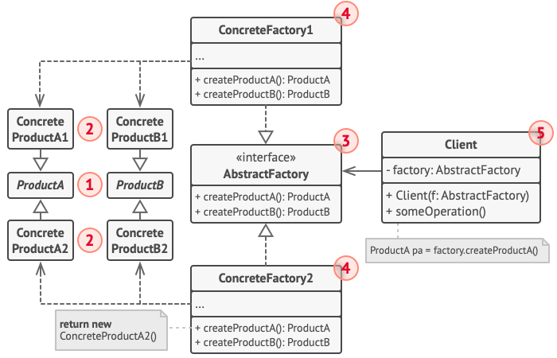

## 抽象工厂模式
### 意图
抽象工厂模式(Abstract Factory)是一种创建型设计模式,它能够创建一系列的,而无序指定其具体类 ..
#### 优点
抽象工厂模式隔离了具体类的生成，用户并不需要知道什么被创建。由于这种隔离，更换一个具体工厂变得相对容易。所有的具体工厂都实现了抽象工厂中定义的那些公共接口，
因此只需要改变具体工厂的实例，就可以在某种程度上改变整个软件系统的行为。
另外，应用抽象工厂模式可以实现高内聚低耦合的设计目的，
因此抽象工厂模式得到了广泛的应用。

当一个产品族中的多个对象被设计成一起工作时，它能够保证客户端始终只使用同一个产品族中的对象。这对一些需要根据当前环境来决定其行为的软件系统来说，是一种非常实用的设计模式。

增加新的具体工厂和产品族很方便，无须修改已有系统，符合“开放封闭原则”。

#### 缺点
在添加新的产品对象时，难以扩展抽象工厂来生产新种类的产品，这是因为在抽象工厂角色中规定了所有可能被创建的产品集合，要支持新种类的产品就意味着要对该接口进行扩展，
而这将涉及到对抽象工厂角色及其所有子类的修改，显然会带来较大的不便。

修改一个抽象工厂下面的所有具体子类修改,不符合开放封闭原则,会带来极大的开销 ..

### 使用场景
抽象工厂模式适用场景：

一个系统要独立于它的产品的创建、组合和表示时。(只关心产品设计,而不关心具体有多少产品 / 以及 产品之间如何组合,只关心大致关系)


上图中,具体的产品B1 / B2 继承于产品B, 具体的产品A1 / 产品A2 继承于产品A抽象, 它们之间的关系是泛化关系

然后具体的工厂2 实现Abstract工厂, 它们之间的关系是实现关系(与泛化的不同是, 实现关系将实现抽象类或者接口的所有方法,而泛化是对已有类型的一种扩展,其表现形式也是继承)

然后,客户端和抽象工厂之间的关系是,关联关系,但是一般关联关系取决于体应用场景和系统设计, 这里很显然客户端需要关联工厂,来构造产品或者选择产品 ..（
例如阿里云,根据选择产品配件来组装一个产品, 这需要依赖于工厂来创建具体的产品)

也就是说,关联关系是一种长久的,不可分离的关系,而依赖关系,是一种短暂的关系 - 一个组件临时依赖于一个组件实现某种动作,它并不是强关联,是一种比关联要弱的关系 ..


一个系统要由多个产品系列中的一个来配置时。(使用其中一种来配置系统,例如博客,你可以选择一种初始化方式,有点类似于策略模式)

当你要强调一系列相关的产品对象的设计以便进行联合使用时。(顶层抽象关系)

当你提供一个产品类库，而只想显示它们的接口而不是实现时。(只面向抽象接口,而不关心具体实现,从而拿到一个具体实现)...


很显然,这术语太泛化 ..
#### 结构说明
抽象产品 （Abstract Product） 为构成系列产品的一组不同但相关的产品声明接口。
具体产品 （Concrete Product） 是抽象产品的多种不同类型实现。 所有变体 （维多利亚/现代） 都必须实现相应的抽象产品 （椅子/沙发）。
抽象工厂 （Abstract Factory） 接口声明了一组创建各种抽象产品的方法。
具体工厂 （Concrete Factory） 实现抽象工厂的构建方法。 每个具体工厂都对应特定产品变体， 且仅创建此种产品变体。
尽管具体工厂会对具体产品进行初始化， 其构建方法签名必须返回相应的抽象产品。 这样， 使用工厂类的客户端代码就不会与工厂创建的特定产品变体耦合。 客户端 （Client） 只需通过抽象接口调用工厂和产品对象， 就能与任何具体工厂/产品变体交互。

也就是说,具体工厂决定了如何创建 以及 初始化产品的 业务逻辑 ..

### 结构代码范式
【AbstractProduct】
```java
abstract class AbstractProductA {
    public abstract void show();
}

abstract class AbstractProductB {
    public abstract void show();
}
```
【ConcreteProduct】
```java
class ConcreteProductA1 extends AbstractProductA {
    @Override
    public void show() {
        System.out.println("ConcreteProductA1");
    }
}

class ConcreteProductA2 extends AbstractProductA {
    @Override
    public void show() {
        System.out.println("ConcreteProductA2");
    }
}

class ConcreteProductB1 extends AbstractProductB {
    @Override
    public void show() {
        System.out.println("ConcreteProductB1");
    }
}

class ConcreteProductB2 extends AbstractProductB {
    @Override
    public void show() {
        System.out.println("ConcreteProductB2");
    }
}
```
【AbstractFactory】
此接口声明了所有创建抽象产品对象的方法
```java
abstract class AbstractFactory {
    public abstract AbstractProductA createProductA();
    public abstract AbstractProductB createProductB();
}
```
【ConcreteFactory】
```java
class ConcreteFactory1 extends AbstractFactory {
    @Override
    public AbstractProductA createProductA() {
        return new ConcreteProductA1();
    }

    @Override
    public AbstractProductB createProductB() {
        return new ConcreteProductB1();
    }
}

class ConcreteFactory2 extends AbstractFactory {
    @Override
    public AbstractProductA createProductA() {
        return new ConcreteProductA2();
    }

    @Override
    public AbstractProductB createProductB() {
        return new ConcreteProductB2();
    }
}
```
每一种工厂负责每一种具体的实现 .. (这就是抽象工厂模式,每一种工厂都可以与系统进行交互 ..)

【客户端】
客户端只需要通过接口即可进行工厂和产品的交互 ..
```java
public class AbstarctFactoryPattern {
    public static void main(String[] args) {
        AbstractFactory  factory1  = new ConcreteFactory1();
        AbstractProductA productA1 = factory1.createProductA();
        AbstractProductB productB1 = factory1.createProductB();
        productA1.show();
        productB1.show();

        AbstractFactory  factory2  = new ConcreteFactory2();
        AbstractProductA productA2 = factory2.createProductA();
        AbstractProductB productB2 = factory2.createProductB();
        productA2.show();
        productB2.show();
    }
}
```

### 与其他设计模式的关系
在许多设计工作的初期都会使用工厂方法模式 （较为简单， 而且可以更方便地通过子类进行定制）， 随后演化为使用抽象工厂模式、 原型模式或生成器模式 （更灵活但更加复杂）。
生成器重点关注如何分步生成复杂对象。 抽象工厂专门用于生产一系列相关对象。 抽象工厂会马上返回产品， 生成器则允许你在获取产品前执行一些额外构造步骤。

抽象工厂模式通常基于一组工厂方法， 但你也可以使用原型模式来生成这些类的方法。
当只需对客户端代码隐藏子系统创建对象的方式时， 你可以使用抽象工厂来代替外观模式。

你可以将抽象工厂和桥接模式搭配使用。 如果由桥接定义的抽象只能与特定实现合作， 这一模式搭配就非常有用。 在这种情况下，
抽象工厂可以对这些关系进行封装， 并且对客户端代码隐藏其复杂性。
抽象工厂、 生成器和原型都可以用单例模式来实现。

工厂方法是模板方法模式的一种特殊形式。 同时， 工厂方法可以作为一个大型模板方法中的一个步骤。(这个很好理解) ..

总结,三种工厂模式的设计,从返回单个对象,到根据方法返回特定实现,到通过规定工厂方法(或者说模版方法)来实现不同具体实现的获取 ..
他们的区别从单一 到 - 单个函数  -> 到多个函数(单工厂 - 多工厂实例(或者通过单例模式实现 单个工厂示例))


方法从静态到动态 - 到多个动态的区别 ...
