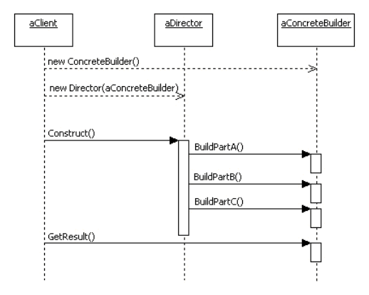
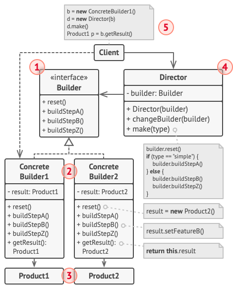
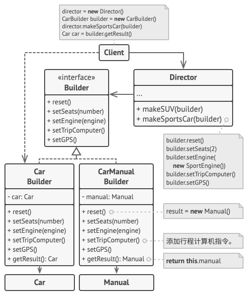

## 构建者模式
### 意图
构建者模式是一种创建型的设计模式,然后你能够分步骤创建复杂对象,改模式允许我们使用相同的创建代码生成不同的类型和形式的对象 ..

使用构建者模式,用户就只需要指定需要构造的类型,具体的构建过程和细节并不需要知道 ..
建造者模式允许修改一个产品的内部表示。

它将构造和表示两块代码隔离开来。

它很好的控制了构建过程。


假设上图, 客户端先使用一个builder,然后通过Director依赖于builder 实现builder的关联,
然后当客户端调用director的构建方法 - 实现 一个目录的构建步骤 ..

最终获取构建结果 ..

总而言之,Director 构建者模式来编排构建过程,最终客户端在构建者身上拿到构建结果 ..


上图我们可以发现,客户端依赖于具体的一个构建者,然后强关联于Director, 它用来编排构建者的构建过程 
然后每一个具体的构建者都需要关联于具体的产品 ..

### 结构
建造者 （Builder） 接口声明在所有类型建造者中通用的产品构造步骤。
具体建造者 （Concrete Builders） 提供构造过程的不同实现。 具体建造者也可以构造不遵循通用接口的产品。
产品 （Products） 是最终生成的对象。 由不同建造者构造的产品无需属于同一类层次结构或接口。
主管 （Director） 类定义调用构造步骤的顺序， 这样你就可以创建和复用特定的产品配置。
客户端 （Client） 必须将某个建造者对象与主管类关联。 一般情况下， 你只需通过主管类构造函数的参数进行一次性关联即可。 此后主管类就能使用建造者对象完成后续所有的构造任务。 但在客户端将建造者对象传递给主管类制造方法时还有另一种方式。 在这种情况下， 你在使用主管类生产产品时每次都可以使用不同的建造者。

一个产品类,由多个部件构成:
```java
class Product {
    List<String> parts = new ArrayList<String>();

    public void AddPart(String part) {
        parts.add(part);
    }

    public void show() {
        System.out.println("============== 产品创建 ==============");
        for (String part : parts) {
            System.out.println(part);
        }
    }
}
```
这些部件本身 可以被接口抽象定义通用化,所以 构建者抽象如下:
```java
interface Builder {
    public void buildPartA();
    public void buildPartB();
    public void buildPartC();
    public Product getResult();
}
```
且声明了一个获取构建结果的方法,很显然构建者模式定义了构建的大体过程, 每个步骤具有强烈的优先顺序,且每一个具体的构建者可以具备不同的构建逻辑,并做一些额外的事情 ..
```java

class ConcreteBuilder implements Builder {
private Product product = new Product();

    @Override
    public void buildPartA() {
        product.AddPart("部件A");
    }

    @Override
    public void buildPartB() {
        product.AddPart("部件B");
    }

    @Override
    public void buildPartC() {
        product.AddPart("部件C");
    }

    @Override
    public Product getResult() {
        return product;
    }
}
```
一个具体的构建者它和一个具体的产品类型关联,更好的管理产品的构建行为和活动过程 .. 
【Director】
指挥者类，指挥建造 Product 的过程（控制构建各部分组件的顺序）。
```java
class Director {
    public void construct(Builder builder) {
        builder.buildPartC();
        builder.buildPartA();
        builder.buildPartB();
    }
}
```
但是其实,对于步骤本身具有强烈关系的来说,我们也许更加偏向于 在具体的构建者中来协调这个执行顺序,那么此示例中的一个项目的三个部分相互构建互不影响,相互独立 ..

所以对于那种强烈依赖关系的步骤,可能需要寻找其他设计模式 ..
【客户端】
用户并不需要知道具体的建造过程，只需指定建造 Product 具体类型。
```java
public class BuilderPattern {
    public static void main(String[] args) {
        Director director = new Director();
        Builder builder = new ConcreteBuilder();

        director.construct(builder);
        Product product = builder.getResult();
        product.show();
    }
}
```

### 伪代码 示例
例如通过构建者模式来构建不同类型的产品 - 例如汽车(以及相应的使用手册),是一个非常完美的示例

```groovy
// 只有当产品较为复杂且需要详细配置时，使用建造者模式才有意义。下面的两个
// 产品尽管没有同样的接口，但却相互关联。
class Car is
    // 一辆汽车可能配备有 GPS 设备、行车电脑和几个座位。不同型号的汽车（
    // 运动型轿车、SUV 和敞篷车）可能会安装或启用不同的功能。

class Manual is
    // 用户使用手册应该根据汽车配置进行编制，并介绍汽车的所有功能。


// 建造者接口声明了创建产品对象不同部件的方法。
interface Builder is
    method reset()
    method setSeats(...)
    method setEngine(...)
    method setTripComputer(...)
    method setGPS(...)

// 具体建造者类将遵循建造者接口并提供生成步骤的具体实现。你的程序中可能会
// 有多个以不同方式实现的建造者变体。
class CarBuilder implements Builder is
    private field car:Car

    // 一个新的建造者实例必须包含一个在后续组装过程中使用的空产品对象。
    constructor CarBuilder() is
        this.reset()

    // reset（重置）方法可清除正在生成的对象。
    method reset() is
        this.car = new Car()

    // 所有生成步骤都会与同一个产品实例进行交互。
    method setSeats(...) is
        // 设置汽车座位的数量。

    method setEngine(...) is
        // 安装指定的引擎。

    method setTripComputer(...) is
        // 安装行车电脑。

    method setGPS(...) is
        // 安装全球定位系统。

    // 具体建造者需要自行提供获取结果的方法。这是因为不同类型的建造者可能
    // 会创建不遵循相同接口的、完全不同的产品。所以也就无法在建造者接口中
    // 声明这些方法（至少在静态类型的编程语言中是这样的）。
    //
    // 通常在建造者实例将结果返回给客户端后，它们应该做好生成另一个产品的
    // 准备。因此建造者实例通常会在 `getProduct（获取产品）`方法主体末尾
    // 调用重置方法。但是该行为并不是必需的，你也可让建造者等待客户端明确
    // 调用重置方法后再去处理之前的结果。
    method getProduct():Car is
        product = this.car
        this.reset()
        return product

// 建造者与其他创建型模式的不同之处在于：它让你能创建不遵循相同接口的产品。
class CarManualBuilder implements Builder is
    private field manual:Manual

    constructor CarManualBuilder() is
        this.reset()

    method reset() is
        this.manual = new Manual()

    method setSeats(...) is
        // 添加关于汽车座椅功能的文档。

    method setEngine(...) is
        // 添加关于引擎的介绍。

    method setTripComputer(...) is
        // 添加关于行车电脑的介绍。

    method setGPS(...) is
        // 添加关于 GPS 的介绍。

    method getProduct():Manual is
        // 返回使用手册并重置建造者。


// 主管只负责按照特定顺序执行生成步骤。其在根据特定步骤或配置来生成产品时
// 会很有帮助。由于客户端可以直接控制建造者，所以严格意义上来说，主管类并
// 不是必需的。
// 虽然不是必须的,但是 本质上 一个顾客买东西都有有一个导购来进行所选产品的提取 / 售后,不太可能让顾客自己操作
// 如果是那样,显然工厂模式更加合适,自己选择要拿取的东西 ..
// 比如发送短信可能有多个厂商,但是我们可能会有一个真正的协调器来协调发短信的过程,虽然每一个厂商的具体过程可能有一定的差异性 ..
// 但是我们不可能让用户直接和其中一个厂商交互, 也就是说我们会为顾客产生特定的设施 ..

class Director is
    private field builder:Builder

    // 主管可同由客户端代码传递给自身的任何建造者实例进行交互。客户端可通
    // 过这种方式改变最新组装完毕的产品的最终类型。
    method setBuilder(builder:Builder)
        this.builder = builder

    // 主管可使用同样的生成步骤创建多个产品变体。
    method constructSportsCar(builder: Builder) is
        builder.reset()
        builder.setSeats(2)
        builder.setEngine(new SportEngine())
        builder.setTripComputer(true)
        builder.setGPS(true)

    method constructSUV(builder: Builder) is
        // ...


// 客户端代码会创建建造者对象并将其传递给主管，然后执行构造过程。最终结果
// 将需要从建造者对象中获取。
class Application is

    method makeCar() is
        director = new Director()

        CarBuilder builder = new CarBuilder()
        director.constructSportsCar(builder)
        Car car = builder.getProduct()

        CarManualBuilder builder = new CarManualBuilder()
        director.constructSportsCar(builder)

        // 最终产品通常需要从建造者对象中获取，因为主管不知晓具体建造者和
        // 产品的存在，也不会对其产生依赖。
        Manual manual = builder.getProduct()
```

### 与其他模式的关系
- 在许多设计工作的初期都会使用工厂方法模式 （较为简单， 而且可以更方便地通过子类进行定制）， 随后演化为使用抽象工厂模式、 原型模式或建造者模式 （更灵活但更加复杂）。
- 建造者重点关注如何分步生成复杂对象。 抽象工厂专门用于生产一系列相关对象。 抽象工厂会马上返回产品， 建造者则允许你在获取产品前执行一些额外构造步骤。
- 你可以在创建复杂组合模式树时使用建造者， 因为这可使其构造步骤以递归的方式运行。
- 你可以结合使用建造者和桥接模式： 主管类负责抽象工作， 各种不同的建造者负责实现工作。
- 抽象工厂、 建造者和原型都可以用单例模式来实现。
