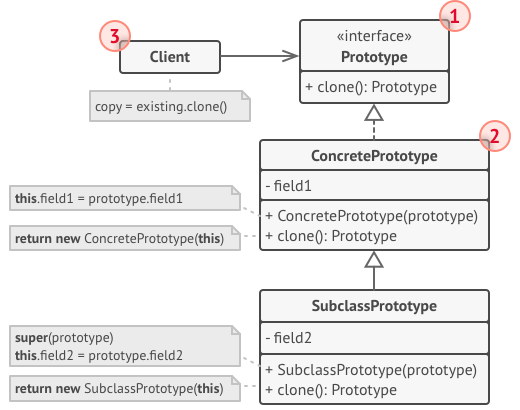

# 原型模式
它是一种创建型设计模式,使你能够复制已有的对象,而无须使代码依赖于他们所属的类 ..

并不是spring中的原型模式 ...

原型模式(prototype) 主要负责对象的复制,它的核心就是类图中的原型类prototype, prototype 类必须具备两个条件:
- 实现cloneable 接口,在java语言中有一个cloneable接口,它的作用只有一个,就是在运行时通知虚拟机可以安全的在实现了此接口的类上使用clone方法 ..

  只有实现了这个接口的类 才可以被拷贝,否则在运行时将抛出CloneNotSupportedException 异常 ..
- 重写Object类中的clone方法,java中,所有的类的父类都是Object类,Object类中有一个clone方法,它的作用是返回对象的一个拷贝,但是其作用域是protected 类型的,
  一般类无法调用,因此Prototype类需要将clone方法的作用域修改为public 类型 ..

## 潜拷贝和深拷贝
潜拷贝仅仅是复制对象的基础类型字段值,字段引用的对象将不会复制 ..

例如,如果一个对象有一个指向 字符串的字段,对对象做浅拷贝,那么两个对象将引用同一个字符串 ..

深拷贝是指当一个类拥有资源,当这个类的对象在发生复制的过程中,资源重新分配，这个过程采用深拷贝 ..

本质上,潜拷贝不会产生资源分配,但是当我们修改这些基础类型的值的数据,它改变了对象引用,而不会影响另一个对象的同等属性的值,
但是如果是对引用的复杂对象的属性进行修改,则导致同时影响,因为它们指向同一个对象 ..

## 使用场景
- 如果你需要复制一些对象,同时又希望代码独立于这些对象所属的具体类,可以使用原型模式,例如深度拷贝一个对象并更新属性 - 保存新对象的内容 ..
- 如果子类的区别在于其对象的初始化方式,那么可以通过该模式来减少子类的数量,别人创建这些子类的目的仅仅是为了创建创建特定类型的对象 ...
    还是那句话,它并不是为了扩展对象,而仅仅是为了此对象的特定内容,而不是从零开始构建一个对象(这个对象的构建过程中可能依赖于其他类型或者数据),
    那么通过这种模式能够减少关联的类型的数量,尽可能的避免代码更新所引起的其他类文件的修改 ..



1. 原型(prototype) 接口对克隆的方法进行声明,在大多数情况下,其中会有一个名为clone克隆的方法 ..
2. 具体原型(ConcretePrototype) 类实现克隆方法,除了将原始对象的数据复制到克隆中之外,该方法还需要处理克隆过程中的极端情况,例如克隆关联关系以及梳理递归依赖等等 ..
3. 客户端,可以复制实现了原型接口的任何对象 ..


##伪代码
在本例中， 原型模式能让你生成完全相同的几何对象副本， 同时无需代码与对象所属类耦合。


所有的形状类都遵循同一个提供克隆方法的接口,在复制自身成员变量值到结果对象前,子类可以调用其父类的克隆 方法 ..
```groovy
// 基础原型。
abstract class Shape is
    field X: int
    field Y: int
    field color: string

    // 常规构造函数。
    constructor Shape() is
        // ...

    // 原型构造函数。使用已有对象的数值来初始化一个新对象。
    constructor Shape(source: Shape) is
        this()
        this.X = source.X
        this.Y = source.Y
        this.color = source.color

    // clone（克隆）操作会返回一个形状子类。
    abstract method clone():Shape


// 具体原型。克隆方法会创建一个新对象并将其传递给构造函数。直到构造函数运
// 行完成前，它都拥有指向新克隆对象的引用。因此，任何人都无法访问未完全生
// 成的克隆对象。这可以保持克隆结果的一致。
class Rectangle extends Shape is
    field width: int
    field height: int

    constructor Rectangle(source: Rectangle) is
        // 需要调用父构造函数来复制父类中定义的私有成员变量。
        super(source)
        this.width = source.width
        this.height = source.height

    method clone():Shape is
        return new Rectangle(this)


class Circle extends Shape is
    field radius: int

    constructor Circle(source: Circle) is
        super(source)
        this.radius = source.radius

    method clone():Shape is
        return new Circle(this)


// 客户端代码中的某个位置。
class Application is
    field shapes: array of Shape

    constructor Application() is
        Circle circle = new Circle()
        circle.X = 10
        circle.Y = 10
        circle.radius = 20
        shapes.add(circle)

        Circle anotherCircle = circle.clone()
        shapes.add(anotherCircle)
        // 变量 `anotherCircle（另一个圆）`与 `circle（圆）`对象的内
        // 容完全一样。

        Rectangle rectangle = new Rectangle()
        rectangle.width = 10
        rectangle.height = 20
        shapes.add(rectangle)

    method businessLogic() is
        // 原型是很强大的东西，因为它能在不知晓对象类型的情况下生成一个与
        // 其完全相同的复制品。
        Array shapesCopy = new Array of Shapes.

        // 例如，我们不知晓形状数组中元素的具体类型，只知道它们都是形状。
        // 但在多态机制的帮助下，当我们在某个形状上调用 `clone（克隆）`
        // 方法时，程序会检查其所属的类并调用其中所定义的克隆方法。这样，
        // 我们将获得一个正确的复制品，而不是一组简单的形状对象。
        foreach (s in shapes) do
            shapesCopy.add(s.clone())

        // `shapesCopy（形状副本）`数组中包含 `shape（形状）`数组所有
        // 子元素的复制品。
```

## 案例
使用示例: java的`Cloneable` 可克隆接口就是立即可用的原型模式..
任何类都可以通过实现该接口来实现可被克隆的性质
- `java.lang.Object#clone()`(类必须实现java.lang.Cloneable接口)

识别方法: 也就是我们只需要关注 `clone` / `copy` 方法 ..

## 与其他模式的关系
原型模式可以用来保存命令模式的历史记录,也就是复制一份无危害的信息进行记录 ..

- 在许多设计工作的初期都会使用工厂方法模式 （较为简单， 而且可以更方便地通过子类进行定制）， 随后演化为使用抽象工厂模式、 原型模式或生成器模式 （更灵活但更加复杂）。
- 抽象工厂模式通常基于一组工厂方法， 但你也可以使用原型模式来生成这些类的方法。(但是应该不会获得好处)
- 原型可用于保存命令模式的历史记录。
- 大量使用组合模式和装饰模式的设计通常可从对于原型的使用中获益。 你可以通过该模式来复制复杂结构， 而非从零开始重新构造。
原型并不基于继承， 因此没有继承的缺点。 另一方面， 原型需要对被复制对象进行复杂的初始化。 工厂方法基于继承， 但是它不需要初始化步骤。
- 有时候原型可以作为备忘录模式的一个简化版本， 其条件是你需要在历史记录中存储的对象的状态比较简单， 不需要链接其他外部资源， 或者链接可以方便地重建。
抽象工厂、 生成器和原型都可以用单例模式来实现。(不是很明白，通过单例模式进行一种对象的构建 ??) ..