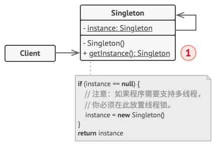

# 单例模式
## 意图
单例模式(Singleton)是一种创建型设计模式,能够保证类只有一个实例,并且提供了一个访问该实例的全局节点 ..

单例(singleton)类声明了一个叫做getInstance 获取实例的静态方法来返回一个所属类的一个相同实例 ..

单例的构造函数必须对客户端代码隐藏,调用getInstance方法是获取单例对象的唯一方式 ...  

所有单例的实现都包含以下两个相同的步骤：

将默认构造函数设为私有， 防止其他对象使用单例类的 new运算符。
新建一个静态构建方法作为构造函数。 该函数会 “偷偷” 调用私有构造函数来创建对象， 并将其保存在一个静态成员变量中。 此后所有对于该函数的调用都将返回这一缓存对象。

如果你的代码能够访问单例类， 那它就能调用单例类的静态方法。 无论何时调用该方法， 它总是会返回相同的对象。

单例模式的优点：

✔ 你可以保证一个类只有一个实例。
✔ 你获得了一个指向该实例的全局访问节点。
✔ 仅在首次请求单例对象时对其进行初始化。

单例模式的缺点：

❌ 违反了单一职责原则。 该模式同时解决了两个问题。
❌ 单例模式可能掩盖不良设计， 比如程序各组件之间相互了解过多等。
❌ 该模式在多线程环境下需要进行特殊处理， 避免多个线程多次创建单例对象。
❌ 单例的客户端代码单元测试可能会比较困难， 因为许多测试框架以基于继承的方式创建模拟对象。 由于单例类的构造函数是私有的， 而且绝大部分语言无法重写静态方法， 所以你需要想出仔细考虑模拟单例的方法。 要么干脆不编写测试代码， 或者不使用单例模式。
    当然我认为这仅仅是一个小事情 ..

## 适用场景
如果程序中的某个类对于所有客户端只有一个可用的实例， 可以使用单例模式。 ⚡ 单例模式禁止通过除特殊构建方法以外的任何方式来创建自身类的对象。 该方法可以创建一个新对象， 但如果该对象已经被创建， 则返回已有的对象。
如果你需要更加严格地控制全局变量， 可以使用单例模式。 ⚡ 单例模式与全局变量不同， 它保证类只存在一个实例。 除了单例类自己以外， 无法通过任何方式替换缓存的实例。
请注意， 你可以随时调整限制并设定生成单例实例的数量， 只需修改 获取实例 方法， 即 getInstance 中的代码即可实现。

举例来说，一些资源管理器常常设计成单例模式。

在计算机系统中，需要管理的资源包括软件外部资源，譬如每台计算机可以有若干个打印机，但只能有一个 Printer Spooler， 以避免两个打印作业同时输出到打印机中。

每台计算机可以有若干通信端口，系统应当集中管理这些通信端口，以避免一个通信端口同时被两个请求同时调用。任务管理器中难以启动两个相同的 task。

## 结构

单例 （Singleton） 类声明了一个名为 getInstance获取实例的静态方法来返回其所属类的一个相同实例。
单例的构造函数必须对客户端 （Client） 代码隐藏。 调用 获取实例方法必须是获取单例对象的唯一方式。

### 形式
#### 懒汉式
懒汉式的实现思路是：你不找懒汉，懒汉根本就懒得去初始化自己。

instance 初始时没有初始化，只有当第一次调 getInstance() 时才创建实例。

缺点：当有两个线程调 getInstance() 方法，当它们同时执行到 if (null == instance) 这行代码，instance 为 null。

继续向下执行，会生成两个实例，违背了单例模式的初衷。
所以需要考虑是否有并发安全的问题,通过锁实现解决并发问题 ..
```java
public class LazySingleton {
    private LazySingleton() {
        System.out.println("Singleton()");
    }

    private static LazySingleton instance = null;

    public static LazySingleton getInstance() {
        if (null == instance) {
            instance = new LazySingleton();
        }
        return instance;
    }
}
```
#### 饿汉式
懒汉式的实现思路是：饿汉根本等不及别人来找他，不管三七二十一先初始化了自身的实例，生怕自己饿着了。

类默认先直接初始化一个实例，以后调用 getInstance() 总是返回这个已创建好的实例。

缺点：在没有必要获取实例时，已经预先产生了开销。

优点：规避了懒汉式方法的线程问题，不用显示编写线程安全代码。
```java
public class HungerSinleton {
    private HungerSinleton() {
        System.out.println("Singleton()");
    }

    private static HungerSinleton instance = new HungerSinleton();

    public static HungerSinleton getInstance() {
        return instance;
    }
}
```

#### 折中
双重锁的形式
如果既不想在没有调用 getInstance() 方法时产生开销，又不想发生线程安全问题，就可以采用双重锁的形式。
```java
public class SyncSingleton {
private SyncSingleton() {
System.out.println("Singleton()");
}

    private static SyncSingleton instance = null;

    public static SyncSingleton getInstance() {
        if (null == instance) {
            synchronized(SyncSingleton.class) {
                if (null == instance) {
                    instance = new SyncSingleton();
                }
            }
        }
        return instance;
    }
}
```
## 与其他设计模式的关系
外观模式类通常可以转换为单例模式类， 因为在大部分情况下一个外观对象就足够了。

如果你能将对象的所有共享状态简化为一个享元对象， 那么享元模式就和单例类似了。 但这两个模式有两个根本性的不同。
只会有一个单例实体， 但是享元类可以有多个实体， 各实体的内在状态也可以不同。
单例对象可以是可变的。 享元对象是不可变的。

抽象工厂模式、 生成器模式和原型模式都可以用单例来实现。
只能说,控制创建对象的单例形式而已,不会对模式造成冲击 ..(使用单例的优势就是复用资源,缓存,全局唯一的好处)
