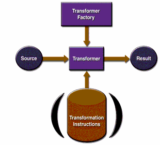
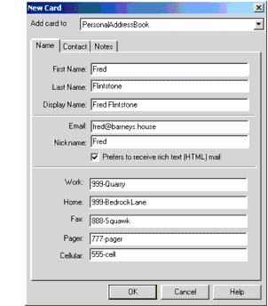
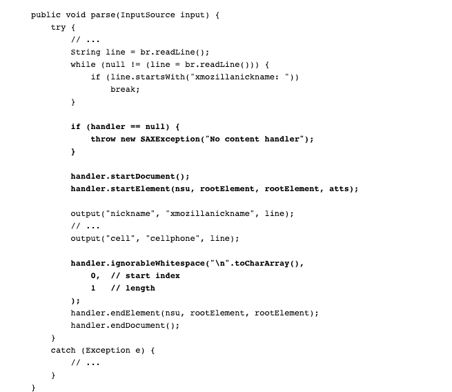
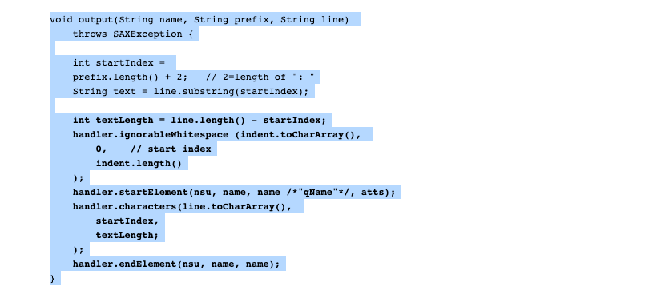

# XSLT API

下图展示了XSLT API的细节:



一个TransformerFactory 对象需要实例化且被用来创建一个Transformer .. 源对象作为转换程序的输入 ..

一个源对象能够从SAX reader 进行读取创建,或者从DOM创建,或者从输入流创建 ..

类似的,结果对象是 转换程序的结果 .. 那就是对象可以是一个SAX事件处理器,DOM 或者输出流 ..

当transformer 创建时, 它能够根据一组转换指令创建,在这种情况下指定的转换将会执行 .. 如果它被创建且没有任何指令,那么转换器对象仅仅是简单的复制源为结果 ..

## XSLT 包

下表中展示了包所定义的XSLT API.

- javax.xml.transform

    定义了TransformerFactory 以及 Transformer 类, 这能够让你获得一个做转换的对象. 在创建了transformer 对象之后,你可以执行它的transform()方法,通过
提供一个输入(source) 并得到一个输出(result) ..
- javax.xml.transform.dom

    此包中包含了基于DOM 创建输入 以及输出的类
- javax.xml.transform.sax

    包含了基于SAX 解析器创建输入 和 基于SAX 事件处理器创建输出的类 ..
- javax.xml.transform.stream

    包含了基于I/O 流创建输入和输出的类 ..

## 介绍
可扩展样式表语言转换(xslt) 标准定义了寻址xml 数据(xpath)的机制 以及在数据上的转换 - 为了将它转换到其他格式 ..

JAXP 包括xslt 的解析实现 ...

在这个教程中, 奖编写输出一个 文档对象模型作为 xml 文件, 并且你将查看如何生成一个dom(从一个任何的数据文件) 将它转换为 xml文件 ...
最终你将把xml数据转换到不同的形式, 学习XPATH 寻址技术(通过这种方式)

### 引入 XSL ,XSLT,以及 XPATH ..

- XSL-FO

格式化对象标准 ,到目前为止,最大的子组件,这个标准给了一种机制(描述字体,页面布局,以及对象渲染的其他方面). 这个子组件并没有被JAXP覆盖,它不包括在这个教程中 ..

- XSLT

这是一个转换语言,它让你能够定义从xml到其他格式的转换,举个例子,你可能使用xslt去产生html 或者 不同的xml 结构 ... 你可能甚至使用它去产生简单文本  或者在某些
其他的文档格式中放入这些信息 ..(正如你在 从任何数据结构产生xml 部分所看到的那样, 一个聪明的应用能够传递它到服务去操作非xml数据 )

- XPath

最终,XSLT 是一个语言能够让你指定可以发生那些事情(当你的特殊元素出现时), 但是编写一个针对一个xml 数据格式的不同部分的程序,你需要指定你在给定时间内关注的结构的部分 ..
XPath 是这样的一个规范语言 .. 它是一个寻址算法 让你指定一个路径去寻找元素,例如 <article><title> 能够和<person><title> 进行区分 ..在这种方式下,
你能够描述对不同<title> 元素的不同的转换类型 ..


### JAXP 转换包
这个部分的剩余部分描述了构成JAXP转换api的包 ..

- javax.xml.transform

  这个包定义了一个工厂类(你使用去获取一个Transformer对象),你然后可以配置转换器(使用输入源) 以及输出(result)对象,并尝试执行 transform()方法去让转换发生 ..

这个源 以及 结果对象将被创建(使用来自其他包的类) ..

- javax.xml.transform.dom

定义了DOMSource 以及 DOMResult的类, 这样你能够使用dom 作为转换的输入以及输出

- javax.xml.transform.sax

  定义了SAXSource 以及 SAXResult 类,这样你能够使用SAX 事件生成器 去作为一个转换的输入, 或者发送SAX 事件作为SAX 事件处理器的输出 ..
- javax.xml.transform.stream

  定义了StreamSource 以及 StreamResult 类, 这让你能够使用I/O 流作为 转换的输入或者输出 ..

### XSLT 示例程序

这一部分的技术没有在JAXP1.4.2参考实现中的示例程序中提供 ... 但是你可以通过这里[下载](https://docs.oracle.com/javase/tutorial/jaxp/examples/xslt_samples.zip)示例程序 ..


### 如何让xpath 工作

xpath 规范是这些规范的种类之一, 包括 xslt 以及 linking / addressing 规范(例如XPointer) .. 因此 理解XPATH 本质上是对xml的大量高级使用 ...
这部分提供了对xpath的介绍(在xslt的上下文中) ..
#### XPATH 表达式
通常来说,xpath 表达式指定了一个模式, 选择一组XML 节点的模式 ... xslt 模版使用那些模式(当应用转换时) - (XPointer,另一方面,为了定义point 或者 一个范围的机制,那么XPath 表达式能够为了解析(寻址)而使用)

在一个XPath表达式中的节点 不仅仅是 elements .. 他们涉及到文本 / 属性 / 以及其他事情 ..  事实上,XPath 规范定义了一个定义7种节点类型的抽象文档模型:
- ROOT
- Element
- Text
- Attribute
- Comment
- Processing instruction
- Namespace

xml数据的根元素 是通过一个element节点建模的, xpath根节点包含了文档的根元素以及和这个文档相关的其他信息 ...

#### XSLT / XPATH 数据模型

和DOM 类似, XSLT / XPATH 数据模型由包含各种类型的节点的树组成, 在任何给定的元素节点下,这里可以包含文本节点, 属性节点 / 元素节点 / 注释节点 / 处理指令的节点 ..

在这个抽象的模型中，语法上的区别消失了，你只剩下一个规范化的数据视图。例如，在一个文本节点中，文本是否被定义在CDATA部分或是否包括实体引用都没有区别。
文本节点将由规范化的数据组成，因为它存在于所有解析完成之后。所以文本将包含一个<字符，无论是否使用了实体引用，如<或CDATA部分来包含它。(同样地，文本将包含一个&字符，无论它是用&来传递还是在CDATA部分）。

在这个部分中,我们处理的最多的是元素节点 以及 文本节点 ..  对于其他寻址算法,查看 XPath 规范 ..

#### 模版和内容
一个 XSLT 模版是格式化指令的集合 - 将应用到节点上 - 通过xpath 表达式选择的节点上 .. 在样式表中,一个XSLT 模版可能看起来如下:
```xml
<xsl:template match="//LIST">
    ...
</xsl:template>
```

这个表达式 // LIST 选择一组LIST 节点的集合(从输入流中), 在这个模版中的其他的指令将告诉系统用它们做什么 ..

被这样的一个表达式选择的节点定义了在模版中的其他表达式评估时的上下文 .. 此上下文能够考虑为 整个集合 .. -例如,当确定它包含了节点的数量 ...

这个上下文也能够考虑为集合的单个成员,然后一个接一个的处理每一个成员 .. 例如,在LIST 处理模版中, 这个表达式 @type 引用了当前LIST节点的类型属性 ..(类似的,
这个表达式 @* 引用了 当前LIST 元素的所有属性) ..


#### 基本的XPATH 寻址
一个xml文档是树结构的(层次结构)节点集合 ... 正如层次结构目录的结构 .. 通过指定一个路径来指示层次结构中的特定节点是有用的(因此这个规范的名称叫做 XPATH)，事实上,
目录路径的符号是原封不动的实施贯彻 ..
- 尾斜杠 作为路径分隔符
- 以 / 开始表示从文档的根开始,作为一个绝对路径
- 否则以其他任何情况开始的都是相对路径
- 双点(..) 指示当前节点的父亲 ..
- 单点 表示当前节点

例如,在一个可扩展的HTML(XHTML)文档中,一个xml 文档看起来像HTML,但是是根据xml规范良好格式编码的 .. 那么路径 /h1/h2/ 表示在 h1下面的h2元素 ..
(在xml中重新调用, 元素名称是大小写敏感的, 因此这种规范的类型工作在XHTML 相比于简单的HTML会更好,因为 HTML 是大小写不敏感的)

在匹配模式规范,例如xpath,规范规定 /h1/h2 选择 h1元素下的h2元素 .. 为了选择一个特定的h2元素,那么你可以使用括号去索引(就像使用数组一样), 那么 /h1[4]/h2[5]将选择在第
4个h1元素下面的 第5个h2元素 ..

> 注意到,在XHTML中,所有的元素名称都是小写 对于xml文档来说这都是常见的约定 .. 然而大写命名也是在此教程中很容易阅读 ..  因此XSLT教程的剩余部分, 所有的xml元素名称都是大写的 ..(属性名,另一方面,保持小写)

一个在xpath表达式指定的名称指的是元素 .. 例如 h1 在 /h1/h2 指的是 h1元素,(element), 对于属性,你可以使用@符号前缀表示一个属性名语法开始 .. 例如@type 表示一个元素的 类型属性 ..
假设你有一个xml 文档(且具有LIST 元素), 例如 表达式 LIST/@type 选择LIST元素的类型属性 ..

> 注意,由于这个表达式没有以 / 开始,那么它会引用和当前上下文相关的文档的不管任何位置出现的LIST元素 ..

### 基本的 XPATH 表达式

表达式的完整范围利用了通配符,操作符  以及 XPATH 定义的函数的优势 .. 这里将快速简短的介绍一下 ..

表达式@type ="unordered" 指示属性名 type 的值是 "unordered", 一个标识List/@type 指定了LIST元素的type 属性(也就是必须具有这个属性) ..

你能够合并那些符号去获得感兴趣的一些事情 ...  在XPATH中, 方括号通常与索引关联延伸指定选择条件, 因此 表达式LIST[@type="unordered"] 选择所有类型值为unordered的LIST元素 ..

类似的表达式包括, 选择关联了一个字符串值的元素,它们的形式是通过关联在这个元素下的所有文本一片(一个更加详尽的解释它是如何进行工作的 - 在 下面部分的String-value of an Element) ..

假设你的模型是在你的组织上进行 - 通过使用由PROJECT元素 以及ACTIVITY元素(具有项目名称的字符串) 以及多个PERSON 元素来列出所设计的用户 所组成的xml结构. 可选的是一个status 元素能够记录项目的状态 ..
这里存在另一种示例(使用延伸的 方括号符号)
- /PROJECT[.="MyProject"] 选择名为"MyProject"的PROJECT ..
- /PROJECT[STATUS] 选择具有STATUS 子元素的所有项目
- /PROJECT[STATUS="Critical"]: 选择所有具有STATUS 子元素且具有单个字符串值Critical的所有项目 ..

#### 联合索引寻址
xpath 规范定义了一些寻址机制,  并且能够使用不同的方式联合使用 .. 因此,XPath 为相对简单的规范提供了大量的表达能力。 下面的部分说明了其他感兴趣的联合 ..
- LIST[@type="ordered"][3] 选择所有类型为ordered的LIST 元素,但是返回第三个
- LIST[3][@type="ordered"] 选择第三个LIST元素,但是如果它的type 属性是ordered ..

> 注意到 许多寻址操作符的更多合并 在XPATH 规范的 2.5部分所 列出(现在xpath 规范有所更新, 应该查看最初的一版 xpath 1.0) .. 
> 对于定义一个XSLT 转换 这是这个规范最有说服力的部分 ..


#### 通配符
通过定义,一个未限定的XPath 表达式可以选择指定模式的xml 节点的集合 ... 例如 /HEAD 匹配所有顶级 HEAD 项, 但是 /HEAD[1] 仅仅匹配第一个 .. 下表列出了能够使用在XPath 表达式中的通配符能够加宽模式匹配的范围 .

- "*"

匹配任何元素节点(无论属性还是文本)

- node()

匹配任何类型的任何节点: 元素节点,文本节点,属性节点,处理指令节点,命名空间节点, 注释节点

- @*

匹配任何属性节点

在项目数据库示例中, /*/PERSON[.="Fred"] 匹配任何PROJECT 以及 ACTIVITY 元素(名为 Fred)

#### 扩展路径寻址

到目前为止,所有表达式(你所看见的)都在层次结构中指定了精确的层级, 例如 /HEAD 指定了 任何HEAD 元素(在层次体系中的第一个层级), 然而 /*/* 指定了在层次结构中的第二层级中的任何元素 ..

为了指定一个中间层级(在层级结构中的), 能够使用双 尾斜杠(//), 例如 XPATH 表达式 // PARA 选择在文档中所有段落元素 ... 无论他们在文档的那个地方 ..


// 表达式能够使用在 路径中,这样的表达式 /HEAD/LIST/PARA 指示在一个以/HEAD/LIST开始的子树中的所有段落元素开始 ..

#### XPATH 数据类型  以及操作符

XPath 表达式产生一组节点、一个字符串、一个布尔值（真/假值）或一个数字。表 4-2 列出了可在 Xpath 表达式中使用的运算符：

- \|

 除此之外,例如,`PARA '|' LIST 选择所有 PARA 以及 列表元素 ` ..
- or ,and

返回 or /and 两个boolean 值

- =,!=

等于或者不等于,对于boolean 以及字符串 或者数值可用 ..
- <,>,<=,>=

小于 / 大于,或者 小于等于 / 大于等于 ..(数字)

- +,-,*,div,mod

增加,减,浮点除法, 以及模运算(取余)操作(例如  6 mod 4 = 2)

表达式能够通过括号分组,因此你不需要担心操作符优先级 ..

> 操作符优先级是回答这个问题的一个术语 .. 如果你指定 a + b * c ,那么以及 (a+b)*c 或者 a + （b*c)? (操作符优先级 是大概和列表中展示的优先级是差不多 ..)


#### 一个元素的字符串值
一个元素的字符串的值 是联合了所有孙代文本节点, 不管有多深, 考虑一个混合内容的xml数据:
```xml
<PARA>This paragraph contains a <b>bold</b> word</PARA>
```

<PARA>元素的字符串值是 This paragraph contains a bold word .. 尤其是,bold 其实被子元素<b> 所包裹 ..

所以一个元素的节点的所有孙代文本节点的联合形式称为 字符串值

同样,值得理解由xpath定义的在抽象数据模型中的 文本是完全标准化的.. 因此无论XML 结构中是否包含了实体引用&it; 或者 在CDATA中的 < 符号,那么元素的字符串值 也会包含< 字符串值 ..
因此当你使用xslt 样式表生成HTML / XML的时候,你必须转换< 的出现到 &lt; 或者将它们封闭到CDATA部分中 .. 类似的&的出现必须转换为 &amp;

### XPATH 函数
这一部分包含了对 XPATH 函数的概述 .. 你能够使用XPATH 函数去选择一组节点 - 和使用元素规范相同的方式 例如已经看到的 .. 其他函数返回一个字符串 或者数值 或者 boolean 值 .. 例如:
表达式 /PROJECT/text() 将获得PROJECT节点的string-value ..

许多函数依赖于当前上下文, 在之前的示例中,每一个对text()函数的调用的上下文是当前选择的PROJECT 节点 ..

下面包含了许多XPATH 函数, 而且描述的很详细, 这部分提供了一个简短列表 展示了可用的XPATH 函数 ... 连同对它们的总结 .. 有关函数的更多信息,查看[XPATH规范](http://www.w3.org/TR/xpath/)的部分4 - 注意这里是 xpath1.0 ..

#### 节点集 函数
许多xpath 表达式可以选择一组节点, 本质上他们返回了一个节点集合, 一个函数可以做到这一点, id(...) 函数将返回特定id的节点(每一个元素可以有一个id  仅当文档具有DTD,它规定了那些属性具有id 类型)

#### 位置函数
- last() 返回最后一个元素的索引, 例如 /HEAD[last()] 选择最后一个HEAD 元素 ..
- position() 返回索引位置, 例如 /HEAD[position() <= 5] 选择前5个HEAD 元素 ..
- count(..) 返回元素的数量, 例如 /HEAD[count(HEAD)=0] 选择所有没有子标题的 head 元素 ..

#### 字符串函数
- concat(string,string) 连接字符串值
- starts-with(string1,string2)  如果string1 以 string2 开始 则返回true
- contains(string1,string2) 如果string1 包含了string2 那么返回true
- substring-before(string1,string2) 返回string1中出现string2 之前的字符串 .
- substring-after(string1,string2) 返回在string1中出现string2之后的子串
- substring(string,idx) 返回从索引位置到结尾的子串, 第一个字符的索引为 1
- substring(string,idx,len) 返回从索引位置到指定长度的子串 .
- string-length(string) 返回指定字符串的长度
- normalize-space() 返回当前节点的标准化 string-value的长度(没有前导或者后导空格, 以及将连续的空白字符转换为单个空格)
- normalize-space(string) 返回标准化的string-value版本(针对给定字符串)
- translate(string1,string2,string3)  转换string1, 替代出现在string2中的字符串 使用来自string3的内容

> 注意: XPath 定义了三种方式来获取元素的内容: text(),string(object), 以及通过元素名隐含的string-value(在表达式中体现 - ,例如 /project[person="Fred"]), string-value 说的是 表达式中的字符值 ..

#### boolean 函数
这些函数操作boolean 或者返回boolean

- not(...): 取反指定的boolean 值
- true() 返回true
- false() 返回false
- lang(String) 如果上下文的语言(由xml:Lang 属性指定) 和指定的语言是相同的(或者是指定的子语言) .. 例如 Lang("en") 对于<PARA_xml :lang="en">...</PARA> 为true.

#### Numeric 函数
数值类的函数 ..

这些函数在数值上操作:
- sum(...) 返回在指定节点集合的每一个节点的数值的总和 ..
- floor(N) 返回地板数
- ceiling(N) 返回天花板数
- round(N) 最接近N的整数

#### Conversion Functions
转换一个类型到另一个类型 ..
- string(...) 返回数值,boolean,node-set的 string值
- boolean(..) 返回一个数值,string,node-set(一个非零数值,或者非空结果集 或者非空字符串 都是 true) .
- number(...) 返回一个boolean,string,node-set的数值(true = 1,false = 0,一个string 包含了数值 那么可以转换为数值, 一个结果集的string-value 能够转换到为一个数字)

#### 命名空间函数
这些函数让你决定一个节点的命名空间的角色 ..
- local-name() 返回当前当前节点的名称, 去掉 命名空间前缀 ..
- local-name(..) 返回在指定节点集的第一个节点的名称, 减去命名空间前缀 ..
- namespace-uri() 返回来自当前节点的命名空间URI ..
- namespace-uri(..) 返回在指定节点集合中的第一个节点的命名空间URI ..
- name() 返回当前节点的EQName(expanded name - uri + 本地名称)
- name(...) 返回在指定节点集合中的第一个节点的EQname

### 总结
XPATH 操作符，函数，通配符, 以及节点寻址算法 能够通过各种各样的方式联合使用 ... 这个介绍应该可以给你一个好的开始(能够对于你特定的目的去指定一个想要的模式) ..


### 输出dom 作为一个xml文件
在你已经构建了dom之后(要么通过解析一个xml 或者程序化构建),你频繁想要保存他作为xml .. 这部分展示你如何使用Xalan 转换包去做这些事情 ..
使用这个包,你需要创建一个transformer 对象去关联DOMSource 到StreamResult .. 然后你可以执行transformer的transform方法去输出DOM 作为 xml 数据 ..

#### 读取xml
第一步是通过解析一个xml文件去在内存中创建一个 dom,现在,你应该对这个过程熟悉 .
> 注意到 这部分讨论的代码存在于TransformationApp01.java,你可以从这里[下载xslt 示例文件](https://docs.oracle.com/javase/tutorial/jaxp/examples/xslt_samples.zip) 并解压他们到 
> install-dir/jaxp-1_4_2-release-date/samples 目录 ..

下面的代码提供了一个开始的基本模版,等价于dom 教程部分的代码使用
```java
import javax.xml.parsers.DocumentBuilder; 
import javax.xml.parsers.DocumentBuilderFactory; 
import javax.xml.parsers.FactoryConfigurationError; 
import javax.xml.parsers.ParserConfigurationException; 
import org.xml.sax.SAXException; 
import org.xml.sax.SAXParseException; 

import org.w3c.dom.Document;
import org.w3c.dom.DOMException;

import java.io.*;

public class TransformationApp01 {

    static Document document; 

    public static void main(String argv[]) {
        if (argv.length != 1) {
            System.err.println("Usage: java TransformationApp01 filename");
            System.exit (1);
        }

        DocumentBuilderFactory factory =
        DocumentBuilderFactory.newInstance();

        try {
            File f = new File(argv[0]);
            DocumentBuilder builder =
            factory.newDocumentBuilder();
            document = builder.parse(f);
  
        } 
        catch (SAXParseException spe) {
            // Error generated by the parser
            System.out.println("\n** Parsing error"
                               + ", line " + spe.getLineNumber()
                               + ", uri " + spe.getSystemId());
            System.out.println("  " + spe.getMessage() );
  
            // Use the contained exception, if any
            Exception x = spe;
            if (spe.getException() != null)
                x = spe.getException();
            x.printStackTrace();
        }
        catch (SAXException sxe) {
            // Error generated by this application
            // (or a parser-initialization error)
            Exception x = sxe;
            if (sxe.getException() != null)
                x = sxe.getException();
            x.printStackTrace();
        }
        catch (ParserConfigurationException pce) {
            // Parser with specified options 
            // cannot be built
            pce.printStackTrace();
        }
        catch (IOException ioe) {
            // I/O error
            ioe.printStackTrace();
        }
    }
}
```

#### 创建一个Transformer
下一步是创建 transformer - 你能够传输 xml 到system.out .. 为了开始, 下面的导入语句是必要的 ..
```java
import javax.xml.transform.Transformer;
import javax.xml.transform.TransformerFactory;
import javax.xml.transform.TransformerException;
import javax.xml.transform.TransformerConfigurationException;
import javax.xml.transform.dom.DOMSource; 
import javax.xml.transform.stream.StreamResult;
import java.io.*;
```

这里,你能够增加一系列的类现在应该可以形式一个标准模式: 一个实体(Transformer),工厂(TransformerFactory)将创建它, 并且异常能够合理生成 ..
因为一个transformation 总是具有一个源和结果 .. 你然后可以导入这个类 去必要的使用DOM 作为一个源(DOMSource),并且作为结果的输出流(StreamResult) ..

下面的代码实现传输:
```java
try {
    File f = new File(argv[0]);
    DocumentBuilder builder = factory.newDocumentBuilder();
    document = builder.parse(f);

    // Use a Transformer for output
    TransformerFactory tFactory =
    TransformerFactory.newInstance();
    Transformer transformer = 
    tFactory.newTransformer();

    DOMSource source = new DOMSource(document);
    StreamResult result = new StreamResult(System.out);
    transformer.transform(source, result);
}

```

这里,你创建了一个transformer 对象,然后使用dom 构造一个source 对象,然后使用System.out 去构造一个结果对象 ...  然后你告诉了transformer 在源对象上操作
并输出到结果对象中 ...

在这种情况下, "transformer" 实际上没有改变任何事情 .. 在XSLT 技术中,你使用的是一个等价转换,这意味着"transformation" 生成了一个源的复制集,没有改变 ...

> 注意: 
> 你能够指定不同的输出属性到transformer 对象上, 例如在w3c规范中定义: http://www.w3.org/TR/xslt#output, 请注意xslt 1.0中的 output ..
> 例如,为了获取缩进的输出,你可以执行以下方法:
> transformer.setOutputProperty(OutputKeys.INDENT,"yes")


最终,以下的高亮部分代码捕捉了产生的新错误:
```java
catch (TransformerConfigurationException tce) {
    System.out.println("* Transformer Factory error");
    System.out.println(" " + tce.getMessage());

    Throwable x = tce;
    if (tce.getException() != null)
        x = tce.getException();
    x.printStackTrace(); 
} 
catch (TransformerException te) {
    System.out.println("* Transformation error");
    System.out.println(" " + te.getMessage());

    Throwable x = te;
    if (te.getException() != null)
        x = te.getException();
    x.printStackTrace();
} 
catch (SAXParseException spe) {
    // ...
}
```
> 注意:
> transformer对象可能抛出 TransformerException
> 工厂可能抛出TransformerConfigurationException
> 为了保留xml 文档的doctype 设置, 必要去增加以下的代码:
> ```java
> 
> import javax.xml.transform.OutputKeys;
>  if (document.getDoctype() != null) {
>  String systemValue = (new File (document.getDoctype().getSystemId())).getName();
>   transformer.setOutputProperty(OutputKeys.DOCTYPE_SYSTEM, systemValue);
>  }
> ```


为了发现有关配置工厂和处理认证异常的信息,查看 dom 对应的章节 ..

#### 运行TransformationApp01 示例
1. 导航到 samples 目录
```shell
cd install-dir/jaxp-1_4_2-release-date/samples.
```
2. 导航到 xslt 目录
```shell
cd xslt
```
3. 编译TransformationApp01 示例
```shell
javac TransformationApp01.java

```
4. 运行代码 - 使用xml 文件
```shell
java TransformationApp01 data/foo.xml
```

你将看到以下输出:
```text
<?xml version="1.0" 
    encoding="UTF-8" 
    standalone="no"?><doc>
  <name first="David" last="Marston"/>
  <name first="David" last="Bertoni"/>
  <name first="Donald" last="Leslie"/>
  <name first="Emily" last="Farmer"/>
  <name first="Joseph" last="Kesselman"/>
  <name first="Myriam" last="Midy"/>
  <name first="Paul" last="Dick"/>
  <name first="Stephen" last="Auriemma"/>
  <name first="Scott" last="Boag"/>
  <name first="Shane" last="Curcuru"/>
```
正如创建transformer 中所提到, transformer 实际上没有改变任何事情 .. 而且仅仅为了执行身份转换, 生成了源的副本 ..

一个真实的转换发生在 从任何数据结构生成 xml ..

#### 写出一个dom的子树
也有可能在一个dom的子树上操作,在这个部分, 你将与一些选项实验 .
> 注意,这一部分的代码在 TransformationApp02.java 如果你还没有下载,可以考虑前面的下载链接下载 .

在这个过程中唯一不同就是你现在讲使用在dom中的 节点创建 DOMSource, 而不是整个dom, 第一步就是导入 你需要获取想要节点的类的定义
```java
import org.w3c.dom.Document;
import org.w3c.dom.DOMException;
import org.w3c.dom.Node;
import org.w3c.dom.NodeList; 
```
下一步就是发现一个节点来做实验, 下面的高亮代码选择第一个<name> 元素 ..
```java
try {
    File f = new File(argv[0]);
    DocumentBuilder builder = factory.newDocumentBuilder();
    document = builder.parse(f);

    NodeList list = document.getElementsByTagName("name");
    Node node = list.item(0); 
}
```

在创建transformer的时候,源对象可以从以前整个文档构建转换为通过节点构建:
```java
DOMSource source = new DOMSource(document);
```
to
```java
DOMSource source = new DOMSource(node);
StreamResult result = new StreamResult(System.out);
transformer.transform(source, result);
```

然后运行这个示例:
- 导航到 samples 目录
- 然后进入 xslt 目录 ..
```shell
cd xslt
```
- 编译 这个示例(TransformationApp02)
- 指定一个xml 进行示例运行
```shell
java TranformationApp02 data/foo.xml
```
你将看到以下的输出 ..
```text
<?xml version="1.0" encoding="UTF-8" 
    standalone="no"?><doc><name 
    first="David" last="Marston"/>
```

此时,第一个<name> 元素已经被打印了 ...

在这个时候,你能够看到如何使用transformer 去编写一个dom(输出) 以及如何使用 dom的子树 作为源对象(在一个传输中), 在下一个部分,你讲看到如何使用transformer 去创建
来自任何数据结构 而转换为xml的方式..

### 从任意的数据结构生成 xml
这部分将转换任意的数据结构到 xml ..

下面是过程的大纲:
- 修改读取数据的现有程序,让它能够生成SAX 事件 ..(无论程序是一个 真实解析器或者简单的某些类型的数据过滤器 - 目前并不重要) ..
- 使用SAX 解析器 能够构造一个SAXSource  进行 transformation ..
- 使用由上一个练习创建的相同StreamResult 去展示结果 ..(但是注意: 你可能仅仅只能够很容易的通过一个 DomResult在内存中去创建 dom)
- 关联输入 到结果 - 使用transformer 对象去做出转换 ..

为了开始,你需要一个数据集(你想要转换) 以及一个能够读取这种数据格式的程序 。。 下面的两部分创建了一个简单的数据文件并使用一个程序读取它 ..

#### 创建一个简单的文件
示例中使用的数据集是一个地址薄, PersonalAddressBook.ldif,如果你没有,请下载示例文件, 这个文件是由Netscape Messenger 创建的 ..
文件中给定了一些模拟数据(一个地址卡号),并且将它导出为 ldap 数据互交换格式 .. 

下面的图标展示了地址薄条目的细节:


到处的地址簿产生了如下文本的文件, 此文件的关心的一部分可以加粗:
```text
dn: cn=Fred Flintstone,mail=fred@barneys.house
modifytimestamp: 20010409210816Z
cn: Fred Flintstone
# 以下全是加粗的
xmozillanickname: Fred
mail: Fred@barneys.house
xmozillausehtmlmail: TRUE
givenname: Fred
sn: Flintstone
telephonenumber: 999-Quarry
homephone: 999-BedrockLane
facsimiletelephonenumber: 888-Squawk
pagerphone: 777-pager
cellphone: 555-cell
xmozillaanyphone: 999-Quarry
objectclass: top
objectclass: person
```

注意到文件的每一行都包含了一个变量名,一个分号,以及空格后跟的一个值 .. sn 变量包含了 个人的姓 以及 cn 包含了地址薄条目的Display Name ..(也就是姓名)

#### 创建一个简单的SimpleParser
下面的步骤将创建一个解析数据的程序:
> 注意,这一部分使用的是 AddressBookReader01.java .

下面的文本展示了程序内容, 它是非常简单的,甚至没有循环,毕竟它仅仅是一个demo ..
```java
import java.io.*; 

public class AddressBookReader01 { 

    public static void main(String argv[]) {
        // Check the arguments
        if (argv.length != 1) {
            System.err.println("Usage: java AddressBookReader01 filename");
            System.exit (1);
        }

        String filename = argv[0];
        File f = new File(filename);
        AddressBookReader01 reader = new AddressBookReader01();
        reader.parse(f);
    }

    // Parse the input file
    public void parse(File f) {
        try {
            // Get an efficient reader for the file
            FileReader r = new FileReader(f);
            BufferedReader br = new BufferedReader(r);

            // Read the file and display its contents.
            String line = br.readLine();
            while (null != (line = br.readLine())) {
                if (line.startsWith("xmozillanickname: "))
                    break;
            }

            output("nickname", "xmozillanickname", line);
            line = br.readLine();
            output("email",  "mail", line);

            line = br.readLine();
            output("html", "xmozillausehtmlmail", line);

            line = br.readLine();
            output("firstname","givenname", line);

            line = br.readLine();
            output("lastname", "sn", line);

            line = br.readLine();
            output("work", "telephonenumber", line);

            line = br.readLine();
            output("home", "homephone", line);

            line = br.readLine();
            output("fax", "facsimiletelephonenumber", line);

            line = br.readLine();
            output("pager", "pagerphone", line);

            line = br.readLine();
            output("cell", "cellphone", line);
        }
        catch (Exception e) {
            e.printStackTrace();
        }
    }
}

```
这个程序包含了三个方法:
- main 方法

   主入口, 可以获取文件的名称(来自命令行参数), 创建解析器实例,然后设置它去解析这个文件,这个方法将不会出现,如果使用SAX解析器 ..(这是将解析代码放入单独方法的原因之一)
- parse 方法

  这个方法操作File对象 由main发送给他的, 然后非常直观, 对效率的唯一让步就是使用BufferedReader. 这很重要,当你操作一个大型文件的时候 ..
- output

  此输出方法中包含了一个行的结构的逻辑, 它需要三个参数,第一个参数给方法一个需要展示的名称, 因此它能够输出html 作为一个变量名, 而不是 xmozillausehtmlmail ..
  第二个参数给出了存储在文件的变量名(xmozillausehtmlmail), 第三个 参数表示包含这个数据的行 .. 然后从行中移除掉变量名 并输出渴望的名称 以及 数据 ..

#### 运行这个示例
指定数据文件
```shell
java AddressBookReader01 data/PersonalAddressBook.ldif
```
然后可以看到以下输出:
```text
nickname: Fred
email: Fred@barneys.house
html: TRUE
firstname: Fred
lastname: Flintstone
work: 999-Quarry
home: 999-BedrockLane
fax: 888-Squawk
pager: 777-pager
cell: 555-cell
```

#### 创建一个生产SAX 事件的解析器
这一部分将让解析器产生sax 事件, 因此你能够使用它作为在xslt中的saxSource对象的基础 ..
> 注意: AddressBookReader02 是从 AddressBookReader01 适配的,因此在代码中仅有一点不同 ..

这个示例中包含了 addressbookReader01 不需要的类:
```java
import java.io.*; 

import org.xml.sax.*;
import org.xml.sax.helpers.AttributesImpl;
```
应用仍然也需要 XmlReader, 这个改变将转换解析器去产生合适的 SAX 事件 ..
```java
public class AddressBookReader02 implements XMLReader { /* ... */ }
```
于是这个示例中不需要main 方法 ..

以下包含了一些全局变量:
```java
public class AddressBookReader02 implements XMLReader {
    ContentHandler handler;

    String nsu = "";  
    Attributes atts = new AttributesImpl();
    String rootElement = "addressbook";

    String indent = "\n ";

    // ...
}

```
这个SAX ContentHandler 是一个对象将会获取由解析器产生的sax 事件 .. 为了让应用进入到xmlReader,引用需要定义一个setContentHandler 方法, 处理器变量将持有一个引用(
当setContentHandler 执行的时候,所发送的对象
)

当解析器生成SAX element 事件的时候, 它将需要提供命名空间和属性信息 ... 因为这是一个简单的应用,所以同时对这些定义为 null ..

应用也会定义一个根元素(为数据结构 - addressBook) 并且设置缩进去提高输出的可读性 ..

因此, 解析方法将被修改去获取一个输入(InputStream 而不是文件) 作为一个参数并且考虑它生成的异常:
```java
public void parse(InputSource input) throws IOException, SAXException
```
 现在, 相反不是创建一个FileReader 实例 - 已经展示在AddressBookReader01, 这个reader 由InputSource 封装 ..
 
> 注意:  下一节展示了如何创建输入源对象，实际上，放在里面的将是一个缓冲的阅读器。但是AddressBookReader可以由其他人使用，在接下来的某个地方。这一步确保了处理的效率，不管给你的是什么阅读器。

下一步就是修改解析方法去产生sax 事件(从文档的开始 以及根元素) .. 下面的高亮代码:
```java
public void parse(InputSource input) {
    try {
        // ...
        String line = br.readLine();
        while (null != (line = br.readLine())) {
            if (line.startsWith("xmozillanickname: ")) 
                break;
        }

        if (handler == null) {
            throw new SAXException("No content handler");
        }

        handler.startDocument(); 
        handler.startElement(nsu, rootElement, rootElement, atts);

        output("nickname", "xmozillanickname", line);
        // ...
        output("cell", "cellphone", line);

        handler.ignorableWhitespace("\n".toCharArray(), 
            0,  // start index
            1   // length
        ); 
        handler.endElement(nsu, rootElement, rootElement);
        handler.endDocument(); 
    }
    catch (Exception e) {
        // ...
    }
}

```



这里,引用检查确保解析器已经正确的使用ContentHandler 配置 .. (对这个应用来说, 我们不关心任何其他事情) ...它将会在文档以及根元素开始的时候生成事件, 并且在根元素 以及文档结束的时候生成结束事件 ..

此时有两点值得注意：
- setDocumentLocator 事件没有发送,因为它是可选的, 如果它很重要, 在startDocument 事件之后会立即发送 ..
- 一个ignorableWhitespace 事件将会在根元素结束之前生成 .. 同样它是可选的, 但是它彻底的优化了输出的可读性, 很快就会看到（在这种情况下, 空白由一个单的新行构成, 它将会以字符串发送到字符串方法的相同方式发送)  - 字符数组,开始索引, 一个长度 ..

现在SAX 事件能够根据文档以及根元素生成 .. 下一步就是修改输出方法去生成合适的元素事件(对于每一个数据项),移除对system.out.println(name + ":" + text)的调用,并增加以下高亮代码:
```java
void output(String name, String prefix, String line) 
    throws SAXException {

    int startIndex = 
    prefix.length() + 2;   // 2=length of ": "
    String text = line.substring(startIndex);

    int textLength = line.length() - startIndex;
    handler.ignorableWhitespace (indent.toCharArray(), 
        0,    // start index
        indent.length()
    );
    handler.startElement(nsu, name, name /*"qName"*/, atts);
    handler.characters(line.toCharArray(), 
        startIndex,
        textLength;
    );
    handler.endElement(nsu, name, name);
}

```


可以看到 是我们自己手动调用处理事件 .. 不过没关系 ...

因为ContentHandler 方法能够发送SAXException 到解析器, 解析器必须能够处理他们 ..  在这种情况喜爱, 没有什么是期待的,因此应用能够简单的允许失败(如果发生) ...
数据的长度可以计算,可以生成个一些忽略性的空格以便可读性 .. 在这种情况下, 这里数据只有一个层级 ..,因此我们能够使用固定的缩进文本(如果数据有更多结构, 我们能够计算需要多少空格来进行缩进), 依赖于数据的内嵌层度 ..

> 注意: 缩进字符和数据没有任何不同 - 他能够让输出更容易阅读 .. 没有这个字符串,那么元素将收尾相连 ..
```xml
<addressbook>
<nickname>Fred</nickname>
<email>...
```

现在,下面的方法配置解析器(使用ContentHandler) 能够接受解析器产生的事件 ..
```java
void output(String name, String prefix, String line)
    throws SAXException {
    //  ...
}

// Allow an application to register a content event handler.
public void setContentHandler(ContentHandler handler) {
    this.handler = handler;
}  

// Return the current content handler.
public ContentHandler getContentHandler() {
    return this.handler;
}

```

各种其他方法必须实现为了满足XmlReader接口, 对于这个练习的目的, 所有的方法都是空实现, 一个生产应用, 必须确保错误处理器方法实现去产生健壮的应用 ..
对此示例, 下面的代码生成了空实现:
```java
// Allow an application to register an error event handler.
public void setErrorHandler(ErrorHandler handler) { } 

// Return the current error handler.
public ErrorHandler getErrorHandler() { 
    return null; 
}

```

下面的代码生成了对剩余xmlReader 接口的空实现,（它们中的大多数对于真正的 SAX 解析器都很有价值，但对像这个这样的数据转换应用程序影响不大）。
```java
// Parse an XML document from a system identifier (URI).
public void parse(String systemId) throws IOException, SAXException 
{ } 

// Return the current DTD handler.
public DTDHandler getDTDHandler() { return null; } 

// Return the current entity resolver.
public EntityResolver getEntityResolver() { return null; } 

// Allow an application to register an entity resolver.
public void setEntityResolver(EntityResolver resolver) { } 

// Allow an application to register a DTD event handler.
public void setDTDHandler(DTDHandler handler) { } 

// Look up the value of a property.
public Object getProperty(String name) { return null; } 

// Set the value of a property.
public void setProperty(String name, Object value) { }  

// Set the state of a feature.
public void setFeature(String name, boolean value) { } 

// Look up the value of a feature.
public boolean getFeature(String name) { return false; }

```

现在你已经有了一个能够生成sax 事件的解析器, 你将使用它构造一个sax 源对象(让你能够转换数据到 xml)

#### 使用解析器如同 saxSource ..

给定一个sax 解析器使用如同 事件源, 你能够构造一个transformer 去产生结果 .. 在这个部分, TransformerApp 将会更新去产生一个流输出结果, 尽管它可能容易产生dom 结果 ..

> 注意,这一部分使用的是 TransformationApp03.java


为了开始,TransformationApp03不同于 02, 它需要导入构造SaxSource 对象的类 ..  dom 类此时不再需要 ..
```java
import org.xml.sax.SAXException; 
import org.xml.sax.SAXParseException; 
import org.xml.sax.ContentHandler;
import org.xml.sax.InputSource;

import javax.xml.transform.sax.SAXSource; 
import javax.xml.transform.stream.StreamResult;

```
下一步, 现在替换DocumentBuilderFactory 创建实现, 而是创建sax 解析器, 它是AddressBookReader ..
```java
public class TransformationApp03 {
    static Document document;  
    public static void main(String argv[]) {
        // ...
        // Create the sax "parser".
        AddressBookReader saxReader = new AddressBookReader();

        try {
            File f = new File(argv[0]);
            // ...
        }
        // ...
    }
}
```
下面的代码将产生SAXSource 对象
```java
// Use a Transformer for output
// ...
Transformer transformer = tFactory.newTransformer();

// Use the parser as a SAX source for input
FileReader fr = new FileReader(f);
BufferedReader br = new BufferedReader(fr);
InputSource inputSource = new InputSource(br);
SAXSource source = new SAXSource(saxReader, inputSource);
StreamResult result = new StreamResult(System.out);
transformer.transform(source, result);
```
这里TransformationApp03 构造了一个buffered reader(正如早期看到的那样) 并封装它为一个Input source 对象, 然后创建了SaxSource 对象, - 传递reader 以及 InputSource 对象 给它.. 最终
将saxSource 传递给transformer ..

当应用运行的时候,transformer 将自己作为sax 解析器(AddressBookReader)的ContentHandler 并告诉解析器去 在inputSource对象上操作, 由解析器生成的事件将会发送给transformer, 这能够做一些合适的事情, 并传递数据给结果对象 .....

最终, 此示例将不会产生异常, 因此在02中的异常处理代码将不会需要 ..

#### 运行 ..
```shell
java TransformationApp03 
  data/PersonalAddressBook.ldif
```
你会看到以下输出:
```text
<?xml version="1.0" encoding="UTF-8"?>
<addressbook>
    <nickname>Fred</nickname>
    <email>Fred@barneys.house</email>
    <html>TRUE</html>
    <firstname>Fred</firstname>
    <lastname>Flintstone</lastname>
    <work>999-Quarry</work>
    <home>999-BedrockLane</home>
    <fax>888-Squawk</fax>
    <pager>777-pager</pager>
    <cell>555-cell</cell>
</addressbook>
```
最终, LDIF 格式文件转换为了 xml ...


## 使用 XSLT 转换 xml 数据
extensible stylesheet language transformations(xslt) api 能够以各种原因使用.. 举个例子, 例如一个足够智能的样式表,你能够生成pdf 或者 PostScript(根据 xml 数据) ..
但是通常,xslt 被用来生成格式化html 输出, 或者创建一个此数据的xml 呈现版本替代 ..

在这个不分,xslt transform 被用来翻译xml 输入数据到 html 输出 ..

> 注意: xslt 规范是大而复杂的, 因此这个教程仅仅能够入门, 它将给你一点背景,因此让你能够理解简单的xslt 处理任务, 但是它没有详细检查如何编写xslt 转换,而是专注于如何使用JAXP的xslt 转换api ...
> 有关在xslt中更全面的了解(或者更全面的基础知识), 考虑一个更好的参考手册,例如 Michael Kay的 XSLT 2.0 以及 XPath 2.0: 编程者手册(wrox,2008)

### 定义简单的文档类型
从定义一个简单的文档类型开始 - 假设是一个 articles(文章),我们的article 文档包含了这些结构标签:
- <TITLE> 文章的标题
- <SECT> 一个部分, 由heading 和 body 组成
- <PARA> 表示一个段落
- <LIST> 列表
- <ITEM> 列表中一个项
- <NOTE> 一个旁白,和主内容有一定的距离 ..

这个结构稍微不常用的方面是 我们没有为一个 section Heading 创建一个独立的元素标签..  例如元素创建能够简单区分heading 文本(以及任何它所包含的tags) 以及 section中内容(body)- 那就是
任何结构化元素位于heading 旁边(在下面) ..

相反，我们将允许标题无缝地合并到一个部分的主体中。这种安排给样式表增加了一些复杂性，但它给了我们探索 XSLT 的模板选择机制的机会。它还符合我们对文档结构的直觉期望，其中标题文本直接跟在结构元素之后，这种排列可以简化面向大纲的编辑。

> 注意: 结构的类型不容易得到验证, 因为xml的 混合内容模型允许文本出现在section的任何地方 .. 然而我们想要限制文本以及内联元素到section的主体中的第一个结构元素之前 .. 
> 那么基于断言的验证器能够做这个事情 ... 但是大多数其他的schema 机制不能这样做 ... 因此我们将会施行为文档类型定义 DTD ..


在这个结构中,section 不能够内嵌 .. 内嵌的深度将确定对section heading所使用的那种 html 格式类型 ..(例如 h1,h2), 使用简单的SECT 标签(代替编号的章节) 对于面向大纲编辑也是有用的 .. 因为它让你可以到处移动而不需要担心改变了任何受影响部分的编号 ..

对于列表, 我们将使用一个type 属性去指定是否一个列表是无需还是有序(强调性), alpha(使用小写字符 列举),ALPHA(大写字符枚举)..

我们也允许某些内联符号去改变文本的外貌:
-  <B> : Bold
- <I>: Italics
- <U>: Underline
- <DEF>: Definition
- <Link>: Link to a URL

> 注意:
> 一个内联标签不会生成一个换行,因此样式改变(通过内联标签 导致的) 不会影响页面的文本流(尽管他们会影响文本的外貌) .. 另一方面，结构标记划分新的文本段，因此除了其他格式更改之外，它至少总是会生成一个换行符。

<DEF> 标签总是被用来表示定义在文本中的术语 .. 例如术语将显示在 斜体中, 通常他们存在于文档中的方式就是如此 ..
但是在 XML 中使用特殊标记将允许索引程序找到此类定义并将它们与标题中的关键字一起添加到索引中。在前面的注释中, 例如: 内联标签的定义以及结构化标签能够通过<DEF> 标签标记为了后续索引 ..

最终,LINK 标签提供了两种目的, 第一将让我们创建一个到URL的连接(而无需放置URL 两次), 因此我们能够编码<lin> http//...<link> 而不是 <a href="http//...">http//...<a> .. 当然.
我们也想要允许看起来像<link target="..">..name..<link> 的形式 .. 那就是<link>标签的第二个原因 .. 它将给我们一个机会去在xslt中使用条件表达式 ..

> 注意: 尽管文章结构非常的简单(只有11标签), 它跑出了足够感兴趣的问题给我们一个好的 xslt的基本能力的展示 .. 但是我们仍然能够利用此规范我们所没有触及的大量区域 ..

### 创建一个测试文档
现在我们将创建一个简单的测试文档(使用内嵌的<SECT> 元素),一些<PARA> 元素,一个<NOTE> 元素,一个<LINK> 以及一个 <LIST type="unordered">,此想法是创建一个具有每一个事情都有之一的文档能够让我们探索更有兴趣的翻译技术 ..

为了去测试文档, 创建一个叫做article.xml的文件,并填入以下xml数据
```xml
<?xml version="1.0"?>
<ARTICLE>
   <TITLE>A Sample Article</TITLE>
   <SECT>The First Major Section
      <PARA>This section will introduce a subsection.</PARA>
      <SECT>The Subsection Heading
         <PARA>This is the text of the subsection.
         </PARA>
      </SECT>
   </SECT>
</ARTICLE>
```
注意到,在这个xml文件中, 子区域完全包含在主区域中(在html中,或者另一方面,headings 并没有包含section的主体内容),结果就是一个大纲结构是很难在简单文本形式中编辑 ..就像这个,但是它很容易使用面向大纲的编辑器编辑 ..

某天,给你一个面向树的xml编辑器 - 能够理解内联标签 <B> 以及 <I>, 他应该能够编辑这种类型的文章 - 在大纲形式中, 而不需要一个复杂的样式表(这样的编辑器可以让作者专注于文章的结构，将布局留到流程的后期),再这样的编辑器中,文章的碎片能够看起来如下:
```xml
<ARTICLE> 
 <TITLE>A Sample Article 
  <SECT>The First Major Section 
   <PARA>This section will 
            introduce a subsection.
    <SECT>The Subheading 
     <PARA>This is the text of the subsection. 
         Note that ...
```

> 注意:在此时,树结构的编辑器存在,但是它们处理内联标签,例如 <B> 以及 <I> 和处理结构标签是一样的方式 .. 并且能使得大纲稍微难以阅读 ..

### 编写一个xslt 转换
现在是时候开始编写一个xslt 转换让xml转换为 html 渲染 ..

从创建普通的xml文档开始:
```xml
<?xml version="1.0" encoding="ISO-8859-1"?>
```
然后增加创建xsl 样式表:
```xml
<?xml version="1.0" encoding="ISO-8859-1"?>
<xsl:stylesheet 
 xmlns:xsl=
    "http://www.w3.org/1999/XSL/Transform" 
 version="1.0"
 >

</xsl:stylesheet>
```

现在能够配置它去产生 兼容html 的输出了
```xml
<xsl:stylesheet 
[...]

   >
<xsl:output method="html"/>

[...]

</xsl:stylesheet>
```
我们将在这个部分的后续得到更多详细的原因(对于条目),现在,注意如果你想要输出任何事情 而不是完好形式的 xml,那么你需要一个 <xsl:output>  标签,正如上面所示, 指定text 或者 html,默认值是 xml ..

> 注意: 当你指定了xml 输出,你能够增加缩进属性去产生非常漂亮的缩进 xml 输出 ..
> 看起来如下:
```xml
<xsl:output method="xml" indent="yes"/>
```

### 处理基本的结构元素
你将开始填写样式表，处理用于创建目录的元素：根元素、标题元素、和标题。你还将处理测试文件中定义的PARA元素。

开始增加主要的指令去处理根元素:
```xml
 <xsl:template match="/">
      <html><body>
         <xsl:apply-templates/>
      </body></html>
   </xsl:template>

</xsl:stylesheet>
```

这个新的xsl 命令他们定义在xsl命名空间中, 指令<xsl:apply-templates> 处理当前节点的孩子, 在这种情况下,当前节点就是根节点 ..

尽管它很简单, 这个示例说明了大量重要的想法, 因此它值得完全理解 .. 这第一个概念就是这个样式表包含了大量的模版, 通过<xsl:template> 标签定义 ..
每一个模版都包含了一个匹配属性, 这使用xpath 寻址算法来选择模版将会应用到选择的元素上 ..
在模板中，不以 xsl: 名称空间前缀开头的标记将被简单地复制。它们后面的换行符和空格也被复制，这有助于使结果输出可读。

> 注意到,当个一个新行没有出现的时候,空格通常将会忽略,为了包括空格在输出中, 或者包括包括其他文本,你可以使用<xsl:text> 标签, 本质上,一个xslt 样式表期待去处理标签 ..
> 因此它能够看到的一切要么是 <xsl:...> 标签 或者某些其他的标签 或者空格 ..

在这种情况下, 非XSL标签是一个 HTML 标签, 因此当根标签匹配的时候, XSLT 输出 HTML 开始元素, 处理任何应用到根的孩子的模版, 并输出html 结束标签 ..

### 处理 <TITLE> 元素
下一步我们需要增加模版去处理article 标签
```xml
 <xsl:template match="/ARTICLE/TITLE">
 <h1 align="center"> 
    <xsl:apply-templates/> </h1>
 </xsl:template>

</xsl:stylesheet>

```
在这个情况下,我们需要制定一个对TITLE元素的完整选择路径 并输出某些HTML 使得标题的文本能够进入到一个更大的,中间对齐的heading中 ..
在这种情况下, apply-templates 标签确保 - 如果标签包含了任何内联标签(例如斜体,链接,下划线) 它们都将被处理 ..

最重要的是,apply-templates 指令导致标题的文本将被处理 .. 和dom 数据模型类似,XSLT 数据模型是基于包含在元素节点中的文本节点的概念(那就是,最终,能够包含在其他元素节点中,等等).. 
那就是层次结构构成了源树 .. 也是一个结果树, 包含了输出 ..

xslt 工作是通过转换源树到结果树 .. 为了可视化xslt 操作的结果, 有助于理解这些树的结构 以及它们的内容 ..(了解这个主题的更多详情 .. 查看 前面的xslt的介绍)

### 处理 Headings
是时候继续处理基本的结构元素了, 增加一个模版去处理顶级heading ..
```xml
 <xsl:template match=
    "/ARTICLE/SECT">
 <h2> <xsl:apply-templates
 select="text()|B|I|U|DEF|LINK"/> 
</h2>
 <xsl:apply-templates select=
    "SECT|PARA|LIST|NOTE"/>
 </xsl:template>

</xsl:stylesheet>
```
这里,你指定了到最顶部的SECT元素的路径,此时, 你应用了模版在两个阶段使用select 属性, 对于第一个阶段,你选择了文本节点, 以及各种内联标签 使用的是XPATH的text() 函数, 以及 管道符号用来匹配多个项 ..
在第二个阶段,你选择了其他了包含在文件中的其他结构化元素 .. 例如sections,段落,列表,注释 ..

使用select 属性让你能够在 h2元素中放置文本和内联元素 .. 同时确保随后处理该部分中的所有结构标记。

换句话说, 你需要确保headings在xml文档 不会反映到 html 的格式中, 区分html的输出很重要 ..

通常,使用select 子句让你能够应用所有的模版到当前上下文中可用信息的子集上 .. 如同另一个示例,这个模版选择了当前节点的所有属性:
```xml
<xsl:apply-templates select="@*"/></attributes>
```
下一步,增加了完全等价的模版去处理子heading(内嵌在一个层级中更深的)
```xml
 <xsl:template match=
    "/ARTICLE/SECT/SECT">
 <h3> <xsl:apply-templates
 select="text()|B|I|U|DEF|LINK"/> 
</h3>
 <xsl:apply-templates select=
    "SECT|PARA|LIST|NOTE"/>
 </xsl:template>

</xsl:stylesheet>
```

### 生成运行时消息
对于更深的heading 你能够增加模版,但是某些时候你必须停止,如果 html 仅仅只有5层级 . 对于当前这个示例, 您将停在两个级别的章节标题处。但是如果xml 输入包含了三层, 你将想要传递一个错误消息给用户 ..

> 注意,我们能够继续处理 SECT 元素(进一步), 通过使用表达式 /SECT/SECT//SECT 那么 // 表示选择任何SECT 元素,在任何深度,由xpath 寻址算法规定的 .. 但是我们也给出一个机会发送消息 ..

增加以下的模版去生成一个错误(当一个部分出现且内嵌的太深)
```xml
 <xsl:template match=
    "/ARTICLE/SECT/SECT/SECT">
 <xsl:message terminate="yes">
 Error: Sections can only be nested 2 deep.
 </xsl:message>
 </xsl:template>

</xsl:stylesheet>
```
这里的terminate 表示 停止处理并产生消息, 处理仍然会继续,但是这一部分的任何事情都将忽略 ..

作为一个额外的练习, 你能够扩展样式表去处理内嵌4层的section .. 生成 <h2> ..<h5> 标签 .. 如果超过4层则抛出一个错误 ..

最终,你可以通过增加以下模版去处理 段落
```xml
<xsl:template match="PARA">
 <p><xsl:apply-templates/></p>
 </xsl:template>
</xsl:stylesheet>
```

### 编写一个基础程序
现在你能够修改程序去使用xslt 去反应一个xml文件没有改变, 改变它 因此你需要使用样式表 ..

下面的Stylizer 示例从TransformationApp02 适配 .. 它解析xml文件并写出到System.out. 主要不同就是下面描述部分:

首先,Stylizer 使用样式表(当创建Transformer的时候)

```java
// ...
import javax.xml.transform.dom.DOMSource; 
import javax.xml.transform.stream.StreamSource; 
import javax.xml.transform.stream.StreamResult; 
// ... 

public class Stylizer {
    // ...
    public static void main (String argv[]) {
        // ...
        try {
            File stylesheet = new File(argv[0]);
            File datafile = new File(argv[1]);

            DocumentBuilder builder = factory.newDocumentBuilder();
            document = builder.parse(datafile);
            // ...
            StreamSource stylesource = new StreamSource(stylesheet); 
            Transformer transformer = Factory.newTransformer(stylesource);
        }
    }
}

```
这个代码使用文件去创建一个StreamSource对象并传递source 对象到工厂类去获取transformer ..

> 注意: 你能够简化代码, 通过消除 DOMSource 类,通过创建一个StreamSource ,对于样式表这同样使用 ..

#### 运行Stylizer 示例
```shell
 java Stylizer data/article1a.xsl  data/article1.xml
```
你将看到以下输出:
```text
<html>
<body>

<h1 align="center">A Sample Article</h1>
<h2>The First Major Section

</h2>
<p>This section will introduce a subsection.</p>
<h3>The Subsection Heading

</h3>
<p>This is the text of the subsection.
</p>

</body>
</html>
```

此时,在输出中有很多多余的空格 .. 在下一部分我们可以消除大多数 ..

#### 修剪空格
首先,这些空格大多数来自于节点(因为在dom中的结构,一个文本节点可以包含大量的可忽略的空格), xsl给你一种方式可以去除他们 ...

> 注意,这个样式表使用的是article1b.xsl

为了移除过量的空格,增加以下代码到样式表中:
```xml
<xsl:stylesheet ...
   >
<xsl:output method="html"/> 
<xsl:strip-space elements="SECT"/>

[...]
```

那么这个指令告诉,xsl 需要移除在sect元素下面的许多文本节点的空格(特点是sect不包含任何东西,但是包含了空格), 如果节点包含了除空格以外的内容将不会受到影响 ..
其他节点也不会 ..

运行应用
```shell
java Stylizer 
  data/article1b.xsl  
  data/article1.xml

```
你将得到以下输出:
```html
<html>
<body>

<h1 align="center">A Sample Article</h1>

<h2>The First Major Section
   </h2>
<p>This section will introduce a subsection.</p>
<h3>The Subsection Heading
      </h3>
<p>This is the text of the subsection.
      </p>

</body>
</html>

```
然而,仍然有换行符 以及在heading之后存在空格, 但是这些是来自于xml写入的形式 ..
因为,在源文档中就包含这些空格 

```text
<SECT>The First Major Section
____<PARA>This section will introduce a subsection.</PARA>
^^^^
```

现在,你能够看到在section heading以新行结尾以及缩进的空格 其实是在para项之前, 那并不是一个大的担忧, 因为浏览器将会压缩处理 html 并且日常处理过量的空格 ..
但是还可以有另一个格式化工具可以供我们使用..

#### 移除最后的空格

最后一点空格的处理可以通过增加以下模版:
```xml
   <xsl:template match="text()">
 <xsl:value-of select="normalize-space()"/>
 </xsl:template>

</xsl:stylesheet>
```
它将移除剩余的空格 ..
```shell
java Stylizer 
  data/article1c.xsl  
  data/article1.xml
```
结果如下:
```html
<html>
<body>
<h1 align="center">A Sample Article
</h1>
<h2>The First Major Section</h2>
<p>This section will introduce a subsection.
</p>
<h3>The Subsection Heading</h3>
<p>This is the text of the subsection.
</p>
</body>
</html>

```

它的结果稍微更棒一点, 当然它能够变得更好,如果有缩进, 但是很难实施去调整到期待的那样, 以下是一些可能的攻击途径以及困难：

- 缩进选项
  
  不幸的是,indent = "yes" 选项能够使用到 xml输出但是不能够使用到html 输出,即使选项可用 但没有帮助,因为html元素很少内嵌的,尽管html 源频繁的缩进去展示隐含的结构 ..
  HTML 标签本身并没有以创建真实结构的方式嵌套。
- 缩进变量

  <xsl:text> 函数让你能够增加任何想要的文本, 包括空格, 因此你能够完全使用去输出缩进空格 .. 这个问题是缩进空格的数量差异, xslt 变量似乎是一个好的注意,但是它们在这里不工作 ..
原因是当你分配一个值到模版中的变量时, 值仅在模版中已知(静态的,编译时), 即使全局定义变量, 那么分配的值也不会存储 能够在运行时让其他模版动态知道 .. 当<apply-templates> 执行其他模版的时候,
那些模版不知道任何变量设置 ..

- 参数化模版

  使用参数化模版是另一个方式去修改模版的行为, 通过确定缩进空格的数量 - 传递为参数是此问题剩余的难题 ..

此时,这里没有更好的方式去控制html 格式输出的缩进, 那就是很不方便,如果你需要展示或者编辑html(作为简单文本).. 但是这不是一个问题(如果你以xml格式编辑),使用 仅仅展示在浏览器的html版本 ..(当你浏览stylizerlc.html,例如,你会看到你期待的结果) ..

### 处理剩余的结构元素 ..
此时,你将处理LIST,NOTE 元素, 这增加了更多的结构到文章中 ..

从增加某些测试数据到示例文档中开始:
```xml
<?xml version="1.0"?>
<ARTICLE>
<TITLE>A Sample Article</TITLE>
 <SECT>The First Major Section
    ...
  </SECT>
  <SECT>The Second Major Section
  <PARA>This section adds a LIST and a NOTE.
    <PARA>Here is the LIST:
      <LIST type="ordered">
        <ITEM>Pears</ITEM>
        <ITEM>Grapes</ITEM>
      </LIST>
  </PARA>
  <PARA>And here is the NOTE:
  <NOTE>Don't forget to go to the 
           hardware store on your way
           to the grocery!
  </NOTE>
  </PARA>
 </SECT> 
</ARTICLE>
```

> 注意: 尽管list / note 在xml文件中包含在独立的段落.. 它事实上没有任何区别(无论它们包含或者不被包含) .. 生成的html 都是相同的方式 ..但是让他们被包含跟容易通过面相大纲的编辑器处理 ..


### 修改<PARA> 处理
现在之前的模版处理不够了 .. 我们面向了更x多的结构, 所以我们需要修改模版
```xml
<xsl:template match="PARA">
<p> <xsl:apply-templates select=
    "text()|B|I|U|DEF|LINK"/>
 </p>
 <xsl:apply-templates select=
    "PARA|LIST|NOTE"/>
</xsl:template>
```

唯一不同就是SECT元素不期待在一个段落中 ..(然而,一个段落能够轻松的存在于另一个段落中 ..,)

### 处理 LIST / ITEM 元素
```xml
<xsl:template match="LIST">
 <xsl:if test="@type='ordered'"> 
  <ol>
   <xsl:apply-templates/>
    </ol>
    </xsl:if>
    <xsl:if test="@type='unordered'">
     <ul>
      <xsl:apply-templates/>
     </ul>
 </xsl:if>
</xsl:template>

</xsl:stylesheet>
```
模版中的<xsl:if> 标签使用了test 属性 去指定了一个boolean 条件,在这种情况下,类型属性将会测试, 并且生成的列表改变依赖于是否值是有序还是无序 ..

注意这个示例中的两个重要的事情:
- 这里没有else 子句, 没有返回或者退出语句, 因此 <xsl:if> 标签覆盖了两个选项(或者<xsl:coolse> 标签也能够被使用,去提供case-语句的功能) ..
- 单引号是必须的 - 围绕这些属性值, 否则 XSLT处理器将尝试解析单词ordered 作为一个xpath 函数而不是字符串 .

现在通过处理ITEM元素完成 LIST的处理
```xml
<xsl:template match="ITEM">
 <li><xsl:apply-templates/>
 </li>
 </xsl:template>

</xsl:stylesheet>
```

### 样式表中的模版顺序
现在你应该想到模版是互不依赖的, 因此不需要关心顺序,但是由于比较的缘故,他们总是增加到示例样式表的尾部)

两个模版的顺序可以是不同的, 在这种情况下定义在后者的顺序将先发现和处理, 举个例子,改变缩进列表的顺序去使用小写字符 .. 你能够指定模版模式看起来像://LIST//LIST

在这个模版中,你能够使用html 选项去生产一个字符枚举,而不是数值化的列表 ..

但是这样的元素也可以使用//LIST 表达式.. 为了确保正确处理是完成了的 . 那么指定//LIST的模版能够出现在 指定//LIST//LIST模版之前 ...


### 处理<NOTE> 元素
最后一个结构元素就是NOTE,增加以下模版
```xml
 <xsl:template match="NOTE">
 <blockquote><b>Note:</b><br/>
 <xsl:apply-templates/>
 </p></blockquote>
 </xsl:template>

</xsl:stylesheet>

```

这个代码提出了一个感兴趣的问题 - 该问题是由包含 <br/> 标记引起的。 对于一个良好形式的xml, 标签必须在样式表中指定为 <br/>，但许多浏览器无法识别该标签。尽管大多数浏览器都能识别序列 <br></br>，但它们都将其视为段落分隔符而不是单个换行符。

换句话说，转换必须产生一个<br>标签，但样式表必须指定<br/>。这就给我们带来了我们在样式表早期添加的那个特殊输出标签的主要原因：
```xml
<xsl:styleheet ... >
<xsl:output method="html"/>
[...]
</xsl:styleheet>
```
输出规范转换空标签例如<br/> 到它的html 格式<br> 到输出中, 转换很重要,因为大多数浏览器不识别空标签, 下面包含了一些受影响的标签:
```text
area      frame   isindex
base      hr      link
basefont  img     meta
br        input   param
col
```
总结,默认的xslt 在输出上产生形式良好的 xml, 并且因为xsl 样式表也是形式良好的xml, 你不能够容易的放置一个标签,例如<br> 到他们的中间,<xsl:output method="html" /> 标签解决了这个问题,因此你能够将<br/> 放入样式表,但是输出中写出 <br>

另一个其他的指定<xsl:output method="html" />的主要原因是,如果是<xsl:output method="text" /> 那么输出的文本是不转义的, 例如 如果样式表包含了 < 实体引用 它将让 < 字符串出现在生成的文本中 ..

当xml生成的时候,另一方面 < 实体引用在样式表中不会改变,因此它同样会出现在生成的文本中 ..
> 注意: 如果你实际上想要将< 作为html 输出的一部分,那么你应该编码为 &it;, 这将输出 <, 因为仅有&会转换为一个 & 字符 ..

#### 运行程序(处理LIST /NOT 元素)
```shell
 java Stylizer data/article2.xsl  data/article2.xml
```

结果输出如下:
```html
...
<h2>The Second Major Section
</h2>
<p>This section adds a LIST and a NOTE.
</p>
<p>Here is the LIST:
</p>
<ol>
<li>Pears</li>
<li>Grapes</li>
</ol>
<p>And here is the NOTE:
</p>
<blockquote>
<b>Note:</b>
<br>Do not forget to go to the hardware store on your way to the grocery!
</blockquote>
```

### 处理内联元素
在article类型中仅剩的标签就是内联标签 并且不会在输出中创建换行 .. 他们将集成到文本的流中 作为一部分 ..
内联元素不同于结构元素 - 内联元素作为一个tag的内容的一部分 .. 如果你认为一个元素是文档树中的一个节点 .. 那么每一个节点都包含了内容和结构 ..

然后内容由文本和它所包含的内联标签组成 .. 结构由标签下的其他元素组成(结构元素) ..

注意到,这个示例文档位于article3.xml中 ..

从增加一点测试数据开始:
```xml
<?xml version="1.0"?>
<ARTICLE>
 <TITLE>A Sample Article</TITLE>
  <SECT>The First Major Section
      [...]
  </SECT>
  <SECT>The Second Major Section
      [...]
  </SECT> 
<SECT>The <i>Third</i> 
    Major Section
 <PARA>In addition to the inline tag
    in the heading, 
 this section defines the term  
    <DEF>inline</DEF>,
 which literally means "no line break". 
 It also adds a simple link to the main page 
    for the Java platform 
(<LINK>http://java.sun.com</LINK>),
 as well as a link to the 
 <LINK target="http://java.sun.com/xml">
   XML </LINK> 
 page.
 </PARA>
 </SECT> 
</ARTICLE>
```
现在可以处理段落中的<DEF> 元素,重命名他们到HTML 斜体标签中 ..

那么我们需要使用模版处理:
```xml
<xsl:template match="DEF">
 <i> <xsl:apply-templates/> </i> 
</xsl:template>
```
接下来，注释掉文本节点的规范化。它已经达到了它的目的，而现在你已经到了需要保留重要空间的地步：
```xml
<!--  
<xsl:template match="text()">
  <xsl:value-of select="normalize-space()"/>
   </xsl:template>
-->
```
这个修改让我们不会让我们在<I> 以及 <DEF>之前丢失空格 ..
现在处理基本的内联HTML 元素(例如<B>,<I>,<U> 进行加粗,斜体,下划线)

```xml
<xsl:template match="B|I|U">
 <xsl:element name="{name()}">
 <xsl:apply-templates/>
 </xsl:element> 
</xsl:template>
```
<xsl:element> 标签让你可以计算你想要生成的元素, 这里你必然想要通过使用当前元素的名称去生成个合适的内联标签 .. 尤其是花括号的使用 .
这个符号能够导致在引号中的文本能够作为XPATH表达式处理 而不是解析为一个文本字符串 .. 这里它将导致XPATH name()函数去返回当前节点的名称 ..

在属性值表达式中的花括号能够别识别 ..(属性值表达式定义在XSLT 规范的 7.6.2 section,并且它们可以出现在模版定义的各个位置). 在这种表达式中,花括号也能够被用来
引用一个属性的值,例如{@foo},或者元素的内容{foo} ,表示获取foo元素的内容..

注意,你能够使用<xsl:attribute> 生成属性,查看 xslt 规范 7.1.3了解更多详情 ..

最后一个元素就是LINK 标签, 最容易处理此标签的方式就是配置一个命名模版 - 我们能够使用一个参数驱动:
```xml
<xsl:template name="htmLink">
 <xsl:param name="dest" 
    select="UNDEFINED"/> 
 <xsl:element name="a">
 <xsl:attribute name="href">
 <xsl:value-of select=""/>
 </xsl:attribute>
 <xsl:apply-templates/> 
 </xsl:element> 
</xsl:template>

```
在这个模版中的主要不同是,没有指定匹配就,而是给模版一个名称子句 .. 因此模版仅仅会在你想要执行它的时候执行 ..

在模板中，您还可以使用 <xsl:param> 标记指定名为 dest 的参数。为了进行一些错误检查，您使用 select 子句(它其实是一个表达式,但是我们直接提供了一个默认值作为返回值)为该参数提供默认值 UNDEFINED。要引用 <xsl:value-of> 标记中的变量，您声明的变量 .

注意: 字符串一定需要使用单引号包裹 ..

<xsl:element> 标签生成一个 元素,之前,你能够简单的指定一个元素(我们想要编码为例如像html一样的事情) .. 但是这里你也能动态的生成html的内容 <ahchor> 锚(<a>) 在<xsl:element> 标签的主体内容中 ..
并且你能够动态的生成anchor的href属性(通过 <xsl:attribute> 标签) ..

最后一个重要的部分是<apply-templates> 标签,它将在LINK 元素下 插入来自文本节点的文本 .. 没有它,生成的html link则没有文本 ..

下一步,增加对LINK 标签的模版,然后调用命名模版:
```xml
<xsl:template match="LINK">
 <xsl:if test="@target">
 <!--Target attribute specified.-->
 <xsl:call-template 
    name="htmLink">
 <xsl:with-param name="dest" 
    select="@target"/> 
 </xsl:call-template>
 </xsl:if>
</xsl:template>
<xsl:template name="htmLink">

[...]
```

test="@target" 子句返回true,如果属性存在于Link tag中,因此<xsl-if> 标签则会生成HTML 标签 - 当链接的文本以及target 定义存在的时候,则生成 ..

<xsl:call-template> 标签执行命名模版, 然而 <xsl:with-param> 指定了一个参数 - 使用命名子句 并制定了一个值(通过select 子句)

作为最后一个步骤, 增加<xsl-if> 标签去处理 LINK 标签(如果没有target 属性)
```xml
<xsl:template match="LINK">
   <xsl:if test="@target">
      [...]
   </xsl:if>

   <xsl:if test="not(@target)">
 <xsl:call-template name="htmLink">
 <xsl:with-param name="dest">
 <xsl:apply-templates/>
 </xsl:with-param>
 </xsl:call-template>
 </xsl:if>
</xsl:template>
```

注意到not(..) 子句反转了前面的测试 ..(记住,这里没有else 子句), 因此模版的这一部分将解析为当target 属性没有指定的时候, 此时, 参数值不能从select 子句获取 .. 而是来自<xsl:with-param> 元素 ..

> 注意:
> 仅仅让他变得显式: 参数以及变量能够通过他们的select子句指定值 .. 当然你也可以使用XPath 表达式, 或者元素的内容指定,这需要使用xslt 标签 ..
> 
> 此时,参数的内容是通过<xsl:apply-templates/> 标签生成的,它在link元素下插入文本节点的内容 ..


#### 运行 解析内联元素 ..
```shell
java Stylizer data/article3.xsl  data/article3.xml
```
然后发现,
```xml
[...]
<h2>The <i>Third</i> Major Section</h2>
<p>In addition to the inline tag in the heading, this section  defines the term <i>inline</i>, which literally means "no line break". It also adds a simple link to the main page for the Java platform (<a href="http://java.sun.com">http://java.sun.com</a>),  as well as a link to the <a href="http://java.sun.com/xml">XML</a> page.</p>

```
很好,已经转换了一个复杂的xml文件到 html..

### 打印 html
你先已经转换了 xml到html,有一天,某些发明了html感知的打印引擎,你能够发现并通过java printing service api 使用它 .. 此时,你将能够打印任何xml文件(通过生成html), 你需要设置样式表 并使用你的浏览器 ..

### xslt 还能做其他事情吗?
尽管这一节很长,但是它仅仅只是xslt的能力的表面, 许多额外的功能等待你在xslt 规范中探索, 这里有一些事情你可以了解:
- import(Section 2.6.2) 以及 include(section 2.6.1)

  rt(Section 2.6.2) 以及 include(section 2.6.1) 使用这些语句去模块化以及合并xslt 样式. include 语句简单的插入任何来自被包括文件的定义 .. 导入语句让你能够覆盖样式表中的定义(通过导入文件中覆盖现有的定义)
- for-each loops(section 8)

  能够循环处理一个集合 并最终处理每一个 .
- choose(case 语句) 条件处理(section 9.2)

  多处理路径分支(基于输入值)
- 生成编号方式(section 7.7)

  动态的生成编号部分, 编号元素,编号文本, xslt 提供了编号模式:
  1. single 在单个标题下的编号项,例如html中的有序数组 .
  2. multiple: 产生多层级的编号(例如 A.1.3)
  3. any : ：对出现的项目进行连续编号，就像课程中的脚注一样。
  
- Formatting numbers (section 12.3)

   控制枚举格式，以便获得数字 (format="1")、大写字母 (format="A")、小写字母 (format="a") 或复合数字，如“A.1”，以及适合特定国际区域的数字和货币金额
- 排序输出(section 10)

  有序输出
- 基于模式的模版(section 5.7)

  多次处理一个元素，每次都采用不同的“模式”。您将模式属性添加到模板，然后指定 <apply-templates mode="..."> 以仅应用具有匹配模式的模板。结合 <apply-templates select="..."> 属性将基于模式的处理应用于输入数据的子集..
- Variables(section 11)

变量类似于方法参数，因为它们可以让您控制模板的行为。但它们并不像你想象的那么有价值。变量的值仅在定义它的当前模板或 <xsl:if> 标记（例如）的范围内是已知的。您不能将值从一个模板传递到另一个模板，甚至不能从模板的封闭部分传递到同一模板的另一部分。
即使对于“全局”变量，这些陈述也是正确的。您可以在模板中更改其值，但更改仅适用于该模板。当用于定义全局变量的表达式被求值时，该求值发生在结构的根节点的上下文中。换句话说，全局变量本质上是运行时常量。这些常量可用于更改模板的行为，尤其是与 include 和 import 语句结合使用时。但是变量不是通用的数据管理机制。

### 变量的问题
创建一个模板并为链接的目标设置一个变量是很诱人的，而不是麻烦地设置一个参数化模板并以两种不同的方式调用它。这个想法是将变量设置为默认值（例如，LINK 标记的文本），然后，如果目标属性存在，则将目标变量设置为目标属性的值。
那将是个好主意——如果可行的话。但同样，问题是变量仅在定义它们的范围内是已知的。因此，当您编写一个 <xsl:if> 标记来更改变量的值时，该值仅在 <xsl:if> 标记的上下文中是已知的。一旦遇到 </xsl:if>，对变量设置的任何更改都会丢失。
一个类似的诱人想法是用变量 () 替换 text()|B|I|U|DEF|LINK 规范的可能性。但是因为变量的值是由定义它的位置决定的，所以全局内联变量的值由文本节点、<B> 节点等组成，它们恰好存在于根级别。换句话说，在这种情况下(非根级别,它们是空的)，此类变量的值为空。