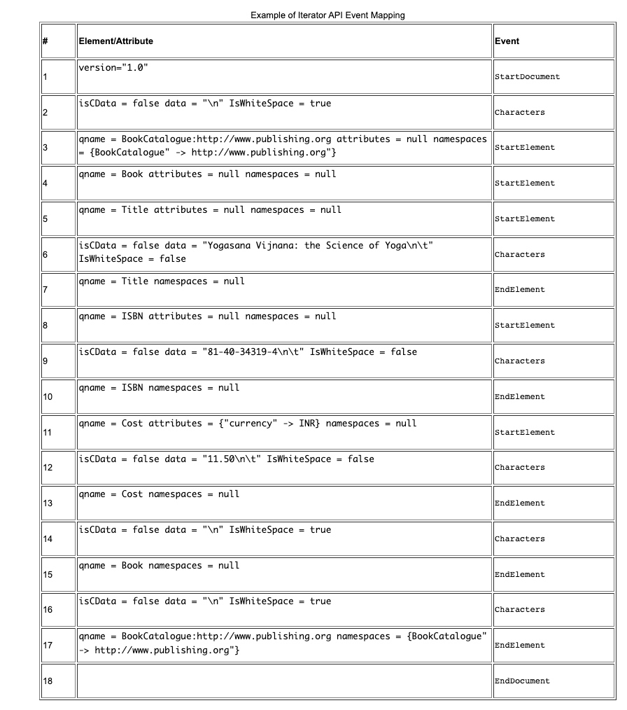

# Streaming API for XML API

StAX 是 JAXP 系列中的最新 API，为希望进行高性能流过滤、处理和修改的开发人员提供了 SAX、DOM、TrAX 和 DOM 的替代方案，尤其是在低内存和有限可扩展性要求的情况下。

作为总结,StAX 提供了一个标准的,双向的拉取式解析器接口(进行流式xml 处理),提供了一个更加简单的编程模型(相比于 SAX) 以及相比于DOM 更高效的内存管理 ..

StAX 让开发者能够解析并修改XML Stream作为事件,并且扩展xml 信息模型去允许应用特定的补充, 更多详细StAX 与各种可替代的API的比较能够在[Streaming API for XML](https://docs.oracle.com/javase/tutorial/jaxp/stax/index.html) 以及 [Comparing StAX to Other JAXP APIs](https://docs.oracle.com/javase/tutorial/jaxp/stax/why.html#bnbea) 发现

## StAX 包

下表中表示StAX API定义在哪些包中
- javax.xml.stream

    定义了XMLStreamReader 接口,这被用来 在XML文档上迭代元素 ..
    XMLStreamWriter 接口指定了XML 应该如何写 ..
- javax.xml.transform.stax

    提供了StAX 特定的转换API


## 介绍

基于java 流的技术,事件驱动,拉取式api 来读取或者写入 xml 文档 .. StAX 让你能够创建双向xml解析器 - 快速的,相对容易的编程, 并且只有一点内存占用 ..

## 为什么使用StAX

StAX项目是由BEA牵头以及来自sum 微服务系统的支持, 以及在 2004年5月java 社区进程最终投票通过了[JSR 173 规范](http://jcp.org/en/jsr/detail?id=173) ..

StAX API的主要目的是给出 " 通过暴露一个简单的基于迭代器的API 来给编程者解析控制, 这允许编程者去对下一个事件进行询问(拉取事件) 并且允许状态能够存储在程序中" ...

StAX 被创建来解决在两种普遍盛行的解析api的限制,SAX / DOM ..

### Streaming 对比 DOM

一般而言，有两种用于处理 XML 信息集的编程模型：流和文档对象模型 (DOM)。
DOM 模型涉及创建表示整个文档树和 XML 文档的完整信息集状态的内存中对象。一旦进入内存，DOM 树就可以自由导航和任意解析，从而为开发人员提供最大的灵活性。
然而，这种灵活性的代价是潜在的大内存占用和显着的处理器要求，因为在文档处理期间，文档的整个表示必须作为对象保存在内存中。
这在处理小文档时可能不是问题，但内存和处理器要求会随着文档大小而迅速增加。
流指的是一种编程模型，在该模型中，XML 信息集在应用程序运行时连续传输和解析，通常是实时的，并且通常来自事先无法准确知道其内容的动态源。
此外，基于流的解析器可以立即开始生成输出，信息集元素可以在使用后立即被丢弃和垃圾收集。虽然在某些情况下提供更小的内存占用、更低的处理器要求和更高的性能，但流处理的主要权衡是您一次只能在文档中的一个位置看到信息集状态。
您基本上被限制在文档的“硬纸板管”视图中，这意味着您需要在阅读 XML 文档之前知道要进行什么处理。
当您的应用程序有严格的内存限制时，用于 XML 处理的流模型特别有用，例如运行 Java Platform, Micro Edition（Java ME 平台）的手机，或者当您的应用程序需要同时处理多个请求时，
例如应用程序服务器。事实上，可以说大多数 XML 业务逻辑都可以从流处理中受益，并且不需要在内存中维护整个 DOM 树。

### 拉取解析 对比 推送解析
流式拉取解析是指一种编程模型，在该模型中，客户端应用程序在需要与 XML 信息集交互时调用 XML 解析库上的方法——也就是说，客户端仅在明确请求时才获取（拉取）XML 数据。
流式推送解析是指一种编程模型，在该模型中，当解析器遇到 XML 信息集中的元素时，XML 解析器将 XML 数据发送（推送）到客户端——也就是说，无论客户端是否准备好使用数据，解析器都会发送数据当时。
在处理 XML 流时，拉式解析比推式解析有几个优势：
通过拉式解析，客户端控制应用程序线程，并可以在需要时调用解析器上的方法。相比之下，对于推送处理，解析器控制应用程序线程，客户端只能接受来自解析器的调用。
拉式解析库可以小得多，与这些库交互的客户端代码比推送库简单得多，即使对于更复杂的文档也是如此。
拉取客户端可以使用单个线程一次读取多个文档。
StAX 拉式解析器可以过滤 XML 文档，从而可以忽略客户端不需要的元素，并且它可以支持非 XML 数据的 XML 视图。

总结就是,拉取式提供了一种懒解析的优势 ...

### StAX Use Cases
StAX 规范定义了大量的使用情况(针对这个api)
- 数据绑定

  1. 解组 一个 xml 文档
  2. 成组一个xml 文档
  3. 并行文档处理
  4. 无线连接

- 简单对象访问协议消息处理(SOAP) - simple object access  protocol

  1. 解析简单的可预见性的结构
  2. 解析 向前引用的图形表示
  3. 解析Web 服务描述语言(WSDL) - Web Services Description Language(WSDL)

- 虚拟数据源

  1. 浏览存储在数据库中的xml数据
  2. 浏览由xml数据绑定创建的 java对象中的数据
  3. 导航一个dom 树 如同事件流一样 ...

- 解析特定的XML 词汇
- 管道化xml 处理

完整的使用情况 的讨论超出了这个这个教程的范围,详情参考 StAX 规范 .

### 比较 StAX 和其他JAXP api
作为 JAXP 系列中的一个 API，StAX 可以与其他 API 等同于 SAX、TrAX 和 JDOM。在后两者中，StAX 不如 TrAX 或 JDOM 强大或灵活，但它也不需要那么多的内存或处理器负载才能发挥作用，而且在许多情况下，StAX 的性能优于基于 DOM 的 API。上面概述的相同论点，权衡 DOM 模型与流模型的成本/收益，适用于此。
考虑到这一点，可以在 StAX 和 SAX 之间进行最接近的比较，StAX 正是在这里提供了在许多情况下有益的功能；其中一些包括：
支持 StAX 的客户端通常比 SAX 客户端更容易编码。虽然可以说 SAX 解析器稍微更容易编写，但 StAX 解析器代码可以更小并且客户端与解析器交互所需的代码更简单。
StAX 是双向 API，这意味着它既可以读取也可以写入 XML 文档。 SAX 是只读的，因此如果要编写 XML 文档，则需要另一个 API。
SAX 是一种推送 API，而 StAX 是一种拉取 API。上面概述的推送和拉取 API 之间的权衡适用于此。
下表总结了 StAX、SAX、DOM 和 TrAX 的比较特性。 （该表改编自 Jeff Ryan 的 [Does StAX Belong in Your XML Toolbox?](http://www.developer.com/xml/article.php/3397691)）。

XML 解析器 api特性总结

---
| feature | StAX | SAX | DOM | TrAX |
|---- | ---- | ---- | ---- | ---- |
| API Type | Pull,Streaming | Push,streaming | in memory tree | XSLT Rule |
| 容易使用 | 高 | 中 | 高 | 中 |
| xpath 能力 | 没有 | 没有 | 有 | 有 |
| cpu 以及内存效率 | 好 | 好 | 差 | 差 |
| 仅向前 | 是 | 是 | 否 | 否 |
| 读xml | 是 | 是 | 是 | 是 |
|写xml | 是 | 否 | 是 | 是 |
|crud | 否 | 否 | 是 | 否 |


## StAX api

StAX API 公开了用于对 XML 文档进行基于事件的迭代处理的方法。 XML 文档被视为经过过滤的一系列事件，信息集状态可以以过程方式存储。此外，与 SAX 不同，StAX API 是双向的，支持读取和写入 XML 文档。

### 游标api(cursor api)

顾名思义，StAX 游标 API 表示一个游标，您可以使用它从头到尾遍历 XML 文档。此光标一次可以指向一个事物，并且始终向前移动，从不向后移动，通常一次指向一个信息集元素。
两个主要的游标接口是 XMLStreamReader 和 XMLStreamWriter。 XMLStreamReader 包括用于从 XML 信息模型检索的所有可能信息的访问器方法，包括文档编码、元素名称、属性、名称空间、文本节点、开始标记、注释、处理指令、文档边界等；例如：

```java
public interface XMLStreamReader {
    public int next() throws XMLStreamException;
    public boolean hasNext() throws XMLStreamException;

    public String getText();
    public String getLocalName();
    public String getNamespaceURI();
    // ... other methods not shown
}
```
您可以调用 XMLStreamReader 上的方法，例如 getText 和 getName，以获取当前光标位置的数据。 XMLStreamWriter 提供了对应 StartElement 和 EndElement 事件类型的方法；例如：
```java
public interface XMLStreamWriter {
    public void writeStartElement(String localName) throws XMLStreamException;
    public void writeEndElement() throws XMLStreamException;
    public void writeCharacters(String text) throws XMLStreamException;
    // ... other methods not shown
}
```
游标 API 在许多方面反映了 SAX。例如，方法可用于直接访问字符串和字符信息，整数索引可用于访问属性和命名空间信息。与 SAX 一样，游标 API 方法以字符串形式返回 XML 信息，这最大限度地减少了对象分配要求。

### 集成API

StAX 迭代器 API 将 XML 文档流表示为一组离散事件对象。这些事件由应用程序提取，并由解析器按照它们在源 XML 文档中的读取顺序提供。

基本迭代器接口称为 XMLEvent，XMLEvent 表中列出的每种事件类型都有子接口。读取迭代器事件的主要解析器接口是 XMLEventReader，写入迭代器事件的主要接口是 XMLEventWriter。 
XMLEventReader 接口包含五个方法，其中最重要的是 nextEvent，它返回 XML 流中的下一个事件。 XMLEventReader 实现 java.util.Iterator，这意味着 XMLEventReader 的返回值可以被缓存或传递到可以使用标准 Java Iterator 的例程中；例如：
```java
ublic interface XMLEventReader extends Iterator {
    public XMLEvent nextEvent() throws XMLStreamException;
    public boolean hasNext();
    public XMLEvent peek() throws XMLStreamException;
    // ...
}

```
类似的,迭代器api的输出端: 
```java
public interface XMLEventWriter {
    public void flush() throws XMLStreamException;
    public void close() throws XMLStreamException;
    public void add(XMLEvent e) throws XMLStreamException;
    public void add(Attribute attribute) throws XMLStreamException;
    // ...
}

```

#### 迭代器事件类型

XMLEvent Types

| event type            | description |
|-----------------------| ----|
| StartDocument         | 报道一组xml事件的开始,包括编码,xml版本,以及单独的属性 |
| StartElement          | 报告元素的开始,包括任何属性以及命名空间声明,也提供访问前缀,以及命名空间URI,以及开始tag的 本地名称(local name) |
| EndElement            | 元素的结束标签报告,命名空间（已经超出范围)能够在这里重新调用(如果它们已经在相关的 StartElement上显式设置) |
| Characters            | 对应XML CData 部分 以及 CharacterData 实体, 注意到可忽略的空格以及重要的空格能够暴露为 Character 事件 |
| EntityReference       | 字符实体能暴露为离散事件, 对应的应用开发者能够选择解析或者通过(如果未解析),默认,实体是解析的,除此之外,如果你不想要暴露实体作为一个事件,那么取代为文本并报告为字符事件 .. |
| ProcessingInstruction | 对于处理指令之下的目标和数据进行报告 |
| Comment               | 返回注释的文本 |
| EndDocument           | 报告一组xml 事件集合的结束 |
| DTD                   | 报告有关DTD的字符串信息, 如果存在,那么可以关联流,并提供一个方法返回在dtd中的任何发现的自定义对象 .. |
| Attribute             | 属性通常报告为StartElement 事件的一部分 , 然而,有时想要返回一个属性作为单独的Attribute 事件 ,例如,当命名空间返回作为XQuery或者XPath表达式的结果 |
| Namespace             | 和属性类似, 命名空间通常报告为StartElement事件的一部分,但是有时渴望报告一个命名空间作为单独的命名空间事件 |

请注意，仅当正在处理的文档包含 DTD 时，才会创建 DTD、EntityDeclaration、EntityReference、NotationDeclaration 和 ProcessingInstruction 事件。

#### 事件映射示例
正如一个示例如何将一个事件迭代器api 映射为 xml 流,考虑以下xml 文档:
```xml
<?xml version="1.0"?>
<BookCatalogue xmlns="http://www.publishing.org">
    <Book>
        <Title>Yogasana Vijnana: the Science of Yoga</Title>
        <ISBN>81-40-34319-4</ISBN>
        <Cost currency="INR">11.50</Cost>
    </Book>
</BookCatalogue>
```

该文档将被解析为十八个主要和次要事件，如下表所示。请注意，显示在大括号 ({}) 中的次要事件通常是从主要事件访问的，而不是直接访问的。



从这个事件流中可以知道, EndElement 事件类型的语义说明是什么意思 ..

- 事件按照在文档中遇到相应的 XML 元素的顺序创建，包括元素的嵌套、元素的打开和关闭、属性顺序、文档开始和文档结束等。
与正确的 XML 语法一样，所有容器元素都有相应的开始和结束事件；例如，每个 StartElement 都有一个对应的 EndElement，即使对于空元素也是如此。
- 属性事件被视为次要事件，并从其相应的 StartElement 事件中访问。
- 与 Attribute 事件类似，Namespace 事件被视为次要事件，但在事件流中出现两次并且可以访问两次，首先是从它们对应的 StartElement，然后是从它们对应的 EndElement。
- 为所有元素指定字符事件，即使这些元素没有字符数据。同样，角色事件可以跨事件拆分。
- StAX 解析器维护一个命名空间堆栈，它保存有关为当前元素及其祖先定义的所有 XML 命名空间的信息。通过 javax.xml.namespace.NamespaceContext 接口公开的命名空间堆栈可以通过命名空间前缀或 URI 进行访问。

### 游标和迭代器API的选择

在这一点上问：“我应该选择什么API？我应该创建XMLStreamReader或XmleventReader的实例吗？为什么到底有两种API？”
- 库和基础架构开发人员：创建应用程序服务器、JAXM、JAXB、JAX-RPC 和类似的实现；需要具有最低可扩展性要求的高效、低级 API。
- Java ME 开发人员：需要小型、简单的拉式解析库，并且具有最小的可扩展性需求。
- Java Platform, Enterprise Edition (Java EE) 和 Java Platform, Standard Edition (Java SE) 开发人员：需要干净、高效的拉式解析库，还需要灵活地读写 XML 流、创建新事件类型和扩展 XML文档元素和属性。

考虑到这些广泛的开发类别，StAX 作者认为定义两个小而高效的 API 比重载一个更大且必然更复杂的 API 更有用。

### 游标和迭代器api的比较

在游标 API 和迭代器 API 之间进行选择之前，您应该注意一些可以使用迭代器 API 执行但不能使用游标 API 执行的操作：

- 从 XMLEvent 子类创建的对象是不可变的，可以在数组、列表和映射中使用，甚至在解析器转移到后续事件后也可以通过您的应用程序传递。
- 您可以创建 XMLEvent 的子类型，这些子类型要么是全新的信息项，要么是现有项的扩展但具有附加方法。
- 您可以使用比使用游标 API 简单得多的方式在 XML 事件流中添加和删除事件。

类似的,在做出你的选择之前考虑某些推荐:
- 如果你正在为一个特别受内存限制的环境编程，比如Java ME，你可以用游标API制作更小、更有效的代码。
- 如果性能是你最优先考虑的问题--例如，在创建低级别的库或基础设施时，游标API会更有效率。
- 如果你想创建XML处理管道，使用迭代器API。
- 如果你想修改事件流，使用迭代器API。
- 如果你希望你的应用程序能够处理事件流的可插拔处理，请使用迭代器API。
- 一般来说，如果你没有强烈的偏好，建议使用迭代器API，因为它更加灵活和可扩展，从而使你的应用程序 "面向未来"。


## 使用StAX

通常，StAX 程序员通过使用 XMLInputFactory、XMLOutputFactory 和 XMLEventFactory 类创建 XML 流读取器、写入器和事件。配置是通过在工厂上设置属性来完成的，从而可以使用工厂上的 setProperty 方法将特定于实现的设置传递给底层实现。同样，可以使用 getProperty 工厂方法查询特定于实现的设置。

下面描述了 XMLInputFactory、XMLOutputFactory 和 XMLEventFactory 类，然后讨论了资源分配、命名空间和属性管理、错误处理，最后是使用游标和迭代器 API 读写流。

### StAX Factory Classes

StAX 工厂类。 XMLInputFactory、XMLOutputFactory 和 XMLEventFactory，让您定义和配置 XML 流读取器、流编写器和事件类的实现实例。

#### XMLInputFactory

XMLInputFactory 类允许您配置由工厂创建的 XML 流读取器处理器的实现实例。抽象类 XMLInputFactory 的新实例是通过调用该类的 newInstance 方法创建的。然后使用静态方法 XMLInputFactory.newInstance 创建一个新的工厂实例。

源自 JAXP 的 XMLInputFactory.newInstance 方法通过使用以下查找过程确定要加载的特定 XMLInputFactory 实现类：
- 使用 javax.xml.stream.XMLInputFactory 系统属性。
- 使用 Java SE 平台的 Java 运行时环境 (JRE) 目录中的 lib/xml.stream.properties 文件。
- 使用服务 API（如果可用）通过查看 JRE 可用的 JAR 文件中的 META-INF/services/javax.xml.stream.XMLInputFactory 文件来确定类名。
- 使用平台默认的 XMLInputFactory 实例。

在获得对适当的 XMLInputFactory 的引用后，应用程序可以使用工厂来配置和创建流实例。下表列出了 XMLInputFactory 支持的属性。有关更详细的列表，请参阅 StAX 规范。

javax.xml.stream.XMLInputFactory 属性

| 属性 | 描述 |
| --- | --- |
| isValidating | 开始特定实现的验证 |
| isCoalescing | 必要的, 确认处理器去联合相邻的额字符数据 |
| isNamespacceAware | 开始命名空间支持, 所有的实现必须支持命名空间, 对非命名空间感知的文档是可选的  |
| isReplacingEntityReference | 必须的, 确认处理器去替换内部的实体引用 - 使用替换值 并报告他们为字符 / 或者描述实体的事件集合 |
| isSupportingExternalEntities | 必须的,确认处理器去解析外部解析的实体 |
| reporter | 必要,设置并获取XMLReporter 接口的实现 |
| resolver | 必要 | 设置并获取XMLResolver 接口的实现 |
| allocator | 必要的,设置并获取XMLEventAllocator 接口的实现 |


#### XMLOutputFactory

抽象类 XMLOutputFactory 的新实例是通过调用该类的 newInstance 方法创建的。然后使用静态方法 XMLOutputFactory.newInstance 创建一个新的工厂实例。用于获取实例的算法与 XMLInputFactory 相同，
但引用了 javax.xml.stream.XMLOutputFactory 系统属性。
XMLOutputFactory 只支持一个属性，javax.xml.stream.isRepairingNamespaces。此属性是必需的，其目的是创建默认前缀并将它们与命名空间 URI 相关联。有关详细信息，请参阅 StAX 规范。

#### XMLEventFactory

抽象类 XMLEventFactory 的新实例是通过调用该类的 newInstance 方法创建的。然后使用静态方法 XMLEventFactory.newInstance 创建一个新的工厂实例。
该工厂引用 javax.xml.stream.XMLEventFactory 属性来实例化工厂。用于获取实例的算法与 XMLInputFactory 和 XMLOutputFactory 相同，但引用了 javax.xml.stream.XMLEventFactory 系统属性。

对于XMLEventFactory没有默认属性 ..

### Resources,Namespaces,以及Error
StAX 规范处理资源解析, 属性 以及命名空间 以及下面描述的错误或者异常 ..
#### Resource Resolution
XMLResolver 接口提供了一种方法来设置在 XML 处理期间解析资源的方法。应用程序在 XMLInputFactory 上设置接口，然后在该工厂实例创建的所有处理器上设置接口。

#### 属性和命名空间
StAX 处理器使用游标接口中的查找方法和字符串以及迭代器接口中的属性和命名空间事件来报告属性。请注意，命名空间被视为属性，尽管在游标和迭代器 API 中命名空间与属性分开报告。
另请注意，命名空间处理对于 StAX 处理器是可选的。有关命名空间绑定和可选命名空间处理的完整信息，请参阅 StAX 规范。

#### 错误报告和异常处理
所有致命错误都通过 javax.xml.stream.XMLStreamException 接口报告。使用 javax.xml.stream.XMLReporter 接口报告所有非致命错误和警告。

### 读取XML 流
如本课前面所述，您使用 StAX 处理器读取 XML 流的方式（更重要的是，您返回的内容）会根据您使用的是 StAX 游标 API 还是事件迭代器 API 而有很大差异。以下两节介绍了如何使用这些 API 中的每一个读取 XML 流。

#### 使用XMLStreamReader
StAX 游标 API 中的 XMLStreamReader 接口允许您仅向前读取 XML 流或文档，一次读取信息集中的一项。以下方法可用于从流中提取数据或跳过不需要的事件：

- 获取属性值
- 读取 XML 内容
- 判断一个元素是有内容还是为空
- 获取对属性集合的索引访问
- 获取对命名空间集合的索引访问
- 获取当前事件的名称（如果适用）
- 获取当前事件的内容（如果适用）

XMLStreamReader 的实例在任何时候都有一个单一的当前事件，其方法对其进行操作。在流上创建 XMLStreamReader 的实例时，初始当前事件是 START_DOCUMENT 状态。然后可以使用 XMLStreamReader.next 方法进入流中的下一个事件。

#### 读取属性,(Attributes),以及命名空间
XMLStreamReader.next 方法加载流中下一个事件的属性。然后，您可以通过调用 XMLStreamReader.getLocalName 和 XMLStreamReader.getText 方法来访问这些属性。
当 XMLStreamReader 光标位于 StartElement 事件上时，它会读取该事件的名称和任何属性，包括命名空间。可以使用索引值访问事件的所有属性，也可以通过名称空间 URI 和本地名称查找。
但是请注意，只有在当前 StartEvent 上声明的命名空间可用；以前声明的命名空间不会被维护，重新声明的命名空间也不会被删除。

### XMLStreamReader 方法
XMLStreamReader provides the following methods for retrieving information about 命名an 空间 and 属性:
```java
int getAttributeCount();
String getAttributeNamespace(int index);
String getAttributeLocalName(int index);
String getAttributePrefix(int index);
String getAttributeType(int index);
String getAttributeValue(int index);
String getAttributeValue(String namespaceUri, String localName);
boolean isAttributeSpecified(int index);
```

命名空间能够使用下面三种方法获取：
```java
int getNamespaceCount();
String getNamespacePrefix(int index);
String getNamespaceURI(int index);
```

#### 实例化一个XMLStreamReader
此示例取自 StAX 规范，展示了如何实例化输入工厂、创建读取器以及迭代 XML 流的元素：
```java
XMLInputFactory f = XMLInputFactory.newInstance();
XMLStreamReader r = f.createXMLStreamReader( ... );
while(r.hasNext()) {
    r.next();
}
```

### 使用XMLEventReader
StAX 事件迭代器 API 中的 XMLEventReader API 提供了将 XML 流中的事件映射到可以自由重用的已分配事件对象的方法，并且 API 本身可以扩展以处理自定义事件。

XMLEventReader 提供了四种迭代解析 XML 流的方法：
- next：返回流中的下一个事件
- nextEvent：返回下一个类型化的 XMLEvent
- hasNext：如果流中有更多事件要处理，则返回 true
- peek：返回事件但不迭代到下一个事件

例如，以下代码片段说明了 XMLEventReader 方法声明：
```java
package javax.xml.stream;
import java.util.Iterator;

public interface XMLEventReader extends Iterator {
    public Object next();
    public XMLEvent nextEvent() throws XMLStreamException;
    public boolean hasNext();
    public XMLEvent peek() throws XMLStreamException;
    // ...
}
```

为了读取流中的所有事件并打印他们,那么你需要循环处理
```java
while(stream.hasNext()) {
    XMLEvent event = stream.nextEvent();
    System.out.print(event);
}
```

#### 读取属性
您可以从其关联的 javax.xml.stream.StartElement 访问属性，如下所示：
```java
public interface StartElement extends XMLEvent {
    public Attribute getAttributeByName(QName name);
    public Iterator getAttributes();
}

```
您可以在 StartElement 接口上使用 getAttributes 方法，以对该 StartElement 上声明的所有属性使用 Iterator。

#### 读取命名空间
与读取属性类似，使用通过调用 StartElement 接口上的 getNamespaces 方法创建的 Iterator 来读取命名空间。仅返回当前 StartElement 的命名空间，应用程序可以使用 StartElement.getNamespaceContext 获取当前命名空间上下文。

### 写XML 流
StAX 是双向 API，游标和事件迭代器 API 都有自己的一组用于编写 XML 流的接口。与读取流的接口一样，游标和事件迭代器的编写器 API 之间存在显着差异。以下部分描述了如何使用这些 API 中的每一个编写 XML 流。
#### 使用XMLStreamWriter
StAX 游标 API 中的 XMLStreamWriter 接口允许应用程序写回 XML 流或创建全新的流。 XMLStreamWriter 的方法可以让您：

- 编写格式良好的 XML
- 刷新或关闭输出
- 写合格的名字

请注意，不需要 XMLStreamWriter 实现来对输入执行格式良好或有效性检查。虽然一些实现可能会执行严格的错误检查，但其他实现可能不会。您实施的规则应用于 XMLOutputFactory 类中定义的属性。

writeCharacters 方法用于转义 &、<、> 和 " 等字符。绑定前缀可以通过传递前缀的实际值、通过使用writer实例的 setPrefix 方法或设置默认命名空间声明的属性来处理。

以下示例取自 StAX 规范，展示了如何实例化输出工厂、创建编写器和编写 XML 输出：
```java
XMLOutputFactory output = XMLOutputFactory.newInstance();
XMLStreamWriter writer = output.createXMLStreamWriter( ... );

writer.writeStartDocument();
writer.setPrefix("c","http://c");
writer.setDefaultNamespace("http://c");

writer.writeStartElement("http://c","a");
writer.writeAttribute("b","blah");
writer.writeNamespace("c","http://c");
writer.writeDefaultNamespace("http://c");

writer.setPrefix("d","http://c");
writer.writeEmptyElement("http://c","d");
writer.writeAttribute("http://c", "chris","fry");
writer.writeNamespace("d","http://c");
writer.writeCharacters("Jean Arp");
writer.writeEndElement();

writer.flush();

```
上面的代码将产生以下xml （新行是非规范的)
```java
<?xml version=’1.0’ encoding=’utf-8’?>
<a b="blah" xmlns:c="http://c" xmlns="http://c">
<d:d d:chris="fry" xmlns:d="http://c"/>Jean Arp</a>
```
#### 使用XMLEventWriter
StAX 事件迭代器 API 中的 XMLEventWriter 接口允许应用程序写回 XML 流或创建全新的流。这个API可以扩展，但是主要的API如下：
```java
public interface XMLEventWriter {
    public void flush() throws XMLStreamException;
    public void close() throws XMLStreamException;
    public void add(XMLEvent e) throws XMLStreamException;
    // ... other methods not shown.
}
```
XMLEventWriter 的实例由 XMLOutputFactory 的实例创建。流事件是迭代添加的，事件添加到事件编写器实例后不能修改。

#### 属性,转义字符,绑定前缀
StAX 实现需要缓冲最后一个 StartElement，直到在流中添加或遇到除 Attribute 或 Namespace 之外的事件。这意味着当您将属性或命名空间添加到流时，它会附加到当前 StartElement 事件。
您可以使用 Characters 方法对 &、<、> 和 " 等字符进行转义。

setPrefix(...) 方法可用于显式绑定一个前缀以供在输出期间使用，而 getPrefix(...) 方法可用于获取当前前缀。请注意，默认情况下，XMLEventWriter 将命名空间绑定添加到其内部命名空间映射中。前缀超出其绑定事件的相应 EndElement 之后的范围。

也就是说,setPrefix应该给自己的元素增加 ..

## Oracle的Streaming XML 解析器实现

Application Server 9.1 包括 Sun Microsystems 的 JSR 173 (StAX) 实现，称为 Sun Java Streaming XML Parser（简称 Streaming XML Parser）。 Streaming XML Parser 是一种高速、非验证、W3C XML 1.0 和 Namespace 1.0 兼容的流式 XML 拉式解析器，构建在 Xerces2 代码库之上。

在 Sun 的 Streaming XML Parser 实现中，Xerces2 较低层，特别是 Scanner 和相关类，已被重新设计为以拉动方式运行。除了底层的变化之外，Streaming XML Parser 还包括额外的 StAX 相关功能和许多性能增强改进。 Streaming XML Parser 在 appserv-ws.jar 和 javaee.jar 文件中实现，这两个文件都位于 install_dir/lib/ 目录中。

JAXP 参考实现中包含 StAX 代码示例，位于 INSTALL_DIR/jaxp-version/samples/stax 目录中，说明 Sun 的 Streaming XML Parser 实现是如何工作的。这些示例在示例代码中进行了描述。

在了解示例代码之前,以下是您应该了解的 Streaming XML Parser 的两个方面：

### 报告CDATA 事件

javax.xml.stream.XMLStreamReader 是 实现Stream XML解析器 但是没有报告CDATA 事件 .. 如果你有应用需要接受这样的事件, 配置XMLInputFactory 去设置实现特定的 report-cdata-event 属性:
```java
XMLInputFactory factory = XMLInputFactory.newInstance()
factory.setProperty("report-cdata-event",Boolean.True)
```

### 流化 XML 解析器 工厂实现

大多数应用程序不需要知道工厂实现类名。对于大多数应用程序来说，只需将 javaee.jar 和 appserv-ws.jar 文件添加到类路径就足够了，因为这两个 jar 为 META-INF/services 目录下的各种流式 XML 解析器属性提供了工厂实现类名——例如，javax。 xml.stream.XMLInputFactory、javax.xml.stream.XMLOutputFactory 和 javax.xml.stream.XMLEventFactory — 这是应用程序请求工厂实例时查找操作的第三步。有关查找机制的更多信息，请参阅 XMLInputFactory.newInstance 方法的 Javadoc。
但是，在某些情况下，应用程序可能想要了解工厂实现类名称并显式设置该属性。这些场景可能包括类路径中有多个 JSR 173 实现并且应用程序想要选择一个的情况，可能是一个具有卓越性能、包含关键错误修复等的情况。
如果应用程序设置了 SystemProperty，这是查找操作的第一步，因此与其他选项相比，获取工厂实例会更快；例如：

- javax.xml.stream.XMLInputFactory -->
com.sun.xml.stream.ZephyrParserFactory
- javax.xml.stream.XMLOutputFactory -->
com.sun.xml.stream.ZephyrWriterFactor
- javax.xml.stream.XMLEventFactory -->
com.sun.xml.stream.events.ZephyrEventFactory

## 示例代码

### Example Code Organization

INSTALL_DIR/jaxp-version/samples/stax 目录包含六个 StAX 示例目录：
- 游标示例：游标目录包含 CursorParse.java，它说明了如何使用 XMLStreamReader（游标）API 读取 XML 文件。
Cursor-to-Event 示例：cursor2event 目录包含 CursorApproachEventObject.java，它说明应用程序如何在使用游标 API 时获取信息作为 XMLEvent 对象。
- 事件示例：事件目录包含 EventParse.java，它说明了如何使用 XMLEventReader（事件迭代器）API 读取 XML 文件。
- 过滤器示例：过滤器目录包含 MyStreamFilter.java，它说明了如何使用 StAX 流过滤器 API。在此示例中，过滤器仅接受 StartElement 和 EndElement 事件，并过滤掉其余事件。
- 读写示例：readnwrite 目录包含 EventProducerConsumer.java，它说明了如何使用 StAX 生产者/消费者机制来同时读取和写入 XML 流。
- Writer 示例：writer 目录包含 CursorWriter.java，它说明了如何使用 XMLStreamWriter 以编程方式编写 XML 文件。

除了 Writer 示例之外的所有 StAX 示例都使用示例 XML 文档 BookCatalog.xml。

### 示例 xml 文档

BookCatalog.xml 内容示例:
```xml
<?xml version="1.0" encoding="UTF-8"?>
<BookCatalogue xmlns="http://www.publishing.org">
  <Book>
    <Title>Yogasana Vijnana: the Science of Yoga</Title>
    <author>Dhirendra Brahmachari</Author>
    <Date>1966</Date>
    <ISBN>81-40-34319-4</ISBN>
    <Publisher>Dhirendra Yoga Publications</Publisher>
    <Cost currency="INR">11.50</Cost>
  </Book>
  <Book>
    <Title>The First and Last Freedom</Title>
    <Author>J. Krishnamurti</Author>
    <Date>1954</Date>
    <ISBN>0-06-064831-7</ISBN>
    <Publisher>Harper &amp; Row</Publisher>
    <Cost currency="USD">2.95</Cost>
  </Book>
</BookCatalogue>
```

#### 游标示例

CursorParse.java 位于 INSTALL_DIR/jaxp-version/samples/stax/cursor/ 目录中，演示了如何使用 StAX 游标 API 读取 XML 文档。在 Cursor 示例中，应用程序通过调用 next() 指示解析器读取 XML 输入流中的下一个事件。
##### 步进事件

通过拉取xml流中的下一个事件: (next()方法) ..
```java
try {
    for (int i = 0 ; i < count ; i++) {
        // pass the file name.. all relative entity
        // references will be resolved against this 
        // as base URI.
        XMLStreamReader xmlr = xmlif.createXMLStreamReader(filename,
                                   new FileInputStream(filename));

        // when XMLStreamReader is created, 
        // it is positioned at START_DOCUMENT event.
        int eventType = xmlr.getEventType();
        printEventType(eventType);
        printStartDocument(xmlr);

        // check if there are more events 
        // in the input stream
        while(xmlr.hasNext()) {
            eventType = xmlr.next();
            printEventType(eventType);

            // these functions print the information 
            // about the particular event by calling 
            // the relevant function
            printStartElement(xmlr);
            printEndElement(xmlr);
            printText(xmlr);
            printPIData(xmlr);
            printComment(xmlr);
        }
    }
}
```

请注意，next() 仅返回一个整数常量，该常量对应于解析器所在的基础事件。应用程序需要调用相关函数来获取与底层事件相关的更多信息。
您可以将此方法想象成一个在 XML 输入流中移动的虚拟光标。当虚拟光标处于特定事件时，可以调用各种访问器方法。


##### 返回一个字符串呈现

因为 next 方法只返回对应于底层事件类型的整数，所以您通常需要将这些整数映射到事件的字符串表示；例如：
```java
public final static String getEventTypeString(int eventType) {
    switch (eventType) {
        case XMLEvent.START_ELEMENT:
            return "START_ELEMENT";

        case XMLEvent.END_ELEMENT:
            return "END_ELEMENT";

        case XMLEvent.PROCESSING_INSTRUCTION:
            return "PROCESSING_INSTRUCTION";

        case XMLEvent.CHARACTERS:
            return "CHARACTERS";

        case XMLEvent.COMMENT:
            return "COMMENT";

        case XMLEvent.START_DOCUMENT:
            return "START_DOCUMENT";

        case XMLEvent.END_DOCUMENT:
            return "END_DOCUMENT";

        case XMLEvent.ENTITY_REFERENCE:
            return "ENTITY_REFERENCE";

        case XMLEvent.ATTRIBUTE:
            return "ATTRIBUTE";

        case XMLEvent.DTD:
            return "DTD";

        case XMLEvent.CDATA:
            return "CDATA";

        case XMLEvent.SPACE:
            return "SPACE";
    }
    return "UNKNOWN_EVENT_TYPE , " + eventType;
}
```
运行Cursor 示例

1. 编译
```java
javac stax/cursor/*.java
```

2. 基于BookCatalogue.xml文件运行CursorParse 示例,使用以下命令:
  
   CursorParse 将打印出每一个BookCatalogue.xml文件的每一个元素 ..
3. 运行
```shell
java stax/event/CursorParse stax/data/BookCatalogue.xml
```

#### 游标到 事件的示例
CursorApproachEventObject.java 位于 tut-install/javaeetutorial5/examples/stax/cursor2event/ 目录中，演示了即使在使用游标 API 时如何获取 XMLEvent 对象返回的信息。

这里的想法是游标 API 的 XMLStreamReader 返回对应于特定事件的整数常量，而事件迭代器 API 的 XMLEventReader 返回不可变和持久的事件对象。 XMLStreamReader 效率更高，
但 XMLEventReader 更易于使用，因为与特定事件相关的所有信息都封装在返回的 XMLEvent 对象中。然而，事件方法的缺点是为每个事件创建对象的额外开销，这会消耗时间和内存。

考虑到这一点，XMLEventAllocator 可用于将事件信息作为 XMLEvent 对象获取，即使在使用游标 API 时也是如此。

1. 实例化XMLEventAllocator

第一步是创建一个新的 XMLInputFactory 并实例化一个 XMLEventAllocator：
```java
XMLInputFactory xmlif = XMLInputFactory.newInstance();
System.out.println("FACTORY: " + xmlif);
xmlif.setEventAllocator(new XMLEventAllocatorImpl());
allocator = xmlif.getEventAllocator();
XMLStreamReader xmlr = xmlif.createXMLStreamReader(filename,
                           new FileInputStream(filename));
```


2. 创建事件迭代器
```java
int eventType = xmlr.getEventType();

while (xmlr.hasNext()) {
    eventType = xmlr.next();
    // Get all "Book" elements as XMLEvent object
    if (eventType == XMLStreamConstants.START_ELEMENT 
        && xmlr.getLocalName().equals("Book")) {
        // get immutable XMLEvent
        StartElement event = getXMLEvent(xmlr).asStartElement();
        System.out.println ("EVENT: " + event.toString());
    }
}
```


3. 创建Allocator 方法
```java
private static XMLEvent getXMLEvent(XMLStreamReader reader)
    throws XMLStreamException {
    return allocator.allocate(reader);
}
```

运行游标到事件的示例:
1. 编译并运行游标到事件的示例, 在终端窗口 ...执行以下命令
```shell
javac -classpath ../lib/jaxp-ri.jar stax/cursor2event/*.java
```

2. 运行
```shell
java stax/cursor2event/CursorApproachEventObject stax/data/BookCatalogue.xml
```

CursorApproachEventObject 将打印出 BookCatalogue.xml 文件定义的事件列表。

#### 事件示例
EventParse.java 位于 INSTALL_DIR/jaxp-version/samples/stax/event/ 目录中，演示了如何使用 StAX 事件 API 读取 XML 文档。

1. 创建input 工厂
```java
XMLInputFactory factory = XMLInputFactory.newInstance();
System.out.println("FACTORY: " + factory);
```

2. 创建事件reader
```java
XMLEventReader r = factory.createXMLEventReader
                       (filename, new FileInputStream(filename));
```

3. 创建事件迭代器
```java
XMLEventReader r = factory.createXMLEventReader
                       (filename, new FileInputStream(filename));
while (r.hasNext()) {
    XMLEvent e = r.nextEvent();
    System.out.println(e.toString());
}

```

4. 获取事件流
```java
public final static String getEventTypeString(int eventType) {
    switch (eventType) {
        case XMLEvent.START_ELEMENT:
            return "START_ELEMENT";

        case XMLEvent.END_ELEMENT:
            return "END_ELEMENT";

        case XMLEvent.PROCESSING_INSTRUCTION:
            return "PROCESSING_INSTRUCTION";

        case XMLEvent.CHARACTERS:
            return "CHARACTERS";

        case XMLEvent.COMMENT:
            return "COMMENT";

        case XMLEvent.START_DOCUMENT:
            return "START_DOCUMENT";

        case XMLEvent.END_DOCUMENT:
            return "END_DOCUMENT";

        case XMLEvent.ENTITY_REFERENCE:
            return "ENTITY_REFERENCE";

        case XMLEvent.ATTRIBUTE:
            return "ATTRIBUTE";

        case XMLEvent.DTD:
            return "DTD";

        case XMLEvent.CDATA:
            return "CDATA";

        case XMLEvent.SPACE:
            return "SPACE";
    }
    return "UNKNOWN_EVENT_TYPE," + eventType;
}
```

5.返回输出
当您运行 Event 示例时，EventParse 类被编译，XML 流被解析为事件并返回到 STDOUT。例如，Author 元素的实例返回为：
```java
<[’http://www.publishing.org’]::Author>
    Dhirendra Brahmachari
</[’http://www.publishing.org’]::Author>
```

请注意，在此示例中，事件包含一个开始和结束标记，这两个标记都包含命名空间。元素的内容作为标签中的字符串返回。

类似的,一个Cost元素的实例返回如下:
```java
<[’http://www.publishing.org’]::Cost currency=’INR’>
    11.50
</[’http://www.publishing.org’]::Cost
```
在这种情况下，货币属性和值在事件的开始标记中返回。

6. 运行示例

编译 
```shell
javac -classpath ../lib/jaxp-ri.jar stax/event/*.java
```

使用下面的命令 执行官:
```shell
java stax/event/EventParse stax/data/BookCatalogue.xml
```

EventParse 将打印由BookCatalogue.xml 定义的所有元素的数据

#### 过滤器示例

MyStreamFilter.java位于install_dir/jaxp-version/samples/stax/filter/Directory中，演示了如何使用STAX流滤波器API过滤您应用程序不需要的事件。在此示例中，解析器滤除了除了开始和结束外的所有事件。

1. 实现StreamFilter 类
```java
The MyStreamFilter class implements javax.xml.stream.StreamFilter:

public class MyStreamFilter implements javax.xml.stream.StreamFilter {
    // ...
}


```
2. 创建一个输入工厂

下一步就是创建XMLInputFactory 实例, 在这个情况下,各种属性可以设置在工厂中:
```java
XMLInputFactory xmlif = null ;

try {
    xmlif = XMLInputFactory.newInstance();
    xmlif.setProperty(
        XMLInputFactory.IS_REPLACING_ENTITY_REFERENCES,
        Boolean.TRUE);

    xmlif.setProperty(
        XMLInputFactory.IS_SUPPORTING_EXTERNAL_ENTITIES,
        Boolean.FALSE);

    xmlif.setProperty(
        XMLInputFactory.IS_NAMESPACE_AWARE,
        Boolean.TRUE);

    xmlif.setProperty(
        XMLInputFactory.IS_COALESCING,
        Boolean.TRUE);
} 
catch (Exception ex) {
    ex.printStackTrace();
}

System.out.println("FACTORY: " + xmlif);
System.out.println("filename = "+ filename);
```
3. 创建过滤器
   下一步是实例化文件输入流并创建流过滤器：
```java
FileInputStream fis = new FileInputStream(filename);
XMLStreamReader xmlr = xmlif.createFilteredReader(
                           xmlif.createXMLStreamReader(fis), 
                           new MyStreamFilter());

int eventType = xmlr.getEventType();
printEventType(eventType);

while (xmlr.hasNext()) {
    eventType = xmlr.next();
    printEventType(eventType);
    printName(xmlr,eventType);
    printText(xmlr);

    if (xmlr.isStartElement()) {
        printAttributes(xmlr);
    }
    printPIData(xmlr);
    System.out.println("-----------------------");
}
```


4. 捕捉事件流

捕捉事件流,等价于Event 示例中的代码 ..

5. 过滤流

最终就是过滤流:
```java
public boolean accept(XMLStreamReader reader) {
    if (!reader.isStartElement() && !reader.isEndElement())
        return false;
    else
        return true;
}
```
6. 返回输出

当你运行过滤器示例时,MyStreamFilter 将需要编译, XML流将会解析为事件并返回到 STDOUT .. 例如一个Author 事件应该如下返回 ..

```text
EVENT TYPE(1):START_ELEMENT
HAS NAME: Author
HAS NO TEXT
HAS NO ATTRIBUTES
-----------------------------
EVENT TYPE(2):END_ELEMENT
HAS NAME: Author
HAS NO TEXT
-----------------------------
```

类似的,一个Cost 事件应该如下返回:
```text
EVENT TYPE(1):START_ELEMENT
HAS NAME: Cost
HAS NO TEXT

HAS ATTRIBUTES:
 ATTRIBUTE-PREFIX:
 ATTRIBUTE-NAMESP: null
ATTRIBUTE-NAME:   currency
ATTRIBUTE-VALUE: USD
ATTRIBUTE-TYPE:  CDATA

-----------------------------
EVENT TYPE(2):END_ELEMENT
HAS NAME: Cost
HAS NO TEXT
-----------------------------
```

查看迭代器api 以及 [阅读 xml 流](#使用stax)了解 关于StAX 事件解析的讨论 ..

7.运行
```shell
javac -classpath ../lib/jaxp-ri.jar stax/filter/*.java
```
使用以下命令对 BookCatalogue.xml 文件运行 MyStreamFilter 示例。此示例需要设置 java.endorsed.dirs 系统属性，以指向 samples/lib 目录。

```shell
java -Djava.endorsed.dirs=../lib stax/filter/MyStreamFilter -f stax/data/BookCatalogue.xml
```
MyStreamFilter 将打印出 BookCatalogue.xml 文件定义的事件作为 XML 流。


#### 读以及写的示例
StAX XMLEventWriter API 从 XMLEventConsumer 接口扩展而来，被称为事件消费者。相比之下，XMLEventReader 是一个事件生产者。 StAX 支持同时读取和写入，因此可以顺序读取一个 XML 流并同时写入另一个流。

读写示例展示了如何使用 StAX 生产者/消费者机制来同时进行读写。此示例还展示了如何修改流以及如何动态添加新事件然后将其写入不同的流。

1. 创建事件 生产者 、 消费者
```java
XMLEventFactory m_eventFactory = XMLEventFactory.newInstance();

public EventProducerConsumer() {
    // ...
    try {
        EventProducerConsumer ms = new EventProducerConsumer();
    
        XMLEventReader reader = XMLInputFactory.newInstance().
        createXMLEventReader(new java.io.FileInputStream(args[0]));
    
        XMLEventWriter writer = 
            XMLOutputFactory.newInstance().createXMLEventWriter(System.out);
    }
    // ...
}
```

2. 创建迭代器
```java
while (reader.hasNext()) {
    XMLEvent event = (XMLEvent)reader.next();
    if (event.getEventType() == event.CHARACTERS) {
        writer.add(ms.getNewCharactersEvent(event.asCharacters()));
    }
    else {
        writer.add(event);
    }
}
writer.flush();
```


3. 创建一个writer 
最后一步是以新 Character 事件的形式创建流编写器：
```java
Characters getNewCharactersEvent(Characters event) {
    if (event.getData().equalsIgnoreCase("Name1")) {
        return m_eventFactory.createCharacters(
                   Calendar.getInstance().getTime().toString());
    }
    // else return the same event
    else {
        return event;
    }
}

```

4. 返回输出
   当您运行读写示例时，将编译 EventProducerConsumer 类，并将 XML 流解析为事件并写回 STDOUT。输出是示例 XML 文档中描述的 BookCatalog.xml 文件的内容。

5. 运行示例
```shell
javac -classpath ../lib/jaxp-ri.jar stax/readnwrite/*.java
```
使用以下命令对 BookCatalogue.xml 文件运行 EventProducerConsumer 示例。
```shell
java stax/readnwrite/EventProducerConsumer stax/数据/BookCatalogue.xml
```
EventProducerConsumer 将打印出 BookCatalogue.xml 文件的内容。

#### 写示例
CursorWriter.java 位于 INSTALL_DIR/jaxp-version/samples/stax/writer/ 目录中，演示了如何使用 StAX 游标 API 编写 XML 流。

1. 创建输出工厂
```java
XMLOutputFactory xof =  XMLOutputFactory.newInstance();
```

2. 创建 Stream Writer
```java
XMLStreamWriter xtw = null;
```

3. 写一个流
   最后一步是编写 XML 流。请注意，在写入最终的 EndDocument 后，流将被刷新并关闭：
```java
xtw = xof.createXMLStreamWriter(new FileWriter(fileName));

xtw.writeComment("all elements here are explicitly in the HTML namespace");
xtw.writeStartDocument("utf-8","1.0");
xtw.setPrefix("html", "http://www.w3.org/TR/REC-html40");
xtw.writeStartElement("http://www.w3.org/TR/REC-html40","html");
xtw.writeNamespace("html", "http://www.w3.org/TR/REC-html40");
xtw.writeStartElement("http://www.w3.org/TR/REC-html40", "head");
xtw.writeStartElement("http://www.w3.org/TR/REC-html40", "title");
xtw.writeCharacters("Frobnostication");
xtw.writeEndElement();
xtw.writeEndElement();

xtw.writeStartElement("http://www.w3.org/TR/REC-html40", "body");
xtw.writeStartElement("http://www.w3.org/TR/REC-html40", "p");
xtw.writeCharacters("Moved to");
xtw.writeStartElement("http://www.w3.org/TR/REC-html40", "a");
xtw.writeAttribute("href","http://frob.com");
xtw.writeCharacters("here");
xtw.writeEndElement();
xtw.writeEndElement();
xtw.writeEndElement();
xtw.writeEndElement();
xtw.writeEndDocument();

xtw.flush();
xtw.close();
```

4.返回输出
当您运行 Writer 示例时，会编译 CursorWriter 类，并将 XML 流解析为事件并写入名为 dist/CursorWriter-Output 的文件：
```xml
<!--all elements here are explicitly in the HTML namespace-->
<?xml version="1.0" encoding="utf-8"?>
<html:html xmlns:html="http://www.w3.org/TR/REC-html40">
<html:head>
<html:title>Frobnostication</html:title></html:head>
<html:body>
<html:p>Moved to <html:a href="http://frob.com">here</html:a>
</html:p>
</html:body>
</html:html>
```
在实际的 dist/CursorWriter-Output 文件中，这个流的写入没有任何换行符；此处添加了分隔符以使列表更易于阅读。
在此示例中，与事件示例中的对象流一样，名称空间前缀被添加到开始和结束 HTML 标记中。 StAX 规范不需要添加此前缀，但当输出流的最终范围不确定时，这是一种很好的做法。


5. 运行示例
```shell
javac -classpath \
    ../lib/jaxp-ri.jar stax/writer/*.java
```

然后运行CursorWriter 示例, 那么指定需要写出输出的文件名:
```shell
java stax/writer/CursorWriter -f output_file
```

得到上述输出... 

### 更多信息

有骨感StAX 的更多信息,查看
- [Java Community Process page](http://jcp.org/en/jsr/detail?id=173)
- w3c 推荐 [可扩展标记语言(xml) 1.0](http://www.w3.org/TR/REC-xml)
- [xml 信息集](http://www.w3.org/TR/xml-infoset/)
- jaxb 规范: [JSR-222 java architecture for xml binding(jaxb)](http://jcp.org/aboutJava/communityprocess/mrel/jsr222/index.html)
- w3c 推荐([文档对象模型](http://www.w3.org/DOM/))
- [sax simple api for xml](http://www.saxproject.org/)
- dom [文档对象模型](http://www.w3.org/TR/2002/WD-DOM-Level-3-Core-20020409/core.html#ID-B63ED1A3)
- w3c 介绍([xml中的命名空间](http://www.w3.org/TR/REC-xml-names/))
- Stax的更多信息
    
    - [Jeff Ryan,Does StAX Belong in Your XML Toolbox?](http://www.developer.com/xml/article.php/3397691/Does-StAX-Belong-in-Your-XML-Toolbox.htm)
    - Elliott Rusty Harold, [对StAX的介绍](http://www.developer.com/xml/article.php/3397691/Does-StAX-Belong-in-Your-XML-Toolbox.htm)


