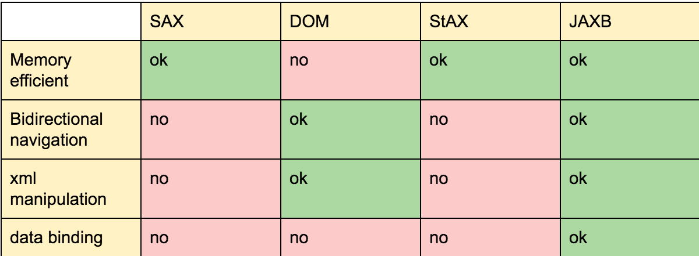

# xml libraries support in java

## XML 类库对比
### SAX

    是一个基于事件的解析API,它提供了更底层访问,相比于DOM来说在意内存并且更快,所以它不会加载整个文档到内存中,所以它不支持导航(就像XPath那样).
    尽管它很高效,但是它很难使用..
### DOM
    
    它是基于模型的解析器 - 将一个树结构的文档加载到内存中,因此如果拥有一个原始原始的顺序,那么就能够在文档中进行前后导航.
    它提供了读写API,它提供了XML操作并且更容易使用但是它的代价就是更紧张的内存资源占用..

### StAX

    它提供了DOM的更容易的实用性 和SAX的高效性 但是它缺失了一些由DOM提供的类似于XML  操作的功能仅仅支持向前导航XML ..
### JAXB

    允许在文档中进行双向导航,并且比DOM高效,允许从XML到Java类型的双向转换并且支持XML操作,但是它仅仅能够解析一个有效的XML文档..


> 注意:
> JAXP 其实是java的xml的api 封装,那么这个项目的最新发新版是2013,所以实际上是死亡了.



## 3. THE XML
下面这一部分将查看最热门的实现,来测试在真实示例的工作情况并检查它们之间的不同 ...

假设我们使用的xml 文件具有如下结构:
```xml
<tutorials>
    <tutorial tutId="01" type="java">
        <title>Guava</title>
        <description>Introduction to Guava</description>
        <date>04/04/2016</date>
        <author>GuavaAuthor</author>
    </tutorial>
    ...
</tutorials>
```
## 4. DOM4J
    
    尝试DOM4J进行xml解析,这是最受欢迎的一个库之一,它能够执行双向读取,并且创建新文档并且更新存在的文档.
    DOM4J 能够和DOM，SAX，XPath以及XLST一起工作,SAX是通过JAXP支持的.

    假设,以下代码来根据给定id过滤去查询一个元素

```java
SAXReader reader = new SAXReader();
Document document = reader.read(file);
List<Node> elements = document.selectNodes("//*[@tutId='" + id + "']");
return elements.get(0);
```
    SAXReader 类负责从SAX解析事件中创建DOM4J 树,一旦我们拥有了一个org.dom4j.Document,我们能够调用必要的方法并给它传递XPath 表达式(作为一个字符串)..
    也能够加载一个存在的文档,并改变它的内容然后更新原始文件。
```java
for (Node node : nodes) {
    Element element = (Element)node;
    Iterator<Element> iterator = element.elementIterator("title");
    while (iterator.hasNext()) {
        Element title =(Element)iterator.next();
        title.setText(title.getText() + " updated");
    }
}
XMLWriter writer = new XMLWriter(
  new FileWriter(new File("src/test/resources/example_updated.xml")));
writer.write(document);
writer.close();
```
    在上面的示例中,改变了标题的内容并创建了一个新的文件。
    请注意，通过调用 elementIterator 并传递节点名称来获取列表中每个标题的节点是多么简单。
    一旦内容被修改了,能够使用XMLWriter 使用DOM4J 树并格式它到一个作为XML的流 ..
```java
Document document = DocumentHelper.createDocument();
Element root = document.addElement("XMLTutorials");
Element tutorialElement = root.addElement("tutorial").addAttribute("tutId", "01");
tutorialElement.addAttribute("type", "xml");
tutorialElement.addElement("title").addText("XML with Dom4J");
...
OutputFormat format = OutputFormat.createPrettyPrint();
XMLWriter writer = new XMLWriter(
  new FileWriter(new File("src/test/resources/example_new.xml")), format);
writer.write(document);
writer.close();

```
    DocumentHelper 为我们提供了 DOM4J 使用的方法集合，例如 createDocument，它创建一个空文档以开始使用它。

