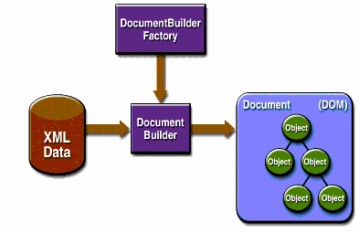
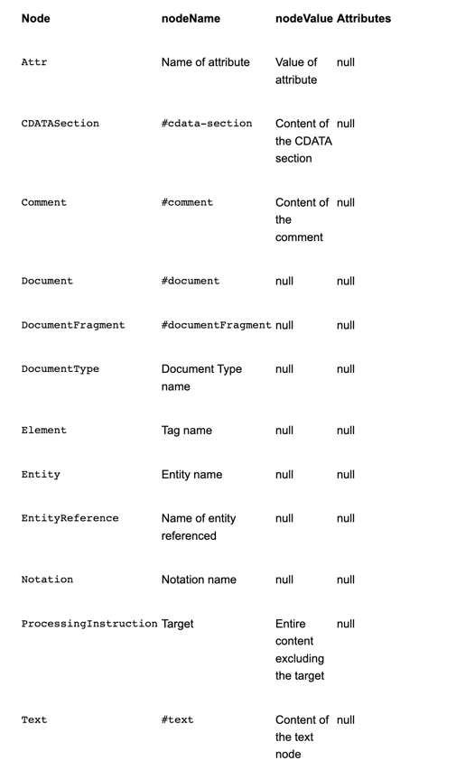
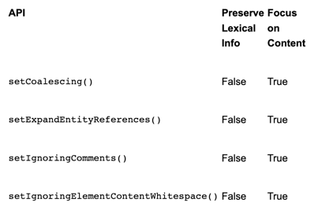
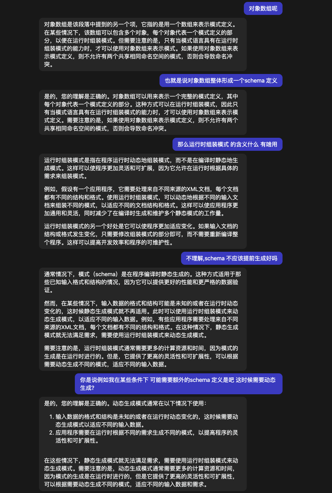

# DOM apis
下面的图展示了DOM API



我们能够使用javax.xml.parsers.DocumentBuilderFactory 类去获得一个DocumentBuilder 实例, 并且能够使用这个实例去产生一个服从dom 规范的Document 对象 ..

事实上,你获得的构建器 是通过系统属性确定的(javax.xml.parsers.DocumentBuilderFactory系统属性), 它会选择被用来产生这个构建器的工厂实现 ..
(此平台的默认值能够从命令行进行覆盖) ..

你能够使用DocumentBuilder.newDocument() 方法去创建一个空的Document(此类型实现了org.w3c.dom.Document接口) ..

除此之外,你能够使用构建器的解析方法之一 去根据存在的XML数据创建Document.. 最终将导致产生一个DOM 树 ..

> 注意:
> 尽管它们叫做对象,在dom树中的项实际上是相当低级的数据结构 ..
> 例如,考虑这个结构:
> ```text
> <color>blue</color>
> ```
> 这是一个元素节点,表示color 标签 .. 在这个标签之下是一个包含了数据`blue` 的文本节点. 这个问题将在DOM 教程中详细探索 ..
> 但是期待对象的开发人员通常会惊讶地发现在元素节点上调用 getNodeValue() 没有返回任何结果。
> 对于真正面向对象的树，请参阅 http://www.jdom.org 上的 JDOM API。

## DOM 包

下表中列出了定义了DOM 实现的包

- org.w3c.dom

    定义了对于XML 文档进行DOM编程的接口(以及,可选的HTML),由w3c 规定的 ..
- javax.xml.parsers

    定义了DocumentBuilderFactory类 以及DocumentBuilder 类,他们返回了实现w3c Document接口的实例 ..

    这个工厂被用来创建builder(依据javax.xml.parsers.DocumentBuilderFactory) 系统属性变量决定哪一个工厂被用来真正的创建构建者 ..

    这能够通过命令行进行覆盖或者当执行newInstance方法时指定来覆盖,此包也定义了ParserConfigurationException 来报告错误 ..

### 介绍
dom 表示一个标准的树形结构, 每一个节点都包含了来自xml 结构的一些组件 .. 两个最常见的节点类型是 元素节点以及 文本节点 ...
使用DOM 函数让你能够创建节点,移除节点 并改变它的内容 以及遍历节点体系(层次结构) ..

此教程说明如何解析一个存在的xml文件去构建一个dom, 展示并检测dom 层次结构, 并探索命名空间的语法,也展示了如何从零创建一个dom, 以及查看如何使用某些特定实现的特性
(在Sun的JAXP 实现中的一些特性) 去转换存在的数据集合到XML ..

## 什么时候使用DOM

dom 对象模型标准是, 首先, 对文档进行设计的(例如,文章和书籍) .. 除此之外,JAXP 1.4.2 实现支持 xml schema, 对于任何给定的应用某些事情都能够是一个重要的考虑 ..

另一方面, 如果你处理简单的数据结构 并且如果xml schema 不是你计划的一个大的部分, 然后你也许能够发现更多面向对象标准之一,例如JDOM 或者 dom4j 可能是更适合你目的的选择 ..

从一开始,dom 有意的设计为 语言无关, 因为它设计可以与任何语言使用(例如 C 以及 Perl),dom 没有利用java的面向对象的特性.. 事实上, 除了区分文档和数据之外, 还有助于解释处理 DOM 与处理 JDOM 或 dom4j 结构的不同方式。

在这一章节, 我们将解释在这些标准之下的模型之间的不同来帮助你选择一个最适合你应用的其中之一 ..

### 文档 对比 数据

在dom中使用的文档模型 以及在JDOM 或者 dom4j中使用的数据模型之间的主要分歧点是:
- 存在于层次结构的节点类型
- 混合内容的容量

在数据层次结构中节点的组成的差异主要描述了 使用两种模型编程的不同 .. 然而,对于混合内容的容量, 比其他事情占比更重 ...

描述了如何在规范中定义一个节点的不同 .. 因此我们从解释 DOM的规定内容模型开始:

#### Mixed-Content Model

文本 以及 元素能够完全相互混合在DOM 体系中, 结构的类型在dom 模型中叫做 混合内容 ..

混合内容频繁发生在文档中 .. 例如,假设你想要去呈现这个结构:
```xml
<sentence>This is an <bold>important</bold> idea.</sentence>
```

DOM 节点的层次结构 将看起来像似如下工作,这里的每一行都是一个节点:
```text
ELEMENT: sentence
   + TEXT: This is an
   + ELEMENT: bold
     + TEXT: important
   + TEXT: idea.
```

注意到sentence 元素包含了文本,后跟了一个子元素,以及一个额外的文本 ..  它是定义了混合内容的模型的相互混合了的文本和元素

#### 节点的类型
对于混合内容去提供容量, dom 节点是非常简单的继承 ... 在前面的示例中, 第一个元素的内容(它的值) 简单的标识了它是什么样的节点 ..

DOM的初次使用的用户 将会被这个事实所困扰..  在导航到 <sentence> 节点之后, 他们会询问节点的内容, 并且期待让某些事情有用 ..
相反, 他们所有能够发现元素的名称,sentence ..

> dom 节点api 定义了 nodeValue() ,nodeType(),以及nodeName() 方法.. 对于第一个元素节点,它的nodeName()将返回sentence .. 然后nodeValue()将
> 返回null, 对于第一个文本节点,nodeName将返回#text,nodeValue() 将返回"This is an". 中药店就是一个元素的值是不和它的内容相同的 ..

在上面的示例中, 要求sentence 的文本的含义是什么? 下面的任何之一都是合理的,依赖于你的应用:
- this is an
- this is an idea.
- this is an important idea ...
- this is an <bold>important</bold> idea ..

#### 一个更简单的模型

通过dom,你完全自由的创建你需要的语义 .. 然而,你也需要去做某些处理--必要去实现那些寓意

标准例如 JDOM / dom4j, 另一方面, 让它更容易做某些事情,因为在层次结构中的每一个节点都是一个对象 ..

尽管JDOM 以及  dom4j 都允许元素具有混合内容,他们并不是主要为这种场景而设计的 .. 相反,他们旨在xml结构中包含数据的应用 ..

在数据结构的元素通常包含要么文本或者其他元素,例如,下面包含了一个xml片段 - 它表示简单的地址薄
```xml
<addressbook>
    <entry>
        <name>Fred</name>
        <email>fred@home</email>
    </entry>
      ...
</addressbook>
```

注意到,对于一个简单的xml数据结构(像这样的), 你能够使用正则表达式(java.util.regex) 结合使用 ..

在JDOM 和 dom4j中, 当你导航到包含文本的元素之后, 你可以执行例如text()方法去获得它的内容,当你处理一个DOM 的时候, 然而你必须检测他的子元素列表去获取这个节点的文本 ..

正如你所见, 即使列表中仅仅包含了一项(text 节点) ..

因此对于简单的数据结构(例如地址薄),你能够节约一点点工作(通过使用JDOM 或者dom4j).  使用这些模型可以受益,即使当你的数据是一个技术性的混合,但是这个示例中,它总是一个节点的总是一个或者有且一个文本碎片 ..

这里存在这种结构的示例,它很容易被jDOM 或者dom4j

```xml
<addressbook>
    <entry>Fred
        <email>fred@home</email>
    </entry>
      ...
</addressbook>
```
这里,每一项都有一个标识文本, 后面跟随其他元素 .. 使用这个结构,此程序能够导航到一个entry, 执行text() 去发现它属于谁.. 并且可以判断如果它在于正确的节点中,那么就可以处理<email> 子元素了 ..


#### 增加复杂性

但是如果你为了完全理解处理的种类 - 当你查询或者操作一个DOM的时候,如果你需要, 有一点很重要,需要知道一个dom能够可能包含的节点的种类很重要..

这里有一个示例说明了这一点: 他是这个数据的代表:
```xml
<sentence>
    The &projectName; <![CDATA[<i>project</i>]]> is
    <?editor: red><bold>important</bold><?editor: normal>.
</sentence>
```
sentence 中包含了一个实体引用, 它是一个指向其他地方定义的实体的指针 .. 在这种情况 下,实体包含了project的名称 ..
这个示例也包含了CDATA部分(没有解析的数据, 例如html中的<pre> 数据),同样以及 处理指令(<?....?>),这种情况下它告诉编辑器哪一个颜色会被使用 - 当渲染文本的时候 ..

下面是数据的DOM 结构, 它一个健壮的应用应该准备处理的 结构类型的呈现 ..
```xml
+ ELEMENT: sentence
       + TEXT: The
       + ENTITY REF: projectName
        + COMMENT: 
        The latest name we are using
        + TEXT: Eagle
       + CDATA: <i>project</i>
       + TEXT: is
       + PI: editor: red
       + ELEMENT: bold
          + TEXT: important
       + PI: editor: normal
```
这个示例描绘了在DOM中可能会出现在的 节点的类型 .. 尽管你的应用也许在大多数情况下可以忽略他们 .. 一个真实的健壮的实现需要去识别并处理它们的每一个 ..

类似的,导航到一个节点参与到子元素的处理的过程,可以忽略你不感兴趣的一些元素并检测你想要的子元素直到找到你感兴趣的节点 ..

稳定工作,内部生成的数据的程序能够担得起做出简化假设的责任: 那就是处理指令,注释,CDATA 节点 以及不存在于数据结构中的实体引用 ..
但是真实的健壮的应用可以在各种不同的数据上工作, 特别是来自外部世界的数据 - 必须准备去处理任何可能的XML 实体 ..

一个简单("simple")的应用将仅当 只有输入数据包含了它所期望的简单XML结构才会工作, 但是这里没有验证机制去确保更多复杂的结构是不存在 ..

毕竟,XML 是专门设计去允许这样的数据结构的 ...

为了变得更加健壮, 一个DOM 应用必须做这些事情:
1. 当搜索一个元素的时候:
  - 忽略注释,属性,并处理指令
  - 允许子元素没有以期待的顺序出现的可能性
  - 跳过包含可忽略空白格的文本节点,如果没有验证 ..
2. 当抓取一个节点的文本时
  - 抓取CDATA节点的文本如同文本节点
  - 忽略注释,属性并 处理执行(当收集 文本的时候)
  - 如果实体引用节点或者另一个元素节点是出现的时候,则递归(那就是,应用文本抓取过程到所有子节点上)

当然许多应用将不需要担心这些事情, 因为数据的类型他们能够看到的已经严格控制了 ... 但是如果数据能够来自差异化的外部资源 ..
然后应用将可能需要考虑这些可能性 ..

这个代码你需要完成这些功能 是将在给定教程的结尾(查询节点部分) 以及获取节点内容给出 ..
现在,目标是简单确定是否DOM 对于你的应用适合 ..

### 选择你的模型
正如你所见, 当你使用DOM的时候,即使一个简单的操作(例如获取一个节点的文本也需要一点编程工作) .. 因此如果你的程序处理简单的数据结构,那么
JDOM / dom4j,或者甚至是正则表达式也许更适合你的需要 ..

对于完全成熟的文档以及复杂的应用,另一方面,dom 给了你大量的灵活性, 并且如果你需要使用xml schema,那么dom 也可以是一个选择,目前至少是 ..

如果你处理文档以及你开发中的应用的数据, 那么dom 也许仍然是你的最佳选择.. 毕竟,在你编写代码去测试以及处理dom结构之后,他是非常容易去针对特定目的去进行定制的 ..

因此,在dom中做任何事情意味着你仅仅有一种API需要处理，而不是两种 ..

除此之外, DOM 标准是一个基于内存文档模型的编撰标准 .. 它是有力且健壮的,并且有很多实现 ... 这是最关键性因素 - 对于许多大型安装来说,尤其是大规模应用需要再API 改变上做出最小化消化的情况下 ..

最终,即使在地址簿中的文本也许不允许加粗,斜体，颜色 以及文字字体(如今的), 有一天你也许想要处理这些事情, 因为DOM 将事实上处理你抛给此规范的任何事情 ..
选择dom 会使得应用容易去面向未来 ..

## 读取xml 数据到dom中
这一部分,我们将尝试如何通过读取一个存在的xml文件来构造一个dom 对象模型 ...

### 创建程序

此dom 提供了一个api 让你能够创建,修改,删除,以及重新编排节点 ... 在你尝试创建一个dom 之前,有助于理解 dom 是如何构建的 .. 下面连续的示例将使用通过一个示例程序叫做DOMEcho中内部可见 ..
例如当你安装了JAXP api之后,你能够在INSTALL_DIR/jaxp-version/samples/dom中发现这个程序 ..

#### 创建骨架
首先,构建一个简单的程序去读取一个xml 文档到dom中并尝试再次写出 ..

开始一个应用的正常基本逻辑处理 ... 并检查去确保一些参数在命令行上已经提供了 ..
```java
public class DOMEcho {

    static final String outputEncoding = "UTF-8";

    private static void usage() {
        // ...
    }

    public static void main(String[] args) throws Exception {
        String filename = null;
    
        for (int i = 0; i < args.length; i++) {
            if (...) { 
                // ...
            } 
            else {
                filename = args[i];
                if (i != args.length - 1) {
                    usage();
                }
            }
        }

        if (filename == null) {
            usage();
        }
    }
}
```

这个代码执行所有基本的配置操作, DOMEcho 的输出使用utf-8的编码格式 ... `usage()` 方法将会在没有参数指定的时候调用去简单的告诉你DOMEcho期待那些参数 ..
因此这个代码没有在这个示例中展示 ... 一个filename 字符串也是声明了,指示了将要被解析为一个dom的xml 文件的名称 ..

#### 导入必要的类
在这个部分,所有的类都是单独命名的,因此你能够看到这里的每一个类来自哪里, 例如当你想要参考api 文档的时候 .. 在示例文件中, 导入语句采用更短的形式 .. 例如
javax.xml.parsers.* ..

他们是由DOMEcho使用的 JAXP APIs ..
```java
package dom;
import javax.xml.parsers.DocumentBuilder; 
import javax.xml.parsers.DocumentBuilderFactory;
```

这些类也期待在xml文档解析过程中抛出异常 ..
```java
import org.xml.sax.ErrorHandler;
import org.xml.sax.SAXException; 
import org.xml.sax.SAXParseException;
import org.xml.sax.helpers.*
```

这些类也会读取示例xml 文件 并管理输出 ..
```java
import java.io.File;
import java.io.OutputStreamWriter;
import java.io.PrintWriter;
```
最终,导入对一个dom的w3c 定义,dom 异常,实体 以及节点 ..
```java
import org.w3c.dom.Document;
import org.w3c.dom.DocumentType;
import org.w3c.dom.Entity;
import org.w3c.dom.NamedNodeMap;
import org.w3c.dom.Node;
```

### 处理错误
下一步,则是错误处理逻辑 .. 这最重要的点是 遵循JAXP文档构建器是必要的 用来报告SAX 异常 - 当它解析一个xml文档发生错误的时候 ..
DOM 解析器事实上没有使用一个sax 解析器 (内部), 但是因为这里已经存在了SAX 标准 .. 它有利于使用它来报告错误.. 因此,对于dom应用的错误处理非常类似于 SAX 应用:
```java
private static class MyErrorHandler implements ErrorHandler {
     
    private PrintWriter out;

    MyErrorHandler(PrintWriter out) {
        this.out = out;
    }

    private String getParseExceptionInfo(SAXParseException spe) {
        String systemId = spe.getSystemId();
        if (systemId == null) {
            systemId = "null";
        }

        String info = "URI=" + systemId + " Line=" + spe.getLineNumber() +
                      ": " + spe.getMessage();
        return info;
    }

    public void warning(SAXParseException spe) throws SAXException {
        out.println("Warning: " + getParseExceptionInfo(spe));
    }
        
    public void error(SAXParseException spe) throws SAXException {
        String message = "Error: " + getParseExceptionInfo(spe);
        throw new SAXException(message);
    }

    public void fatalError(SAXParseException spe) throws SAXException {
        String message = "Fatal Error: " + getParseExceptionInfo(spe);
        throw new SAXException(message);
    }
}
```
正如你所见,DOMEcho 类的错误处理器生成了它的输出 - 通过使用PrintWriter 实例 ..

### 实例化工厂
下一步,增加以下代码到main 方法中, 去获取一个能够给出文档构建器的工厂 ..
```java
public static void main(String[] args) throws Exception {
    DocumentBuilderFactory dbf = DocumentBuilderFactory.newInstance();

    // ...
}
```
### 获取解析器并解析文件
现在,我们能够获得一个构建器(文档构建器),那么我们能够解析指定的文件 ..
```java
DocumentBuilderFactory dbf = DocumentBuilderFactory.newInstance();
DocumentBuilder db = dbf.newDocumentBuilder(); 
Document doc = db.parse(new File(filename));
```

注意到文件名是由 main方法开始解析的命令行参数提供的 ... 

### 配置工厂
默认,此工厂返回了一个非验证解析器(不知道有关命名空间的任何事情) ... 为了获得一个校验的解析器 ..
或者理解命名空间的解析器(或者同时具备这两种能力), 我们可以配置工厂去设置这些选项:
```java
public static void main(String[] args) throws Exception {

    String filename = null;
    boolean dtdValidate = false;
    boolean xsdValidate = false;
    String schemaSource = null;
        
    for (int i = 0; i < args.length; i++) {
        if (args[i].equals("-dtd"))  { 
            dtdValidate = true;
        } 
        else if (args[i].equals("-xsd")) {
            xsdValidate = true;
        } 
        else if (args[i].equals("-xsdss")) {
            if (i == args.length - 1) {
                usage();
            }
            xsdValidate = true;
            schemaSource = args[++i];
        }
        else {
            filename = args[i];
            if (i != args.length - 1) {
                usage();
            }
        }
    }

    if (filename == null) {
        usage();
    }

    DocumentBuilderFactory dbf = DocumentBuilderFactory.newInstance();

    dbf.setNamespaceAware(true);
    dbf.setValidating(dtdValidate || xsdValidate);

    // ...

    DocumentBuilder db = dbf.newDocumentBuilder();
    Document doc = db.parse(new File(filename));
}
```
现在,命令行参数可以配置去通知程序是否可以根据一个DTD 或者 XML schema 进行验证, 并且工厂将配置为命名空间感知, 并且去执行用户所指定的类型的验证 ..

> 注意: 符合 JAXP 的解析器不需要支持这些选项的所有组合，即使引用解析器支持。如果您指定了无效的选项组合，则当您尝试获取解析器实例时，工厂会生成一个 ParserConfigurationException。

更多信息 有关如何使用命名空间 以及验证 - 查看验证XML schema,在对应的部分中完整了体现了当前示例代码所缺失的有关验证的部分 ..

#### 处理验证错误
对验证错误的默认响应, 正如sax 规范所指示的那样 .. 不做任何事情 ..
JAXP 标准需要抛出一个SAX 异常, 因此你使用完全一致的错误处理机制 - 正如和sax应用一致 ... 尤其是,你使用DocumentBuilder的setErrorHandler 方法可以是一个实现了
SAX ErrorHandler接口的对象 ..

> DocumentBuilder 也有一个setEntityResolver 方法你能够使用 ..

下面的代码配置了文档构建器去使用错误处理器
```java
DocumentBuilder db = dbf.newDocumentBuilder();
OutputStreamWriter errorWriter = new OutputStreamWriter(System.err,
                                         outputEncoding);
db.setErrorHandler(new MyErrorHandler (new PrintWriter(errorWriter, true)));
Document doc = db.parse(new File(filename));
```
到目前为止,我们已经设置了文档构建器,并且配置它去在要求之上执行验证 .. 错误处理也是到位了 .
然而,DOMEcho 可能还不能做一些事情 .. 下一个部分,展示了dom结构 并了解它 .. 例如 实体引用 / CDATA 部分,由于是最重要的阶段,那么你能够看到在一个dom中的
元素节点下的文本节点(他们包含实际的数据) ..

### 显示 dom 节点
为了创建或者操作一个dom, 有助于帮助去清晰的认识在dom中节点是如何构建的 .. 这个教程的这一部分 暴露了一个dom的内部结构 ..
因此你能够看到它包含什么,DOMEcho 示例将会通过回显DOM节点来实现此目的 .. 并且将他们打印在屏幕上个 ... 并且使用合适的缩进去做出显而易见的节点层级结构 ..
这些节点节点类型的规范能够在 [DOM LEVEL2 Core Specification](http://www.w3.org/TR/2000/REC-DOM-Level-2-Core-20001113) 中发现,在节点的规范之下,
Table 3-1 下表 将适配这个规范:


这些信息非常有用,当你在dom中工作的时候,你将需要它们 .. 因为这些类型都是相互混合在dom树中 ..

### 获取节点类型信息

dom 节点元素类型信息是通过调用org.w3c.dom.Node的类的各个方法来获取的 ..
通过DOMEcho 暴露的节点的属性属性可以通过以下代码回显:
```java
private void printlnCommon(Node n) {
    out.print(" nodeName=\"" + n.getNodeName() + "\"");

    String val = n.getNamespaceURI();
    if (val != null) {
        out.print(" uri=\"" + val + "\"");
    }

    val = n.getPrefix();

    if (val != null) {
        out.print(" pre=\"" + val + "\"");
    }

    val = n.getLocalName();
    if (val != null) {
        out.print(" local=\"" + val + "\"");
    }

    val = n.getNodeValue();
    if (val != null) {
        out.print(" nodeValue=");
        if (val.trim().equals("")) {
            // Whitespace
            out.print("[WS]");
        }
        else {
            out.print("\"" + n.getNodeValue() + "\"");
        }
    }
    out.println();
}
```

每一个dom 节点都有一个至少一个类型,一个名称,一个值 这可能为空 . 在上述示例中,Node接口的getNamespaceURI(),getPrefix(),getLocalName(),以及
getNodeValue() 方法将返回并打印出被回显的节点的命名空间URI,命名空间前缀,本地限定的名字和值 .. 注意到trim()方法调用在由getNodeValue()方法返回的字符串去
过滤掉多余的空格 ..

对于Node的所有方法 以及它们返回的不同信息,查看 Node API ..

下一步,一个方法将定义去设置被打印的节点的缩进 .. 因此节点的层次结构将会被容易的展示 ..

```java
private void outputIndentation() {
    for (int i = 0; i < indent; i++) {
        out.print(basicIndent);
    }
}

```
basicIndent 常量定义了被使用的缩进的基本单元 - 当DOMEcho 显示树层次结构的时候, 如下所示:
```java
public class DOMEcho {
    static final String outputEncoding = "UTF-8";

    private PrintWriter out;
    private int indent = 0;
    private final String basicIndent = " ";

    DOMEcho(PrintWriter out) {
        this.out = out;
    }
}
```

正如在处理错误部分定义的错误处理器,DOMEcho 将使用PrintWriter 实例创建它的输出 ..

### 词汇控制
词汇信息是你需要去重新构造一个xml文档的原始语法的相关信息 .. 保留词汇信息在一个可编辑的应用中是非常重要的 ..
如果你想要保存一个准确对完整原始的注解,实体引用 以及 任何CDATA 部分(可能在一开始都包含的)的文档 ..

大多数应用,然而专注于xml结构中的内容 .. 他们担负忽略注释的责任 并且他们不关心在CDATA部分中的内容 或者不担心它们处于哪里 ..或者是否文档中包含了实体引用 ..
对于这些应用, 词法信息是尽可能的最小化 .. 因为他们简化了dom的节点数量和类型(应用必须去准备检查 、 解释的东西)

下面的DocumentBuilderFactory 方法让你能够控制你在dom中看见的词法信息 ..

- setCoalescing()

  为了转换CDATA 节点到Text 节点并追加到 一个相邻的文本节点 ..
- setExpandEntityReferences()
  
  为了展开实体引用节点
- setIgnoringComments()

  忽略注释
- setIgnoringElementContentWhitespace()

  忽略空格(它不是元素内容重要的一部分)

对于这些属性的所有默认值全是false .. 那就是保留了所有的词法信息 能够有必要去重新构建输入的文档 ..
配置他们为true 让你能够构造一个更简单的dom (因此应用能够专注于数据的语义内容 而不需要担忧任何词汇语法详情)

下表总结了这些配置的影响:


上面的意思是,如果设置为false,则保留词法信息 .. 但是如果设置为true,则不保留词法信息, 专注于内容 ..

这些方法的实现存在于DOMEcho 示例中:
```java
// ...

dbf.setIgnoringComments(ignoreComments);
dbf.setIgnoringElementContentWhitespace(ignoreWhitespace);
dbf.setCoalescing(putCDATAIntoText);
dbf.setExpandEntityReferences(!createEntityRefs);

// ...
```
这些变量的boolean 值声明在主方法代码的开始, 以及它们能够在当DomEcho运行的时候 通过命令行参数设置 ..

```java
public static void main(String[] args) throws Exception {
    // ...

    boolean ignoreWhitespace = false;
    boolean ignoreComments = false;
    boolean putCDATAIntoText = false;
    boolean createEntityRefs = false;

    for (int i = 0; i < args.length; i++) {
        if (...) {  // Validation arguments here
           // ... 
        } 
        else if (args[i].equals("-ws")) {
            ignoreWhitespace = true;
        } 
        else if (args[i].startsWith("-co")) {
            ignoreComments = true;
        }
        else if (args[i].startsWith("-cd")) {
            putCDATAIntoText = true;
        } 
        else if (args[i].startsWith("-e")) {
            createEntityRefs = true;

            // ...
        } 
        else {
            filename = args[i];

            // Must be last arg
            if (i != args.length - 1) {
                usage();
            }
        }
    }

    // ...
}
```

### 打印DOM 树节点
这DomEcho 应用允许你查看DOM 树的一个结构,并且说明节点是如何组成DOM 以及它们是如何编排的 .. 通常来说,在dom 树中的节点的主要类型是 Element 以及Text 节点 ...

> 注意: 文本节点存在于dom的元素节点之下. 并且数据总是存在于一个文本节点中, 因此在dom中处理的大多数错误是导航到一个元素节点并期待它包含存储的数据 .. 不仅如此
> 甚至是简单的element 节点都包含了一个存储数据的文本节点 ..


下面的代码将打印dom 树的节点(包含合适的缩进) ..
```java
private void echo(Node n) {
    outputIndentation();
    int type = n.getNodeType();

    switch (type) {
        case Node.ATTRIBUTE_NODE:
            out.print("ATTR:");
            printlnCommon(n);
            break;

        case Node.CDATA_SECTION_NODE:
            out.print("CDATA:");
            printlnCommon(n);
            break;

        case Node.COMMENT_NODE:
            out.print("COMM:");
            printlnCommon(n);
            break;

        case Node.DOCUMENT_FRAGMENT_NODE:
            out.print("DOC_FRAG:");
            printlnCommon(n);
            break;

        case Node.DOCUMENT_NODE:
            out.print("DOC:");
            printlnCommon(n);
            break;

        case Node.DOCUMENT_TYPE_NODE:
            out.print("DOC_TYPE:");
            printlnCommon(n);
            NamedNodeMap nodeMap = ((DocumentType)n).getEntities();
            indent += 2;
            for (int i = 0; i < nodeMap.getLength(); i++) {
                Entity entity = (Entity)nodeMap.item(i);
                echo(entity);
            }
            indent -= 2;
            break;

        case Node.ELEMENT_NODE:
            out.print("ELEM:");
            printlnCommon(n);

            NamedNodeMap atts = n.getAttributes();
            indent += 2;
            for (int i = 0; i < atts.getLength(); i++) {
                Node att = atts.item(i);
                echo(att);
            }
            indent -= 2;
            break;

        case Node.ENTITY_NODE:
            out.print("ENT:");
            printlnCommon(n);
            break;

        case Node.ENTITY_REFERENCE_NODE:
            out.print("ENT_REF:");
            printlnCommon(n);
            break;

        case Node.NOTATION_NODE:
            out.print("NOTATION:");
            printlnCommon(n);
            break;

        case Node.PROCESSING_INSTRUCTION_NODE:
            out.print("PROC_INST:");
            printlnCommon(n);
            break;

        case Node.TEXT_NODE:
            out.print("TEXT:");
            printlnCommon(n);
            break;

        default:
            out.print("UNSUPPORTED NODE: " + type);
            printlnCommon(n);
            break;
    }

    indent++;
    for (Node child = n.getFirstChild(); child != null;
         child = child.getNextSibling()) {
        echo(child);
    }
    indent--;
}

```
这个代码针对所有情况都是 使用switch 语句去打印不同的节点类型以及任何可能的子节点 .. 通过合适的缩进 ..

节点属性并不包括作为dom从层次结构中的孩子 ..  他们相反是通过节点的接口的方法(getAttributes)进行获取 ..

DocType 接口是对 w3c.org.dom.Node的扩展, 它定义了getEntities方法 .. 这能够让你获取一个Entity 节点 .. - 这是定义实体的节点 ..
也就是说(docType 其实是 dtd - document type definition)

例如Attribute 节点，Entity 节点将不会出现在dom节点的孩子列表中 ..

### 节点操作
这一部分尝试快速查看一些可能想要在dom中使用的 操作 ..

- 创建节点
- 遍历节点
- 查询节点
- 获取节点内容
- 创建属性
- 移除或者改变节点
- 插入节点


#### 创建节点
你能够创建不同类型的节点 - 通过Document接口的方法 ... 例如,createElement,createComment,createCDATASection,createTextNode 以及其他 ..
完整的创建不同节点的api 在[org.w3c.dom.Document](https://docs.oracle.com/javase/8/docs/api/org/w3c/dom/Document.html) ..

#### 遍历节点
org.w3c.Node 接口定义了大量的方法 - 你能够用来遍历节点,包括getFirstChild,getLastChild,getNextSibling,getPreviousSibling,getParentNode ..
那些操作足够你在树的任何地方开始到树的另一个地方 ..

#### 查询节点
当你需要查询一个特定名称的节点时, 需要考虑更多一点, 尽管它尝试获取第一个孩子并且检查是否有兄弟节点 ..这个查询必须考虑到第一个孩子可以是一个注释或者处理指令的事实 ..
如果xml数据是无效的,它也可以甚至是一个傲寒了可忽略空格的文本节点 ..

本质上,你需要通过查询子节点的列表, 忽略一些不关心的 检查你关心的, 下面是一个示例: 当查询一个dom 层次下的节点时所需要路由的方式 .. 此示例是完整呈现(包括注释),因此你能够使用它作为一个应用的模版 ..
```
/**
 * Find the named subnode in a node's sublist.
 * <ul>
 * <li>Ignores comments and processing instructions.
 * <li>Ignores TEXT nodes (likely to exist and contain
 *         ignorable whitespace, if not validating.
 * <li>Ignores CDATA nodes and EntityRef nodes.
 * <li>Examines element nodes to find one with
 *        the specified name.
 * </ul>
 * @param name  the tag name for the element to find
 * @param node  the element node to start searching from
 * @return the Node found
 */
public Node findSubNode(String name, Node node) {
    if (node.getNodeType() != Node.ELEMENT_NODE) {
        System.err.println("Error: Search node not of element type");
        System.exit(22);
    }

    if (! node.hasChildNodes()) return null;

    NodeList list = node.getChildNodes();
    for (int i=0; i < list.getLength(); i++) {
        Node subnode = list.item(i);
        if (subnode.getNodeType() == Node.ELEMENT_NODE) {
           if (subnode.getNodeName().equals(name)) 
               return subnode;
        }
    }
    return null;
}
```

为了进一步解释这个代码, 可以查看当使用dom时[增加复杂性](#增加复杂性)章节的示例 ...

注意到你也可以使用在词法控制中描述的API来修改解析器构建dom的类型 .

#### 获取节点内容
当你想要获取节点包含的内容的时候,你需要再次查看 - 通过遍历子节点的列表, 忽略不关心的并且累积你发现在Text节点,CDATA节点 以及 EntityRef节点中的文本 ..
下面是一个日常示例 你能够使用它去获取节点文本 ..

```java
/**
  * Return the text that a node contains. This routine:
  * <ul>
  * <li>Ignores comments and processing instructions.
  * <li>Concatenates TEXT nodes, CDATA nodes, and the results of
  *     recursively processing EntityRef nodes.
  * <li>Ignores any element nodes in the sublist.
  *     (Other possible options are to recurse into element 
  *      sublists or throw an exception.)
  * </ul>
  * @param    node  a  DOM node
  * @return   a String representing its contents
  */
public String getText(Node node) {
    StringBuffer result = new StringBuffer();
    if (! node.hasChildNodes()) return "";

    NodeList list = node.getChildNodes();
    for (int i=0; i < list.getLength(); i++) {
        Node subnode = list.item(i);
        if (subnode.getNodeType() == Node.TEXT_NODE) {
            result.append(subnode.getNodeValue());
        }
        else if (subnode.getNodeType() == Node.CDATA_SECTION_NODE) {
            result.append(subnode.getNodeValue());
        }
        else if (subnode.getNodeType() == Node.ENTITY_REFERENCE_NODE) {
            // Recurse into the subtree for text
            // (and ignore comments)
            result.append(getText(subnode));
        }
    }

    return result.toString();
}
```

#### 创建属性
org.w3c.dom.Element 节点它继承于 Node, 定义了一个setAttribute 操作,这增加了属性到节点上 ..(一个来自java平台的立场的更好的名称可能是addAttribute) .. 这个属性不是这个类的属性(property) .. 你也能够使用Document 的 createAttribute 操作去创建一个 Attribute的实例并且使用 
setAttributeNode方法去增加它 ..


#### 移除并修改节点
为了移除一个节点,那么你可以使用它的父节点的removeChild方法,为了改变它,你可以要么使用父节点的replaceChild操作 或者节点的setNodeValue操作 ..(一个是替换节点,一个是修改节点内容)

#### 插入节点
重要的是记住,当你创建一个新的节点 - 且创建的是一个element 节点, 你唯一要指定的数据就是仅仅指定一个名称 .. 事实上,节点会给你一个钩子来挂东西 ... 例如你可以挂一个节点到一个节点的子节点列表中,这样子节点列表就挂在了一个节点上 ..

例如,增加文本节点,CDATA节点或者属性节点 ... 当你构建的时候,记住在此教程中看见的结构 .. 记住,在层次中的每一个节点是非常简单 仅且包含一个数据 element ..

### 运行DOMEcho 示例
1. 导航到samples 目录
```shell
cd install-dir/jaxp-1_4_2-release-date/samples
```
2. Compile 示例程序 
```shell
javac dom/*
```
3. 运行DOMEcho 程序(通过一个 xml文件)
选择data目录中的xml 文件去运行此程序,我们可以选择在 personal-schema.xml上运行这个程序 ..
```shell
java dom/DOMEcho data/personal-schema.xml
```
xml文件 personal-schema.xml包含了一个小公司的 personnel 文件信息 .. 当你运行DOMEcho程序的时候,你应该可以看到以下输出:
```text
DOC: nodeName="#document"
 ELEM: nodeName="personnel" 
       local="personnel"
 TEXT: nodeName="#text" 
       nodeValue=[WS]
 ELEM: nodeName="person" 
       local="person"
 ATTR: nodeName="id" 
       local="id" 
       nodeValue="Big.Boss"
 TEXT: nodeName="#text" 
       nodeValue=[WS]
 ELEM: nodeName="name" 
       local="name"
 ELEM: nodeName="family" 
       local="family"
 TEXT: nodeName="#text" 
       nodeValue="Boss"
 TEXT: nodeName="#text" 
       nodeValue=[WS]
 ELEM: nodeName="given" 
       local="given"
 TEXT: nodeName="#text" 
       nodeValue="Big"
 TEXT: nodeName="#text" 
       nodeValue=[WS]
 ELEM: nodeName="email" 
       local="email"
 TEXT: nodeName="#text" 
       nodeValue="chief@foo.example.com"
 TEXT: nodeName="#text" 
       nodeValue=[WS]
 ELEM: nodeName="link" 
       local="link"
 ATTR: nodeName="subordinates" 
       local="subordinates" 
       nodeValue="one.worker two.worker 
                  three.worker four.worker
                  five.worker"
 TEXT: nodeName="#text" 
       nodeValue=[WS]
 TEXT: nodeName="#text" 
       nodeValue=[WS]
 ELEM: nodeName="person" 
       local="person"
 ATTR: nodeName="id" 
       local="id" 
       nodeValue="one.worker"
 TEXT: nodeName="#text" 
       nodeValue=[WS]
 ELEM: nodeName="name" 
       local="name"
 ELEM: nodeName="family" 
       local="family"
 TEXT: nodeName="#text" 
       nodeValue="Worker"
 TEXT: nodeName="#text" 
       nodeValue=[WS]
 ELEM: nodeName="given" 
       local="given"
 TEXT: nodeName="#text" 
       nodeValue="One"
 TEXT: nodeName="#text" 
       nodeValue=[WS]
 ELEM: nodeName="email" 
       local="email"
 TEXT: nodeName="#text" 
       nodeValue="one@foo.example.com"
 TEXT: nodeName="#text" 
       nodeValue=[WS]
 ELEM: nodeName="link" 
       local="link"
 ATTR: nodeName="manager" 
       local="manager" 
       nodeValue="Big.Boss"
 TEXT: nodeName="#text"
       nodeValue=[WS]

[...]
```
正如你所见, DOMEcho 打印了在文档中的不同元素的所有节点 ..


### 验证 xml schema
对于xml schema的更多了解,可以查看在线教程([xml schema part 0: primer](http://www.w3.org/TR/xmlschema-0/)),此部分的最后,你可以学习到如何使用xml schema 定义
去验证一个包含了来自多个命名空间的的元素的文档..

#### 概述 验证过程
为了通知在xml文档中的验证错误, 以下条件必须成立
- 工厂必须被配置, 并且合适的错误处理器必须设置 ..
- 文档必须关联至少一个 schema  以及 更多可能性 ..

#### 配置DocumentBuilder 工厂
能够在配置工厂的时候定义约束 来限制解析器的行为 .. 这些约束在SAX 解析 验证 xml schema的时候同样可用, 他们声明在DOMEcho程序的开始..
```java
static final String JAXP_SCHEMA_LANGUAGE =
    "http://java.sun.com/xml/jaxp/properties/schemaLanguage";
static final String W3C_XML_SCHEMA =
    "http://www.w3.org/2001/XMLSchema";
```
下一步, 你能够配置documentBuilderFactory去生成一个 命名空间感知,使用xmlschema 验证的解析器,这是通过调用setValidating 方法来完成的 ..
```java
// ...

dbf.setNamespaceAware(true);
dbf.setValidating(dtdValidate || xsdValidate);

if (xsdValidate) {
    try {
        dbf.setAttribute(JAXP_SCHEMA_LANGUAGE, W3C_XML_SCHEMA);
    }
    catch (IllegalArgumentException x) {
        System.err.println("Error: JAXP DocumentBuilderFactory attribute " 
                           + "not recognized: " + JAXP_SCHEMA_LANGUAGE);
        System.err.println("Check to see if parser conforms to JAXP spec.");
        System.exit(1);
    }
}

// ...
```

因为遵循JAXP标准的解析器 默认是不感知 namespace .. 设置 schema 验证去工作是必要的 ..
你也能设置工厂属性去指定解析器语言使用(例如 sax解析,另一方面,你可以通过在通过此工厂产生的解析器上设置属性) ..

#### 让文档与schema关联
现在程序已经准备好使用xml schema 定义进行验证了, 必要的是确保xml文档关联至少一个schema,以下有两种方式可以做:
- 在xml文档中使用 schema 声明
- 在应用中指定 schemas ..

> 注意,在应用中覆盖使用的schema(s), 它会覆盖所有在文档中的 schema 声明 ..

为了在文档中指定xml schema 定义, 你能够创建 xml:
```xml
<documentRoot xmlns:xsi="http://www.w3.org/2001/XMLSchema-instance" xsi:noNamespaceSchemaLocation='YourSchemaDefinition.xsd'> [...]
```
第一个属性定义 xml 命名空间前缀 xml namespace, = xsi, 它表示 "xml schema 实例"的标准 .. 第二行指定了在文档中使用的元素如果没有指定命名空间前缀(所使用的schema) ..
这些元素通常你定义在一个简单的, 不复杂的文档中 ..

你能够在应用中指定:
```java
static final String JAXP_SCHEMA_SOURCE =
    "http://java.sun.com/xml/jaxp/properties/schemaSource";
        
// ...

dbf.setValidating(dtdValidate || xsdValidate);
if (xsdValidate) {
    // ...    
}

if (schemaSource != null) {
    dbf.setAttribute(JAXP_SCHEMA_SOURCE, new File(schemaSource));
```

### 验证多个命名空间
命名空间让你能够在多个文档中联合元素提供不同的目的 而不需要担心覆盖它们的名称 ..

> 注意到在这个部分讨论的材料 也适用到当使用SAX解析器的时候的验证..  此时我们已经了解了足够多的命名空间知识,这是有意义的 ..

为了设计一个示例, 考虑一个持有 personnel 数据的xml 数据集 .. 这个数据集也许包括了来自 来自 tax 声明形式 以及 员工雇佣形式的 ..信息 ..
两种元素命名为 form(在他们的各自的schema中) ..

如果为tax命名空间定义了一个前缀, 并且为hiring 命名空间定义了另一个前缀 .. 那么 personnel 数据能够包括以下碎片:
```xml
<employee id="...">
  <name>....</name>
  <tax:form>
     ...w2 tax form data...
  </tax:form>
  <hiring:form>
     ...employment history, etc....
  </hiring:form>
</employee>

```
tax:form元素的内容 明显是不同于 hiring:form元素的内容 - 那么它们的验证也是不同的 .

注意: 在这个示例中有一个默认的命名空间 - 对于没有限定元素名(employee / name) - 它们属于这个命名空间 .. 为了让文档能够正确验证 .. 对应命名空间的schema
必须声明,同样包括 tax / hiring 命名空间的schema..

> 默认的命名空间实际上是一个特殊的命名空间, 它定义为没有名称的命名空间, 因此你不能简单的使用一个命名空间 作为默认命名空间, 并且另一个命名空间将作为默认命名空间 ..
> 未命名空间(或者 空命名空间) 是看起来像数字 0 ..  它没有任何价值 ..(没有名称), 但是它仍然是精确定义的 .. 因此如果一个命名空间有命名,则不可能作为默认的命名空间 ..

当解析的时候, 每一个在数据集中的元素都将根据合适的 schema 进行验证, 只要那些schema 已经被定义 .. 再次, schema 能够定义作为xml 数据集或者程序的一部分 ..
(它可能去修复声明, 通常来说, 然而,更好的方式是保持所有的声明结合在一个地方 ..)

### 声明 在xml 数据集中的schemas
为了在数据集中声明schemas, 那么 xml 代码能够看起来如下所示:
```xml
<documentRoot
  xmlns:xsi=
  "http://www.w3.org/2001/XMLSchema-instance"
  xsi:noNamespaceSchemaLocation=
    "employeeDatabase.xsd"
  xsi:schemaLocation=
  "http://www.irs.gov.example.com/ 
   fullpath/w2TaxForm.xsd
   
   http://www.ourcompany.example.com/ 
   relpath/hiringForm.xsd"
  xmlns:tax=
    "http://www.irs.gov.example.com/"
  xmlns:hiring=
    "http://www.ourcompany.example.com/"
>
```

noNamespaceSchemaLocation 声明之前我们已经了解过, 最后两项也是如此, 定义了 tax / hiring 命名空间前缀 ..  在中间的是一些新的项 ,它们定义了对于在文档中所引用的每一个命名空间的schema的位置 ..(统一定义了schema的位置 ..)
xsi:schemaLocation 声明由条目对 组成,在每一对中的第一项是一个完全限定的URI - 它指定了命名空间,第二部分包含了完全路径 或者对于schema 定义的相对路径 ... 通常,完全限定的路径是更推荐的 在这种情况下,schema的副本只有一份 ..

注意到你不能够使用命名空间前缀 - 当你定义schema 位置的时候(在 schemaLocation中定义) ... 因为它仅仅理解命名空间名称 而不是前缀 ...

### 在应用中声明schema
为了声明等价的schema(在应用中声明),下面的代码可以参考
```java
static final String employeeSchema = "employeeDatabase.xsd";
static final String taxSchema = "w2TaxForm.xsd";
static final String hiringSchema = "hiringForm.xsd";

static final String[] schemas = {
    employeeSchema,
    taxSchema, 
    hiringSchema,
};

static final String JAXP_SCHEMA_SOURCE =
    "http://java.sun.com/xml/jaxp/properties/schemaSource";

// ...

DocumentBuilderFactory factory = DocumentBuilderFactory.newInstance()
    
// ...

factory.setAttribute(JAXP_SCHEMA_SOURCE, schemas);
```
这里包含了schema 定义的字符串数组(xsd文件) 将传递到工厂的 factory.setAttribute属性 .. 注意这和当你声明schema作为xml数据集的一部分有所不同
- 这里没有对默认schema的特定声明
- 你不能指定命名空间名称,相反你只能提供.xsd文件 ..

为了进行命名空间分配，解析器读取 .xsd 文件，并在其中找到它们所应用的目标命名空间的名称。因为文件是用 URI 指定的，所以解析器可以使用 EntityResolver（如果已定义的话）来查找模式的本地副本。

如果schema 定义没有定义一个目标命名空间, 那么它会使用默认的 默认的(未命名的,或者空的)命名空间, 因此,在这个示例中, 你能够期待查看到在schema中声明的这些目标命名空间 ...
- 一个指向schema的URI 字符串
- 一个具有schema 内容的InputStream
- 一个SAX 输入源(inputSource)
- 一个文件
- 一个对象的数组,每一个对象都是在这里定义的一个类型 ...

上面的内容给出了如何传递schema 定义的方式 ..

对象数组它指的是用一个数组来表示模式定义。在某些情况下，该数组可以包含多个对象，每个对象代表一个模式定义的部分，以便在运行时组装模式。但需要注意的是，只有当模式语言具有在运行时组装模式的能力时，才可以使用对象数组来表示模式。如果使用对象数组来表示模式定义，则不允许有两个共享相同命名空间的模式，否则会导致命名冲突。



### 运行 Schema验证的示例
为了运行DOMEcho 示例(具有schema 验证), 遵守以下的步骤:

1. 导航到samples 目录
```shell
cd install-dir/jaxp-1_4_2/-release-date/samples
```
2. 编译示例类, 使用你设置的java 类路径:
```shell
javac dom/*
```
3. 运行(且指定一个 schema 验证)

我们可以选择通过 -xsd选项指定 schema 文件 并选择在personal-schema.xml上运行此程序 ..
```shell
java dom/DOMEcho -xsd data/personal-schema.xml
```
正如你在之前看到,xsd 选项告诉DOMEcho 程序根据定义在 personal-schema.xml文件的 xml schema进行验证, 在这种情况下,schema 是 personal.xsd 文件 ..

4. 打开 personal-schema.xml

删除schema 声明,一出 <personnel> 标签中的以下内容
```text
xmlns:xsi="http://www.w3.org/2001/XMLSchema-instance" xsi:noNamespaceSchemaLocation='personal.xsd'
```
5. 指定 -xsd 再次运行

```shell
java dom/DOMEcho -xsd data/personal-schema.xml
```
 这次将会发生错误 .
 
6. 通过指定 -xsdss 选项 并指定schema 定义文件 进行在xml文件中声明的schema 覆盖..

```shell
% java dom/DOMEcho -xsdss data/personal.xsd data/personal-schema.xml
```
你会发现,此时xml文件已经根据指定的schema 进行成功的验证 ...


### 更多信息
可以查看dom 规范页面,了解w3c 文档对象模型 ..

对于更多有关schema的验证机制, 查看以下的内容:
1. [w3c 规范验证机制,xml schema](http://www.w3.org/XML/Schema)
2. [relax ng的常规表达式(基于验证机制)](http://www.oasis-open.org/committees/tc_home.php?wg_abbrev=relax-ng)
3. [schematron的基于断言的验证机制](http://www.ascc.net/xml/resource/schematron/schematron.html)