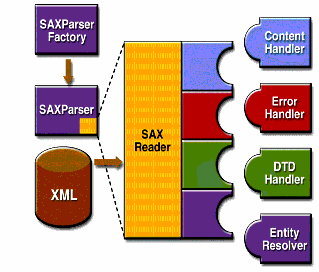

# java api for xml process (jaxp)

java处理xml的api 目前是 1.4版本,此主题以此版本了解xml处理,可以通过各种jaxp 应用示例了解详情 ...

## 必备知识

1. java 编程语言 以及它的开发环境
2. xml (extensible mark-up language)
3. 文档对象模型(document object model), 由 world wide web consortium(W3C) DOM 工作组定义的 ..
4. XML的简单API(SAX), 由XML-DEV 邮件列表的成员合作开发的 ..

某些DOM以及SAX的前置知识是假设, 仅仅特定于JAXP API的代码是详细研究的 ..

1. 对JAXP 的介绍
    
    提供了一个简单的JAXP技术的描述, 包括它的目的以及主要特性 ..
2. XML的简单API

    引入了在JAXP技术中被使用的一个概念, XML的简单API(称为 SAX): 当使用SAX,如何解析一个xml文件,如何实现SAX验证,如何运行SAX解析器 以及 如何处理词汇事件 .
3. DOM

    引入了由DOM所使用的树结构 并且展示了如何使用DOM函数去创建node,移除node,改变node的内容 以及去便利 node 结构 ..
4. Extensible StyleSheet Language Transformations(XSLT)

    包括如何编写一个DOM 到XML文件中,并且如何根据任意的数据文件去生成DOM 并转换它为 XML ..
5. Streaming API for XML

    集中基于Java流化技术,事件驱动,拉取式解析API  来读取以及写入XML 文档 ..

    StAX 让你能够创建一个双向的xml 解析器能够快速的,且相对容易得编程 并且具有很少的内存占用 ..
6. JAXP1.5 以及新的属性

    引入了一些属性到 jdk 7u40 以及 JDK8中 ..
7. 处理限制

    讨论了JAXP 实现的限制,包括在7u45中增加的三个限制 ..

## 介绍JAXP

它是处理xml的java api,jaxp 利用了标准的解析器(SAX simple api for xml) 以及 DOM,因此你能够选择解析你的数据,以及事件流 或者 构建文档的 对象呈现 ..

JAXP 也支持Extensible Stylesheet Language Transformations(XSLT) 标准, 让你能够控制数据的呈现并且让你能够转换这个数据到其他的XML文档或者其他形式 ,
例如HTML. jaxp 也支持 命名空间支持, 允许你与DTD进行工作(dtd 可能命名冲突), 最终,从1.4开始,JAXP 实现了 Streaming API for XML(StAX)标准 ..

设计非常灵活,JAXP 允许你使用任何XML 兼容的解析器(来自你应用的任何遵循XML的解析器) ..
它使用所谓的可插拔层来做到这一点,这能够让你加入一个 SAX 或者 DOM API的实现 ..

插件层也允许你去插入一个XSL 处理器,让你能够控制你的XML 数据如何展示 ..

### 包概览

SAX 以及 DOM API 是由 XML-DEV 小组 和 W3C定义的(分别), 这个库定义了如下所示的API:
- javax.xml.parsers

   JAXP APIs, 它提供了常见的接口(针对不同厂商的 SAX 和 DOM 解析器) ...
- org.w3c.dom

   定义了DOM的Document 类,同样一个DOM的所有组件的类 ..
- org.xml.sax

   定义了基本的SAX APIs
- javax.xml.transform

   定义了XSLT API 能够让你转换XML到其他形式 ..
- javax.xml.stream

   提供了StAX-特定的转换API

Simple API for XML (SAX) 是一种事件驱动的串行访问机制，可以逐个元素地进行处理。

此API 对于读取以及写入XML的级别可以是数据仓库 或者 web.. 对于服务端 以及 高性能的应用来说,
你能够完全理解这个级别 .. 但是对于许多应用来说, 最小理解也是足够了 ..

DOM api 通常是一个更容易使用的API, 它提供了一个熟悉的对象的树结构 .. 你能够使用DOM api去操作此api 封装的应用对象的结构..

DOM 对于交互式应用来说是理想的, 因为完整的对象模型的呈现是在内存中, 它们能够被用户访问和操作 ..

另一方面, 构造DOM 需要读取完整的XML结构并持有这个对象树在内存中,因此它需要更多的CPU 和内存 ..

对此，SAX API 往往更适合不需要内存中数据表示的服务器端应用程序和数据过滤器。

XSLT API 定义在 javax.xml.transform中,让你能够编写XML数据到 文件或者将它转换为其他格式 ..
正如此指南的在XSLT 部分所展示的那样,你甚至能够和SAX API 结合去转换遗留的数据到xml ..

最终,StAX API 定义在 javax.xml.stream中,并且它提供了基于java流的,事件驱动,拉取式解析的API 来对xml文档进行读取或者编写 ..

StAX 提供了更简单的编程模型 (相比于SAX) 并且相比DOM 有更高效的内存管理 ..
## Simple API for XML APIs

SAX 解析API的基本概览在图 1-1中, 为了开始这个过程,首先需要使用一个SAXParserFactory 类的实例来生成解析器的实例 ..

Figure 1-1 SAX APIs

此解析器包装了一个SAX Reader对象, 当调用解析器的`parse()` 方法的时候, reader  会执行在应用中实现的各种回调方法 ..

那些方法是由ContentHandler,ErrorHandler,DTDHandler 以及 EntityResolver 接口定义的 ..

下面是SAX APIs的总结:

1. SAXParserFactory

    一个SAXParserFactory 对象用来创建 一个解析器的实例(由系统属性确定) ..
2. SAXParser

    此解析器接口 定义了各种形式的`parse()` 方法 ..

    通常, 你需要传递一个XML 数据源 以及 DefaultHandler 对象给此解析器 ..  

    它会处理这个XML 以及 执行handler 对象中的合适的方法 ..
3. SAXReader

    此SAXParser 包装了一个SAXReader, 通常来说,你不需要关注,但是每次你需要获得拥有的reader(你能够使用SAXParser的getXMLReader()),因此你能够配置它 ..
    
    SAXReader 和你定义的SAX 事件处理器 进行交流 ..
4. DefaultHandler

    并没有展示在图表中,DefaultHandler 实现了 ContentHandler,ErrorHandler,DTDHandler 以及 EntityResolver 接口(方法实现是空),
    因此你能够覆盖你所感兴趣的那一个 ..
5. ContentHandler

    例如startDocument,endDocument,startElement,以及 endElement 将会执行(XML 标签被识别的时候) ..

   当识别出 XML 标记时，将调用 startDocument、endDocument、startElement 和 endElement 等方法。该接口还定义了方法 characters() 和 processingInstruction()，当解析器分别遇到 XML 元素或内联处理指令中的文本时调用它们。
6. ErrorHandler

    error()  / fatalError() / warning() 方法被执行去响应各种解析错误 ..

    默认的错误处理器将对致命错误抛出异常并且忽略其他错误(包括验证错误) ..
    
    这里有一个需要知道有关sax 解析器的原因, 即使你使用DOM, 某些时候, 应用也许能够从验证错误中恢复 .. 
    其他情况下,你也许需要生成一个异常, 为了确保正确的处理,泥浆需要提供你自己的错误处理器到此解析器 ..
7. DTDHandler

    定义了一些方法你通常绝不会调用的方法,以识别和对未解析的实体的声明进行处理 ..

8. EntityResolver

    此类的`resolveEntity` 方法将被执行(党解析器必须识别由URI 标识的数据), 在大多数情况下,URI 是一个简单的URL ..

    它指定了文档的位置,但是有些情况下,文档由URN 标识的 .. - 一个public 标识符 或者 名称,在web空间中是唯一标识的 ..

    public 标识符也许能够指定(除了URL). 此实例能够使用public 标识符替代URI 去发现文档,举个例子,如果存在,就访问文档的本地copy ..

一个典型的应用程序至少要实现大部分的ContentHandler方法。因为这些接口的默认实现会忽略所有的输入，除了致命的错误，一个强大的实现可能还需要实现ErrorHandler方法。

所以自定义实现可能会更加健壮 .

### SAX Packages

SAX解析器定义在下面表中所列出的包中:

Table SAX Packages:

- org.xml.sax

    定义了SAX接口, `org.xml` 是这个包的前缀 它是由定义SAX api的小组所决定的 ..
- org.xml.sax.ext

    定义了SAX的扩展 将被用来做更加复杂的SAX 处理,为了处理文档类型定义(DTD) 或者 查看一个文件详细的语法 ..
- org.xml.sax.helpers

    包含了帮助类能够使它更容易去使用SAX, 通过定义一个默认的处理器(对所有接口都具有空实现方法),因此你仅仅只需要覆盖你实际想要实现的一个即可 ..
- javax.xml.parsers

    定义了SAXParserFactory 类, 它返回SAXParser .. 同样也定义了异常类(为了报告错误) ...

