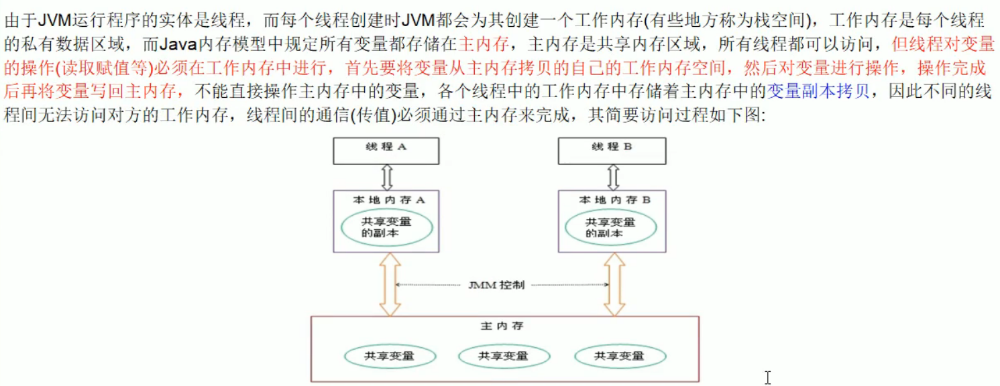

volatile 轻量级的同步机制：

- 保证可见性
- 不保证原子性
- 禁止指令重排

# JMM

JMM(Java内存模型Java Memory Model，简称JMM)本身是一种抽象的概念并不真实存在，它描述的是一组规则或规范，通过这组规范定义了程序中各个变量（包括实例字段，静态字段和构成数组对象的元素）的访问方式。

JMM关于同步的规定:

1. 线程解锁前，必须把共享变量的值刷新回主内存
2. 线程加锁前，必须读取主内存的最新值到自己的工作内存3加锁解锁是同一把锁

#### 硬件层数据一致性

使用各种各样的协议确保数据一致性，协议有很多种类

intel 用**MESI**

https://www.cnblogs.com/z00377750/p/9180644.html

**M: 被修改（Modified)**              **E: 独享的（Exclusive)**

 **S: 共享的（Shared)**                **I: 无效的（Invalid）**

现代CPU的数据一致性实现 = 缓存锁(MESI ...) + 总线锁

读取缓存以cache line为基本单位，目前64bytes

位于同一缓存行的两个不同数据，被两个不同CPU锁定，产生互相影响的伪共享问题

伪共享问题：JUC/c_028_FalseSharing

使用缓存行的对齐能够提高效率

#### 乱序问题

CPU为了提高指令执行效率，会在一条指令执行过程中（比如去内存读数据（慢100倍）），去同时执行另一条指令，前提是，两条指令没有依赖关系

https://www.cnblogs.com/liushaodong/p/4777308.html

写操作也可以进行合并

https://www.cnblogs.com/liushaodong/p/4777308.html

JUC/029_WriteCombining

乱序执行的证明：JVM/jmm/Disorder.java

原始参考：https://preshing.com/20120515/memory-reordering-caught-in-the-act/

#### 如何保证特定情况下不乱序

硬件内存屏障 X86

>  sfence:  store| 在sfence指令前的写操作当必须在sfence指令后的写操作前完成。
>  lfence：load | 在lfence指令前的读操作当必须在lfence指令后的读操作前完成。
>  mfence：modify/mix | 在mfence指令前的读写操作当必须在mfence指令后的读写操作前完成。

> 原子指令，如x86上的”lock …” 指令是一个Full Barrier，执行时会锁住内存子系统来确保执行顺序，甚至跨多个CPU。Software Locks通常使用了内存屏障或原子指令来实现变量可见性和保持程序顺序

#### JVM级别如何规范（JSR133）

> LoadLoad屏障：
> 	对于这样的语句Load1; LoadLoad; Load2， 
>
> 	在Load2及后续读取操作要读取的数据被访问前，保证Load1要读取的数据被读取完毕。
>
> StoreStore屏障：
>
> 	对于这样的语句Store1; StoreStore; Store2，
> 			
> 	在Store2及后续写入操作执行前，保证Store1的写入操作对其它处理器可见。
>
> LoadStore屏障：
>
> 	对于这样的语句Load1; LoadStore; Store2，
> 			
> 	在Store2及后续写入操作被刷出前，保证Load1要读取的数据被读取完毕。
>
> StoreLoad屏障：
> 	对于这样的语句Store1; StoreLoad; Load2，
>
> ​	 在Load2及后续所有读取操作执行前，保证Store1的写入对所有处理器可见。

#### volatile的实现细节

1. 字节码层面
   ACC_VOLATILE

2. JVM层面
   volatile内存区的读写 都加屏障

   > StoreStoreBarrier
   >
   > volatile 写操作
   >
   > StoreLoadBarrier

   > LoadLoadBarrier
   >
   > volatile 读操作
   >
   > LoadStoreBarrier

3. OS和硬件层面
   https://blog.csdn.net/qq_26222859/article/details/52235930
   工具：**hsdis** - HotSpot Dis Assembler
   windows lock 指令实现 | MESI实现

synchronized实现细节

1. 字节码层面
   ACC_SYNCHRONIZED
   monitorenter monitorexit  监控器进入/退出
2. JVM层面
   C C++ 调用了操作系统提供的同步机制
3. OS和硬件层面
   X86 : lock cmpxchg / xxx
   [https](https://blog.csdn.net/21aspnet/article/details/88571740)[://blog.csdn.net/21aspnet/article/details/](https://blog.csdn.net/21aspnet/article/details/88571740)[88571740](https://blog.csdn.net/21aspnet/article/details/88571740)

**Tip:**  java8大原子操作（虚拟机规范）已弃用，了解即可

最新的JSR-133已经放弃这种描述,但JMM没有变化《深入理解Java虚拟机》P364
lock:主内存，标识变量为线程独占
unlock:主内存，解锁线程独占变量
read:主内存，读取内容到工作内存
load:工作内存,read后的值放入线程本地变量副本use:工作内存，传值给执行引擎
assign:工作内存,执行引擎结果赋值给线程本地变量store:工作内存，存值到主内存给write备用
write:主内存，写变量值

#### 重排序规则

**hanppens-before原则（JVM规定重排序必须遵守的规则）JLS17.4.5**
·程序次序规则:同一个线程内，按照代码出现的顺序，前面的代码先行于后面的代码，准确的说是控制流顺序,因为要考虑到分支和循环结构。
·管程锁定规则:一个unlock操作先行发生于后面(时间上）对同一个锁的lock操作
ovolatile变量规则:对一个volatile变量的写操作先行发生于后面(时间上）对这个变量的读操作。
●线程启动规则:Thread的start()方法先行发生于这个线程的每一个操作。
·线程终止规则:线程的所有操作都先行于此线程的终止检测。可以通过Thread.join( )方法结束、Thread.isAlive( )的返回值等手段检测线程的终止。
●线程中断规则:对线程interrupt( )刀法的A力1删在想以不由断断事件的发生，可以通过Thread.interrupt()方法检测线程是否中断
●对象终结规则:一个对象的初始化完成先行于发生它的finalize()方法的开始。传递性:如果操作A先行于操作B，操作B先行于操作C，那么操作A先行于操作C

#### 对象创建过程

1. 请解释一下对象的创建过程 ?
   - class loading
   - class linking (verification, preparation, resolution)class initializing
   - 申请对象内存
   - 成员变量赋默认值
   - 调用构造方法<init>
     - 成员变量顺序赋初始值,首先调用super
     - 执行构造方法语句
2. 对象在内存中的存储布局 ?
   - JavaAgent_ AboutObject.md
3. 对象头具体包括什么 ?
   JavaAgent_AboutObject.md
4. 对象怎么定位 ?
   https://blog.csdn.net/clover_lily/article/details/8oo955805
5. 对象怎么分配 ?
   - Gc相关内容
6. Object o= new Object在内存中占用多少字节?
JavaAgent_AboutObject.md

