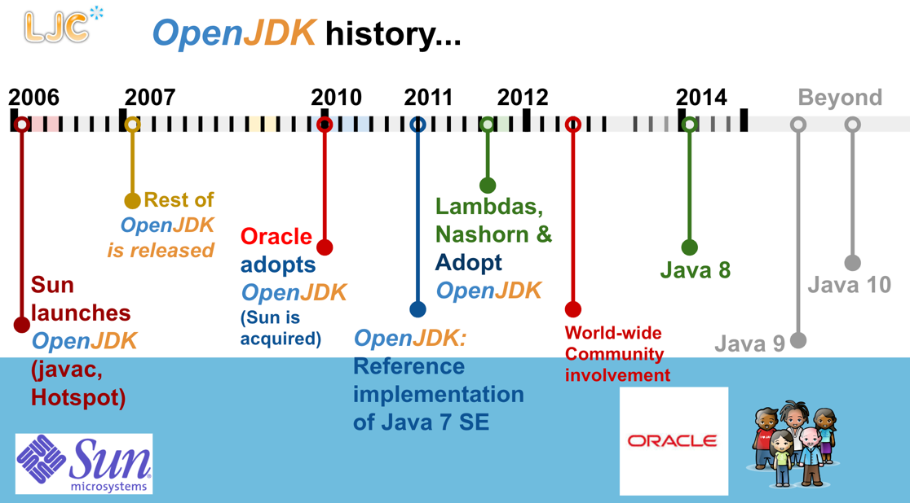
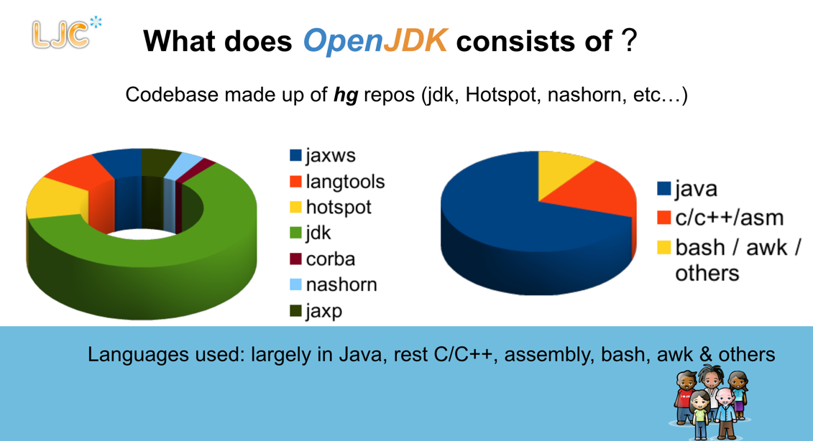

# OpenJDK 是什么东西?

以下是它的介绍:
- [Adopt OpenJDK 是什么](http://openjdk.java.net/groups/adoption/) - 通过感兴趣的站点注册
  - 主要说的是 adopt 组织通过低障碍的方式将JDK的开发带入java社区的中心(约束以及针对OpenJDK项目的协作)
  - OpenJDK wiki
    - Adoption Group
        此小组(adoption) 分组是 Java User Group(JUG) Adopt OpenJDK计划上形成的,原始计划的大部分预计将合并到这个组中(随着时间)..
    - sign up
        你能够加入这个讨论组的讨论和活动
         - [adoption-discuss](http://mail.openjdk.java.net/mailman/listinfo/adoption-discuss)
         - [http://openjdk.java.net/irc](http://openjdk.java.net/irc/) IRC channel(通道)
    - 使命宣言
      “促进和支持社区参与 OpenJDK 项目的开发、采用和传播”
    - 可持续性和可扩展性
      采用小组旨在以可持续和可扩展的方式实现这一使命宣言。采用小组可能会重点帮助教育新的贡献者提交相关的高质量补丁，并在文档、基础设施和宣传方面为现有项目和小组提供支持。
    - 具体的目标
        这个小组的目标是:
         - 低技术门槛,允许更多开发者,JUG 以及 组织参与OpenJDK的开发
         - 提升JAVA的质量(语言和平台) 并且集中于测试和扫除技术债务
         - 在更广泛的 Java 社区中推广 OpenJDK
         - 拓宽OpenJDK的贡献者基数
    - 主动性
      采用小组正在采取多项举措，代表性示例如下：
      - [新贡献者](https://wiki.openjdk.org/display/Adoption/New+Contributor) - 这是一个指南去帮助你提交一个补丁给OpenJDK 作为一个新的贡献者
      - [开发者指南](https://wiki.openjdk.org/display/Adoption/Developers+Guide) - 对于OpenJDK 开发者
      - [质量推广](https://wiki.openjdk.org/display/quality/Quality+Outreach) - 一项让 Java/JVM F/OSS 生态系统参与测试 OpenJDK 的计划。
      - [JDK 9 推广](https://wiki.openjdk.org/display/Adoption/JDK+9+Outreach) - 一个快速指南如何让你的代码通过JDK 9 测试
      - [Hackdays](https://wiki.openjdk.org/display/Adoption/Hackdays) - 物理或虚拟聚会，共同开发 OpenJDK 项目。
    - adoptopenjdk.net
      虽然不是 OpenJDK 的官方项目，但大多数采用小组成员都参与了在 adoptopenjdk.net 上为 OpenJDK 新建的共享构建农场。
      该构建农场和基础设施即代码将允许 OpenJDK 开发人员在尽可能多的版本、变体和平台上构建和测试 OpenJDK。
    - 内务管理
      与任何组织一样，总会有一些内务管理。
      [季度报告](https://wiki.openjdk.org/display/Adoption/Quarterly+Reports)
    
- [介绍1](http://bit.ly/1lZtesx)
  1. OpenJDK 是什么?
     OpenJDK(Open Java Development Kit) 表示开放的Java工具包[(是一个自由且开源的JavaPlatform,标准版(JavaSE)的实现)](http://en.wikipedia.org/wiki/Java_Platform,_Standard_Edition). 它是从2006开始,
      sun微服务公司努力的结果. 这个实现是隶属于[GNU General Public License(GNU GPL)](http://en.wikipedia.org/wiki/GNU_General_Public_License) 公众协议之下但是包含了一个链接除外 ..
     如果没有[链接除外](http://en.wikipedia.org/wiki/GPL_linking_exception) ,那么链接到这个java 类库的组件将需要遵循GPL 许可证的条款..
     OpenJDK 是官方Java SE7[参考实现](http://en.wikipedia.org/wiki/Reference_implementation) .
     > 移动OpenJDK 作为JavaSe 7参考实现: http://blogs.oracle.com/henrik/entry/moving_to_openjdk_as_the
       [Java 平台标准版本7参考实现](http://jdk7.java.net/java-se-7-ri/)
  2. OpenJDK 实际到底是什么?
     1. 从Java 7 SE开始的RI(不理解RI) - 理解了,参考实现(reference Implementation)
     2. 开源且自由
     3. 可用于构建自己的Java语言和平台的源代码
     4. 了解Java语言和平台的内部更多信息
     5. 历史
        
  3. Open JDK 由什么组成?
    由hg 仓库组成的代码仓库(jdk,Hotspot,nashorn,其他)
    
  4. OpenJDK的不同部分是如何配合的？
    
  5. Adopt OpenJDK 是什么?
    - JUG 领导发起
    - 项目孵化
    - 大量的开源项目工作在优化的OpenJDK以及Java 自身上
    - 帮助去补丁贡献给Java
    - 各种疑问和解答: https://java.net/projects/adoptopenjdk/pages/AdoptOpenJDK#Getting_Started
- [介绍2](http://www.slideshare.net/neomatrix369/how-is-java-jvm-built-adopt-openjdk-is-your-answer)
- [介绍3](http://www.slideshare.net/neomatrix369/how-is-jdkjvm-built-back-then-and-now)
- [视频1](http://www.youtube.com/watch?v=Cvyo0rfSQsw)
- [视频2](https://t.co/NrbrvWZaKO)
- [视频3](https://t.co/UJf5tqdNsd)
- [PDF 完全介绍](http://bit.ly/16QUelB)
- [PPT 完全介绍](http://bit.ly/1aXtErZ)
- [在Voxxed上的最近的博客文章](https://www.voxxed.com/blog/2015/01/java-jvm-built-adopt-openjdk-answer/)
- [使用 #OpenJDK 进行 #Twitter 规模计算](https://t.co/f4GDsfBADv)
- [在Voxxed上的相关更多的OpenJDK的文章](https://www.voxxed.com/?s=openjdk)
- [在Java Advent Calendar上的文章](https://www.javacodegeeks.com/2014/12/the-java-ecosystem-my-top-5-highlights-of-2014.html)

