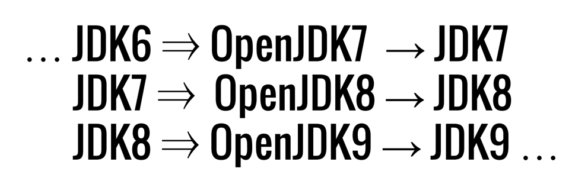
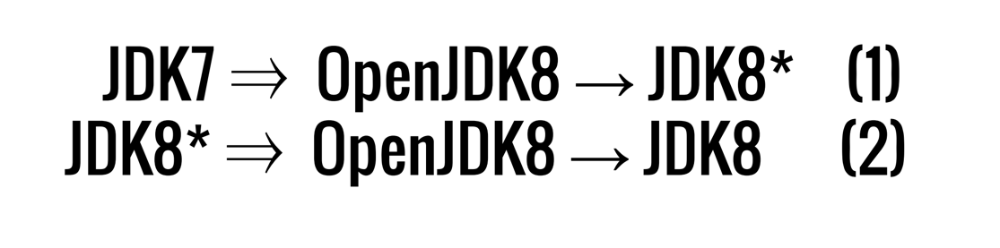
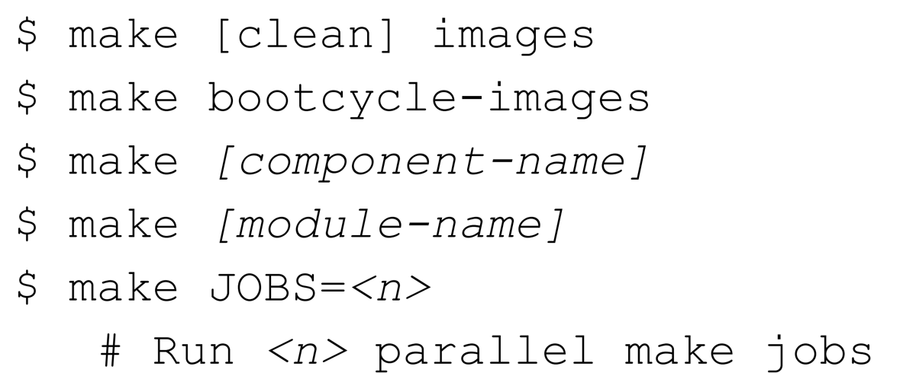

# 这么多年,如何构建JDK?

## 引导

## 引导周期镜像

## 有用的make 命令


## 某些神话破碎?

OpenJDK / Hotspot 使用c/C++写的? 这种说法是错误的 ..

成为一个硬核的开发者?

代码仓库非常吓人，令人猥琐的?

### C/C++ 示例
```c++
GenCollectorPolicy* gc_policy;
 if (UseSerialGC) {
 gc_policy = new MarkSweepPolicy();
 } else if (UseConcMarkSweepGC) {
 #ifndef SERIALGC
 if (UseAdaptiveSizePolicy) {
 gc_policy = new ASConcurrentMarkSweepPolicy();
 } else {
 gc_policy = new ConcurrentMarkSweepPolicy();
 }
 #else // SERIALGC
 fatal("UseConcMarkSweepGC not supported in this VM.");
 #endif // SERIALGC
 } else { // default old generation
 gc_policy = new MarkSweepPolicy();
 }
 Universe::_collectedHeap = new GenCollectedHeap(gc_policy);
```
完整的有关vm/memory/universe.cpp在HotSpot仓库中能够通过以下地址发现:
http://hg.openjdk.java.net/jdk6/jdk6/hotspot/raw-file/a541ca8fa0e3/src/share/vm/memory/universe.cpp
## 现代 - 工具
```shell
git clone <repo-name>
git pull origin master
mvn clean install
```

## 构建你自己的JDK 或者 JRE
```shell
hg clone http://hg.openjdk.java.net/jdk8/jdk8 jdk8
hg clone http://hg.openjdk.java.net/jdk9/jdk9 jdk9
```

执行以下命令
```shell
./get_source.sh

bash configure --with-boot-jdk=<path to jdk8 image>
make clean images
make install
```
等待一会就能够将jdk 构建出来 ..


## 在不同平台上构建JDK


