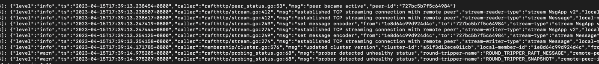

# 集群搭建

根据kubeadm 的集群搭建的日志,来进行二进制手动搭建 ...

## 1. 证书生成

首先参考官网上的[文档介绍](https://kubernetes.io/zh-cn/docs/tasks/administer-cluster/certificates/)

这里我们选择cfssl进行证书生成,根据cfssl官网描述,基于rhel的linux版本存在某些算法移除,所以需要手动安装go来安装cfssl ..

简单介绍一下cfssl:

- 具有一组包可以用来构建自定义的tls pki tools
- cfssl 程序,它是一个命令行工具 - 使用cfssl 包支持
- multirootca 程序, 它是一个证书授权服务器 - 能够使用多个签名密钥 ..
- mkbundle 程序,被用来构建证书池捆绑包
- cfssljson 程序,它解析来自cfssl 以及 multirootca程序的json输出并写入证书，密钥,csr(证书签名请求)以及捆绑包到磁盘 .

首先,下载对应的文件

```shell
curl -L https://github.com/cloudflare/cfssl/releases/download/v1.6.4/cfssl_1.6.4_linux_amd64 -o cfssl
chmod +x cfssl
curl -L https://github.com/cloudflare/cfssl/releases/download/v1.6.4/cfssljson_1.6.4_linux_amd64 -o cfssljson
chmod +x cfssljson
curl -L https://github.com/cloudflare/cfssl/releases/download/v1.6.4/cfssl-certinfo_1.6.4_linux_amd64 -o cfssl-certinfo
chmod +x cfssl-certinfo
```

### 1.1 生成自签名ca证书

### 1.2 生成etcd 集群所使用的证书

#### 1.2.1 生成etcd 集群节点通信证书

- tls \
  需要注意,tls来支持etcd 加密交流,tls 通道能够被用来加密內部集群的对端成员 同样以及成员与客户端的交流 ..
  所以我们需要配置对端和客户端tls 来构建一个集群 ..

  详细的[安全指南](https://etcd.io/docs/v3.5/op-guide/security/)

- 自签名证书 \
  一个集群使用自签名证书(在传输加密 以及认证 连接)，为了开始使用自签名证书启动集群,每一个集群成员都应该有一个独一无二的密钥对
  (member.crt,member.key) - 这些密钥对由统一的集群ca 证书加密(ca.crt) - 为了使用在对端连接以及客户端连接上 ..

  证书能够通过跟随 etcd 的[tls setup示例](https://github.com/etcd-io/etcd/tree/master/hack/tls-setup) 生成 ..

  生成完成之后,我们可以跟随证书相关的标志 ..

#### 1.2.2 根据ca证书生成 etcd节点的证书

现创建ca-config.json
```json
{
  "signing": {
    "default": {
      "usages": [
        "signing",
        "key encipherment",
        "server auth",
        "client auth"
      ],
      "expiry": "876000h"
    }
  },
  "profiles": {
    "www": {
      "expiry": "87600h",
      "usages": [
        "signing",
        "key encipherment",
        "server auth",
        "client auth"
      ]
    }
  }
}
```
上述中的profiles 标识配置方面,做出特性化配置,在生成证书的时候可以使用-profile 指定生成证书所使用的方面 ..

但是可以省略,直接提供配置文件(csr)去生成证书

生成ca-csr.json
```json
{
  "CN": "etcd CA",
  "key": {
    "algo": "rsa",
    "size": 2048
  },
  "names": [
    {
      "C": "CN",
      "ST": "",
      "L": "chongqing",
      "O": "jasonj-foundation",
      "OU": "soft-development-department"
    }
  ]
}
```
开始生成自签名ca证书
```shell
cfssl gencert -initca ca-csr.json | cfssljson -bare ca -
```

创建etcd-csr.json文件

```shell
{
  "CN": "etcd",
  "hosts": [
    "3.8.121.201",
    "46.4.19.20",
    "127.0.0.1",
    "localhost"
  ],
  "key": {
    "algo": "rsa",
    "size": 2048
  },
  "names": [
    {
      "O": "jasonj-foundation",
      "OU": "etcd cluster",
      "L": "chongqing"
    }
  ]
}
```

执行证书生成的命令
```shell
cfssl gencert -ca ca.pem  -ca-key ca-key.pem  -config ca-config.json  etcd-csr.json  | cfssljson -bare cluster-ssl/etcd-3
```
几个节点就重复生成多少个证书 ..

你可以发现上述命令没有在-config 后面加-profile 参数来指定 使用哪一个方面的设定 直接后跟csr, 给这个证书请求生成证书 ..

例如,你可以指定profile 
```shell
cfssl gencert -ca=ca.pem -ca-key=ca-key.pem -config=ca-config.json - profile=www server-csr.json | cfssljson -bare server
```

修改上述的hosts列表为集群ip地址列表,其中localhost,127.0.0.1 建议保留, 为了loopback 地址认证,然后执行命令

```shell
 cfssl gencert \
	  -ca certs/ca.pem \
	  -ca-key certs/ca-key.pem \
	  -config config/ca-config.json \
	  config/etcd-config.json | cfssljson -bare certs/${infra0}
	  
  # 生成对端证书
 cfssl gencert \
	  -ca certs/ca.pem \
	  -ca-key certs/ca-key.pem \
	  -config config/ca-config.json \
	  config/etcd-config.json | cfssljson -bare certs/peer-${infra0}
```

上述的infra0 是集群节点的ip地址, 可以是能够区分出节点的名称 ...(因为它会根据这个名称生成证书的名称)

以及启动etcd集群的相关配置

- 下载 etcd 安装包
  
  链接地址: https://github.com/etcd-io/etcd/releases
- 由于etcd集群化的方式有很多种,这里我们采用static
  静态ip发现,详情查看 [etcd clustering](https://etcd.io/docs/v3.5/op-guide/clustering/)

这里我们需要注意的是,2379 和2380两个端口的区别

2379是用来接收客户端请求的流量(它可能是本地客户端发起的流量 或者是其他etcd集群內的成员(作为客户端发起的流量)
,或者远程客户端发起的流量)

2380 是用来etcd集群內部的成员之间相互通信的 ..

于是listen-client-urls 指定了etcd 成员接收客户端流量的地址,advertise-client-urls 指定了将通告其他成员(
当前etcd成员接收客户端流量的地址)

在每一个etcd成员上执行命令
修改10.0.1.10 到当前etcd节点的服务器ip ...

还需要注意的是,initial-cluster 参数是用来使用一个离线引导配置,也就是提前知道etcd节点的ip地址端口等信息 ...

当然也可以通过环境变来那个设定(这里官方给出的示例,直接看下面的作为service 启动方案)

```shell
ETCD_INITIAL_CLUSTER="infra0=http://10.0.1.10:2380,infra1=http://10.0.1.11:2380,infra2=http://10.0.1.12:2380"
ETCD_INITIAL_CLUSTER_STATE=new
```

或者

```shell
--initial-cluster infra0=http://10.0.1.10:2380,infra1=http://10.0.1.11:2380,infra2=http://10.0.1.12:2380 \
--initial-cluster-state new
```

现在开始执行 ..

```shell
etcd --name infra0 --initial-advertise-peer-urls http://10.0.1.10:2380 \
  --listen-peer-urls http://10.0.1.10:2380 \
  --listen-client-urls http://10.0.1.10:2379,http://127.0.0.1:2379 \
  --advertise-client-urls http://10.0.1.10:2379 \
  --initial-cluster-token etcd-cluster-1 \
  --initial-cluster infra0=http://10.0.1.10:2380,infra1=http://10.0.1.11:2380,infra2=http://10.0.1.12:2380 \
  --initial-cluster-state new
```

修改地址,继续执行

```shell
etcd --name infra1 --initial-advertise-peer-urls http://10.0.1.11:2380 \
  --listen-peer-urls http://10.0.1.11:2380 \
  --listen-client-urls http://10.0.1.11:2379,http://127.0.0.1:2379 \
  --advertise-client-urls http://10.0.1.11:2379 \
  --initial-cluster-token etcd-cluster-1 \
  --initial-cluster infra0=http://10.0.1.10:2380,infra1=http://10.0.1.11:2380,infra2=http://10.0.1.12:2380 \
  --initial-cluster-state new
```

修改地址,继续执行

```shell
etcd --name infra2 --initial-advertise-peer-urls http://10.0.1.12:2380 \
  --listen-peer-urls http://10.0.1.12:2380 \
  --listen-client-urls http://10.0.1.12:2379,http://127.0.0.1:2379 \
  --advertise-client-urls http://10.0.1.12:2379 \
  --initial-cluster-token etcd-cluster-1 \
  --initial-cluster infra0=http://10.0.1.10:2380,infra1=http://10.0.1.11:2380,infra2=http://10.0.1.12:2380 \
  --initial-cluster-state new
```

请注意,这个`--initial-cluster` 将会被后续的etcd 命令运行忽略, 也就是不会生效(但是有些情况下 需要加入,具体查看[官网教程](https://etcd.io/docs/v3.5/op-guide/clustering/)) ... 所以可以将 前面的环境变量移除 ..

如果后续配置需要更新,例如新增 /
移除成员,那么查看 [运行时配置](https://etcd.io/docs/v3.5/op-guide/runtime-configuration/)

- 使用服务的方式启动etcd
先创建配置文件
```shell
cat > /opt/etcd/cfg/etcd.conf << EOF
#[Member]
ETCD_NAME="etcd-1"
ETCD_DATA_DIR="/var/lib/etcd/default.etcd"
ETCD_LISTEN_PEER_URLS="https://172.30.0.4:2380"
ETCD_LISTEN_CLIENT_URLS="https://172.30.0.4:2379"
#[Clustering]
ETCD_INITIAL_ADVERTISE_PEER_URLS="https://172.30.0.4:2380"
ETCD_ADVERTISE_CLIENT_URLS="https://172.30.0.4:2379"
ETCD_INITIAL_CLUSTER="etcd-1=https://172.30.0.4:2380,etcd-2=https://172.30.0.7:2380,etcd-3=https://172.30.0.17:2380"
ETCD_INITIAL_CLUSTER_TOKEN="etcd-cluster"
ETCD_INITIAL_CLUSTER_STATE="new"                                                                       
EOF
```
ETCD_NAME:节点名称，集群中唯一
ETCD_DATA_DIR:数据目录
ETCD_LISTEN_PEER_URLS:集群通信监听地址
ETCD_LISTEN_CLIENT_URLS:客户端访问监听地址
ETCD_INITIAL_ADVERTISE_PEER_URLS:集群通告地址
ETCD_ADVERTISE_CLIENT_URLS:客户端通告地址
ETCD_INITIAL_CLUSTER:集群节点地址
ETCD_INITIAL_CLUSTER_TOKEN:集群 Token
ETCD_INITIAL_CLUSTER_STATE:加入集群的当前状态，new 是新集群，existing 表示加入 已有集群

配置etcd.service文件
```shell
[Unit]
Description=Etcd Server
After=network.target
After=network-online.target
Wants=network-online.target

[Service]
Type=notify
EnvironmentFile=/opt/etcd/cfg/etcd.conf
ExecStart=/opt/etcd/bin/etcd  --cert-file=/opt/etcd/ssl/server.pem  --key-file=/opt/etcd/ssl/server-key.pem --peer-cert-file=/opt/etcd/ssl/server.pem --peer-key-file=/opt/etcd/ssl/server-key.pem --trusted-ca-file=/opt/etcd/ssl/ca.pem --peer-trusted-ca-file=/opt/etcd/ssl/ca.pem --logger=zap
Restart=on-failure
LimitNOFILE=65536
[Install]
WantedBy=multi-user.target
```

根据这个服务文件,我们可以 知道我们需要将配置文件(前面的配置文件 etcd.conf)放置在/opt/etcd/cfg下
并且需要将etcd 安装包中的/bin 目录中的相关可执行脚本放入 /opt/etcd/bin下 
然后将证书放入 /opt/etcd/ssl下 (包括ca证书, 以及 客户端证书 / 对等端交流证书)

```shell
systemctl daemon-reload
systemctl start etcd
systemctl enable etcd
```

- 具有tls 交换信息的 集群构建方式
```shell
/opt/etcd/bin/etcd --name "etcd-1" --data-dir=/var/lib/etcd/default.etcd \
--listen-peer-urls="https://172.30.0.4:2380" \
--listen-client-urls="https://172.30.0.4:2379,http://127.0.0.1:2379" \
--advertise-client-urls="https://172.30.0.4:2379" \
--initial-advertise-peer-urls="https://172.30.0.4:2380" \
--initial-cluster-token="etcd-cluster" \
--initial-cluster="etcd-1=https://172.30.0.4:2380,etcd-2=https://172.30.0.7:2380,etcd-3=https://172.30.0.17:2380" \
--initial-cluster-state=new \
--cert-file=/opt/etcd/ssl/server.pem \
--key-file=/opt/etcd/ssl/server-key.pem \
--peer-cert-file=/opt/etcd/ssl/server.pem \
--peer-key-file=/opt/etcd/ssl/server-key.pem \
--trusted-ca-file=/opt/etcd/ssl/ca.pem \
--peer-trusted-ca-file=/opt/etcd/ssl/ca.pem \
--logger=zap
```
请注意,127.0.0.1 / localhost:2379 端口可能会被占用(有可能是同时写了localhost), 使用一个即可 ..

当执行命令之后,成员之间,会等待互相交换信息,一旦交换成功,集群就启动成功 ...

成功消息:



> 注意事项:
> 由于initial-cluster-state 的状态可能会影响成员的行为,如果本地已经有了etcd的记录信息(那么其中必然存在集群信息),那么将一个已经加入集群的成员加入
> 到其他新的集群将会发生错误,具体issues在[etcd](https://github.com/ahrtr/etcd-issues/blob/master/docs/cluster_id_mismatch.md) 
> 
> 解决办法就是:
> 删除数据存储目录,重新创建集群即可
> 例如上述使用数据目录为: /var/lib/etcd
> 直接删除,然后尝试重新启动集群 ..
> 
> ```shell
>  systemctl stop etcd
>  rm -rf /var/lib/etcd
>  ystemctl start etcd
> ```

#### 1.2.3 配置服务端组件
- 安装api-server
首先将下载的k8s组件包解压,然后将server/bin下的api-server 放置到 /usr/local/bin下,以便使用

然后编写systemd 服务文件
/usr/lib/systemd/system/api-server.service
```shell
[Unit]
Description=Kubernetes API Server
Documentation=https://github.com/kubernetes/kubernetes

[Service]
ExecStart=/usr/local/bin/kube-apiserver \
  --advertise-address=172.30.0.12 \
  --allow-privileged=true \
  --enable-admission-plugins=NodeRestriction \
  --enable-bootstrap-token-auth=true \
  --token-auth-file=/etc/kubernetes/cfg/token.csv \
  --bind-address=172.30.0.12 \
  --tls-cert-file=/etc/kubernetes/ssl/server.pem \
  --tls-private-key-file=/etc/kubernetes/ssl/server-key.pem \
  --etcd-servers=https://172.30.0.4:2379,https://172.30.0.17:2379,https://172.30.0.7:2379 \
  --etcd-cafile=/etc/kubernetes/etcd/ca.pem \
  --etcd-certfile=/etc/kubernetes/etcd/server.pem \
  --etcd-keyfile=/etc/kubernetes/etcd/server-key.pem \
  --secure-port=6443 \
  --authorization-mode=Node,RBAC \
  --kubelet-preferred-address-types=InternalIP,ExternalIP,Hostname \
  --kubelet-certificate-authority=/etc/kubernetes/ssl/ca.pem \
  --kubelet-client-certificate=/etc/kubernetes/ssl/server.pem \
  --kubelet-client-key=/etc/kubernetes/ssl/server-key.pem \
  --client-ca-file=/etc/kubernetes/ssl/ca.pem \
  --proxy-client-cert-file=/etc/kubernetes/ssl/server.pem \
  --proxy-client-key-file=/etc/kubernetes/ssl/server-key.pem \
  --requestheader-allowed-names=front-proxy-client \
  --requestheader-client-ca-file=/etc/kubernetes/ssl/ca.pem \
  --requestheader-extra-headers-prefix=X-Remote-Extra- \
  --requestheader-group-headers=X-Remote-Group \
  --requestheader-username-headers=X-Remote-User \
  --service-cluster-ip-range=10.96.0.0/12 \
  --service-node-port-range=30000-32767 \
  --service-account-issuer=https://kubernetes.default.svc.cluster.local \
  --api-audiences=kubernetes.default.svc \
  --service-account-key-file=/etc/kubernetes/ssl/ca-key.pem \
  --service-account-signing-key-file=/etc/kubernetes/ssl/ca-key.pem \
  --audit-log-maxage=30 \
  --audit-log-maxbackup=3 \
  --audit-log-maxsize=100 \
  --audit-log-path=/opt/kubernetes/logs/k8s-audit.log \
  --v=2

Restart=always
User=root
WorkingDirectory=/root

[Install]
WantedBy=multi-user.target
```
- 安装控制器
/usr/lib/systemd/system/kube-controller-manager.service 编写
```shell
 kube-controller-manager
    --allocate-node-cidrs=true \
    --authentication-kubeconfig=/etc/kubernetes/controller-manager.conf \
    --authorization-kubeconfig=/etc/kubernetes/controller-manager.conf \
    --bind-address=172.30.0.12
    --client-ca-file=/etc/kubernetes/ssl/ca.crt
    --cluster-cidr=10.244.0.0/16
    --cluster-name=kubernetes
    --cluster-signing-cert-file=/etc/kubernetes/ssl/ca.crt
    --cluster-signing-key-file=/etc/kubernetes/ssl/ca.key
    --controllers=*,bootstrapsigner,tokencleaner
    --kubeconfig=/etc/kubernetes/controller-manager.conf
    --leader-elect=true
    --requestheader-client-ca-file=/etc/kubernetes/ssl/ca.crt
    --root-ca-file=/etc/kubernetes/ssl/ca.crt
    --service-account-private-key-file=/etc/kubernetes/ssl/ca.key
    --service-cluster-ip-range=10.96.0.0/12
    --use-service-account-credentials=true
```
- 安装kubectl

  Kubernetes 提供 kubectl 是使用 Kubernetes API 与 Kubernetes 集群的控制面进行通信的命令行工具
  针对配置信息，kubectl 在 $HOME/.kube 目录中查找一个名为 config 的配置文件。 你可以通过设置 KUBECONFIG 环境变量或设置 --kubeconfig

  所以我们一般可以通过环境变量指定config 配置文件 ..
```yaml
apiVersion: v1
clusters:
- cluster:
    certificate-authority-data: LS0tLS1CRUdJTiBDRVJUSUZJQ0FURS0tLS0tCk1JSUR3RENDQXFpZ0F3SUJBZ0lVQ1B6ajBDVElPRDNKY0ptSXA0bjNhWkh6ZjNFd0RRWUpLb1pJaHZjTkFRRUwKQlFBd2VERUxNQWtHQTFVRUJoTUNRMDR4RWpBUUJnTlZCQWNUQ1dOb2IyNW5jV2x1WnpFYU1CZ0dBMVVFQ2hNUgphbUZ6YjI1cUxXWnZkVzVrWVhScGIyNHhKREFpQmdOVkJBc1RHM052Wm5RdFpHVjJaV3h2Y0cxbGJuUXRaR1Z3CllYSjBiV1Z1ZERFVE1CRUdBMVVFQXhNS2EzVmlaWEp1WlhSbGN6QWVGdzB5TXpBME1UWXdNRE0zTURCYUZ3MHkKT0RBME1UUXdNRE0zTURCYU1IZ3hDekFKQmdOVkJBWVRBa05PTVJJd0VBWURWUVFIRXdsamFHOXVaM0ZwYm1jeApHakFZQmdOVkJBb1RFV3BoYzI5dWFpMW1iM1Z1WkdGMGFXOXVNU1F3SWdZRFZRUUxFeHR6YjJaMExXUmxkbVZzCmIzQnRaVzUwTFdSbGNHRnlkRzFsYm5ReEV6QVJCZ05WQkFNVENtdDFZbVZ5Ym1WMFpYTXdnZ0VpTUEwR0NTcUcKU0liM0RRRUJBUVVBQTRJQkR3QXdnZ0VLQW9JQkFRRERQU2ZuTXJzSk9TLytkY0Q5RW1vZUVjZi9yb3IrMHlKeQo3U2oxNitTS3VtdnpVbW5wcnJZNFFKZE1mVVFTeHg0RmhheXJ4VkhZUUJQdTErenlWVFl1dlRCTmVYSklxLzRjCmlNTkx6NFFJMnVKSzZ1cWRzbXdId1d4d25XWGxFNS81SlptekpxRkVlN2RsZk5lb0xQMzMwai8vblRRUXRiV0wKb20zdER5eTJJSW1NcEVxVVFhb1NiNDBRYzNFNXc5cDc5R3E2R0ZmaFUvNzByUnNQc0ZBTzVrRTZvZWo0bVdTZQozaUd6NjRZMU5SU2N6NlpFRmFYWGdJZVlQdHBUVkIrdlBhaXI1aWZSLzQ3R3RjR2ZSZjBFdHJaUFU0SlFUQU9ICjliblllWTdNQ3JOVlk4d3o3M1VxOUcyTms4ZmN2Q2gxMHNXTk42bFJTTE9OcjUvZXlLUmZBZ01CQUFHalFqQkEKTUE0R0ExVWREd0VCL3dRRUF3SUJCakFQQmdOVkhSTUJBZjhFQlRBREFRSC9NQjBHQTFVZERnUVdCQlE2bW52Vwpic29UMzVkUXUrZE9GSUNsRGZkWXRqQU5CZ2txaGtpRzl3MEJBUXNGQUFPQ0FRRUFZdmRIT1cxV1VsOUZ3OVZFCk16dFVCZExWd21aa29TMk13VmhKdnhuditQalNaajFZeCt1Vk5zSVNjYlJ0dTh5c00rc0RVai82U0o3dlhwZnQKR0lZRTRBdEd6L1NKNGZCanRBSWJBUUhjRnNjR0JpMzk3WjFWK1lTZk91Ym5VUGdlSm90VlBnZ1NFY2JWZnFqeApkOFpHM2poZ0dyUGczTnRNTXkycTNQdjAzbmtPaXpxdjVWSXNHVEtDZUJVS3pJSGp5bE1wbEhTWGFkWXBJQTVBCmNWS0VDNjRLZi9nbHZFU2tUZmVQb1o4ZG1FZEtCbU82eE05cXpHM0ZTSkp3czRvUWhsRGluT3VxVStIM0ZMLysKUTJvMXFGTktGUkNlcHR0a0pHWHlMeVlpRXkzSjF4Vjg1YzFVcnByM2gwTUtXR3hDSVkxVE4xcUFMbkpuZ3lvNgpZRlF5V3c9PQotLS0tLUVORCBDRVJUSUZJQ0FURS0tLS0tCg==
    server: https://172.30.0.12:6443
  name: kubernetes
contexts:
- context:
    cluster: kubernetes
    user: system:kube-controller-manager
  name: system:kube-controller-manager@kubernetes
current-context: system:kube-controller-manager@kubernetes
kind: Config
preferences: {}
users:
- name: system:kube-controller-manager
  user:
    client-certificate-data: LS0tLS1CRUdJTiBDRVJUSUZJQ0FURS0tLS0tCk1JSUR3RENDQXFpZ0F3SUJBZ0lVQ1B6ajBDVElPRDNKY0ptSXA0bjNhWkh6ZjNFd0RRWUpLb1pJaHZjTkFRRUwKQlFBd2VERUxNQWtHQTFVRUJoTUNRMDR4RWpBUUJnTlZCQWNUQ1dOb2IyNW5jV2x1WnpFYU1CZ0dBMVVFQ2hNUgphbUZ6YjI1cUxXWnZkVzVrWVhScGIyNHhKREFpQmdOVkJBc1RHM052Wm5RdFpHVjJaV3h2Y0cxbGJuUXRaR1Z3CllYSjBiV1Z1ZERFVE1CRUdBMVVFQXhNS2EzVmlaWEp1WlhSbGN6QWVGdzB5TXpBME1UWXdNRE0zTURCYUZ3MHkKT0RBME1UUXdNRE0zTURCYU1IZ3hDekFKQmdOVkJBWVRBa05PTVJJd0VBWURWUVFIRXdsamFHOXVaM0ZwYm1jeApHakFZQmdOVkJBb1RFV3BoYzI5dWFpMW1iM1Z1WkdGMGFXOXVNU1F3SWdZRFZRUUxFeHR6YjJaMExXUmxkbVZzCmIzQnRaVzUwTFdSbGNHRnlkRzFsYm5ReEV6QVJCZ05WQkFNVENtdDFZbVZ5Ym1WMFpYTXdnZ0VpTUEwR0NTcUcKU0liM0RRRUJBUVVBQTRJQkR3QXdnZ0VLQW9JQkFRRERQU2ZuTXJzSk9TLytkY0Q5RW1vZUVjZi9yb3IrMHlKeQo3U2oxNitTS3VtdnpVbW5wcnJZNFFKZE1mVVFTeHg0RmhheXJ4VkhZUUJQdTErenlWVFl1dlRCTmVYSklxLzRjCmlNTkx6NFFJMnVKSzZ1cWRzbXdId1d4d25XWGxFNS81SlptekpxRkVlN2RsZk5lb0xQMzMwai8vblRRUXRiV0wKb20zdER5eTJJSW1NcEVxVVFhb1NiNDBRYzNFNXc5cDc5R3E2R0ZmaFUvNzByUnNQc0ZBTzVrRTZvZWo0bVdTZQozaUd6NjRZMU5SU2N6NlpFRmFYWGdJZVlQdHBUVkIrdlBhaXI1aWZSLzQ3R3RjR2ZSZjBFdHJaUFU0SlFUQU9ICjliblllWTdNQ3JOVlk4d3o3M1VxOUcyTms4ZmN2Q2gxMHNXTk42bFJTTE9OcjUvZXlLUmZBZ01CQUFHalFqQkEKTUE0R0ExVWREd0VCL3dRRUF3SUJCakFQQmdOVkhSTUJBZjhFQlRBREFRSC9NQjBHQTFVZERnUVdCQlE2bW52Vwpic29UMzVkUXUrZE9GSUNsRGZkWXRqQU5CZ2txaGtpRzl3MEJBUXNGQUFPQ0FRRUFZdmRIT1cxV1VsOUZ3OVZFCk16dFVCZExWd21aa29TMk13VmhKdnhuditQalNaajFZeCt1Vk5zSVNjYlJ0dTh5c00rc0RVai82U0o3dlhwZnQKR0lZRTRBdEd6L1NKNGZCanRBSWJBUUhjRnNjR0JpMzk3WjFWK1lTZk91Ym5VUGdlSm90VlBnZ1NFY2JWZnFqeApkOFpHM2poZ0dyUGczTnRNTXkycTNQdjAzbmtPaXpxdjVWSXNHVEtDZUJVS3pJSGp5bE1wbEhTWGFkWXBJQTVBCmNWS0VDNjRLZi9nbHZFU2tUZmVQb1o4ZG1FZEtCbU82eE05cXpHM0ZTSkp3czRvUWhsRGluT3VxVStIM0ZMLysKUTJvMXFGTktGUkNlcHR0a0pHWHlMeVlpRXkzSjF4Vjg1YzFVcnByM2gwTUtXR3hDSVkxVE4xcUFMbkpuZ3lvNgpZRlF5V3c9PQotLS0tLUVORCBDRVJUSUZJQ0FURS0tLS0tCg==
    client-key-data: LS0tLS1CRUdJTiBSU0EgUFJJVkFURSBLRVktLS0tLQpNSUlFb3dJQkFBS0NBUUVBd3owbjV6SzdDVGt2L25YQS9SSnFIaEhILzY2Sy90TWljdTBvOWV2a2lycHI4MUpwCjZhNjJPRUNYVEgxRUVzY2VCWVdzcThWUjJFQVQ3dGZzOGxVMkxyMHdUWGx5U0t2K0hJakRTOCtFQ05yaVN1cnEKbmJKc0I4RnNjSjFsNVJPZitTV1pzeWFoUkh1M1pYelhxQ3o5OTlJLy81MDBFTFcxaTZKdDdROHN0aUNKaktSSwpsRUdxRW0rTkVITnhPY1BhZS9ScXVoaFg0VlArOUswYkQ3QlFEdVpCT3FIbytKbGtudDRocyt1R05UVVVuTSttClJCV2wxNENIbUQ3YVUxUWZyejJvcStZbjBmK094clhCbjBYOUJMYTJUMU9DVUV3RGgvVzUySG1PekFxelZXUE0KTSs5MUt2UnRqWlBIM0x3b2RkTEZqVGVwVVVpemphK2Yzc2lrWHdJREFRQUJBb0lCQUd6T3JHcGhEM080ZDFMcwo5VDBWQWliMzZlcElzQllNUE9xbjJXZ1VxeTNWYjB3UDVnN2gyNVBHQzR3SlUrTFRMWndPUDRrTFV1MmQ2SDMzCndJbmRpM0RJNXg2R1RIYkx3N2JMVVd2eW5yY0FwWlR6RHdZTDVjRDh2eDZUMmJHdEdqNlVBZkNoMnNaNzNGMm4KRWRrY0dmMy9Jc09tTE5vVEtyWkRNOWdsMk5rMmx1Z3cvTUtKT2FTTHFpL3p5OHF6TjhlU3BGRjlETzh6K3V1OApwaGRHTlJqQ0hjNlE2Wk5WZmdaMzc4RmlDZnBpc2drMEI4UEhkSlllbWRTR1NtS1pqY2dPaHp6OUZLUGswdExTCmZwNklYVjJ5ZzQxSG52R0dvNitOd0RmZFBPNFROK0pwYmNJRTQzNFd1N25SR3NsTllhYW1XblpQRFpiY29oc3EKWXc5RjdtRUNnWUVBemQvZmJVTU9vOFFnOG8ydW1TQUhxYmMxbHFjSjU5bHZ6a05BTVB0V2hNSmUxdFk0NldOdQp0U1FNMzFkaDlmK2pRNDZBSWpRYVJ5NkN0cFhnTnFWTzRQdEtpT2lQblQyRGJ1aUFWY0lReENRREQyL2JBdUsvCnF1TW1LZ1JQZ2M4R2VZeS9iRFB5MVRVZ0JxUHVRQ3hFYTlSdklwTlRLWlRrRXVrNmJhNkNuZE1DZ1lFQThzWmQKNzdaZVhocDFhaTNHM1ZOcHNLM0xjZzcwR0REdUlOT1RwZGJyeHVCZXhkNjk1RGVzQ1NQclF1bTNSRjR3aHdwbQpLWmNta2p4cGozNlI1Y0ZXaFFqcy9US1ZoeEdTcFl3L3lPR3NQTHQ0WnZyQmdMelM3dTVzbUZjcS81ZCs3VmhnCkU4WGdmbWh0UGxjWVFDYldCOHV5TDh4U3A0L3BiZEJiK2N1NmE4VUNnWUJSa2tXbHRpOGp4ajlEdTgyVlVIS1kKMVVXL1pubnZTbUVaZWQ0Q1NtUFNnRzB4ZEhuaVI0cUM3VURJY1lnWC8yMUNCRUZTekJBcGFnMVNxUG5JelNEKwoxYktIb3BYY3VKWE9LUU5JZDNkTEwvV2lkVEJ5NlVNR1E3QkliNkxORFNsRW1mYnl1WGFhOGN5NXROUmV5dXRsClNpdXFxSE1JQTcyR25MQ1E2dGRJRHdLQmdHdTZQRXEzZU81Mi9TME5mUllQQW5JazNJY1RQWnRTY3doYitrTjMKdUEzNjEvTWpvTTJaS3B5dnRLQnZoeVF1UzRoUXcvNm1sTFlGV3E0Uzh2aXByeE8vWHpJSGRUU0hSclJ4SklpbQpJMENieTVTZXBxalNvU0xtNTRjOS90V0Z5d3ZVMEdWVnhBVXpuMjR2UlpLSjZTVnliUElxejI2TlBINi9HMkVmCjF1d2xBb0dCQU1yV3RyZS9HRi9FNk1mTFlKZll2REhyNzZGTGFOUmpYOTJlYmFPL2hSSngxSWxMeHcxM0pNekcKYzcreXBqL2hVWXZCeUlZOFZZVVYzRUFoN2puOFdzZ05QMmY2ZWhVdzlyb3pqSEJ5VGxLWE9PWDZFVHh0aENkcQp4WWpGNHp5bW93bU5tVUtoQ3ZMYng2MVlBckw4S3h5VDczMEJxdDRsVm4rV2lFYnRydkJZCi0tLS0tRU5EIFJTQSBQUklWQVRFIEtFWS0tLS0tCg==
```
- scheduler 

```yaml
apiVersion: v1
clusters:
- cluster:
    certificate-authority-data: LS0tLS1CRUdJTiBDRVJUSUZJQ0FURS0tLS0tCk1JSUR3RENDQXFpZ0F3SUJBZ0lVQ1B6ajBDVElPRDNKY0ptSXA0bjNhWkh6ZjNFd0RRWUpLb1pJaHZjTkFRRUwKQlFBd2VERUxNQWtHQTFVRUJoTUNRMDR4RWpBUUJnTlZCQWNUQ1dOb2IyNW5jV2x1WnpFYU1CZ0dBMVVFQ2hNUgphbUZ6YjI1cUxXWnZkVzVrWVhScGIyNHhKREFpQmdOVkJBc1RHM052Wm5RdFpHVjJaV3h2Y0cxbGJuUXRaR1Z3CllYSjBiV1Z1ZERFVE1CRUdBMVVFQXhNS2EzVmlaWEp1WlhSbGN6QWVGdzB5TXpBME1UWXdNRE0zTURCYUZ3MHkKT0RBME1UUXdNRE0zTURCYU1IZ3hDekFKQmdOVkJBWVRBa05PTVJJd0VBWURWUVFIRXdsamFHOXVaM0ZwYm1jeApHakFZQmdOVkJBb1RFV3BoYzI5dWFpMW1iM1Z1WkdGMGFXOXVNU1F3SWdZRFZRUUxFeHR6YjJaMExXUmxkbVZzCmIzQnRaVzUwTFdSbGNHRnlkRzFsYm5ReEV6QVJCZ05WQkFNVENtdDFZbVZ5Ym1WMFpYTXdnZ0VpTUEwR0NTcUcKU0liM0RRRUJBUVVBQTRJQkR3QXdnZ0VLQW9JQkFRRERQU2ZuTXJzSk9TLytkY0Q5RW1vZUVjZi9yb3IrMHlKeQo3U2oxNitTS3VtdnpVbW5wcnJZNFFKZE1mVVFTeHg0RmhheXJ4VkhZUUJQdTErenlWVFl1dlRCTmVYSklxLzRjCmlNTkx6NFFJMnVKSzZ1cWRzbXdId1d4d25XWGxFNS81SlptekpxRkVlN2RsZk5lb0xQMzMwai8vblRRUXRiV0wKb20zdER5eTJJSW1NcEVxVVFhb1NiNDBRYzNFNXc5cDc5R3E2R0ZmaFUvNzByUnNQc0ZBTzVrRTZvZWo0bVdTZQozaUd6NjRZMU5SU2N6NlpFRmFYWGdJZVlQdHBUVkIrdlBhaXI1aWZSLzQ3R3RjR2ZSZjBFdHJaUFU0SlFUQU9ICjliblllWTdNQ3JOVlk4d3o3M1VxOUcyTms4ZmN2Q2gxMHNXTk42bFJTTE9OcjUvZXlLUmZBZ01CQUFHalFqQkEKTUE0R0ExVWREd0VCL3dRRUF3SUJCakFQQmdOVkhSTUJBZjhFQlRBREFRSC9NQjBHQTFVZERnUVdCQlE2bW52Vwpic29UMzVkUXUrZE9GSUNsRGZkWXRqQU5CZ2txaGtpRzl3MEJBUXNGQUFPQ0FRRUFZdmRIT1cxV1VsOUZ3OVZFCk16dFVCZExWd21aa29TMk13VmhKdnhuditQalNaajFZeCt1Vk5zSVNjYlJ0dTh5c00rc0RVai82U0o3dlhwZnQKR0lZRTRBdEd6L1NKNGZCanRBSWJBUUhjRnNjR0JpMzk3WjFWK1lTZk91Ym5VUGdlSm90VlBnZ1NFY2JWZnFqeApkOFpHM2poZ0dyUGczTnRNTXkycTNQdjAzbmtPaXpxdjVWSXNHVEtDZUJVS3pJSGp5bE1wbEhTWGFkWXBJQTVBCmNWS0VDNjRLZi9nbHZFU2tUZmVQb1o4ZG1FZEtCbU82eE05cXpHM0ZTSkp3czRvUWhsRGluT3VxVStIM0ZMLysKUTJvMXFGTktGUkNlcHR0a0pHWHlMeVlpRXkzSjF4Vjg1YzFVcnByM2gwTUtXR3hDSVkxVE4xcUFMbkpuZ3lvNgpZRlF5V3c9PQotLS0tLUVORCBDRVJUSUZJQ0FURS0tLS0tCg==
    server: https://172.30.0.12:6443
  name: kubernetes
contexts:
- context:
    cluster: kubernetes
    user: system:kube-scheduler
  name: system:kube-scheduler@kubernetes
current-context: system:kube-scheduler@kubernetes
kind: Config
preferences: {}
users:
- name: kube-scheduler
  user:
    client-certificate-data: LS0tLS1CRUdJTiBDRVJUSUZJQ0FURS0tLS0tCk1JSUR3RENDQXFpZ0F3SUJBZ0lVQ1B6ajBDVElPRDNKY0ptSXA0bjNhWkh6ZjNFd0RRWUpLb1pJaHZjTkFRRUwKQlFBd2VERUxNQWtHQTFVRUJoTUNRMDR4RWpBUUJnTlZCQWNUQ1dOb2IyNW5jV2x1WnpFYU1CZ0dBMVVFQ2hNUgphbUZ6YjI1cUxXWnZkVzVrWVhScGIyNHhKREFpQmdOVkJBc1RHM052Wm5RdFpHVjJaV3h2Y0cxbGJuUXRaR1Z3CllYSjBiV1Z1ZERFVE1CRUdBMVVFQXhNS2EzVmlaWEp1WlhSbGN6QWVGdzB5TXpBME1UWXdNRE0zTURCYUZ3MHkKT0RBME1UUXdNRE0zTURCYU1IZ3hDekFKQmdOVkJBWVRBa05PTVJJd0VBWURWUVFIRXdsamFHOXVaM0ZwYm1jeApHakFZQmdOVkJBb1RFV3BoYzI5dWFpMW1iM1Z1WkdGMGFXOXVNU1F3SWdZRFZRUUxFeHR6YjJaMExXUmxkbVZzCmIzQnRaVzUwTFdSbGNHRnlkRzFsYm5ReEV6QVJCZ05WQkFNVENtdDFZbVZ5Ym1WMFpYTXdnZ0VpTUEwR0NTcUcKU0liM0RRRUJBUVVBQTRJQkR3QXdnZ0VLQW9JQkFRRERQU2ZuTXJzSk9TLytkY0Q5RW1vZUVjZi9yb3IrMHlKeQo3U2oxNitTS3VtdnpVbW5wcnJZNFFKZE1mVVFTeHg0RmhheXJ4VkhZUUJQdTErenlWVFl1dlRCTmVYSklxLzRjCmlNTkx6NFFJMnVKSzZ1cWRzbXdId1d4d25XWGxFNS81SlptekpxRkVlN2RsZk5lb0xQMzMwai8vblRRUXRiV0wKb20zdER5eTJJSW1NcEVxVVFhb1NiNDBRYzNFNXc5cDc5R3E2R0ZmaFUvNzByUnNQc0ZBTzVrRTZvZWo0bVdTZQozaUd6NjRZMU5SU2N6NlpFRmFYWGdJZVlQdHBUVkIrdlBhaXI1aWZSLzQ3R3RjR2ZSZjBFdHJaUFU0SlFUQU9ICjliblllWTdNQ3JOVlk4d3o3M1VxOUcyTms4ZmN2Q2gxMHNXTk42bFJTTE9OcjUvZXlLUmZBZ01CQUFHalFqQkEKTUE0R0ExVWREd0VCL3dRRUF3SUJCakFQQmdOVkhSTUJBZjhFQlRBREFRSC9NQjBHQTFVZERnUVdCQlE2bW52Vwpic29UMzVkUXUrZE9GSUNsRGZkWXRqQU5CZ2txaGtpRzl3MEJBUXNGQUFPQ0FRRUFZdmRIT1cxV1VsOUZ3OVZFCk16dFVCZExWd21aa29TMk13VmhKdnhuditQalNaajFZeCt1Vk5zSVNjYlJ0dTh5c00rc0RVai82U0o3dlhwZnQKR0lZRTRBdEd6L1NKNGZCanRBSWJBUUhjRnNjR0JpMzk3WjFWK1lTZk91Ym5VUGdlSm90VlBnZ1NFY2JWZnFqeApkOFpHM2poZ0dyUGczTnRNTXkycTNQdjAzbmtPaXpxdjVWSXNHVEtDZUJVS3pJSGp5bE1wbEhTWGFkWXBJQTVBCmNWS0VDNjRLZi9nbHZFU2tUZmVQb1o4ZG1FZEtCbU82eE05cXpHM0ZTSkp3czRvUWhsRGluT3VxVStIM0ZMLysKUTJvMXFGTktGUkNlcHR0a0pHWHlMeVlpRXkzSjF4Vjg1YzFVcnByM2gwTUtXR3hDSVkxVE4xcUFMbkpuZ3lvNgpZRlF5V3c9PQotLS0tLUVORCBDRVJUSUZJQ0FURS0tLS0tCg==
    client-key-data: LS0tLS1CRUdJTiBSU0EgUFJJVkFURSBLRVktLS0tLQpNSUlFb3dJQkFBS0NBUUVBd3owbjV6SzdDVGt2L25YQS9SSnFIaEhILzY2Sy90TWljdTBvOWV2a2lycHI4MUpwCjZhNjJPRUNYVEgxRUVzY2VCWVdzcThWUjJFQVQ3dGZzOGxVMkxyMHdUWGx5U0t2K0hJakRTOCtFQ05yaVN1cnEKbmJKc0I4RnNjSjFsNVJPZitTV1pzeWFoUkh1M1pYelhxQ3o5OTlJLy81MDBFTFcxaTZKdDdROHN0aUNKaktSSwpsRUdxRW0rTkVITnhPY1BhZS9ScXVoaFg0VlArOUswYkQ3QlFEdVpCT3FIbytKbGtudDRocyt1R05UVVVuTSttClJCV2wxNENIbUQ3YVUxUWZyejJvcStZbjBmK094clhCbjBYOUJMYTJUMU9DVUV3RGgvVzUySG1PekFxelZXUE0KTSs5MUt2UnRqWlBIM0x3b2RkTEZqVGVwVVVpemphK2Yzc2lrWHdJREFRQUJBb0lCQUd6T3JHcGhEM080ZDFMcwo5VDBWQWliMzZlcElzQllNUE9xbjJXZ1VxeTNWYjB3UDVnN2gyNVBHQzR3SlUrTFRMWndPUDRrTFV1MmQ2SDMzCndJbmRpM0RJNXg2R1RIYkx3N2JMVVd2eW5yY0FwWlR6RHdZTDVjRDh2eDZUMmJHdEdqNlVBZkNoMnNaNzNGMm4KRWRrY0dmMy9Jc09tTE5vVEtyWkRNOWdsMk5rMmx1Z3cvTUtKT2FTTHFpL3p5OHF6TjhlU3BGRjlETzh6K3V1OApwaGRHTlJqQ0hjNlE2Wk5WZmdaMzc4RmlDZnBpc2drMEI4UEhkSlllbWRTR1NtS1pqY2dPaHp6OUZLUGswdExTCmZwNklYVjJ5ZzQxSG52R0dvNitOd0RmZFBPNFROK0pwYmNJRTQzNFd1N25SR3NsTllhYW1XblpQRFpiY29oc3EKWXc5RjdtRUNnWUVBemQvZmJVTU9vOFFnOG8ydW1TQUhxYmMxbHFjSjU5bHZ6a05BTVB0V2hNSmUxdFk0NldOdQp0U1FNMzFkaDlmK2pRNDZBSWpRYVJ5NkN0cFhnTnFWTzRQdEtpT2lQblQyRGJ1aUFWY0lReENRREQyL2JBdUsvCnF1TW1LZ1JQZ2M4R2VZeS9iRFB5MVRVZ0JxUHVRQ3hFYTlSdklwTlRLWlRrRXVrNmJhNkNuZE1DZ1lFQThzWmQKNzdaZVhocDFhaTNHM1ZOcHNLM0xjZzcwR0REdUlOT1RwZGJyeHVCZXhkNjk1RGVzQ1NQclF1bTNSRjR3aHdwbQpLWmNta2p4cGozNlI1Y0ZXaFFqcy9US1ZoeEdTcFl3L3lPR3NQTHQ0WnZyQmdMelM3dTVzbUZjcS81ZCs3VmhnCkU4WGdmbWh0UGxjWVFDYldCOHV5TDh4U3A0L3BiZEJiK2N1NmE4VUNnWUJSa2tXbHRpOGp4ajlEdTgyVlVIS1kKMVVXL1pubnZTbUVaZWQ0Q1NtUFNnRzB4ZEhuaVI0cUM3VURJY1lnWC8yMUNCRUZTekJBcGFnMVNxUG5JelNEKwoxYktIb3BYY3VKWE9LUU5JZDNkTEwvV2lkVEJ5NlVNR1E3QkliNkxORFNsRW1mYnl1WGFhOGN5NXROUmV5dXRsClNpdXFxSE1JQTcyR25MQ1E2dGRJRHdLQmdHdTZQRXEzZU81Mi9TME5mUllQQW5JazNJY1RQWnRTY3doYitrTjMKdUEzNjEvTWpvTTJaS3B5dnRLQnZoeVF1UzRoUXcvNm1sTFlGV3E0Uzh2aXByeE8vWHpJSGRUU0hSclJ4SklpbQpJMENieTVTZXBxalNvU0xtNTRjOS90V0Z5d3ZVMEdWVnhBVXpuMjR2UlpLSjZTVnliUElxejI2TlBINi9HMkVmCjF1d2xBb0dCQU1yV3RyZS9HRi9FNk1mTFlKZll2REhyNzZGTGFOUmpYOTJlYmFPL2hSSngxSWxMeHcxM0pNekcKYzcreXBqL2hVWXZCeUlZOFZZVVYzRUFoN2puOFdzZ05QMmY2ZWhVdzlyb3pqSEJ5VGxLWE9PWDZFVHh0aENkcQp4WWpGNHp5bW93bU5tVUtoQ3ZMYng2MVlBckw4S3h5VDczMEJxdDRsVm4rV2lFYnRydkJZCi0tLS0tRU5EIFJTQSBQUklWQVRFIEtFWS0tLS0tCg==
```
- kubelet 
```yaml
apiVersion: kubelet.config.k8s.io/v1beta1
kind: KubeletConfiguration
address: 0.0.0.0
port: 10250
readOnlyPort: 10255
authentication:
  anonymous:
    enabled: false
  webhook:
    cacheTTL: 2m0s
    enabled: true
  x509:
    clientCAFile: /etc/kubernetes/pki/ca.pem
authorization:
  mode: Webhook
  webhook:
    cacheAuthorizedTTL: 5m0s
    cacheUnauthorizedTTL: 30s
cgroupDriver: systemd
cgroupsPerQOS: true
clusterDNS:
  - 10.96.0.10
clusterDomain: cluster.local
containerLogMaxFiles: 5
containerLogMaxSize: 10Mi
contentType: application/vnd.kubernetes.protobuf
cpuCFSQuota: true
cpuManagerPolicy: none
cpuManagerReconcilePeriod: 10s
enableControllerAttachDetach: true
enableDebuggingHandlers: true
enforceNodeAllocatable:
  - pods
eventBurst: 10
eventRecordQPS: 5
evictionHard:
  imagefs.available: 15%
  memory.available: 100Mi
  nodefs.available: 10%
  nodefs.inodesFree: 5%
evictionPressureTransitionPeriod: 5m0s
failSwapOn: true
fileCheckFrequency: 20s
hairpinMode: promiscuous-bridge
healthzBindAddress: 127.0.0.1
healthzPort: 10248
httpCheckFrequency: 20s
imageGCHighThresholdPercent: 85
imageGCLowThresholdPercent: 80
imageMinimumGCAge: 2m0s
iptablesDropBit: 15
iptablesMasqueradeBit: 14
kubeAPIBurst: 10
kubeAPIQPS: 5
makeIPTablesUtilChains: true
maxOpenFiles: 1000000
maxPods: 110
nodeStatusUpdateFrequency: 10s
oomScoreAdj: -999
podPidsLimit: -1
registryBurst: 10
registryPullQPS: 5
resolvConf: /etc/resolv.conf
rotateCertificates: true
runtimeRequestTimeout: 2m0s
serializeImagePulls: true
staticPodPath: /etc/kubernetes/manifests
streamingConnectionIdleTimeout: 4h0m0s
syncFrequency: 1m0s
volumeStatsAggPeriod: 1m0s
```

- admin 配置
```shell
apiVersion: v1
clusters:
- cluster:
    certificate-authority-data: LS0tLS1CRUdJTiBDRVJUSUZJQ0FURS0tLS0tCk1JSUVrRENDQTNpZ0F3SUJBZ0lVY1pLNzc5ZW44eFN1YVE1T2kzQ2lYOW9UWUFFd0RRWUpLb1pJaHZjTkFRRUwKQlFBd2VERUxNQWtHQTFVRUJoTUNRMDR4RWpBUUJnTlZCQWNUQ1dOb2IyNW5jV2x1WnpFYU1CZ0dBMVVFQ2hNUgphbUZ6YjI1cUxXWnZkVzVrWVhScGIyNHhKREFpQmdOVkJBc1RHM052Wm5RdFpHVjJaV3h2Y0cxbGJuUXRaR1Z3CllYSjBiV1Z1ZERFVE1CRUdBMVVFQXhNS2EzVmlaWEp1WlhSbGN6QWVGdzB5TXpBME1UVXhNREUzTURCYUZ3MHkKTkRBME1UUXhNREUzTURCYU1IZ3hDekFKQmdOVkJBWVRBa05PTVJJd0VBWURWUVFIRXdsamFHOXVaM0ZwYm1jeApHakFZQmdOVkJBb1RFV3BoYzI5dWFpMW1iM1Z1WkdGMGFXOXVNU1F3SWdZRFZRUUxFeHR6YjJaMExXUmxkbVZzCmIzQnRaVzUwTFdSbGNHRnlkRzFsYm5ReEV6QVJCZ05WQkFNVENtdDFZbVZ5Ym1WMFpYTXdnZ0VpTUEwR0NTcUcKU0liM0RRRUJBUVVBQTRJQkR3QXdnZ0VLQW9JQkFRQzV4OVhhVXMweU9nazZKZWt0T0F1REhoV2hGckkxN0NsVwptT2tIalNQa1JOVEdNU2JsbkxOczJwU2hiN01wSEtYM3RHek5QaktvaFBHdTYrRUJXb0JkVWVMUllWdXpKUUwwCjdDYnNYdkxjYW1YdDdxeUp1bzgzQVNBT003RWhwM254Ymkzc21VVG5YaDFNejVzWjVnYnhPWW5vbHQ0WnlzWVkKcCtHSTc5YmtCb0pPM01HWURzWFhkQ3dScHY2aGZDNEQwOWJ1bG9Xd0xzdXlsdjRiRmRNMEliL1gxU3RHVE94OQpSTE5iQTdXdElWaVNpTEZta3BzYnhZd1NkVitLc1l1M3ZZOWhtTUxsQVp3dmhCcUV4MWQrUDkrZkI1U1VWSUhpCmpwOG5vMElNZ1FSZStVZzkrOWwvdDBEVlhpdkp6SVlJNUMvUGlLbWNYaVA1ODUzMVdmWnRBZ01CQUFHamdnRVEKTUlJQkREQU9CZ05WSFE4QkFmOEVCQU1DQmFBd0hRWURWUjBsQkJZd0ZBWUlLd1lCQlFVSEF3RUdDQ3NHQVFVRgpCd01DTUF3R0ExVWRFd0VCL3dRQ01BQXdIUVlEVlIwT0JCWUVGSUtPR2xLWUtzUDYzbm45R1huNVNBZFUzdkdqCk1JR3RCZ05WSFJFRWdhVXdnYUtDQ210MVltVnlibVYwWlhPQ0VtdDFZbVZ5Ym1WMFpYTXVaR1ZtWVhWc2RJSVcKYTNWaVpYSnVaWFJsY3k1a1pXWmhkV3gwTG5OMlk0SWVhM1ZpWlhKdVpYUmxjeTVrWldaaGRXeDBMbk4yWXk1agpiSFZ6ZEdWeWdpUnJkV0psY201bGRHVnpMbVJsWm1GMWJIUXVjM1pqTG1Oc2RYTjBaWEl1Ykc5allXeUhCSDhBCkFBR0hCS3dlQUF5SEJBcGdBQUdIQkt3ZUFBU0hCS3dlQUFlSEJLd2VBQkV3RFFZSktvWklodmNOQVFFTEJRQUQKZ2dFQkFCZUR3cGpHUnFmeFZUK3JTZmhGdDJuMERBaEtudVkwSWNWSlYycktSSkszOXZBd2VCek1md0JFS0ZPZgpYNEp1Qkh5TG1CN2hwYUtwd0doYTJ0MGx0VWpHOUNJaGJPS0dpMkJUZEE2ZU51NitsbnhSY0lFeUFFcDI5aGwwClc0SzNEZFhYSjc4TnlCYzNPcHBDRDI5QUJpYnhkd28vajk0c2lia3BRc1FFeEp1NWdCQVRIMHhCdmdRQ0Y1SEEKc1JFRXJCU0JuRjJKMVlOUlg4ZEdveEdJRUR0d1VuTG9uVExKbU5tV05aWFRVWHY2c25OZjNIaEhsWDkxbDJEbQpJN0VMZmNyMTRCMGRhWS9zbFFVUHZ5NVkyNVlRS3NLQjJId1lxL2V4dWJWWjdPOEpRN3JzcGpGVW5hZ2M5L3kxCk9XT29ERVJacytqODY0R3ZxcGVYY3RrcEFPcz0KLS0tLS1FTkQgQ0VSVElGSUNBVEUtLS0tLQo=
    server: https://172.30.0.12:6443
  name: kubernetes
contexts:
- context:
    cluster: kubernetes
    user: kubernetes-admin
  name: kubernetes-admin@kubernetes
current-context: kubernetes-admin@kubernetes
kind: Config
preferences: {}
users:
- name: kubernetes-admin
  user:
    client-certificate-data: LS0tLS1CRUdJTiBDRVJUSUZJQ0FURS0tLS0tCk1JSUVrRENDQTNpZ0F3SUJBZ0lVY1pLNzc5ZW44eFN1YVE1T2kzQ2lYOW9UWUFFd0RRWUpLb1pJaHZjTkFRRUwKQlFBd2VERUxNQWtHQTFVRUJoTUNRMDR4RWpBUUJnTlZCQWNUQ1dOb2IyNW5jV2x1WnpFYU1CZ0dBMVVFQ2hNUgphbUZ6YjI1cUxXWnZkVzVrWVhScGIyNHhKREFpQmdOVkJBc1RHM052Wm5RdFpHVjJaV3h2Y0cxbGJuUXRaR1Z3CllYSjBiV1Z1ZERFVE1CRUdBMVVFQXhNS2EzVmlaWEp1WlhSbGN6QWVGdzB5TXpBME1UVXhNREUzTURCYUZ3MHkKTkRBME1UUXhNREUzTURCYU1IZ3hDekFKQmdOVkJBWVRBa05PTVJJd0VBWURWUVFIRXdsamFHOXVaM0ZwYm1jeApHakFZQmdOVkJBb1RFV3BoYzI5dWFpMW1iM1Z1WkdGMGFXOXVNU1F3SWdZRFZRUUxFeHR6YjJaMExXUmxkbVZzCmIzQnRaVzUwTFdSbGNHRnlkRzFsYm5ReEV6QVJCZ05WQkFNVENtdDFZbVZ5Ym1WMFpYTXdnZ0VpTUEwR0NTcUcKU0liM0RRRUJBUVVBQTRJQkR3QXdnZ0VLQW9JQkFRQzV4OVhhVXMweU9nazZKZWt0T0F1REhoV2hGckkxN0NsVwptT2tIalNQa1JOVEdNU2JsbkxOczJwU2hiN01wSEtYM3RHek5QaktvaFBHdTYrRUJXb0JkVWVMUllWdXpKUUwwCjdDYnNYdkxjYW1YdDdxeUp1bzgzQVNBT003RWhwM254Ymkzc21VVG5YaDFNejVzWjVnYnhPWW5vbHQ0WnlzWVkKcCtHSTc5YmtCb0pPM01HWURzWFhkQ3dScHY2aGZDNEQwOWJ1bG9Xd0xzdXlsdjRiRmRNMEliL1gxU3RHVE94OQpSTE5iQTdXdElWaVNpTEZta3BzYnhZd1NkVitLc1l1M3ZZOWhtTUxsQVp3dmhCcUV4MWQrUDkrZkI1U1VWSUhpCmpwOG5vMElNZ1FSZStVZzkrOWwvdDBEVlhpdkp6SVlJNUMvUGlLbWNYaVA1ODUzMVdmWnRBZ01CQUFHamdnRVEKTUlJQkREQU9CZ05WSFE4QkFmOEVCQU1DQmFBd0hRWURWUjBsQkJZd0ZBWUlLd1lCQlFVSEF3RUdDQ3NHQVFVRgpCd01DTUF3R0ExVWRFd0VCL3dRQ01BQXdIUVlEVlIwT0JCWUVGSUtPR2xLWUtzUDYzbm45R1huNVNBZFUzdkdqCk1JR3RCZ05WSFJFRWdhVXdnYUtDQ210MVltVnlibVYwWlhPQ0VtdDFZbVZ5Ym1WMFpYTXVaR1ZtWVhWc2RJSVcKYTNWaVpYSnVaWFJsY3k1a1pXWmhkV3gwTG5OMlk0SWVhM1ZpWlhKdVpYUmxjeTVrWldaaGRXeDBMbk4yWXk1agpiSFZ6ZEdWeWdpUnJkV0psY201bGRHVnpMbVJsWm1GMWJIUXVjM1pqTG1Oc2RYTjBaWEl1Ykc5allXeUhCSDhBCkFBR0hCS3dlQUF5SEJBcGdBQUdIQkt3ZUFBU0hCS3dlQUFlSEJLd2VBQkV3RFFZSktvWklodmNOQVFFTEJRQUQKZ2dFQkFCZUR3cGpHUnFmeFZUK3JTZmhGdDJuMERBaEtudVkwSWNWSlYycktSSkszOXZBd2VCek1md0JFS0ZPZgpYNEp1Qkh5TG1CN2hwYUtwd0doYTJ0MGx0VWpHOUNJaGJPS0dpMkJUZEE2ZU51NitsbnhSY0lFeUFFcDI5aGwwClc0SzNEZFhYSjc4TnlCYzNPcHBDRDI5QUJpYnhkd28vajk0c2lia3BRc1FFeEp1NWdCQVRIMHhCdmdRQ0Y1SEEKc1JFRXJCU0JuRjJKMVlOUlg4ZEdveEdJRUR0d1VuTG9uVExKbU5tV05aWFRVWHY2c25OZjNIaEhsWDkxbDJEbQpJN0VMZmNyMTRCMGRhWS9zbFFVUHZ5NVkyNVlRS3NLQjJId1lxL2V4dWJWWjdPOEpRN3JzcGpGVW5hZ2M5L3kxCk9XT29ERVJacytqODY0R3ZxcGVYY3RrcEFPcz0KLS0tLS1FTkQgQ0VSVElGSUNBVEUtLS0tLQo=
    client-key-data: LS0tLS1CRUdJTiBSU0EgUFJJVkFURSBLRVktLS0tLQpNSUlFb3dJQkFBS0NBUUVBdWNmVjJsTE5Nam9KT2lYcExUZ0xneDRWb1JheU5ld3BWcGpwQjQwajVFVFV4akVtCjVaeXpiTnFVb1crektSeWw5N1JzelQ0eXFJVHhydXZoQVZxQVhWSGkwV0Zic3lVQzlPd203Rjd5M0dwbDdlNnMKaWJxUE53RWdEak94SWFkNThXNHQ3SmxFNTE0ZFRNK2JHZVlHOFRtSjZKYmVHY3JHR0tmaGlPL1c1QWFDVHR6QgptQTdGMTNRc0VhYitvWHd1QTlQVzdwYUZzQzdMc3BiK0d4WFROQ0cvMTlVclJrenNmVVN6V3dPMXJTRllrb2l4ClpwS2JHOFdNRW5WZmlyR0x0NzJQWVpqQzVRR2NMNFFhaE1kWGZqL2Zud2VVbEZTQjRvNmZKNk5DRElFRVh2bEkKUGZ2WmY3ZEExVjRyeWN5R0NPUXZ6NGlwbkY0aitmT2Q5Vm4yYlFJREFRQUJBb0lCQVFDeEg1Q0paWlpUZzdlVwpZOXlyaXhxV3VORWdVM1kzS09ERXVtYTZGMXVYMy9RSXZZWDdObXB1cHZzNzZ6WWlSVGtMTUU3blk1eUN4TFZ6Cjgxb0RvMWh0SUl3aTJqTEdXc3cxM1F6RElVZGsxR0EzOSsweUp0Y3lOdlZyOU9hMVVtcFZ2NWt6VVhHN01TUzQKUGRyL1Z5dFpRMlZ6aHB0Y2RkSm1ZWEVLMExmTmo3TTFCaUhZdnE1UG4vUXlmYlRYNXh6WjN5ZGNVcFQ5ZW90cAphcW5iNXlOZU9xMGgxY0ZsaGJrWnBSUW1MVmhEQXVhUlhZdVlJd2hDMDdDQXBVNGJhTjZMb1NJWHlTbzRzakRPCnJ1dDNDdjlUdERubmZpS2dqRkliVDcyQXRKcjRScnNIc2ZPTytjaSsxejZ0N0ZwbFJENHVOWkNVMUgzMWM1cmEKdUdHUXRrRDFBb0dCQU40V3FKTmQ3L2pSUlJ2N2FjYWVrMFpTMU9sWm9lcVlkZTRPVFUvOC9NUVNKV2cvWTJrdgpOQjkwSkxUdkd5MEp1Y2RFbThjWElRQTUwQXRpSDFIZzVlL0RqcjAzREd4TFZuTFBBSVB2UnpxNFdZQXppUnVZCks2bVg0S3I5RFpBTzM5akcvZWZsY08yVmMySk8rNVRlUnZwQWdDVTdnd3ZCN1JzcGFpczVacng3QW9HQkFOWWwKNnNHNE5QUW9saEsrZThLSE9PQ3NVQk1WdTJ6YlFrSkZhUjdLUFBnZUpZTTVPMk4xUVpzS2lKMVBoNW8zc2VIOQo2NjZsTmM5aU54dkNWZWNkVzlERmxGeGpCSVhqeFh2SVpMUWNyczVCMWRpNWJOSmRacExNUjdIVkRZMjRMMGtmCnVrU2dCZ3VKeFJrcGd2ZThnMHB3clR5MGJQdkwxMW0wNmNkQzZPZzNBb0dBVTR5MHFKUUxabERjTGZXOFNtTjMKeGxuOURUaVNLRjVvNTBEc0p1NW03U0JpZ0VCd2xxNlNiazdVVEZrem9STHFtQ09nY3hxcGFKdFhRQ0VPNVUrMQpVU2tCdHY5UnBpQUZpcldEWFI4VWJldlNoOTliY2swaUIvQkNMakY2KzdvTXpsRzJUWnBNaktUUHZxazJEa0E4CjlZSjBjdzFiZEgzbFJIV2xJbE82NmFjQ2dZQVQzNXp6c1dhb3FnT1RaYjRTaFg0UHk2MzZ0MitYWUptN2tMbDYKdEFZSWVMTytnOWN4R2JhbTdzbFM0QWlUbFV1YXozZkowMmMxQWNaZmV4K0J2VVhDRURQK2h1bnFpd0xPeEFBawpmdXp5RTBZSFFONEtmOFIvSnhvWU5NOTNNWHFoN0tIYXNJY2ZGd0FGbjhhWnV4THNHNXpZSDE1bDE3cjZoa0dUCnptL1M3UUtCZ0FndU16TmdIVWR2QjF6anhwSEZRN3JzTjR1cERYZElJMFhYY3k0TUI5bm9teWpuUXJCbDZJSm4KL0NETW43amhiaG44VVVZVEdzWFN5c3VuWDdwYUNNaWVLV0NHR1dVZU1XbDZZUGVEQ3NUYTh3Mktjb1p3TWpqcAppanBYQmRjLzB4VDRxUkQrSmJDUXhYU1pmSnNiUStkQkxCSG9RR0o3R3NGWnUwZU1RUzZCCi0tLS0tRU5EIFJTQSBQUklWQVRFIEtFWS0tLS0tCg==

```

```shell
cat > /usr/lib/systemd/system/kube-apiserver.service <<EOF
[Unit]
Description=Kubernetes API Server
Documentation=https://github.com/kubernetes/kubernetes
After=network.target

[Service]
ExecStart=/usr/local/bin/kube-apiserver \\
     --v=2 \\
     --allow-privileged=true \\
     --bind-address=0.0.0.0 \\
     --secure-port=6443 \\
     --advertise-address=172.30.0.17 \\
     --service-cluster-ip-range=10.96.0.0/12 \\
     --service-node-port-range=30000-32767 \\
     --etcd-servers=https://172.30.0.17:2379,https://172.30.0.4:2379,https://172.30.0.7:2379 \\
     --etcd-cafile=/etc/kubernetes/pki/etcd/ssl/etcd-ca.pem \\
     --etcd-certfile=/etc/kubernetes/pki/etcd/ssl/etcd.pem \\
     --etcd-keyfile=/etc/kubernetes/pki/etcd/ssl/etcd-key.pem \\
     --client-ca-file=/etc/kubernetes/pki/ca.pem \\
     --tls-cert-file=/etc/kubernetes/pki/apiserver.pem \\
     --tls-private-key-file=/etc/kubernetes/pki/apiserver-key.pem \\
     --kubelet-client-certificate=/etc/kubernetes/pki/apiserver.pem \\
     --kubelet-client-key=/etc/kubernetes/pki/apiserver-key.pem \\
     --service-account-key-file=/etc/kubernetes/pki/sa.pub \\
     --service-account-signing-key-file=/etc/kubernetes/pki/sa.key \\
     --service-account-issuer=https://kubernetes.default.svc.cluster.local \\
     --kubelet-preferred-address-types=InternalIP,ExternalIP,Hostname \\
     --enable-admission-plugins=NamespaceLifecycle,LimitRanger,ServiceAccount,DefaultStorageClass,DefaultTolerationSeconds,NodeRestriction,ResourceQuota \\
     --authorization-mode=Node,RBAC \\
     --enable-bootstrap-token-auth=true \\
     --requestheader-client-ca-file=/etc/kubernetes/pki/front-proxy-ca.pem \\
     --proxy-client-cert-file=/etc/kubernetes/pki/front-proxy-client.pem \\
     --proxy-client-key-file=/etc/kubernetes/pki/front-proxy-client-key.pem \\
     --requestheader-allowed-names=aggregator \\
     --requestheader-group-headers=X-Remote-Group      --requestheader-extra-headers-prefix=X-Remote-Extra- \\
     --requestheader-username-headers=X-Remote-User
     # --token-auth-file=/etc/kubernetes/token.csv

Restart=on-failure
RestartSec=10s
LimitNOFILE=65535

[Install]
WantedBy=multi-user.target
EOF
```

```shell
 cat > /usr/lib/systemd/system/kube-controller-manager.service <<EOF
[Unit]
Description=Kubernetes Controller Manager
Documentation=https://github.com/kubernetes/kubernetes
After=network.target

[Service]
ExecStart=/usr/local/bin/kube-controller-manager \\
     --v=2 \\
     --bind-address=127.0.0.1 \\
     --root-ca-file=/etc/kubernetes/pki/ca.pem \\
     --cluster-signing-cert-file=/etc/kubernetes/pki/ca.pem \\
     --cluster-signing-key-file=/etc/kubernetes/pki/ca-key.pem \\
     --service-account-private-key-file=/etc/kubernetes/pki/sa.key \\
     --kubeconfig=/etc/kubernetes/controller-manager.kubeconfig \\
     --leader-elect=true \\
     --use-service-account-credentials=true \\
     --node-monitor-grace-period=40s \\
     --node-monitor-period=5s \\
     --controllers=*,bootstrapsigner,tokencleaner \\
     --allocate-node-cidrs=true \\
     --cluster-cidr=192.168.0.0/24 \\
     --requestheader-client-ca-file=/etc/kubernetes/pki/front-proxy-ca.pem \\
     --node-cidr-mask-size=24
     
Restart=always
RestartSec=10s

[Install]
WantedBy=multi-user.target
EOF

```

```shell
cat > /usr/lib/systemd/system/kube-scheduler.service <<EOF
[Unit]
Description=Kubernetes Scheduler
Documentation=https://github.com/kubernetes/kubernetes
After=network.target

[Service]
ExecStart=/usr/local/bin/kube-scheduler \\
     --v=2 \\
     --bind-address=127.0.0.1 \\
     --leader-elect=true \\
     --kubeconfig=/etc/kubernetes/scheduler.kubeconfig

Restart=always
RestartSec=10s

[Install]
WantedBy=multi-user.target
EOF
```

```yaml
apiVersion: kubeproxy.config.k8s.io/v1alpha1
bindAddress: 0.0.0.0
clientConnection:
  acceptContentTypes: ""
burst: 10
contentType: application/vnd.kubernetes.protobuf
kubeconfig: /etc/kubernetes/kube-proxy.kubeconfig
qps: 5
clusterCIDR: 192.168.0.0/12
configSyncPeriod: 15m0s
conntrack:
max: null
maxPerCore: 32768
min: 131072
tcpCloseWaitTimeout: 1h0m0s
tcpEstablishedTimeout: 24h0m0s
enableProfiling: false
healthzBindAddress: 0.0.0.0:10256
hostnameOverride: ""
iptables:
masqueradeAll: false
masqueradeBit: 14
minSyncPeriod: 0s
syncPeriod: 30s
ipvs:
masqueradeAll: true
minSyncPeriod: 5s
scheduler: "rr"
syncPeriod: 30s
kind: KubeProxyConfiguration
metricsBindAddress: 127.0.0.1:10249
mode: "ipvs"
nodePortAddresses: null
oomScoreAdj: -999
portRange: ""
udpIdleTimeout: 250ms
```

```yaml
---
# Source: calico/templates/calico-kube-controllers.yaml
# This manifest creates a Pod Disruption Budget for Controller to allow K8s Cluster Autoscaler to evict

apiVersion: policy/v1
kind: PodDisruptionBudget
metadata:
  name: calico-kube-controllers
  namespace: kube-system
  labels:
    k8s-app: calico-kube-controllers
spec:
  maxUnavailable: 1
  selector:
    matchLabels:
      k8s-app: calico-kube-controllers
---
# Source: calico/templates/calico-kube-controllers.yaml
apiVersion: v1
kind: ServiceAccount
metadata:
  name: calico-kube-controllers
  namespace: kube-system
---
# Source: calico/templates/calico-node.yaml
apiVersion: v1
kind: ServiceAccount
metadata:
  name: calico-node
  namespace: kube-system
---
# Source: calico/templates/calico-node.yaml
apiVersion: v1
kind: ServiceAccount
metadata:
  name: calico-cni-plugin
  namespace: kube-system
---
# Source: calico/templates/calico-etcd-secrets.yaml
# The following contains k8s Secrets for use with a TLS enabled etcd cluster.
# For information on populating Secrets, see http://kubernetes.io/docs/user-guide/secrets/
apiVersion: v1
kind: Secret
type: Opaque
metadata:
  name: calico-etcd-secrets
  namespace: kube-system
data:
# Populate the following with etcd TLS configuration if desired, but leave blank if
# not using TLS for etcd.
# The keys below should be uncommented and the values populated with the base64
# encoded contents of each file that would be associated with the TLS data.
# Example command for encoding a file contents: cat <file> | base64 -w 0
# etcd-key: null
# etcd-cert: null
# etcd-ca: null
---
# Source: calico/templates/calico-config.yaml
# This ConfigMap is used to configure a self-hosted Calico installation.
kind: ConfigMap
apiVersion: v1
metadata:
  name: calico-config
  namespace: kube-system
data:
  # Configure this with the location of your etcd cluster.
  etcd_endpoints: "http://<ETCD_IP>:<ETCD_PORT>"
  # If you're using TLS enabled etcd uncomment the following.
  # You must also populate the Secret below with these files.
  etcd_ca: ""   # "/calico-secrets/etcd-ca"
  etcd_cert: "" # "/calico-secrets/etcd-cert"
  etcd_key: ""  # "/calico-secrets/etcd-key"
  # Typha is disabled.
  typha_service_name: "none"
  # Configure the backend to use.
  calico_backend: "bird"

  # Configure the MTU to use for workload interfaces and tunnels.
  # By default, MTU is auto-detected, and explicitly setting this field should not be required.
  # You can override auto-detection by providing a non-zero value.
  veth_mtu: "0"

  # The CNI network configuration to install on each node. The special
  # values in this config will be automatically populated.
  cni_network_config: |-
    {
      "name": "k8s-pod-network",
      "cniVersion": "0.3.1",
      "plugins": [
        {
          "type": "calico",
          "log_level": "info",
          "log_file_path": "/var/log/calico/cni/cni.log",
          "etcd_endpoints": "__ETCD_ENDPOINTS__",
          "etcd_key_file": "__ETCD_KEY_FILE__",
          "etcd_cert_file": "__ETCD_CERT_FILE__",
          "etcd_ca_cert_file": "__ETCD_CA_CERT_FILE__",
          "mtu": __CNI_MTU__,
          "ipam": {
              "type": "calico-ipam"
          },
          "policy": {
              "type": "k8s"
          },
          "kubernetes": {
              "kubeconfig": "__KUBECONFIG_FILEPATH__"
          }
        },
        {
          "type": "portmap",
          "snat": true,
          "capabilities": {"portMappings": true}
        },
        {
          "type": "bandwidth",
          "capabilities": {"bandwidth": true}
        }
      ]
    }
---
# Source: calico/templates/calico-kube-controllers-rbac.yaml
# Include a clusterrole for the kube-controllers component,
# and bind it to the calico-kube-controllers serviceaccount.
kind: ClusterRole
apiVersion: rbac.authorization.k8s.io/v1
metadata:
  name: calico-kube-controllers
rules:
  # Pods are monitored for changing labels.
  # The node controller monitors Kubernetes nodes.
  # Namespace and serviceaccount labels are used for policy.
  - apiGroups: [ "" ]
    resources:
      - pods
      - nodes
      - namespaces
      - serviceaccounts
    verbs:
      - watch
      - list
      - get
  # Watch for changes to Kubernetes NetworkPolicies.
  - apiGroups: [ "networking.k8s.io" ]
    resources:
      - networkpolicies
    verbs:
      - watch
      - list
---
# Source: calico/templates/calico-node-rbac.yaml
# Include a clusterrole for the calico-node DaemonSet,
# and bind it to the calico-node serviceaccount.
kind: ClusterRole
apiVersion: rbac.authorization.k8s.io/v1
metadata:
  name: calico-node
rules:
  # Used for creating service account tokens to be used by the CNI plugin
  - apiGroups: [ "" ]
    resources:
      - serviceaccounts/token
    resourceNames:
      - calico-cni-plugin
    verbs:
      - create
  # The CNI plugin needs to get pods, nodes, and namespaces.
  - apiGroups: [ "" ]
    resources:
      - pods
      - nodes
      - namespaces
    verbs:
      - get
  # EndpointSlices are used for Service-based network policy rule
  # enforcement.
  - apiGroups: [ "discovery.k8s.io" ]
    resources:
      - endpointslices
    verbs:
      - watch
      - list
  - apiGroups: [ "" ]
    resources:
      - endpoints
      - services
    verbs:
      # Used to discover service IPs for advertisement.
      - watch
      - list
  # Pod CIDR auto-detection on kubeadm needs access to config maps.
  - apiGroups: [ "" ]
    resources:
      - configmaps
    verbs:
      - get
  - apiGroups: [ "" ]
    resources:
      - nodes/status
    verbs:
      # Needed for clearing NodeNetworkUnavailable flag.
      - patch
---
# Source: calico/templates/calico-node-rbac.yaml
# CNI cluster role
kind: ClusterRole
apiVersion: rbac.authorization.k8s.io/v1
metadata:
  name: calico-cni-plugin
rules:
  - apiGroups: [ "" ]
    resources:
      - pods
      - nodes
      - namespaces
    verbs:
      - get
---
# Source: calico/templates/calico-kube-controllers-rbac.yaml
kind: ClusterRoleBinding
apiVersion: rbac.authorization.k8s.io/v1
metadata:
  name: calico-kube-controllers
roleRef:
  apiGroup: rbac.authorization.k8s.io
  kind: ClusterRole
  name: calico-kube-controllers
subjects:
  - kind: ServiceAccount
    name: calico-kube-controllers
    namespace: kube-system
---
# Source: calico/templates/calico-node-rbac.yaml
apiVersion: rbac.authorization.k8s.io/v1
kind: ClusterRoleBinding
metadata:
  name: calico-node
roleRef:
  apiGroup: rbac.authorization.k8s.io
  kind: ClusterRole
  name: calico-node
subjects:
  - kind: ServiceAccount
    name: calico-node
    namespace: kube-system
---
# Source: calico/templates/calico-node-rbac.yaml
apiVersion: rbac.authorization.k8s.io/v1
kind: ClusterRoleBinding
metadata:
  name: calico-cni-plugin
roleRef:
  apiGroup: rbac.authorization.k8s.io
  kind: ClusterRole
  name: calico-cni-plugin
subjects:
  - kind: ServiceAccount
    name: calico-cni-plugin
    namespace: kube-system
---
# Source: calico/templates/calico-node.yaml
# This manifest installs the calico-node container, as well
# as the CNI plugins and network config on
# each master and worker node in a Kubernetes cluster.
kind: DaemonSet
apiVersion: apps/v1
metadata:
  name: calico-node
  namespace: kube-system
  labels:
    k8s-app: calico-node
spec:
  selector:
    matchLabels:
      k8s-app: calico-node
  updateStrategy:
    type: RollingUpdate
    rollingUpdate:
      maxUnavailable: 1
  template:
    metadata:
      labels:
        k8s-app: calico-node
    spec:
      nodeSelector:
        kubernetes.io/os: linux
      hostNetwork: true
      tolerations:
        # Make sure calico-node gets scheduled on all nodes.
        - effect: NoSchedule
          operator: Exists
        # Mark the pod as a critical add-on for rescheduling.
        - key: CriticalAddonsOnly
          operator: Exists
        - effect: NoExecute
          operator: Exists
      serviceAccountName: calico-node
      # Minimize downtime during a rolling upgrade or deletion; tell Kubernetes to do a "force
      # deletion": https://kubernetes.io/docs/concepts/workloads/pods/pod/#termination-of-pods.
      terminationGracePeriodSeconds: 0
      priorityClassName: system-node-critical
      initContainers:
        # This container installs the CNI binaries
        # and CNI network config file on each node.
        - name: install-cni
          image: docker.io/calico/cni:master
          imagePullPolicy: IfNotPresent
          command: [ "/opt/cni/bin/install" ]
          envFrom:
            - configMapRef:
                # Allow KUBERNETES_SERVICE_HOST and KUBERNETES_SERVICE_PORT to be overridden for eBPF mode.
                name: kubernetes-services-endpoint
                optional: true
          env:
            # Name of the CNI config file to create.
            - name: CNI_CONF_NAME
              value: "10-calico.conflist"
            # The CNI network config to install on each node.
            - name: CNI_NETWORK_CONFIG
              valueFrom:
                configMapKeyRef:
                  name: calico-config
                  key: cni_network_config
            # The location of the etcd cluster.
            - name: ETCD_ENDPOINTS
              valueFrom:
                configMapKeyRef:
                  name: calico-config
                  key: etcd_endpoints
            # CNI MTU Config variable
            - name: CNI_MTU
              valueFrom:
                configMapKeyRef:
                  name: calico-config
                  key: veth_mtu
            # Prevents the container from sleeping forever.
            - name: SLEEP
              value: "false"
          volumeMounts:
            - mountPath: /host/opt/cni/bin
              name: cni-bin-dir
            - mountPath: /host/etc/cni/net.d
              name: cni-net-dir
            - mountPath: /calico-secrets
              name: etcd-certs
          securityContext:
            privileged: true
        # This init container mounts the necessary filesystems needed by the BPF data plane
        # i.e. bpf at /sys/fs/bpf and cgroup2 at /run/calico/cgroup. Calico-node initialisation is executed
        # in best effort fashion, i.e. no failure for errors, to not disrupt pod creation in iptable mode.
        - name: "mount-bpffs"
          image: docker.io/calico/node:master
          imagePullPolicy: IfNotPresent
          command: [ "calico-node", "-init", "-best-effort" ]
          volumeMounts:
            - mountPath: /sys/fs
              name: sys-fs
              # Bidirectional is required to ensure that the new mount we make at /sys/fs/bpf propagates to the host
              # so that it outlives the init container.
              mountPropagation: Bidirectional
            - mountPath: /var/run/calico
              name: var-run-calico
              # Bidirectional is required to ensure that the new mount we make at /run/calico/cgroup propagates to the host
              # so that it outlives the init container.
              mountPropagation: Bidirectional
            # Mount /proc/ from host which usually is an init program at /nodeproc. It's needed by mountns binary,
            # executed by calico-node, to mount root cgroup2 fs at /run/calico/cgroup to attach CTLB programs correctly.
            - mountPath: /nodeproc
              name: nodeproc
              readOnly: true
          securityContext:
            privileged: true
      containers:
        # Runs calico-node container on each Kubernetes node. This
        # container programs network policy and routes on each
        # host.
        - name: calico-node
          image: docker.io/calico/node:master
          imagePullPolicy: IfNotPresent
          envFrom:
            - configMapRef:
                # Allow KUBERNETES_SERVICE_HOST and KUBERNETES_SERVICE_PORT to be overridden for eBPF mode.
                name: kubernetes-services-endpoint
                optional: true
          env:
            # The location of the etcd cluster.
            - name: ETCD_ENDPOINTS
              valueFrom:
                configMapKeyRef:
                  name: calico-config
                  key: etcd_endpoints
            # Location of the CA certificate for etcd.
            - name: ETCD_CA_CERT_FILE
              valueFrom:
                configMapKeyRef:
                  name: calico-config
                  key: etcd_ca
            # Location of the client key for etcd.
            - name: ETCD_KEY_FILE
              valueFrom:
                configMapKeyRef:
                  name: calico-config
                  key: etcd_key
            # Location of the client certificate for etcd.
            - name: ETCD_CERT_FILE
              valueFrom:
                configMapKeyRef:
                  name: calico-config
                  key: etcd_cert
            # Set noderef for node controller.
            - name: CALICO_K8S_NODE_REF
              valueFrom:
                fieldRef:
                  fieldPath: spec.nodeName
            # Choose the backend to use.
            - name: CALICO_NETWORKING_BACKEND
              valueFrom:
                configMapKeyRef:
                  name: calico-config
                  key: calico_backend
            # Cluster type to identify the deployment type
            - name: CLUSTER_TYPE
              value: "k8s,bgp"
            # Auto-detect the BGP IP address.
            - name: IP
              value: "autodetect"
            # Enable IPIP
            - name: CALICO_IPV4POOL_IPIP
              value: "Always"
            # Enable or Disable VXLAN on the default IP pool.
            - name: CALICO_IPV4POOL_VXLAN
              value: "Never"
            # Enable or Disable VXLAN on the default IPv6 IP pool.
            - name: CALICO_IPV6POOL_VXLAN
              value: "Never"
            # Set MTU for tunnel device used if ipip is enabled
            - name: FELIX_IPINIPMTU
              valueFrom:
                configMapKeyRef:
                  name: calico-config
                  key: veth_mtu
            # Set MTU for the VXLAN tunnel device.
            - name: FELIX_VXLANMTU
              valueFrom:
                configMapKeyRef:
                  name: calico-config
                  key: veth_mtu
            # Set MTU for the Wireguard tunnel device.
            - name: FELIX_WIREGUARDMTU
              valueFrom:
                configMapKeyRef:
                  name: calico-config
                  key: veth_mtu
            # The default IPv4 pool to create on startup if none exists. Pod IPs will be
            # chosen from this range. Changing this value after installation will have
            # no effect. This should fall within `--cluster-cidr`.
            # - name: CALICO_IPV4POOL_CIDR
            #   value: "192.168.0.0/16"
            # Disable file logging so `kubectl logs` works.
            - name: CALICO_DISABLE_FILE_LOGGING
              value: "true"
            # Set Felix endpoint to host default action to ACCEPT.
            - name: FELIX_DEFAULTENDPOINTTOHOSTACTION
              value: "ACCEPT"
            # Disable IPv6 on Kubernetes.
            - name: FELIX_IPV6SUPPORT
              value: "false"
            - name: FELIX_HEALTHENABLED
              value: "true"
          securityContext:
            privileged: true
          resources:
            requests:
              cpu: 250m
          lifecycle:
            preStop:
              exec:
                command:
                  - /bin/calico-node
                  - -shutdown
          livenessProbe:
            exec:
              command:
                - /bin/calico-node
                - -felix-live
                - -bird-live
            periodSeconds: 10
            initialDelaySeconds: 10
            failureThreshold: 6
            timeoutSeconds: 10
          readinessProbe:
            exec:
              command:
                - /bin/calico-node
                - -felix-ready
                - -bird-ready
            periodSeconds: 10
            timeoutSeconds: 10
          volumeMounts:
            # For maintaining CNI plugin API credentials.
            - mountPath: /host/etc/cni/net.d
              name: cni-net-dir
              readOnly: false
            - mountPath: /lib/modules
              name: lib-modules
              readOnly: true
            - mountPath: /run/xtables.lock
              name: xtables-lock
              readOnly: false
            - mountPath: /var/run/calico
              name: var-run-calico
              readOnly: false
            - mountPath: /var/lib/calico
              name: var-lib-calico
              readOnly: false
            - mountPath: /calico-secrets
              name: etcd-certs
            - name: policysync
              mountPath: /var/run/nodeagent
            # For eBPF mode, we need to be able to mount the BPF filesystem at /sys/fs/bpf so we mount in the
            # parent directory.
            - name: bpffs
              mountPath: /sys/fs/bpf
            - name: cni-log-dir
              mountPath: /var/log/calico/cni
              readOnly: true
      volumes:
        # Used by calico-node.
        - name: lib-modules
          hostPath:
            path: /lib/modules
        - name: var-run-calico
          hostPath:
            path: /var/run/calico
        - name: var-lib-calico
          hostPath:
            path: /var/lib/calico
        - name: xtables-lock
          hostPath:
            path: /run/xtables.lock
            type: FileOrCreate
        - name: sys-fs
          hostPath:
            path: /sys/fs/
            type: DirectoryOrCreate
        - name: bpffs
          hostPath:
            path: /sys/fs/bpf
            type: Directory
        # mount /proc at /nodeproc to be used by mount-bpffs initContainer to mount root cgroup2 fs.
        - name: nodeproc
          hostPath:
            path: /proc
        # Used to install CNI.
        - name: cni-bin-dir
          hostPath:
            path: /opt/cni/bin
        - name: cni-net-dir
          hostPath:
            path: /etc/cni/net.d
        # Used to access CNI logs.
        - name: cni-log-dir
          hostPath:
            path: /var/log/calico/cni
        # Mount in the etcd TLS secrets with mode 400.
        # See https://kubernetes.io/docs/concepts/configuration/secret/
        - name: etcd-certs
          secret:
            secretName: calico-etcd-secrets
            defaultMode: 0400
        # Used to create per-pod Unix Domain Sockets
        - name: policysync
          hostPath:
            type: DirectoryOrCreate
            path: /var/run/nodeagent
---
# Source: calico/templates/calico-kube-controllers.yaml
# See https://github.com/projectcalico/kube-controllers
apiVersion: apps/v1
kind: Deployment
metadata:
  name: calico-kube-controllers
  namespace: kube-system
  labels:
    k8s-app: calico-kube-controllers
spec:
  # The controllers can only have a single active instance.
  replicas: 1
  selector:
    matchLabels:
      k8s-app: calico-kube-controllers
  strategy:
    type: Recreate
  template:
    metadata:
      name: calico-kube-controllers
      namespace: kube-system
      labels:
        k8s-app: calico-kube-controllers
    spec:
      nodeSelector:
        kubernetes.io/os: linux
      tolerations:
        # Mark the pod as a critical add-on for rescheduling.
        - key: CriticalAddonsOnly
          operator: Exists
        - key: node-role.kubernetes.io/master
          effect: NoSchedule
        - key: node-role.kubernetes.io/control-plane
          effect: NoSchedule
      serviceAccountName: calico-kube-controllers
      priorityClassName: system-cluster-critical
      # The controllers must run in the host network namespace so that
      # it isn't governed by policy that would prevent it from working.
      hostNetwork: true
      containers:
        - name: calico-kube-controllers
          image: docker.io/calico/kube-controllers:master
          imagePullPolicy: IfNotPresent
          env:
            # The location of the etcd cluster.
            - name: ETCD_ENDPOINTS
              valueFrom:
                configMapKeyRef:
                  name: calico-config
                  key: etcd_endpoints
            # Location of the CA certificate for etcd.
            - name: ETCD_CA_CERT_FILE
              valueFrom:
                configMapKeyRef:
                  name: calico-config
                  key: etcd_ca
            # Location of the client key for etcd.
            - name: ETCD_KEY_FILE
              valueFrom:
                configMapKeyRef:
                  name: calico-config
                  key: etcd_key
            # Location of the client certificate for etcd.
            - name: ETCD_CERT_FILE
              valueFrom:
                configMapKeyRef:
                  name: calico-config
                  key: etcd_cert
            # Choose which controllers to run.
            - name: ENABLED_CONTROLLERS
              value: policy,namespace,serviceaccount,workloadendpoint,node
          volumeMounts:
            # Mount in the etcd TLS secrets.
            - mountPath: /calico-secrets
              name: etcd-certs
          livenessProbe:
            exec:
              command:
                - /usr/bin/check-status
                - -l
            periodSeconds: 10
            initialDelaySeconds: 10
            failureThreshold: 6
            timeoutSeconds: 10
          readinessProbe:
            exec:
              command:
                - /usr/bin/check-status
                - -r
            periodSeconds: 10
      volumes:
        # Mount in the etcd TLS secrets with mode 400.
        # See https://kubernetes.io/docs/concepts/configuration/secret/
        - name: etcd-certs
          secret:
            secretName: calico-etcd-secrets
            defaultMode: 0440
```