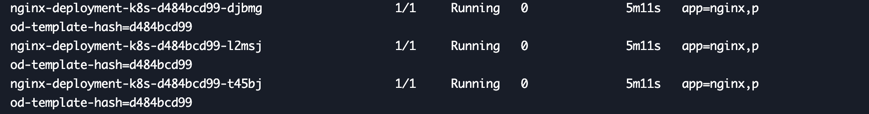

# deployments

它是一种资源控制器, 它可以为Pod 和 ReplicaSet 提供声明式的更新能力

具体做法就是,我们通过编排deployment的资源描述,而Deployment 控制器(Controller) 以受控速率更改实际的状态并使其变为期望状态 ..

通过定义Deployment 以创建新的ReplicaSet 或者删除现有的Deployment,并通过新的Deployment 收养其资源 ...

官方说,不需要管理Deployment所拥有的ReplicaSet ..

## 用例

### 创建一个Deployment
```yaml
apiVersion: apps/v1
kind: Deployment
metadata:
  # 指定了 deployment 资源的名称
  name: nginx-deployment
  labels:
    app: nginx
spec:
  # 创建了复制集 它指定了创建pod的副本
  replicas: 3
  # 选择器定义了 复制集 如何查找要管理的Pod
  # 可以有多个,也就是它查找多个需要管理的Pod, 但是很单一,因为这里的pod模版它本身 只有一个(虽然它可以定义一组label,但是很局限)
  # 估计 一般只会有一个 label(对于Pod模版的label 定义)
  selector:
    # 这里还隐含了一个兄弟元素 matchExpressions 它默认是空,则代表匹配所有 
    # k8s 会根据matchLabels 和 matchExpressions 所有条件满足才会满足匹配
    matchLabels:
      app: nginx
  # 它称为 pod模版
  template:
    metadata:
      # 给此pod 打上标签
      labels:
        app: nginx
    spec:
      containers:
      - name: nginx
        image: nginx:1.14.2
        ports:
        - containerPort: 80
```
通过`kubectl get deployments` 可以检查 Deployment 是否已经创建,如果仍然在创建Deployment,则输出类似于
容器正在创建中 .. 以及 Ready 还没有准备好 ..

由于我们指定了副本集,那么这里会存在3个 ..

#### 查看 deployment 创建的副本集(ReplicaSet - rs)
运行
```shell
kubectl get rs
```
拿到创建的复制集 .. 会得到复制集的相关信息 ..

注意到复制集的名称为 `[Deployment 名称]-[哈希]`,该名称将成为所创建的Pod的命名基础 .. 其中哈希字符串与副本集的`pod-template-hash` 标签一致 ..

我们可以查看每一个Pod自动生成的标签,通过执行命令查看他们的标签
```shell
kubectl get pods --show-labels
```
将展示如下结果


你能够发现 pod的命名也是基于这个副本集的名称来命名依据的 ...

在前面我们说过 副本集使用的 选择器可以选择多个标签,但是它只能选择当前工作负载资源的Pod模版中定义的标签,选择器和Pod模版标签不应该与其他的控制器(
包括其他的Deployment  / StatefulSet重叠),K8s不会阻止我们这样做,但是如果多个控制器具有重叠的选择算符,那么可能会发生冲突执行难以预料的操作 ..

也就是说,我们需要为Deployment工作负载资源定义合适的 选择算符 和 Pod模版标签 ...

且就算是部署同一种应用程序 不同Deployment之间应该使用相对独立的标签或者选择符 .. 不要引起歧义 ..

> 注意:
> Pod-template-hash 标签
> 这个标签不应该被更改,Deployment 控制器将 `pod-template-hash` 标签添加到Deployment 所创建或者收留的每一个ReplicaSet ..
> 此标签可确保Deployment的ReplicaSets 不会重叠 .. 标签是通过对ReplicaSet的`PodTemplate` 进行hash 处理,所生成的hash值将会
> 添加到ReplicaSet 选择算符,Pod模版标签,并且存在于ReplicaSet可能拥有的任何现有的Pod中 ..
> 
> 在前面的示例中,你应该已经发现,对应的Pod都具有这个hash值(也就是 pod-template-hash)
> 这样才能够独一无二的选择需要管理的Pod ...


### 更新Deployment

仅当Deployment Pod模版(既`.spec.template`) 发生改变时,例如模版的标签或容器镜像被更新的时候,才会触发Deployment 上线,其他的更新(如对Deployment执行
扩缩容的操作)不会触发上线动作 ..

也就是说对于deployment的复制集更改是不会影响deployment的上线 ..

首先我们先执行命令更新Deployment

先来更新 nginx Pod 以使用 nginx:1.16.1 镜像，而不是 nginx:1.14.2 镜像。
```shell
kubectl set image deployment.v1.apps/nginx-deployment nginx=nginx:1.16.1
```
这里命令中的 deployment的名称, 以及镜像的名称需要注意 ..

或者使用下面的命令,上面的命令中,指定了版本号 ...
```shell
kubectl set image deployment/nginx-deployment nginx=nginx:1.16.1
```
或者对Deployment 执行`edit` 操作 将容器镜像修改为 1.16.1
```shell
kubectl edit deployment/nginx-deployment
```

请注意deployment 部署名称 以及  镜像名称

当我们上线Deployment之后,可以通过命令
```shell
kubectl rollout status deployment/nginx-deployment
```
来查看 上线状态

针对不同时间它存在不同的提示信息
```text
waiting for rollout to finish: 2 out of 3 new replicas have been updated...
```
或者
```text
deployment "nginx-deployment" successfully rolled out
```
或者查看已经更新的Deployment的更多信息:
- 在上线成功之后,我们可以通过执行
```shell
kubectl get deployments
```
来查看部署成功的Deployment ..
- 运行 
```shell
kubectl get rs
```
以查看Deployment 通过创建的新的ReplicaSet(扩容到三个副本)并将旧的ReplicaSet 缩容到0个副本完成了对Pod的更新操作 ..
```shell
kubectl get rs
```
结果如下:
```shell
NAME                          DESIRED   CURRENT   READY   AGE
nginx-deployment-1564180365   3         3         3       6s
nginx-deployment-2035384211   0         0         0       36s
```

由于缩放为0,那么现在执行
```shell
kubectl get pods
```
将只展示新的Pod ...

现在Deployment 还能够确保在更新的时候仅关闭一定数量的Pod,保证应用平滑上线,而不中断服务 ..
默认情况下它确保至少所需Pod的75%处于运行状态(最大不可用比例为25%)

并且Deployment 还确保所创建的Pod数量只比期望的Pod数高一点点,默认情况下,它确保启动的Pod个数比期望的个数高出125%(也就是高出25%)

当然可以这个值可以合理的设置,因为 它能够平稳过度应用的启动 ... 而不会出现应用异常的情况 ...
因为太低或者太高都会影响应用的启动速度 以及响应速度 ..(以及对集群影响) ..

也就是说上述的Deployment,将首先看到它创建了一个新的Pod,然后删除旧的Pod,并创建了新的Pod,并且直到有了足够数量的Pod出现以后 ..

确保至少有3个Pod可用,同时最多能够容忍4个Pod可用,当设置Deployment的副本数为4的时候,Pod个数在过程中会存在 3-5个变化 ..

我们能够查看部署的详细信息
```shell
kubectl describe deployments
```
显示结果如下
```text
Name:                   nginx-deployment
Namespace:              default
CreationTimestamp:      Thu, 30 Nov 2017 10:56:25 +0000
Labels:                 app=nginx
Annotations:            deployment.kubernetes.io/revision=2
Selector:               app=nginx
Replicas:               3 desired | 3 updated | 3 total | 3 available | 0 unavailable
StrategyType:           RollingUpdate
MinReadySeconds:        0
RollingUpdateStrategy:  25% max unavailable, 25% max surge
Pod Template:
  Labels:  app=nginx
   Containers:
    nginx:
      Image:        nginx:1.16.1
      Port:         80/TCP
      Environment:  <none>
      Mounts:       <none>
    Volumes:        <none>
  Conditions:
    Type           Status  Reason
    ----           ------  ------
    Available      True    MinimumReplicasAvailable
    Progressing    True    NewReplicaSetAvailable
  OldReplicaSets:  <none>
  NewReplicaSet:   nginx-deployment-1564180365 (3/3 replicas created)
  Events:
    Type    Reason             Age   From                   Message
    ----    ------             ----  ----                   -------
    Normal  ScalingReplicaSet  2m    deployment-controller  Scaled up replica set nginx-deployment-2035384211 to 3
    Normal  ScalingReplicaSet  24s   deployment-controller  Scaled up replica set nginx-deployment-1564180365 to 1
    Normal  ScalingReplicaSet  22s   deployment-controller  Scaled down replica set nginx-deployment-2035384211 to 2
    Normal  ScalingReplicaSet  22s   deployment-controller  Scaled up replica set nginx-deployment-1564180365 to 2
    Normal  ScalingReplicaSet  19s   deployment-controller  Scaled down replica set nginx-deployment-2035384211 to 1
    Normal  ScalingReplicaSet  19s   deployment-controller  Scaled up replica set nginx-deployment-1564180365 to 3
    Normal  ScalingReplicaSet  14s   deployment-controller  Scaled down replica set nginx-deployment-2035384211 to 0
```
能够看到的是,刚开始直接缩放到3个副本,然后由于最大容忍的Pod个数是125%,那么就是4个,所以缩放新的deployment为 1个Pod,
接着由于已经满足最大运行Pod条件,所以继续缩放原始副本到2个,因为,最小故障节点是25%,也就是最少需要运行的Pod节点数必须是3个,
所以只缩放了一个Pod,然后依次循环,将新副本集缩放+1,然后将旧的副本集缩放减一,最后的结果就是新的副本集缩放为 3个,旧的副本集缩放为 0个 ..

> kubernetes 在计算availableReplicas数值的时候,不考虑终止过程中的Pod,availableReplicas的值一定介于 replicas-maxUnavailable 和 
> replicas + maxSurge之间 ..
> 所以在上线期间能够看到Pod比预期的多,Deployment所消耗的总的资源也大于replicas+maxSurge 个Pod所用的资源,直到被终止的Pod所设置的terminationGracePeriodSeconds
> 到期为止 ...
> 这是针对两个副本集总和所描述的 ..


### 翻转(多个Deployment 动态更新)
Deployment控制器每次注意到新的Deployment的时候,都会创建一个副本集以启动所需的Pod,如果更新了Deployment,则新的副本集将缩放为`.spec.replica`个副本 ..
所有旧的ReplicaSets 缩放为0个副本 ..

当Deployment正在上线时被更新,那么Deployment将会针对更新创建一个新的ReplicaSet 并开始对其扩容,之前正在被扩容的ReplicaSet将会被翻转 .. 添加到旧的ReplicaSets列表中
并实现缩容 .

例如,假设你正在创建一个Deployment 以生成`nginx:1.14.2` 的5个副本,但是接下来更新Deployment以创建5个`nginx:1.16.1` 副本,此时只有3个`nginx:1.14.2` 副本已经创建,那么
这种情况下,Deployment将会立即将这三个Pod加入旧的Deployment 副本集中进行杀死,并创建一个新的副本集创建`nginx:1.16.1` Pod,
也就是说Deployment 最终都会创建副本集来启动Pod,不管你有没有设置 ..

### 更改标签选择算符
通常不建议更新选择算符,建议提前规划好选择算符,在任何情况下,如果需要更新标签选择算符,需要额外小心,确保了解这背后可能发生的事情 ..
> 在API版本`app/v1` 中,Deployment标签选择算符在创建之后不可变 ..

- 添加选择算符要求使用新的标签更新Deployment规约中的Pod模版标签,否则将返回验证错误 .. \
    此更改是非重叠的,也就是说新的选择算符将不会使用旧选择算符所创建的副本集以及Pod,这将导致创建新的ReplicaSet时所有旧的副本集将会被孤立 ..
- 选择算符的更新如果更改了某个算符的键名,这将导致与添加算符时产生相同效果 .. \
  删除选择算符的操作将会从Deployment选择算符中删除现有算符,此操作不需要修改Pod模版标签,现有的ReplicaSet不会被孤立,也不会因此创建新的ReplicaSet,
  但是删除的标签仍然存在于现有的Pod和ReplicaSet ..

根据这三条我应该可以理解出 选择算符的更新等价于删除(旧的选择算符将不会影响Deployment的相关内容,查看第三条)

### 回滚Deployment
有时候,你可能想要回滚Deployment,例如,当它不稳定的时候(反复进入崩溃状态). 默认情况下,Deployment的所有上线记录都存在于系统中 ..
以便可以随时回滚(你可以更通过修改修订历史记录限制来更改这一约束)
> 当Deployment 触发上线的时候,系统会创建Deployment的新的修订版本 .. 这意味着仅当Deployment的Pod模版(`.spec.template`) 发生更改时,才会创建新的修订版本 。。
> 例如 标签或者容器镜像发生变化 .. 其他更新,如果Deployment的扩缩容操作不会创建Deployment修订版本.. 这是为了方便同时执行手动缩放或者自动缩放 ...
> 换言之,当你回滚到较早的修订版本时,只有Deployment的Pod模版部分会回滚 ..

也就是说永远有效的部分就是`spec.template` 发生变化才会进行修订版本的产生 ..

- 假设我们正在更新Deployment 犯了一个拼写错误,将镜像名称命名设置为`nginx:1.161` 而不是 `nginx:1.16.1`

```shell
kubectl set image deployment/nginx-deployment nginx=nginx:1.161
```
现在输出
```text
deployment.apps/nginx-deployment image updated
```
此上线进程会停滞,你可以通过检查上线状态来验证
```shell
kubectl rollout status deployment/nginx-deployment
```
然后通过ctrl + c 停止上线状态观测 ..[详细信息是](https://kubernetes.io/zh-cn/docs/concepts/workloads/controllers/deployment/#deployment-status)

由于平滑升级的策略,不会导致所有的pod 停止运行,所以你能够看到:

    你可以看到旧的副本有两个（nginx-deployment-1564180365 和 nginx-deployment-2035384211）， 新的副本有 1 个（nginx-deployment-3066724191）：

通过查看副本集:
```shell
kubectl get rs
```
输出类似于:
```text
NAME                          DESIRED   CURRENT   READY   AGE
nginx-deployment-1564180365   3         3         3       25s
nginx-deployment-2035384211   0         0         0       36s
nginx-deployment-3066724191   1         1         0       6s
```
查看所创建的Pod,你能够注意到新的副本集所创建的1个Pod卡顿在镜像拉取循环中 ..

其中,nginx-deployment-1564180365 和  nginx-deployment-2035384211 表示旧的副本集...
新的 副本集是  nginx-deployment-3066724191 ..
```shell
kubectl get pods
```
输出如下:
```text
NAME                                READY     STATUS             RESTARTS   AGE
nginx-deployment-1564180365-70iae   1/1       Running            0          25s
nginx-deployment-1564180365-jbqqo   1/1       Running            0          25s
nginx-deployment-1564180365-hysrc   1/1       Running            0          25s
nginx-deployment-3066724191-08mng   0/1       ImagePullBackOff   0          6s
```
> Deployment 控制器自动停止有问题的上线过程,并停止对新的ReplicaSet扩容,这行为取决于所指定的rollingUpdate 参数(具体为maxUnavailable),
> 默认情况下,此k8s将此值设定为25% .. (当达到这个条件之后,就会停止更新 ...) - 直到pod的优雅停止中断时间完成 ..

同样也可以再次获取Deployment 描述信息来查看:
```shell
kubectl describe deployment
```
结果如下
```text
Name:           nginx-deployment
Namespace:      default
CreationTimestamp:  Tue, 15 Mar 2016 14:48:04 -0700
Labels:         app=nginx
Selector:       app=nginx
Replicas:       3 desired | 1 updated | 4 total | 3 available | 1 unavailable
StrategyType:       RollingUpdate
MinReadySeconds:    0
RollingUpdateStrategy:  25% max unavailable, 25% max surge
Pod Template:
  Labels:  app=nginx
  Containers:
   nginx:
    Image:        nginx:1.161
    Port:         80/TCP
    Host Port:    0/TCP
    Environment:  <none>
    Mounts:       <none>
  Volumes:        <none>
Conditions:
  Type           Status  Reason
  ----           ------  ------
  Available      True    MinimumReplicasAvailable
  Progressing    True    ReplicaSetUpdated
OldReplicaSets:     nginx-deployment-1564180365 (3/3 replicas created)
NewReplicaSet:      nginx-deployment-3066724191 (1/1 replicas created)
Events:
  FirstSeen LastSeen    Count   From                    SubObjectPath   Type        Reason              Message
  --------- --------    -----   ----                    -------------   --------    ------              -------
  1m        1m          1       {deployment-controller }                Normal      ScalingReplicaSet   Scaled up replica set nginx-deployment-2035384211 to 3
  22s       22s         1       {deployment-controller }                Normal      ScalingReplicaSet   Scaled up replica set nginx-deployment-1564180365 to 1
  22s       22s         1       {deployment-controller }                Normal      ScalingReplicaSet   Scaled down replica set nginx-deployment-2035384211 to 2
  22s       22s         1       {deployment-controller }                Normal      ScalingReplicaSet   Scaled up replica set nginx-deployment-1564180365 to 2
  21s       21s         1       {deployment-controller }                Normal      ScalingReplicaSet   Scaled down replica set nginx-deployment-2035384211 to 1
  21s       21s         1       {deployment-controller }                Normal      ScalingReplicaSet   Scaled up replica set nginx-deployment-1564180365 to 3
  13s       13s         1       {deployment-controller }                Normal      ScalingReplicaSet   Scaled down replica set nginx-deployment-2035384211 to 0
  13s       13s         1       {deployment-controller }                Normal 
```
可以看到当前新的副本集缩放到1个,但是上线停止了 ... 解决此问题,需要回滚到以前稳定的Deployment 版本 ..

### 检查Deployment 上线历史
按照如下步骤检查回滚历史:
1. 首先,检查Deployment 修订历史
```shell
kubectl rollout history deployment/nginx-deployment
```
输出类似于
```text
deployments "nginx-deployment"
REVISION    CHANGE-CAUSE
1           kubectl apply --filename=https://k8s.io/examples/controllers/nginx-deployment.yaml
2           kubectl set image deployment/nginx-deployment nginx=nginx:1.16.1
3           kubectl set image deployment/nginx-deployment nginx=nginx:1.161
```
`CHANGE-CAUSE`的内容是从Deployment的`kubernetes.io/change-cause` 注解复制过来的 .. 复制动作发生在修订版本创建时 ..
你可以通过以下的方式设置`CHANGE-CAUSE` 消息:
- 通过以下命令修改注释
```shell
kubectl annotate deployment/nginx-deployment kubernetes.io/change-cause="image updated to 1.16.1"
```
为Deployment添加注释 ..

可以想象,`kubernetes.io/change-cause` 注解默认应该是自动生成的 ...

- 查看 修订历史的详细信息
```shell
kubevctl rollout history deployment/nginx-deployment --revision=2
```
```text
deployments "nginx-deployment" revision 2
  Labels:       app=nginx
          pod-template-hash=1159050644
  Annotations:  kubernetes.io/change-cause=kubectl set image deployment/nginx-deployment nginx=nginx:1.16.1
  Containers:
   nginx:
    Image:      nginx:1.16.1
    Port:       80/TCP
     QoS Tier:
        cpu:      BestEffort
        memory:   BestEffort
    Environment Variables:      <none>
```
- 回滚到之前的修订版本
根据上线历史情况,可以查看到存在的版本,可以进行回滚

撤销到上一个版本
```shell
kubectl rollout undo deployment/nginx-deployment
```
则能够回滚到上一个版本

- 回滚到指定修订版本
```shell
kubectl rollout undo deployment/nginx-deployment --to-revision=2
```
我们能够查看deployment 是否如此的生成了回滚到指定版本,运行命令
```shell
kubectl get deployment nginx-deployment
```
输出类似于
```text
NAME               READY   UP-TO-DATE   AVAILABLE   AGE
nginx-deployment   3/3     3            3           30m
```
然后尝试获取部署的详细信息
```shell
kubectl describle deployment nginx-deployment
```

- 开始缩放deployment
```shell
kubectl scale deployment/nginx-deployment --replicas=10
```
输出类似于
```text
deployment.apps/nginx-deployment scaled
```

假设集群启用了[Pod的水平自动缩放](https://kubernetes.io/zh-cn/docs/tasks/run-application/horizontal-pod-autoscale-walkthrough/),你可以为`Deployment 设置自动缩放器`.

通过为Deployment 设置自动缩放器,并基于现有的Pod的cpu利用率选择要运行的Pod的个数上下限 ..
```shell
kubectl autoscale deployment/nginx-deployment --min=10 --max=15 --cpu-percent=80
```

### 比例缩放
rollingUpdate的Deployment 支持同时运行应用程序的多个版本,当自动缩放器缩放处于上线进程(仍在进行中或者暂停)中的RollingUpdate Deployment时,
Deployment 控制器会平衡现有的活跃状态的ReplicaSets(含有Pod的ReplicaSets)中的额外副本,以降低风险 ..

这成为比例缩放(proportional scaling).

假设,我有一个运行了10个副本的Deployment,其中maxSurge = 3,maxUnavailable = 2
- 确保Deployment的这 10个副本都在运行
```shell
kubectl get deploy
```
能够发现这是没有问题的 ..
- 更新Deployment 使用新的镜像,碰巧该镜像无法从集群内部解析
```shell
kubectl set image deployment/nginx-deployment nginx=nginx:sometag
```
这会更新成功,但是由于错误镜像,导致新的副本集上线导致阻塞 . 检查上线状态(因为maxUnavailable要求) 
```shell
kubectl get rs
```
输出可以发现类似于
```shell
NAME                          DESIRED   CURRENT   READY     AGE
nginx-deployment-1989198191   5         5         0         9s
nginx-deployment-618515232    8         8         8         1m
```
之所以有5个的原因就是,maxSurge 表示 突增最大3个,然后集群副本集最大不可用可以有2个,这样就有了5个,然后原来的副本集就少了两个 ..

根据前面的定义,复制集的Pod可用范围总是在 replicaSet - maxUnavailable  ----- replicaSet + maxSurge之间

能够发现上图中,可用Pod的范围是 8 -> 13(注意: Ready = 0,新副本集)

- 然后当出现新的Deployment的扩展需求的时候,自动缩放器将Deployment 副本增加到15 ..

    此时Deployment 控制器需要决定在何处增加5个新的副本,如果未使用比例缩放,所有5个副本都将加入的新的ReplicaSet中..
    使用比例缩放,可以将额外的副本分不到所有ReplicaSet. 较大比例的副本(也就是说大多数的副本)都会添加到拥有最多副本的ReplicaSet. 而较低比例的副本
  (也就是较小部分的副本)将进入副本较少的ReplicaSet. 所有剩下的副本都会添加到副本最多的ReplicaSet.(都分配完了,还有剩下的???) 具有零个副本的ReplicaSets不会被扩容 ..


在上面的示例中,3个副本添加到了旧的ReplicaSet,剩下的2个副本添加到新的ReplicaSet. 假定新的副本都很健康,上线过程最终应将所有的副本迁移到新的ReplicaSet中
```shell
kubectl get deployment
```
结果类似于
```text
NAME                 DESIRED   CURRENT   UP-TO-DATE   AVAILABLE   AGE
nginx-deployment     15        18        7            8           7m
```
上线状态确认了副本是如何添加到每一个ReplicaSet的
```shell
kubectl describle deployment
```

当然我们可以查看最终副本集,发现输出如下
```text
NAME                          DESIRED   CURRENT   READY     AGE
nginx-deployment-1989198191   7         7         0         7m
nginx-deployment-618515232    11        11        11        7m
```

这里应该只是上线过程的一部分,应该会有一部分状态是:
```text
NAME                          DESIRED   CURRENT   READY     AGE
nginx-deployment-1989198191   7         7         2         7m
nginx-deployment-618515232    11        11        11        7m
```
一直到15个副本全部READY ...

### 暂停、恢复Deployment的上线过程
当我们更新一个Deployment的时候,或者计划更新它的时候,我们可以出发一个或者多个更新之前暂停的Deployment的上线过程 .
当准备好应用这些变更的时候,可以恢复Deployment的上线过程,这样能够在暂停和恢复之间应用多个修补程序,而不会触发不必要的上线操作(
也就是比拟为批量执行)
- 例如,对于刚刚创建的Deployment

我们尝试获取Deployment 信息
```shell
kubectl get deploy
```
获取它的上线状态
```shell
kubectl get rs
```
我们可以使用上线暂停指令
```shell
kubectl rollout pause deployment/nginx-deployment
```
输出如下:
```text
deployment.apps/nginx-deployment paused
```

我们可以执行一系列操作,例如更新Deployment 镜像
```shell
kubectl set image deployment/nginx-deployment nginx=nginx:1.16.1
```
输出类似于:
```text
deployment.apps/nginx-deployment image updated
```
此时,由于我们暂停了上线过程,则不会有新的上线触发,你可以通过查看历史记录来确认
```shell
kubectl rollout history deployment/nginx-deployment
```
输出类似于:
```text
deployments "nginx"
REVISION  CHANGE-CAUSE
1   <none>
```
一旦发生了上线更新，则CHANGE-CAUSE 会有变化
- 获取上线状态验证现有的ReplicaSet 没有被更改
```shell
kubectl get rs
```
输出类似于:
```text
NAME               DESIRED   CURRENT   READY     AGE
nginx-2142116321   3         3         3         2m
```

现在我们还可以做一些复杂的更新操作
```shell
kubectl set resources deployment/nginx-deployment -c=nginx --limits=cpu=200m,memory=512Mi
```
最终我们可以恢复Deployment上线并观察新的ReplicaSet的创建过程,其中包含了所应用的所有更新:
```shell
kubectl rollout resume deployment/nginx-deployment
```
类似的输出
```text
deployment.apps/nginx-deployment resumed
```
观察上线状态直到完成
```shell
kubectl get rs -w
```
观察结果:
```text
NAME               DESIRED   CURRENT   READY     AGE
nginx-2142116321   2         2         2         2m
nginx-3926361531   2         2         0         6s
nginx-3926361531   2         2         1         18s
nginx-2142116321   1         2         2         2m
nginx-2142116321   1         2         2         2m
nginx-3926361531   3         2         1         18s
nginx-3926361531   3         2         1         18s
nginx-2142116321   1         1         1         2m
nginx-3926361531   3         3         1         18s
nginx-3926361531   3         3         2         19s
nginx-2142116321   0         1         1         2m
nginx-2142116321   0         1         1         2m
nginx-2142116321   0         0         0         2m
nginx-3926361531   3         3         3         20s
```
能够看到Deployment 的副本集正在进行调整 ..


最终可以再次检查上线状态
```shell
kubectl get rs
```
结果是
```text
NAME               DESIRED   CURRENT   READY     AGE
nginx-2142116321   0         0         0         2m
nginx-3926361531   3         3         3         28s
```

> 说明：
> 你不可以回滚处于暂停状态的 Deployment，除非先恢复其执行状态。


### Deployment 状态
deployment 在生命周期中可能会存在很多状态,上线新的ReplicaSet期间 将处于Progressing(进行状态),可能是Complete(已完成),
也可能是Failed(失败) 以至于无法继续进行 ...

#### 进行中的Deployment
进行下面的任务期间,Kubernetes 标记Deployment为进行中(Progressing)_:
- Deployment 创建新的副本集
- Deployment 正在为其最新的副本集扩容
- Deployment 正在为其旧有的副本集缩容
- 新的Pod已经就绪或者可用(就绪至少持续了MinReadSeconds 秒)

当进入"progressing" 状态时,Deployment控制器会向Deployment的`.status.conditions` 中添加包含下面属性的状况条目:
- type: Progressing
- status: "True"
- reason: NewReplicaSetCreated | reason: FoundNewReplicaSet | reason: ReplicaSetUpdated

你可以使用以下命令监视Deployment的进度
```shell
kubectl rollout status
```

#### 完成的Deployment
当deployment 具有以下的特征时,则标记为"完成"
- Deployment关联的所有副本都已经更新到指定的最新版本,这意味着之前的请求的所有更新都已经完成 ...
- 与Deployment关联的所有副本都可用
- 未运行的Deployment的旧副本

当上线过程中进入"Complete"状态时,Deployment控制器会向Deployment的`.status.conditions` 中添加包含下面属性的状况条目
- type: Progressing
- status: `True`
- reason: NewReplicaSetAvailable

这一个`Progressing` 状况的状态值将会一直持续为`True`, 直到新的上线动作被处罚,即使副本的可用状态发生变化(进而影响Available状况),
`Progressing`状况的值也不会发生变化. 但是`Progressing` 状况的值也不会发生变化 ...

我们可以通过命令 检查Deployment是否已经完成, 如果上线成功完成,此命令返回退出代码为 0 ..
```shell
kubectl rollout status
```
例如:
```shell
kubectl rollout status deployment/nginx-deployment
```
输出类似于:
```text
Waiting for rollout to finish: 2 of 3 updated replicas are available...
deployment "nginx-deployment" successfully rolled out
```

当`kubectl rollout` 命令获得的返回状态为 0(表示成功):
```shell
echo $?
```
当命令执行失败的时候,返回值不可能是 0 ...

### 失败的Deployment
你的Deployment可能会在尝试部署其最新的ReplicaSet受挫, 一直处于未完成状态. 造成此情况的一些可能因素如下:
- 配额(Quota)不足
- 就绪探测(Readiness Probe)失败
- 镜像拉取错误
- 权限不足
- 限制范围(Limit Ranges)问题
- 应用程序运行时的配置错误(应用错误)

检查此状况的一种方式是在Deployment规约中指定截止的时间参数:
`.spec.progressDeadlineSeconds`  它会给出一个秒值,Deployment控制器在表示Deployment进展停滞之前,需要等待所给的时长 ..

此参数表示过程截止时间, 我们可以通过以下命令来设置规约中的`progressDeadlineSeconds` ,从而告知控制器在10分钟之后报告
Deployment的上线没有进展 ..
```shell
kubectl patch deployment/nginx-deployment -p '{"spec":{"progressDeadlineSeconds":600}}'
```
输出类似于,打补丁
```shell
deployment.apps/nginx-deployment patched
```
超过截止时间之后,Deployment控制器将添加具有以下属性的Deployment状况到Deployment的`.status.conditions`
- type: Progressing
- status: "False"
- reason: ProgressDeadlineExceeded

这个状况也可能会较早的失败,因而其状态值被设置为"False",其原因为`ReplicaSetCreateError`,一旦Deployment上线完成,则Deployment的
`.status.condtions` 将会更新为"True",上线成功 而不会考虑期限 ...

参考 [Kubernetes API Conventions](https://git.k8s.io/community/contributors/devel/sig-architecture/api-conventions.md#typical-status-properties) 获取更多状态状况相关的信息
> 说明:
> 除了报告 Reason = ProgressDeadlineExceeded之外,Kubernetes 对已经停止的Deployment 不执行任何操作, 更高级别的编排器可以利用这一点设计并相应的采取行动 ..
> 例如将Deployment 回滚到其以前的版本 ..

> 说明:
> 当你暂停了某个Deployment上线,Kubernetes 不再根据指定的截止时间检查Deployment的上线进展 .. 你可以在上线过程中安全的暂停Deployment 再恢复其执行,这样将不会导致其超出最后的时限问题 ..

Deployment 可能会出现瞬时性的错误,可能因为设置的超时时间过短,也可能因为其他可能认为是临时性的问题 ..
例如,假定所遇到的问题是配额不足,如果描述Deployment,你将注意到以下部分:
```shell
kubectl describe deployment nginx-deployment
```
输出类似于:
```text
<...>
Conditions:
  Type            Status  Reason
  ----            ------  ------
  Available       True    MinimumReplicasAvailable
  Progressing     True    ReplicaSetUpdated
  ReplicaFailure  True    FailedCreate
<...>
```
如果运行以下命令:
```shell
kubectl get deployment nginx-deployment -o yaml
```
Deployment状态输出类似于:
```text
 status:
  availableReplicas: 2
  conditions:
  - lastTransitionTime: 2016-10-04T12:25:39Z
    lastUpdateTime: 2016-10-04T12:25:39Z
    message: Replica set "nginx-deployment-4262182780" is progressing.
    reason: ReplicaSetUpdated
    status: "True"
    type: Progressing
  - lastTransitionTime: 2016-10-04T12:25:42Z
    lastUpdateTime: 2016-10-04T12:25:42Z
    message: Deployment has minimum availability.
    reason: MinimumReplicasAvailable
    status: "True"
    type: Available
  - lastTransitionTime: 2016-10-04T12:25:39Z
    lastUpdateTime: 2016-10-04T12:25:39Z
    message: 'Error creating: pods "nginx-deployment-4262182780-" is forbidden: exceeded quota:
      object-counts, requested: pods=1, used: pods=3, limited: pods=2'
    reason: FailedCreate
    status: "True"
    type: ReplicaFailure
  observedGeneration: 3
  replicas: 2
  unavailableReplicas: 2
```
最终,一旦超过Deployment进度期限,Kubernetes 将更新状态和进度状况的原因:
```text
Conditions:
  Type            Status  Reason
  ----            ------  ------
  Available       True    MinimumReplicasAvailable
  Progressing     False   ProgressDeadlineExceeded
  ReplicaFailure  True    FailedCreate
```
可以通过缩容Deployment或者缩容其他运行状态的控制器,或者直接在命令空间中增加配额来解决配额不足的问题 ..
如果配额满足,Deployment控制器完成了Deployment的上线操作,Deployment状态会更新为成功状态(Status = True 以及 Reason = NewReplicaSetAvaiable)


