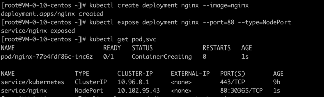

# kubeadm 集群安装基本流程

主要实现1主三从的k8s集群搭建 ..
## 1. 前置条件

1. 2核2G的服务器即可 \
1台做master,2台做node节点

2. 开始安装必要工具

### 2. 必要工具安装
#### 2.1 配置仓库的镜像地址
##### 2.1.1 k8s 仓库地址
配置为aliyun的k8s仓库地址
```shell
cat <<EOF > /etc/yum.repos.d/kubernetes.repo
[kubernetes]
name=Kubernetes
baseurl=http://mirrors.aliyun.com/kubernetes/yum/repos/kubernetes-el7-x86_64
enabled=1
gpgcheck=0
repo_gpgcheck=0
gpgkey=http://mirrors.aliyun.com/kubernetes/yum/doc/yum-key.gpg
 http://mirrors.aliyun.com/kubernetes/yum/doc/rpm-package-key.gpg
EOF
```

##### 2.1.2 配置docker的镜像仓库地址
这里我们使用containerd作为容器运行时,所以根据containerd的官方指南发现,centos可能需要基于包管理器安装,具体查看[官方指南](https://github.com/containerd/containerd/blob/main/docs/getting-started.md)

写入 /etc/yum.repos.d/docker-ce.repo
```shell
[docker-ce-stable]
name=Docker CE Stable - $basearch
baseurl=https://mirrors.aliyun.com/docker-ce/linux/centos/7/$basearch/stable
enabled=1
gpgcheck=1
gpgkey=https://mirrors.aliyun.com/docker-ce/linux/centos/gpg

[docker-ce-stable-debuginfo]
name=Docker CE Stable - Debuginfo $basearch
baseurl=https://mirrors.aliyun.com/docker-ce/linux/centos/7/debug-$basearch/stable
enabled=0
gpgcheck=1
gpgkey=https://mirrors.aliyun.com/docker-ce/linux/centos/gpg

[docker-ce-stable-source]
name=Docker CE Stable - Sources
baseurl=https://mirrors.aliyun.com/docker-ce/linux/centos/7/source/stable
enabled=0
gpgcheck=1
gpgkey=https://mirrors.aliyun.com/docker-ce/linux/centos/gpg

[docker-ce-edge]
name=Docker CE Edge - $basearch
baseurl=https://mirrors.aliyun.com/docker-ce/linux/centos/7/$basearch/edge
enabled=1
gpgcheck=1
gpgkey=https://mirrors.aliyun.com/docker-ce/linux/centos/gpg

[docker-ce-edge-debuginfo]
name=Docker CE Edge - Debuginfo $basearch
baseurl=https://mirrors.aliyun.com/docker-ce/linux/centos/7/debug-$basearch/edge
enabled=0
gpgcheck=1
gpgkey=https://mirrors.aliyun.com/docker-ce/linux/centos/gpg

[docker-ce-edge-source]
name=Docker CE Edge - Sources
baseurl=https://mirrors.aliyun.com/docker-ce/linux/centos/7/source/edge
enabled=0
gpgcheck=1
gpgkey=https://mirrors.aliyun.com/docker-ce/linux/centos/gpg

[docker-ce-test]
name=Docker CE Test - $basearch
baseurl=https://mirrors.aliyun.com/docker-ce/linux/centos/7/$basearch/test
enabled=0
gpgcheck=1
gpgkey=https://mirrors.aliyun.com/docker-ce/linux/centos/gpg

[docker-ce-test-debuginfo]
name=Docker CE Test - Debuginfo $basearch
baseurl=https://mirrors.aliyun.com/docker-ce/linux/centos/7/debug-$basearch/test
enabled=0
gpgcheck=1
gpgkey=https://mirrors.aliyun.com/docker-ce/linux/centos/gpg

[docker-ce-test-source]
name=Docker CE Test - Sources
baseurl=https://mirrors.aliyun.com/docker-ce/linux/centos/7/source/test
enabled=0
gpgcheck=1
gpgkey=https://mirrors.aliyun.com/docker-ce/linux/centos/gpg

[docker-ce-nightly]
name=Docker CE Nightly - $basearch
baseurl=https://mirrors.aliyun.com/docker-ce/linux/centos/7/$basearch/nightly
enabled=0
gpgcheck=1
gpgkey=https://mirrors.aliyun.com/docker-ce/linux/centos/gpg

[docker-ce-nightly-debuginfo]
name=Docker CE Nightly - Debuginfo $basearch
baseurl=https://mirrors.aliyun.com/docker-ce/linux/centos/7/debug-$basearch/nightly
enabled=0
gpgcheck=1
gpgkey=https://mirrors.aliyun.com/docker-ce/linux/centos/gpg

[docker-ce-nightly-source]
name=Docker CE Nightly - Sources
baseurl=https://mirrors.aliyun.com/docker-ce/linux/centos/7/source/nightly
enabled=0
gpgcheck=1
gpgkey=https://mirrors.aliyun.com/docker-ce/linux/centos/gpg
```

##### 2.1.3 其他可选安装
centos-base /etc/yum.repos.d/CentOS-Base.repo
```text
# CentOS-Base.repo
#
# The mirror system uses the connecting IP address of the client and the
# update status of each mirror to pick mirrors that are updated to and
# geographically close to the client.  You should use this for CentOS updates
# unless you are manually picking other mirrors.
#
# If the mirrorlist= does not work for you, as a fall back you can try the 
# remarked out baseurl= line instead.
#
 
[base]
name=CentOS-$releasever - Base - mirrors.aliyun.com
failovermethod=priority
baseurl=http://mirrors.aliyun.com/centos/$releasever/os/$basearch/
        http://mirrors.aliyuncs.com/centos/$releasever/os/$basearch/
        http://mirrors.cloud.aliyuncs.com/centos/$releasever/os/$basearch/
gpgcheck=1
gpgkey=http://mirrors.aliyun.com/centos/RPM-GPG-KEY-CentOS-7
 
#released updates 
[updates]
name=CentOS-$releasever - Updates - mirrors.aliyun.com
failovermethod=priority
baseurl=http://mirrors.aliyun.com/centos/$releasever/updates/$basearch/
        http://mirrors.aliyuncs.com/centos/$releasever/updates/$basearch/
        http://mirrors.cloud.aliyuncs.com/centos/$releasever/updates/$basearch/
gpgcheck=1
gpgkey=http://mirrors.aliyun.com/centos/RPM-GPG-KEY-CentOS-7
 
#additional packages that may be useful
[extras]
name=CentOS-$releasever - Extras - mirrors.aliyun.com
failovermethod=priority
baseurl=http://mirrors.aliyun.com/centos/$releasever/extras/$basearch/
        http://mirrors.aliyuncs.com/centos/$releasever/extras/$basearch/
        http://mirrors.cloud.aliyuncs.com/centos/$releasever/extras/$basearch/
gpgcheck=1
gpgkey=http://mirrors.aliyun.com/centos/RPM-GPG-KEY-CentOS-7
 
#additional packages that extend functionality of existing packages
[centosplus]
name=CentOS-$releasever - Plus - mirrors.aliyun.com
failovermethod=priority
baseurl=http://mirrors.aliyun.com/centos/$releasever/centosplus/$basearch/
        http://mirrors.aliyuncs.com/centos/$releasever/centosplus/$basearch/
        http://mirrors.cloud.aliyuncs.com/centos/$releasever/centosplus/$basearch/
gpgcheck=1
enabled=0
gpgkey=http://mirrors.aliyun.com/centos/RPM-GPG-KEY-CentOS-7
 
#contrib - packages by Centos Users
[contrib]
name=CentOS-$releasever - Contrib - mirrors.aliyun.com
failovermethod=priority
baseurl=http://mirrors.aliyun.com/centos/$releasever/contrib/$basearch/
        http://mirrors.aliyuncs.com/centos/$releasever/contrib/$basearch/
        http://mirrors.cloud.aliyuncs.com/centos/$releasever/contrib/$basearch/
gpgcheck=1
enabled=0
gpgkey=http://mirrors.aliyun.com/centos/RPM-GPG-KEY-CentOS-7
```
epel-7.repo /etc/yum.repos.d/epel-7.repo
```shell
[epel]
name=Extra Packages for Enterprise Linux 7 - $basearch
baseurl=http://mirrors.aliyun.com/epel/7/$basearch
failovermethod=priority
enabled=1
gpgcheck=0
gpgkey=file:///etc/pki/rpm-gpg/RPM-GPG-KEY-EPEL-7
 
[epel-debuginfo]
name=Extra Packages for Enterprise Linux 7 - $basearch - Debug
baseurl=http://mirrors.aliyun.com/epel/7/$basearch/debug
failovermethod=priority
enabled=0
gpgkey=file:///etc/pki/rpm-gpg/RPM-GPG-KEY-EPEL-7
gpgcheck=0
 
[epel-source]
name=Extra Packages for Enterprise Linux 7 - $basearch - Source
baseurl=http://mirrors.aliyun.com/epel/7/SRPMS
failovermethod=priority
enabled=0
gpgkey=file:///etc/pki/rpm-gpg/RPM-GPG-KEY-EPEL-7
gpgcheck=0
EOF
```

#### 2.2 安装容器运行时
##### 2.2.1 前置条件
```shell
cat <<EOF | sudo tee /etc/modules-load.d/k8s.conf
overlay
br_netfilter
EOF

sudo modprobe overlay
sudo modprobe br_netfilter

# 设置所需的 sysctl 参数，参数在重新启动后保持不变
cat <<EOF | sudo tee /etc/sysctl.d/k8s.conf
net.bridge.bridge-nf-call-iptables  = 1
net.bridge.bridge-nf-call-ip6tables = 1
net.ipv4.ip_forward                 = 1
EOF

# 应用 sysctl 参数而不重新启动
sudo sysctl --system
```
通过运行以下指令确认 br_netfilter 和 overlay 模块被加载：
```shell
lsmod | grep br_netfilter
lsmod | grep overlay
```
通过运行以下指令确认 net.bridge.bridge-nf-call-iptables、net.bridge.bridge-nf-call-ip6tables 和 net.ipv4.ip_forward 系统变量在你的 sysctl 配置中被设置为 1：
```shell
sysctl net.bridge.bridge-nf-call-iptables net.bridge.bridge-nf-call-ip6tables net.ipv4.ip_forward
```
这里有可能net.ipv4.ip_forward 可能还是0,那么找出/etc/sysctl.conf中的相同配置注释即可,因为这个文件是最后才加载的,合并策略导致为0(因为这个文件中的默认选项就是 0)
##### 2.2.2 容器运行时安装
前面已知,我们安装containerd作为容器运行时,首先调用list 命令,查看可以安装的containerd
```shell
yum list | grep containerd
```
这里我们安装最新版
```shell
sudo yum install containerd.io-1.6.20-3.1.el7 -y
```
安装好了之后,根据官方指南提示,还需要cni(也就是[网络插件](https://kubernetes.io/zh-cn/docs/concepts/cluster-administration/networking/#how-to-implement-the-kubernetes-networking-model))
但是，k8s不使用这个的网络插件 .. 所以可以不装 .. 装了crictl 执行命令不会报错 ..
```text
Download the cni-plugins-<OS>-<ARCH>-<VERSION>.tgz archive from https://github.com/containernetworking/plugins/releases , verify its sha256sum, and extract it under /opt/cni/bin:
```
执行命令,结果如下
```text
mkdir -p /opt/cni/bin
tar Cxzvf /opt/cni/bin cni-plugins-linux-amd64-v1.2.0.tgz
./
./macvlan
./static
./vlan
./portmap
./host-local
./vrf
./bridge
./tuning
./firewall
./host-device
./sbr
./loopback
./dhcp
./ptp
./ipvlan
./bandwidth
```
这样网络插件就安装好了 ..

然后开始,配置容器运行时containerd的相关配置... 先执行命令,将默认配置输出到配置文件中
```shell
containerd config default > /etc/containerd/config.toml
```
##### 2.2.3 配置systemd cgroup 驱动
配置 systemd cgroup 驱动

结合 runc 使用 systemd cgroup 驱动，在 /etc/containerd/config.toml 中设置：
```shell
[plugins."io.containerd.grpc.v1.cri".containerd.runtimes.runc]
  ...
  [plugins."io.containerd.grpc.v1.cri".containerd.runtimes.runc.options]
    SystemdCgroup = true
```
> 说明：
> 如果你从软件包（例如，RPM 或者 .deb）中安装 containerd，你可能会发现其中默认禁止了 CRI 集成插件。
> 你需要启用 CRI 支持才能在 Kubernetes 集群中使用 containerd。 要确保 cri 没有出现在 /etc/containerd/config.toml 文件中 disabled_plugins 列表内。如果你更改了这个文件，也请记得要重启 containerd。

这样还不够,我们还需要做一些事情
##### 2.2.4 配置沙箱镜像拉取
由于沙箱镜像使用外国的地址,我们需要修改为使用阿里云的容器拉取地址
```shell
[plugins."io.containerd.grpc.v1.cri"]
  sandbox_image = "registry.aliyuncs.com/google_containers/pause:3.9"
```

最后尝试刷新配置
```shell
systemctl daemon-reload
# 可选,如果没有对应的containerd.service 配置 ..
systemctl enable containerd
systemctl restart containerd
```

### 3. 开始安装kubeadm 以及kubelet 等工具
我们可以通过list 命令查看安装版本,我们这里使用k8s v1.27.0版本 ..
```shell
yum list kubeadm.x86_64  --showduplicates | sort -r
```
去查看可以安装的kubeadm 版本,然后执行安装
```shell

# 将 SELinux 设置为 permissive 模式（相当于将其禁用）
sudo setenforce 0
# 关闭swap 分区
sudo swapoff -a && sudo sed -i '/ swap / s/^/#/' /etc/fstab

sudo sed -i 's/^SELINUX=enforcing$/SELINUX=permissive/' /etc/selinux/config

sudo yum install -y kubelet kubeadm kubectl --disableexcludes=kubernetes

sudo systemctl enable --now kubelet
```
>注意:
> 通过运行命令 setenforce 0 和 sed ... 将 SELinux 设置为 permissive 模式可以有效地将其禁用。 这是允许容器访问主机文件系统所必需的，而这些操作是为了例如 Pod 网络工作正常。
> 你必须这么做，直到 kubelet 做出对 SELinux 的支持进行升级为止。
> 如果你知道如何配置 SELinux 则可以将其保持启用状态，但可能需要设定 kubeadm 不支持的部分配置
> 如果由于该 Red Hat 的发行版无法解析 basearch 导致获取 baseurl 失败，请将 \$basearch 替换为你计算机的架构。 输入 uname -m 以查看该值。 例如，x86_64 的 baseurl URL 可以是：https://packages.cloud.google.com/yum/repos/kubernetes-el7-x86_64。

kubelet 现在每隔几秒就会重启，因为它陷入了一个等待 kubeadm 指令的死循环。

#### 3.1  配置 kubeadm 配置,修改kubelet 配置(cgroup driver)
以下是可选的,kubeadm的配置修改有很多方式,详情查看[官网](https://kubernetes.io/zh-cn/docs/tasks/administer-cluster/kubeadm/configure-cgroup-driver/) 介绍的一种方式

/etc/systemd/system/kubelet.service.d/10-kubeadm.conf下面需要添加以下内容

修改和containerd 运行时使用相同的cgroup 驱动
```shell
Environment="KUBELET_CGROUP_ARGS=--cgroup-driver=systemd"
```
这一部分内容尚未找到对应的文档解释

重新使得 systemd 配置生效
```shell
sudo systemctl daemon-reload
#重启 kubelet 
sudo systemctl restart kubelet
```
或者你使用另一种最佳实践的方式
通过 pod-infra-container-image ,例如：
```shell
cat > /etc/sysconfig/kubelet << EOF
KUBELET_EXTRA_ARGS="--cgroup-driver=systemd --pod-infra-container-image=registry.cn-hangzhou.aliyuncs.com/google_containers/pause-amd64:3.1"
```
然后同样让systemd 配置生效 ..
> 注意:  我们还可以使用kubeadm的配置文件来初始化集群,以及配置 kubelet .. 详情查看[官网](https://kubernetes.io/zh-cn/docs/tasks/administer-cluster/kubeadm/configure-cgroup-driver/#%E9%85%8D%E7%BD%AE-kubelet-%E7%9A%84-cgroup-%E9%A9%B1%E5%8A%A8)

> 在你使用kubeadm 初始化集群之后,你能够看到kubelet的配置 
> Kubeadm 对集群所有的节点，使用相同的 KubeletConfiguration。 KubeletConfiguration 存放于 kube-system 命名空间下的某个 ConfigMap 对象中。
> 执行 init、join 和 upgrade 等子命令会促使 kubeadm 将 KubeletConfiguration 写入到文件 /var/lib/kubelet/config.yaml 中， 继而把它传递给本地节点的 kubelet。


#### 3.2 集群初始化
注意,假设你这里的apiserver-advertise-address 选项是api服务器启动所绑定的ip地址,如果你在一个机器上执行kubeadm初始化,但是给定了其他ip地址,这将导致
初始化失败,因为主节点,自动使用了一个etcd节点,它会连接api-server,然后api-server并没有在那个ip上,所以将会导致etcd节点启动失败,所以需要给定正确的主节点ip ..

// 后续探索具有软负载均衡的k8s集群 以及 etcd集群搭建 .. 目前使用单etcd节点和单个master节点 ..
```shell
sudo kubeadm init --apiserver-advertise-address=172.30.0.10  --image-repository registry.aliyuncs.com/google_containers  --kubernetes-version v1.27.0  --service-cidr=10.96.0.0/12  --pod-network-cidr=10.244.0.0/16
```
执行结果如下
```shell
kubeadm init --apiserver-advertise-address=172.30.0.8  --image-repository registry.aliyuncs.com/google_containers  --kubernetes-version v1.27.0  --service-cidr=10.96.0.0/12  --pod-network-cidr=10.244.0.0/16
[init] Using Kubernetes version: v1.27.0
[preflight] Running pre-flight checks
[preflight] Pulling images required for setting up a Kubernetes cluster
[preflight] This might take a minute or two, depending on the speed of your internet connection
[preflight] You can also perform this action in beforehand using 'kubeadm config images pull'
W0414 14:52:03.246873   11221 images.go:80] could not find officially supported version of etcd for Kubernetes v1.27.0, falling back to the nearest etcd version (3.5.7-0)
W0414 14:52:03.348973   11221 checks.go:835] detected that the sandbox image "registry.cn-hangzhou.aliyuncs.com/google_containers/pause:3.6" of the container runtime is inconsistent with that used by kubeadm. It is recommended that using "registry.aliyuncs.com/google_containers/pause:3.9" as the CRI sandbox image.
[certs] Using certificateDir folder "/etc/kubernetes/pki"
[certs] Generating "ca" certificate and key
[certs] Generating "apiserver" certificate and key
[certs] apiserver serving cert is signed for DNS names [kubernetes kubernetes.default kubernetes.default.svc kubernetes.default.svc.cluster.local vm-0-8-centos] and IPs [10.96.0.1 172.30.0.8]
[certs] Generating "apiserver-kubelet-client" certificate and key
[certs] Generating "front-proxy-ca" certificate and key
[certs] Generating "front-proxy-client" certificate and key
[certs] Generating "etcd/ca" certificate and key
[certs] Generating "etcd/server" certificate and key
[certs] etcd/server serving cert is signed for DNS names [localhost vm-0-8-centos] and IPs [172.30.0.8 127.0.0.1 ::1]
[certs] Generating "etcd/peer" certificate and key
[certs] etcd/peer serving cert is signed for DNS names [localhost vm-0-8-centos] and IPs [172.30.0.8 127.0.0.1 ::1]
[certs] Generating "etcd/healthcheck-client" certificate and key
[certs] Generating "apiserver-etcd-client" certificate and key
[certs] Generating "sa" key and public key
[kubeconfig] Using kubeconfig folder "/etc/kubernetes"
[kubeconfig] Writing "admin.conf" kubeconfig file
[kubeconfig] Writing "kubelet.conf" kubeconfig file
[kubeconfig] Writing "controller-manager.conf" kubeconfig file
[kubeconfig] Writing "scheduler.conf" kubeconfig file
[kubelet-start] Writing kubelet environment file with flags to file "/var/lib/kubelet/kubeadm-flags.env"
[kubelet-start] Writing kubelet configuration to file "/var/lib/kubelet/config.yaml"
[kubelet-start] Starting the kubelet
[control-plane] Using manifest folder "/etc/kubernetes/manifests"
[control-plane] Creating static Pod manifest for "kube-apiserver"
[control-plane] Creating static Pod manifest for "kube-controller-manager"
[control-plane] Creating static Pod manifest for "kube-scheduler"
[etcd] Creating static Pod manifest for local etcd in "/etc/kubernetes/manifests"
W0414 14:52:05.701534   11221 images.go:80] could not find officially supported version of etcd for Kubernetes v1.27.0, falling back to the nearest etcd version (3.5.7-0)
[wait-control-plane] Waiting for the kubelet to boot up the control plane as static Pods from directory "/etc/kubernetes/manifests". This can take up to 4m0s
[apiclient] All control plane components are healthy after 5.502659 seconds
[upload-config] Storing the configuration used in ConfigMap "kubeadm-config" in the "kube-system" Namespace
[kubelet] Creating a ConfigMap "kubelet-config" in namespace kube-system with the configuration for the kubelets in the cluster
[upload-certs] Skipping phase. Please see --upload-certs
[mark-control-plane] Marking the node vm-0-8-centos as control-plane by adding the labels: [node-role.kubernetes.io/control-plane node.kubernetes.io/exclude-from-external-load-balancers]
[mark-control-plane] Marking the node vm-0-8-centos as control-plane by adding the taints [node-role.kubernetes.io/control-plane:NoSchedule]
[bootstrap-token] Using token: em3mb9.44sh04b1w85ij325
[bootstrap-token] Configuring bootstrap tokens, cluster-info ConfigMap, RBAC Roles
[bootstrap-token] Configured RBAC rules to allow Node Bootstrap tokens to get nodes
[bootstrap-token] Configured RBAC rules to allow Node Bootstrap tokens to post CSRs in order for nodes to get long term certificate credentials
[bootstrap-token] Configured RBAC rules to allow the csrapprover controller automatically approve CSRs from a Node Bootstrap Token
[bootstrap-token] Configured RBAC rules to allow certificate rotation for all node client certificates in the cluster
[bootstrap-token] Creating the "cluster-info" ConfigMap in the "kube-public" namespace
[kubelet-finalize] Updating "/etc/kubernetes/kubelet.conf" to point to a rotatable kubelet client certificate and key
[addons] Applied essential addon: CoreDNS
[addons] Applied essential addon: kube-proxy

Your Kubernetes control-plane has initialized successfully!

To start using your cluster, you need to run the following as a regular user:

  mkdir -p $HOME/.kube
  sudo cp -i /etc/kubernetes/admin.conf $HOME/.kube/config
  sudo chown $(id -u):$(id -g) $HOME/.kube/config

Alternatively, if you are the root user, you can run:

  export KUBECONFIG=/etc/kubernetes/admin.conf

You should now deploy a pod network to the cluster.
Run "kubectl apply -f [podnetwork].yaml" with one of the options listed at:
  https://kubernetes.io/docs/concepts/cluster-administration/addons/

Then you can join any number of worker nodes by running the following on each as root:

kubeadm join 172.30.0.8:6443 --token em3mb9.44sh04b1w85ij325 \
	--discovery-token-ca-cert-hash sha256:2f2548f24d217862b15b438a548d8ba98f58e5713e40ec9e4863bb09ecaea516
```
请注意,这个执行的日志消息很重要,有助于我们理解kubeadm 帮我们做了什么东西,例如证书(各种pki证书规范要求) ...

最后还有如何将其他worker 节点加入到集群中,以及 用户的认证的配置设置 ..

以及我们还需要部署一个pod 网络到集群中 ...

#### 3.3 pod网络安装
我们选择老牌的Flannel  作为pod 网络的提供者,这里要求k8s集群版本是v1.17.0之上,我们需要在任何使用pod网络的pod之前加入此pod网络插件

[官网其他的pod网络插件](https://kubernetes.io/zh-cn/docs/concepts/cluster-administration/addons/)

根据官网描述,我们能够简单的增加flannel ,通过以下命令执行
```shell
kubectl apply -f https://github.com/flannel-io/flannel/releases/latest/download/kube-flannel.yml
```
如果使用了自定义的`podCIDR` 而不是(10.244.0.0/16),我们需要下载上面的清单并且修改网络去匹配我们的自定义选择 .
当执行之后,会发现以下的内容

```shell
kubectl apply -f https://github.com/flannel-io/flannel/releases/latest/download/kube-flannel.yml
namespace/kube-flannel created
serviceaccount/flannel created
clusterrole.rbac.authorization.k8s.io/flannel created
clusterrolebinding.rbac.authorization.k8s.io/flannel created
configmap/kube-flannel-cfg created
daemonset.apps/kube-flannel-ds created
```
现在,我们可以开始加入节点了
#### 3.4 节点加入
首先,其他节点,例如work节点,我们需要给节点安装kubelet / kube-proxy 以及 kubeadm ,首先还是需要根据前面的指南进行安装 ..

然后执行加入命令,根据上述提示
```shell
kubeadm join 172.30.0.8:6443 --token em3mb9.44sh04b1w85ij325 \
	--discovery-token-ca-cert-hash sha256:2f2548f24d217862b15b438a548d8ba98f58e5713e40ec9e4863bb09ecaea516
```

执行结果
```shell
[root@VM-0-11-centos ~]# kubeadm join 172.30.0.8:6443 --token em3mb9.44sh04b1w85ij325 \
> --discovery-token-ca-cert-hash sha256:2f2548f24d217862b15b438a548d8ba98f58e5713e40ec9e4863bb09ecaea516
[preflight] Running pre-flight checks
[preflight] Reading configuration from the cluster...
[preflight] FYI: You can look at this config file with 'kubectl -n kube-system get cm kubeadm-config -o yaml'
[kubelet-start] Writing kubelet configuration to file "/var/lib/kubelet/config.yaml"
[kubelet-start] Writing kubelet environment file with flags to file "/var/lib/kubelet/kubeadm-flags.env"
[kubelet-start] Starting the kubelet
[kubelet-start] Waiting for the kubelet to perform the TLS Bootstrap...

This node has joined the cluster:
* Certificate signing request was sent to apiserver and a response was received.
* The Kubelet was informed of the new secure connection details.

Run 'kubectl get nodes' on the control-plane to see this node join the cluster.
```
从它的显示我们可以看到我们能够拿到命名空间为kube-system的 kubeadm-config的输出配置,我们能够看到信息 ..

并且现在我们可以直接查看 `/var/lib/kubelet/config.yaml`的信息 ..

并且还有kubelet的具有标志的环境文件到 /var/lib/kubelet/kubeadm-flags.env

并且kubelet 已经被告知了新的安全连接详情 ..

### 4. kubeadm 节点 卸载
参考[kubeadm 教程](https://kubernetes.io/zh-cn/docs/setup/production-environment/tools/kubeadm/create-cluster-kubeadm/) 能够有更多的提示信息 以及集群操作的更多细节 ..

在k8s master上执行尽力而为的清理
```shell
kubeadm reset
```
显示如下
```text
preflight] Running pre-flight checks
W0414 17:09:21.129348   20061 removeetcdmember.go:106] [reset] No kubeadm config, using etcd pod spec to get data directory
[reset] Stopping the kubelet service
[reset] Unmounting mounted directories in "/var/lib/kubelet"
[reset] Deleting contents of directories: [/etc/kubernetes/manifests /var/lib/kubelet /etc/kubernetes/pki]
[reset] Deleting files: [/etc/kubernetes/admin.conf /etc/kubernetes/kubelet.conf /etc/kubernetes/bootstrap-kubelet.conf /etc/kubernetes/controller-manager.conf /etc/kubernetes/scheduler.conf]

The reset process does not clean CNI configuration. To do so, you must remove /etc/cni/net.d

The reset process does not reset or clean up iptables rules or IPVS tables.
If you wish to reset iptables, you must do so manually by using the "iptables" command.

If your cluster was setup to utilize IPVS, run ipvsadm --clear (or similar)
to reset your system's IPVS tables.

The reset process does not clean your kubeconfig files and you must remove them manually.
Please, check the contents of the $HOME/.kube/config file.
```
可以根据这些提示,删除对应的文件 ...

其他详细信息,这里不再记录 ..

### 5. 测试集群
我们下载一个nginx 镜像运行pod,进行测试
```shell
kubectl create deployment nginx --image=nginx
kubectl expose deployment nginx --port=80 --type=NodePort
kubectl get pod,svc
```
执行结果


现在我们能够通过30365端口访问nginx(不管是那个节点都可以访问)

前提 你可能需要打开端口设定 ...

### 5. 值的参考的文章
1. [kubeadm 搭建k8s](https://cloud.tencent.com/developer/article/1797155)
2. [kubeadm 搭建k8s 并使用containerd做容器运行时](https://cloud.tencent.com/developer/inventory/12338/article/1810553)
3. [k8s 参考文章](https://cloud.tencent.com/developer/inventory/12338)
4. [k8s 参考](https://www.huweihuang.com/kubernetes-notes/code-analysis/kubelet/startKubelet.html)
