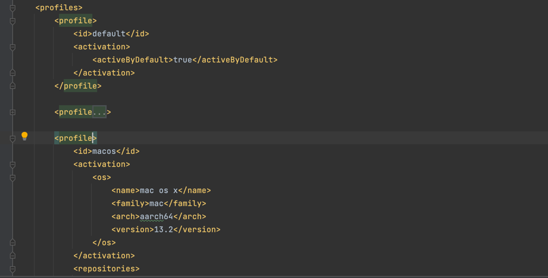

# maven 学习

##  1. overview 
maven 的关键特性包括:
- 简单的项目构建遵循最佳实践原则

    maven 尝试避免太多的配置 - 通过应用项目模版(名为 骨架类型)
- 依赖管理

    包括自动更新,下载 并且验证兼容性 .. 同样报告依赖的开闭原则(已知为传递性/反式依赖)
- 在项目依赖和插件之间进行隔离

    通过maven,项目依赖从依赖仓库中抓取,然后插件的依赖是通过插件仓库中抓取的,这可能会导致的冲突会更少 - 当插件开始下载额外的依赖时 ..
-  中央仓库系统

  项目依赖能够从本地文件系统或者公共仓库下载,例如 maven central ..

##  2. 项目对象模型
maven项目的配置完全通过pom(project object model),由pom.xml文件呈现.. pom 描述了项目,管理依赖并且配置构建软件的插件 ..

pom也定义了多个模块项目的模块之间的关系 .. 让我们来看看一个常见pom文件的基本结构
```xml
<project>
 <modelVersion>4.0.0</modelVersion>
 <groupId>com.baeldung</groupId>
 <artifactId>baeldung</artifactId>
 <packaging>jar</packaging>
 <version>1.0-SNAPSHOT</version>
 <name>com.baeldung</name>
 <url>http://maven.apache.org</url>
 <dependencies>
 <dependency>
 <groupId>org.junit.jupiter</groupId>
 <artifactId>junit-jupiter-api</artifactId>
 <version>5.8.2</version>
 <scope>test</scope>
 </dependency>
 </dependencies>
 <build>
 <plugins>
 <plugin>
 //...
 </plugin>
 </plugins>
 </build>
</project>
```
### 3.1 项目表示符
maven 使用了一堆标识符,也称为坐标,为了唯一识别一个项目并指定项目工件应该如何打包
- groupId 标识创建这个项目的公司或者分组的基础名称
- artifactId 项目的独一无二的名称
- version 项目的版本
- packaging 打包方法(eg. WAR / JAR / ZIP)

这三个结合出的格式`groupId:artifactId:version` 合并为独一无二的标识符,这种机制用来指定在我们项目中使用的一个外部库的特定版本(例如一个jar)

### 3.2 依赖
当前项目使用的外部库叫做依赖,maven的依赖管理特性确保maven 自动从中央仓库中下载这些库 .. 因此不需要本地存储他们 ..

这是maven的关键特性,这提供了以下的好处:
- 使用更少的存储 所有相同依赖使用同一个本地下载的包(将会显著的降低从远程存储库中下载的次数)
- 使得检查一个项目更加快速
- 提供了一个有效的平台，用于在我们的组织内部和外部交换二进制工件，而不需要每次都从源头构建工件。

为了声明一个对外部库的依赖,我们需要提供依赖坐标
```xml
<dependency>
 <groupId>org.springframework</groupId>
 <artifactId>spring-core</artifactId>
 <version>5.3.16</version>
</dependency>
```

### 3.3 仓库
在maven中的一个仓库被用来持有构建各种类型的构建工件和依赖 ... 默认的local repository 是位于 .m2/repository 目录下(用户家目录下的一个目录) ..

如果一个工件或者插件在本地仓库是可用的,maven将会使用它.. 反之,它将从中央仓库中下载它并存储在本地仓库,默认的中央仓库是 maven central ..

某些库,例如JBoss server不存在于中央仓库,但是它存在于额外的仓库中. 对于这些库,我们需要提供到额外的仓库的url(在pom.xml中) ...
```xml
<repositories>
 <repository>
 <id>JBoss repository</id>
 <url>http://repository.jboss.org/nexus/content/groups/public/</
url>
 </repository>
</repositories>
```
也就是说我们可以在项目中使用多仓库 ..

### 3.4 属性
自定义属性能够让使得我们的pom.xml文件更容易的读取并维护 ... 在典型的使用情况中,我们能够使用自定义属性去定义项目依赖的版本 ..

maven 属性是一个值占位符 并且能够在pom.xml中的任何地方进行访问 - 通过标记${name}的形式,这里的name 是属性的名称 ..

```xml
<project>
  <properties>
    <spring.version>5.3.16</spring.version>
  </properties>
  <dependencies>
    <dependency>
      <groupId>org.springframework</groupId>
      <artifactId>spring-core</artifactId>
      <version>${spring.version}</version>
    </dependency>
    <dependency>
      <groupId>org.springframework</groupId>
      <artifactId>spring-context</artifactId>
      <version>${spring.version}</version>
    </dependency>
  </dependencies>
</project>
```
现在如果我们想要更新Spring到新版本,我们仅仅只需要改变在<spring.version> 属性标签中的值,那么所有使用这个属性到<version>标签的所有依赖都将更新 ..

属性经常被用来定义构建路径变量:
```xml
<properties>
 <project.build.folder>${project.build.directory}/tmp/</project.build.folder>
</properties>
```
或者
```xml
<plugin>
  //...
  <outputDirectory>${project.resources.build.folder}</outputDirectory>
  //...
</plugin>
```

### 3.5 构建
在maven pom中,构建部分是非常重要的一部分,它提供了有关默认的maven goal的信息,编译项目的目录以及 应用的最终名称,默认的构建部分看起来如下:
```xml
<build>
 <defaultGoal>install</defaultGoal>
 <directory>${basedir}/target</directory>
 <finalName>${artifactId}-${version}</finalName>
 <filters>
 <filter>filters/filter1.properties</filter>
 </filters>
 //...
</build>
```
也就是我们可以指定默认的goal(为install) ...
编译工件的默认输出目录叫做 target,并且打包的工件的最终名称是由工件id和版本组成,但是我们可以随意改变 ..

### 3.6 使用profile
maven的另一个重要的特性是 支持profiles, 一个方面(profile)本质上是一组配置值.. 通过使用profile,我们能够自定义不同环境的构建,例如生产/测试/开发环境的构建 ..
```xml
<profiles>
 <profile>
 <id>production</id>
 <build>
 <plugins>
 <plugin>
 //...
 </plugin>
 </plugins>
 </build>
 </profile>
 <profile>
 <id>development</id>
 <activation>
 <activeByDefault>true</activeByDefault>
 </activation>
 <build>
 <plugins>
 <plugin>
 //...
 </plugin>
 </plugins>
 </build>
 </profile>
 </profiles>
```
正如我们在上面的示例中看到,默认的profile 设置为开发,如果我们想要运行生产profile,我们能够执行以下maven命令
```shell
mvn clean install -Pproduction
```
## 4. maven 构建生命周期
每一个maven构建跟随一个指定的生命周期. 我们能够执行各种构建生命周期goals .. 包括编译项目代码 / 创建包 以及安装
archive文件到本地maven 依赖仓库中 ..

### 4.1 生命周期阶段
以下的列表展示了最重要的maven生命周期:
- validate 检查项目的正确性
- compile 编译提供的源代码到二进制工件
- test 执行单元测试
- package 打包编译的代码到工件文件
- integration-test 执行额外的测试
- verify 检查打包是否有效
- install 安装package到本地maven 仓库
- deploy 部署打包文件到远程服务器或者仓库

### 4.2 插件以及目标(goals)
一个maven插件是一个或者多个goals的集合,goals 在声明周期阶段中执行,这帮助去决定goals执行的顺序 ..

丰富的插件列表是由maven官方支持的,可以在https://maven.apache.org/plugins/网站中找到,这里也有一些有趣的文章了解如何
[使用不同的插件去构建一个可执行的jar](https://www.baeldung.com/executable-jar-with-maven) ...

为了获得一个更棒的goals的理解 - 默认由这些生命周期阶段执行的goals,可以查看[默认的maven生命周期绑定](https://maven.apache.org/guides/introduction/introduction-to-the-lifecycle.html#Built-in_Lifecycle_Bindings)

我们可以执行上述阶段的任意之一,通过以下命令调用即可
```shell
mvn <phase>
```
举个例子,mvn clean install 将会移除之前创建的jar / war /zip文件 以及编译的类(clean),同样install 将会执行所有必要的阶段去安装新的归档..

请注意由查看提供的这些goals能够关联到生命周期的不同阶段 ...

## 5. 我们的第一个maven 项目
首先通过maven 命令创建一个基本的java项目
```shell
mvn archetype:generate \
 -DgroupId=com.baeldung \
 -DartifactId=baeldung \
 -DarchetypeArtifactId=maven-archetype-quickstart \
 -DarchetypeVersion=1.4 \
 -DinteractiveMode=false
```
这个示例中groupId 是一个表示创建项目的分组或者个人,通常是保留的一个公司的域名,artifactId 标识项目的基本包名.. 这里使用了
标准的archetype(原型),这里使用了最新的原型版本去确保创建的项目是更新的以及最新的结构 ..

因此我们不需要指定版本和打包类型,这些将设置为默认值,版本将会设置为 1.0-SNAPSHOT,打包默认为jar ..

如果我们不知道那些参数将会被提供,我们能够总是指定interactiveMode = true,那么maven将会询问所有必要的参数 ..

命令完成之后,我们有了一个包含了App.java类的java 项目,这仅仅是一个简单的"Hello World"程序,在src/main/java目录中,我们也包含了一个
测试类在src/test/java中,这个项目的pom.xml将会看起来像这样 ...
```xml
<project>
 <modelVersion>4.0.0</modelVersion>
 <groupId>com.baeldung</groupId>
 <artifactId>baeldung</artifactId>
 <version>1.0-SNAPSHOT</version>
 <name>baeldung</name>
 <url>http://www.example.com</url>
 <dependencies>
 <dependency>
 <groupId>junit</groupId>
 <artifactId>junit</artifactId>
 <version>4.11</version>
 <scope>test</scope>
 </dependency>
 </dependencies>
</project>
```
如你所见,JUnit依赖将默认提供 ..

### 5.2 编译并打包一个项目
下一个步骤是编译项目
```shell
mvn compile
```
maven 将会运行所有必须的生命周期阶段 - 由当前compile 阶段所需要去构建项目资源的所有阶段 .. 如果我们仅仅只想要运行一个测试阶段,能够使用
```shell
mvn test
```
现在能够执行打包阶段,这将产生一个编译的归档jar 文件
### 5.3 执行一个应用
最终,我们能够执行我们的java项目 - 使用exec-maven-plugin,我们仅仅只需要在pom.xml中配置这个必要的插件
```xml
<build>
 <sourceDirectory>src</sourceDirectory>
 <plugins>
 <plugin>
 <artifactId>maven-compiler-plugin</artifactId>
 <version>3.6.1</version>
 <configuration>
 <source>1.8</source>
 <target>1.8</target>
 </configuration>
 </plugin>
 <plugin>
 <groupId>org.codehaus.mojo</groupId>
 <artifactId>exec-maven-plugin</artifactId>
 <version>3.0.0</version>
 <configuration>
 <mainClass>com.baeldung.java.App</mainClass>
 </configuration>
 </plugin>
 </plugins>
</build>
```
第一个插件,maven-compiler-plugin,负责编译源代码 - 使用java 版本1.8,然后exec-maven-plugin 负责查询你项目中的mainClass ..

现在你可以执行应用,我们运行以下命令:
```shell
mvn exec:java
```

## 6. 总结
在这个章节中,我们将发现某些非常受欢迎的特性(有关maven构建工具的特性) ..

所有的代码示例 - 使用maven构建的示例,都可以查看baeldung的[github项目 web站点](https://github.com/eugenp/tutorials/tree/master/maven-modules/maven-simple)查看各种maven 配置 ..

## 7. apache maven 标准目录结构
maven是java项目最受欢迎的构建工具之一,除了去中心化依赖以及仓库,跨项目促进了一种统一的目录结构 是它最重要的一个方面 ..

这个章节,将会探索常见maven项目的标准目录结构 ..
### 7.1 目录结构
一个常见maven项目具有一个pom.xml文件并且具有约定定义的目录结构


默认的目录结构能够使用项目描述符进行覆盖,但是这是不常见且不鼓励的 ..

回到章节开头,我们将揭示有关每一个标准文件以及子目录的更多详情

### 7.2 根目录
根目录作为maven项目的根目录

我们能够发现以下标准文件以及子目录 - 典型的maven项目中
- maven-project/pom.xml 定义了在maven项目的构建生命周期过程中需要的依赖和模块
- maven-project/LICENSE.txt 项目的许可证信息
- maven-project/README.txt 项目的总结
- maven-project/NOTICE.txt 有关这个项目中使用的第三方的库的信息
- maven-project/src/main   包含了作为这个工件一部分的源代码 以及资源
- maven-project/src/test 持有所有测试代码和资源
- maven-project/src/it  常见保留由maven failsafe 插件所使用的集成测试 ...
- maven-project/src/site 由maven 站点插件创建的站点文档
- maven-project/src/assembly 打包二进制的装配 / 组装配置 ..

### 7.3 src/main 目录
根据命名指示,src/main 是maven项目中最重要的目录,这个目录中的任何东西将假设为工件的一部分,要么是war / 要么是jar,都可以出现在这 ..

它的子目录是:
- src/main/java 工件的java源代码
- src/main/resources 配置文件以及其他,例如 i18n 文件,各个环境的配置文件以及xml配置 ..
- src/main/webapp 对于web应用,包含了例如js / css / html文件 / 视图模版以及图片的资源
- src/main/filters 包含了注入值到在资源目录中的配置属性的文件 - 在构建阶段做这个事情 ..
### 7.4 src/test 目录
同理,等价于src/main目录,仅仅是测试应用中的每一个组件

注意到 这些目录或者文件将不会作为工件的一部分,让我们看一看它的子目录
- src/test/java 测试的java源目录
- src/main/resources 配置文件以及其他的由测试使用的配置文件
- src/test/filters 包含了需要注入值到配置中的文件
- src/main/filters 包含在测试阶段将值注入资源文件夹中的配置属性的文件

## 8 maven profiles 指南
maven profiles 能够被用来创建自定义的构建配置,例如针对测试粒度的级别(程度),或者一个特定的部署环境 ..

在这个章节中,我们将学习 如何使用maven profile 进行工作
### 8.1 基本示例
现在当我们运行mvn package的时候,单元测试将会如期执行,但是如果我们想要快速的打包工件并运行它是否可以工作:

首先,我们将创建一个没有测试的profile - 通过设置maven.test.skip 属性为true ...
```xml
<profile>
 <id>no-tests</id>
 <properties>
 <maven.test.skip>true</maven.test.skip>
 </properties>
</profile>
```
现在,通过运行
```shell
mvn package -Pno-tests
``` 
命令来执行profile,现在工件将会被创建并且测试将会跳过,在这种情况下
```shell
mvn package -Dmaven.test.skip
```
看起来会变得更加容易

然而,这仅仅是对maven profiles的一个介绍,现在来看一些更加负责的配置

### 8.2 声明 profiles
在前面的部分中,我们查看了如何创建一个profile,我们能够配置多个想要的profile - 通过给他们独一无二的id 进行声明定义 ..

现在我们想要创建一个profile - 仅仅涉及到集成测试 并且另一个profile - 包含了可变集合的测试 ..

我们能够在pom.xml文件中为每一个指定id
```xml
<profiles>
 <profile>
 <id>integration-tests</id>
 </profile>
 <profile>
 <id>mutation-tests</id>
 </profile>
</profiles>
```
在每一个profile 元素中,我们能够配置多个元素,例如依赖/插件/资源 以及 finalName ..

因此,对于上述示例,我们能够增加插件以及依赖 - 分别为 integration-tests / mutation-tests 单独添加 ..

分离测试到profiles 能够使得默认的构建更快 - 针对它们所关注的 -例如,仅仅进行单元测试 ..

### 8.3 profile 范围
现在我们已经放置了profile到pom.xml文件中,这仅仅声明到了自己的项目中 

但是maven3开始,我们能够增加profiles到以下三个位置的任何一个
1. 项目特定的profiles( 在项目的pom.xml文件中指定)
2. 使用用户特定的profiles(设置在用户的settings.xml文件中)
3. 全局profiles(设置在全局的settings.xml文件中)

我们可以尽可能的配置profiles到pom.xml中,这是因为我们想要同时在开发机器和构建机器上同时使用这些profile .. 使用这些配置

xml更困难，也更容易出错，因为我们必须自己在构建环境中分发它。

## 9 激活profiles
在创建了一个或者多个profiles,我们能够开始使用它们,或者换句话说,激活他们 ..

## 9.1 查看那些profiles是激活的
让我们使用`help:active-profiles` goal 去查看在默认的构建中那些profiles是激活的 ..
```shell
mvn help:active-profiles
```
默认构建

以下的profiles是激活的:

well,nothing ..

现在我们仅仅需要片刻就能激活它们,但是需要另一种方式来查看那些profiles是激活的 - 通过包括maven-help-plugin到我们的
pom.xml中并且绑定active-profiles 目标到 编译阶段 ..
```xml
<build>
 <plugins>
 <plugin>
 <groupId>org.apache.maven.plugins</groupId>
 <artifactId>maven-help-plugin</artifactId>
 <version>3.2.0</version>
 <executions>
 <execution>
 <id>show-profiles</id>
 <phase>compile</phase>
 <goals>
 <goal>active-profiles</goal>
 </goals>
 </execution>
 </executions>
 </plugin>
 </plugins>
</build>
```
现在让我们来看一看一些不同的使用他们的方式
### 9.2 使用-P
我们已经使用了一种方式开始,现在我们能够激活profiles - 通过-P参数,因此让我们开始启用integration-tests profile
```shell
mvn package -P integration-tests
```
如果我们使用了maven-help-plugin 去验证激活的profiles 或者 通过
```shell
mvn help:active-profiles -P integration-tests
``` 
命令去验证激活的profiles,我们将得到以下的结果
```text
The following profiles are active:
- integration-tests
```
如果我们想要同时激活多个profiles,我们能够使用逗号分割的profile列表
```shell
mvn package -P integration-tests,mutation-tests
```

### 9.3 默认激活
如果我们总是需要激活一个profile,那么我们可以让它默认激活
```xml
<profile>
 <id>integration-tests</id>
 <activation>
 <activeByDefault>true</activeByDefault>
 </activation>
</profile>
```
现在我们运行mvn package 命令而不指定任何profiles,并且我们能够验证integration-test profile是激活的 ..

然而,如果我们运行maven 命令并启用其他的profile,那么这个设定了activeByDefault的profile将会跳过 ..例如当我们
运行`mvn package -P mutation-tests`,仅仅mutation-tests profile将会激活 ..

当我们使用其他方式激活时,那么activeByDefault 同样被跳过 .. 

### 9.4 基于属性激活profile
我们能够在命令行中激活profiles,然而,如果自动激活可能更加方便,也就是说,基于-D 系统属性激活 ..
```xml
<profile>
 <id>active-on-property-environment</id>
 <activation>
 <property>
 <name>environment</name>
 </property>
 </activation>
</profile>
```
现在我们能够使用`mvn package -Denvironment`  命令激活profile, -D指定了一个系统属性,它也可能去激活一个profile,如果属性没有设置 ..
```xml
<property>
 <name>!environment</name>
</property>
```
或者我们能够激活profile(如果这个属性指定了一个特定的值)
```xml
<property>
 <name>environment</name>
 <value>test</value>
</property>
```
现在我们能够指定特定的profile并运行构建
```shell
mvn package -Denvironment=test
```
最终,我们能够激活profile - 如果一个属性包含了值 - 但不是指定的值,我们同样可以激活
```xml
<property>
 <name>environment</name>
 <value>!test</value>
</property>
```
### 9.5 基于jdk 版本
另一个选项是基于机器上运行的jdk去启用profile,在这种情况下,我们能够启用特定的profile(如果jdk版本以11开始)
```xml
<profile>
 <id>active-on-jdk-11</id>
 <activation>
 <jdk>11</jdk>
 </activation>
</profile>
```
我们能够使用jdk版本的范围来启用profile,请查看[maven version range syntax](https://www.baeldung.com/maven-dependency-latest-version)

### 9.6 基于操作系统
我们可以基于操作系统的信息来激活特定的profile,如果我们不确定这些细节,我们能够先使用`mvn enforcer:display-info` 命令,这将给出一些操作系统的简单信息 ..

例如:
```text
Maven Version: 3.5.4
JDK Version: 11.0.2 normalized as: 11.0.2
OS Info: Arch: amd64 Family: windows Name: windows 10 Version: 10.0
```
在此之后,我们能够基于操作系统配置仅在windows 10上激活的profile ... 

### 9.7 基于文件激活profile
另一种选择是基于一个文件的存在或者丢失来运行profile,现在先创建一个测试proflie - 仅仅当testreport.html不存在的情况下才执行
```xml
<activation>
 <file>
 <missing>target/testreport.html</missing>
 </file>
</activation>
```
### 9.8 停用一个profile
我们已经知道了多种激活profiles的方式,但是某些时候我们需要禁用他们 ..

为了禁用一个profile,那么我们能够使用'!'或者'-'. 
因此如果我们需要禁用active-on-jdk-11 profile,那么我们可以执行
```shell
mvn compile -P -active-on-jdk-11
```
总结,请注意,默认profile的激活条件是当 符合条件的profile不存在则默认激活,也就是说它的优先级较低 .. 如果你执行maven 构建
但是没有指定激活的profile,那么当默认符合条件的profile将会激活,则导致默认激活的也会失效 ..

但是根据前面的profiles的加载规则,同一个scope抓取的profiles(虽然存在激活的profiles和默认的profiles存在排斥问题),但是三个地方
加载的profiles 是可以共存的 ..

假设我的项目设置了以下的profiles


但是我们的maven配置文件中配置了一个默认的profiles


我们使用`mvn help:active-profiles` 去查看那些profiles 激活了


## 10. maven 依赖 scopes
### 10.1 概述
maven 是构建java 生态系统的最受欢迎的构建工具,并且最核心的一个特性就是进行依赖管理 ..
在这个章节中,我们描述并探索这个机制来帮助我们管理在maven项目中的传递性依赖 - 称为依赖scopes

### 传递性 依赖
这里有两种依赖类型 - 在maven中(direct / transitive)

直接依赖是我们显式包含在项目中的一些,通过<dependency>标签进行包括
```xml
<dependency>
 <groupId>junit</groupId>
 <artifactId>junit</artifactId>
 <version>4.12</version>
</dependency>
```
另一方面,被直接依赖需要的传递性依赖.

maven 将自动包含需要的传递性依赖到我们的项目中 ..

我们能够查看所有依赖,包括传递性依赖,通过使用过`mvn dependency:tree` 命令 ..

### 10.2 依赖范围
依赖范围能够帮助我们限制依赖的传递性它也能够根据不同的构建任务来修改类路径 .. maven 已经包含了6中默认的依赖范围 ..

理解每一种scope很重要,除了（import）,都会对传递性依赖产生影响 ...

#### 10.2.1 compile
这是默认的scope,如果没有为依赖提供其他的作用域 ..

拥有这个scope的依赖将出现在项目的类路径上(在所有构建任务中) ..

最重要的是,这些依赖也具有传递性依赖,例如一个依赖本身依赖了
```xml
<dependency>
 <groupId>commons-lang</groupId>
 <artifactId>commons-lang</artifactId>
 <version>2.6</version>
</dependency>
```
#### 10.2.2 provided
这个scope标识依赖应该在运行时由jdk或者其他容器提供 ..

一个好的使用场景就是部署到容器的web 应用,这个容器已经提供了一些库..

举个例子,它可以是一个在运行时已经提供了Servlet API的web服务器 .. 在项目中,仅仅只需要定义这些依赖为provided scope.
```xml
<dependency>
 <groupId>javax.servlet</groupId>
 <artifactId>javax.servlet-api</artifactId>
 <version>4.0.1</version>
 <scope>provided</scope>
</dependency>
```
此外,这些依赖仅仅在编译时以及项目的测试类路径可用,这些依赖不是传递性的 ...

#### 10.2.3 runtime
具有这个scope的依赖在运行时必要,但是在项目编译的时候可以不需要它们 ..

因此,标记为runtime scope的依赖将在运行时以及测试类路径上可用,但是它们在编译类路径上消失 ..

例如一个好的例子是 JDBC drvier应该使用runtime scope:
```xml
<dependency>
 <groupId>mysql</groupId>
 <artifactId>mysql-connector-java</artifactId>
 <version>8.0.28</version>
 <scope>runtime</scope>
</dependency>
```

#### 10.2.4 test
我们使用这个scope 指示依赖不需要出现在项目的标准运行时中,并且仅仅由于测试目的使用,测试依赖不存在传递性并且仅仅出现在测试以及执行类路径上 ..

标准的使用情况是增加一个测试库,例如JUnit到我们的应用中
```xml
<dependency>
 <groupId>junit</groupId>
 <artifactId>junit</artifactId>
 <version>4.12</version>
 <scope>test</scope>
</dependency>
```

#### 10.2.5 system
系统scope 非常类似于provided scope,主要不同的是,system 确保我们指向文件系统中的一个特定jar ..

值的提及的是 [system scope 是不推荐的](https://maven.apache.org/guides/introduction/introduction-to-dependency-mechanism.html#system-dependencies) 
重要的是使用这种方式构建一个项目可能会在多个不同的机器上失败,因为这种方式不跨越平台(或者说依赖不存在机器上的指定位置或者放置在另一个不同的systemPath所指向的位置 -导致它没有出现)..
```xml
<dependency>
 <groupId>com.baeldung</groupId>
 <artifactId>custom-dependency</artifactId>
 <version>1.3.2</version>
 <scope>system</scope>
 <systemPath>${project.basedir}/libs/custom-dependency-1.3.2.jar</
systemPath>
</dependency>
```

#### 10.2.6 import
import 指示此依赖项应替换为其 POM 中声明的所有有效依赖项..

这里,custom-project的依赖项将会被替换为所有在 custom-project的pom.xml的 <dependencyManagement> 部分声明的依赖 ..
```xml
<dependency>
 <groupId>com.baeldung</groupId>
 <artifactId>custom-project</artifactId>
 <version>1.3.2</version>
 <type>pom</type>
 <scope>import</scope>
</dependency>
```
也就是说这种依赖类型将声明在<dependencyManagement>中 ..

#### 10.2.7 scope 以及 transitivity
每一个依赖scope会以自己的方式影响传递性依赖,这意味着不同的传递性依赖也许会在具有不同scope的项目中结束 ..
然而具有provided以及test的依赖项将绝不会包括在主项目中 ...

我觉得它这里的在具有不同scope的项目中结束,取决于项目如何使用这个依赖项(仅仅是说明此依赖项的传递项依赖或者它本身是否会作为一个传递项依赖继续生命周期，而不是结束)..

我们仔细了解这意味着什么:
- 对于compile scope, 所有具有运行时scope的依赖项将拉取到项目中的运行时scope中 .. 并且所有具有编译scope的依赖拉取到项目中的编译scope ..
- 对于provided scope,运行时 / 编译scope依赖项将拉取到项目中的provided scope中 .
- 对于test scope,runtime / compile scope 以及它们的transitive dependencies 将会拉入到项目的test scope ..
- 对于runtime scope, runtime / compile scope 以及它们的 transitive dependencies 拉入到项目的runtime scope

以上这些我认为主体是依赖项,也就是例如依赖项是compile scope,那么它的所有运行时scope依赖项将与当前项目的runtime scope合并 ... 等等 ..

为了深入的了解maven,查看[此文档](https://maven.apache.org/guides/introduction/introduction-to-dependency-mechanism.html) 是一个好的开始

## 11 插件管理
apache maven 是一个强有力的工具让使用插件去自动并执行在java项目中的所有构建以及报告任务 ..

然而,这可能在构建中使用各种插件并且连同不同的版本和配置,特别是在多模块项目中,这可能导致复杂pom文件的问题(具有冗余或者重复的插件工件,同样配置分散到各种子项目中 ..)

现在我们来学习如何使用maven的插件管理机制去处理这些问题 以及高效的在整个项目中维护插件 ..

### 11.1 插件配置
maven 包含了两种类型的插件
- build 在构建过程中执行,例如包括了clean / install 以及Surefire 插件 . 这些应该在pom的build部分进行配置 ..
- reporting 在站点生成过程中执行 - 去产生各种项目报告,例如javadoc / Checkstyle 插件. 这些配置在项目的pom的reporting 部分 ..

maven 插件提供了所有有用的功能(需要执行并管理项目构建所需) ..

举个例子,我能够在pom中声明Jar插件
```xml
<build>
 ....
 <plugins>
 <plugin>
 <groupId>org.apache.maven.plugins</groupId>
 <artifactId>maven-jar-plugin</artifactId>
 <version>3.2.0</version>
 ....
 </plugin>
 ....
 </plugins>
</build>
```
现在我们能够包括插件在build部分去增加编译项目为jar的能力 ..

### 11.2 插件管理
除了插件,我们也能够在pom的pluginManagement部分声明插件,这包含了plugin多个元素(同前面所述). 它对当前pom有效并且会被子poms继承 ..

这意味着任何子poms将会继承此插件执行  - 通过引用此插件在他们的插件部分即可 ... 所有的我们还需要做的是添加相关的groupId 以及 artifactId,无需
版本和重复的配置或者管理版本 ..

类似于[依赖管理](https://maven.apache.org/guides/introduction/introduction-to-dependency-mechanism.html#dependency-management) 机制,
在多模块项目中这非常有用,因为它提供了一个中央位置来管理插件版本以及任何相关的配置 ...

### 11.3 示例
现在让我们从一个简单的多模块项目开始  - 它具有两个子模块 .. 我们会包含Build Helper Plugin在父pom中,它包含了各种小的目标关联到构建生命周期,
在这个示例中,在子项目中我们使用它去复制某些其他资源到项目的输出
```xml
<pluginManagement>
 <plugins>
 <plugin>
 <groupId>org.codehaus.mojo</groupId>
 <artifactId>build-helper-maven-plugin</artifactId>
 <version>3.3.0</version>
 <executions>
 <execution>
 <id>add-resource</id>
 <phase>generate-resources</phase>
 <goals>
 <goal>add-resource</goal>
 </goals>
 <configuration>
 <resources>
 <resource>
 <directory>src/resources</directory>
 <targetPath>json</targetPath>
 </resource>
 </resources>
 </configuration>
 </execution>
 </executions>
 </plugin>
 </plugins>
</pluginManagement>
```
在这个示例中我们绑定此插件的add-resource目标到在[默认pom生命周期](https://maven.apache.org/guides/introduction/introduction-to-the-lifecycle.html#Built-in_Lifecycle_Bindings) 的 generate-resources 阶段
我也指定了src/resources 目录包含了额外的资源 .. 这个插件执行的时候将会复制这些资源到目标位置(在项目的输出位置的相对路径配置 - targetPath) ..

现在,我们可以运行maven 命令去确定配置是有效的并构建成功:
```shell
$ mvn clean test
```
在运行这个之后,我们能够看见target location 并没有包含期待的资源 ..

### 11.4 子pom配置
现在让我们在子pom的配置中引入插件
```xml
<build>
 <plugins>
 <plugin>
 <groupId>org.codehaus.mojo</groupId>
 <artifactId>build-helper-maven-plugin</artifactId>
 </plugin>
 </plugins>
</build>
```
类似依赖管理,我们不需要声明版本或者任何插件配置,相反,子项目继承在父pom中的声明的内容 ..

最终,让我们再次运行这个构建并查看到存在输出


现在在构建过程中将会执行此插件,但是仅仅会在拥有相关声明的子项目中执行,因此,项目输出现在将包含来自指定项目位置的其他资源,正如我们所期待的那样 ..

现在应该注意到仅仅我们的父pom包含了插件声明以及配置,然而子项目中仅仅引用了它所需要的 ..

子项目也可以免费的修改它所需要的[继承配置](https://www.baeldung.com/maven-plugin-override-parent)  ..
### 11.5 核心插件
某些maven的[核心插件](https://www.baeldung.com/core-maven-plugins) 是默认使用作为构建生命周期的一部分 ..

例如,clean / compiler 插件不需要显式的声明 ..

我们也可以,然而,显式的声明并配置这些到pom中的pluginManagement 元素中 .. 主要不同是核心插件配置会自动生效而不需要在子项目中包含任何引用 ..

也就是说,核心插件不需要显式声明,每个项目都会使用 ..

现在让我们尝试增加编译器插件到熟悉的pluginManagement 部分
```xml
<pluginManagement>
 ....
 <plugin>
 <groupId>org.apache.maven.plugins</groupId>
 <artifactId>maven-compiler-plugin</artifactId>
 <version>3.10.0</version>
 <configuration>
 <source>1.8</source>
 <target>1.8</target>
 </configuration>
 </plugin>
 ....
</pluginManagement>
```
现在我们锁定了插件的版本,并且配置它使用java 8 去构建这个项目. 然而这里不需要在任何子项目中进行额外必要的插件声明 ..
构建框架会默认激活这个配置,因此,这个配置意味着构建必须使用java8 去编译这个项目(跨越所有模块)

总的来说,它是一个好的最佳实践 - 去显式的声明配置并锁定在多模块项目中必须的任何插件的版本 ..  因此不同的子项目也能够继承仅仅所需要的插件配置(来自父pom的)并且
按需使用 ..

这减少了重复的声明,简化了pom文件并且提升了构建的重复能力(再现能力)

## 12 maven goals and phases
在这个章节中,探索不同的maven 构建生命周期 以及 他们的阶段,同样也会讨论goals 以及 phases之间的核心关系 .

### 12.1 maven build lifecycle
maven 构建允许一个特定的声明周期去部署并发布目标项目

这有三种内置生命周期 ..
- default 主要的生命周期,它负责项目部署
- clean 去清理项目 并移除之前构建中生成的所有文件
- site 去创建项目的站点文档

每一个生命周期关联(或者说由一系列阶段组成). default build lifecycle 由23阶段组成，因此它是主要的构建生命周期 ..

另一个方面是, clean lifecycle 由3个阶段组成,然而 site 生命周期由4个阶段组成 ..

### 12.2 maven phase
一个maven 阶段表示在maven构建生命周期中的一个阶段，每一个阶段负责一个特定的任务 ..

这里某些重要的阶段存在于构建生命周期中 ...
- validate 检查对于此构建所有必要的信息是否可用
- compile 编译源代码
- test-compile 编译测试源代码
- test 运行单元测试
- package 打包编译后的源代码到可发布的格式(jar / war ...)
- integration-test 处理并部署打包(如果需要运行集成测试)
- install: 安装package 到本地仓库
- deploy 复制此package 到远程仓库

对于完整的每一个生命周期的阶段的完整列表,查看 [maven reference](https://maven.apache.org/guides/introduction/introduction-to-the-lifecycle.html#Lifecycle_Reference) ..

阶段将会根据指定顺序执行,这意味着如果我们使用命令运行一个特定的phase
```shell
mvn <pahse>
```
它并不会仅仅执行指定的phase,相反它前置的所有阶段也会执行 ..

例如,如果运行deploy 阶段,这是default build 生命周期的最后的一个阶段 .. 它会执行deploy阶段之前的所有阶段,这是整个default lifecycle ..
```shell
mvn deploy
```

总结:
maven 存在多个生命周期,并且每一个生命周期都存在不同的阶段 ..

### 12.3 maven goal
每一个阶段可以包含一系列的goals,每一个goal负责特定的任务 ..

当我们运行一个阶段的时候,此阶段绑定的所有goals都将有序的执行,这些有某些阶段以及默认的绑定到他们的goals
- compiler:compile

  来自编译器插件的goal绑定到compile 阶段
- compiler:testCompile

  绑定testCompile goal到 test-compile 阶段
- surefire:test

  绑定test目标到 test阶段
- install:install

  绑定到 install 阶段
- jar:jar 以及 war:war

  绑定到package 阶段

我们也能够列出绑定到特定阶段的所有goals 以及 它们的插件
```shell
mvn help:describe -Dcmd=PHASENAME
```
例如，为了列出绑定到compile 阶段的所有goals,我们能够运行
```shell
mvn help:describe -Dcmd=compile
```
我们得到输出 


如上所述,这意味着来自compiler 插件的compile goal将绑定到compile 阶段 ..


## 12 maven 插件

maven插件是包含一组goals的工具,然而,这些goals 将不必要绑定到相同阶段 ..

举个例子,这里具有一个对maven failsafe 插件的简单配置,这负责运行集成测试:
```xml
<build>
 <plugins>
 <plugin>
 <artifactId>maven-failsafe-plugin</artifactId>
 <version>${maven.failsafe.version}</version>
 <executions>
 <execution>
 <goals>
 <goal>integration-test</goal>
 <goal>verify</goal>
 </goals>
 </execution>
 </executions>
 </plugin>
 </plugins>
</build>
```
如你所见,这里配置了两个主要的goals ..
- integration-test

  运行集成测试
- verify

  验证传递的所有集成测试

我们能够使用以下的命令去列出特定插件的所有goals ..
```shell
mvn <PLUGIN>:help
```
例如,列出所有在Failsafe 插件中的所有goals,我们能够运行
```shell
mvn failsafe:help
```
你会发现以下输出:


上述输出告诉我们还可以使用-Ddetail 或者 -Dgoal 去显示参数详情 或者goal的详情 ..

为了运行一个特定的goal 而不执行其完整的阶段(以及前置的阶段),我们可以使用
```shell
mvn <PLUGIN>:<GOAL>
```
例如,为了运行来自Failsafe 插件的集成测试 goal,我们需要使用以下命令
```shell
mvn failsafe:integration-test
```
## 13 构建一个maven 项目
为了构建一个maven项目,我们需要执行其中一个生命周期 - 通过运行他们的一个阶段来实现,例如
```shell
mvn deploy
```
这将执行默认的完整的default lifecycle. 除此之外,我们能够停在install 阶段 ..
```shell
mvn install
```
但是通常,我们能够首先清理项目 - 通过运行clean生命周期然后执行新的构建
```shell
mvn clean install
```
我们也能够运行插件的一个特定的goal 
```shell
mvn compiler:compile
```

这样看来,虽然存在多个生命周期,但是好像每一个生命周期的阶段是没有交集重复的 ..

注意到,如果我们尝试构建一个maven项目而不指定一个阶段或者goal,我们将得到一个错误
> [ERROR] No goals have been specified for this build. You must specify a valid lifecycle phase or a goal in the format <plugin-prefix>:<goal> or <plugin-group-id>:<plugin-artifact-id>[:<plugin-version>]:<goal>. Available lifecycle phases are: validate, initialize, generate-sources, process-sources, generate-resources, process-resources, compile, process-classes, generate-test-sources, process-test-sources, generate-test-resources, process-test-resources, test-compile, process-test-classes, test, prepare-package, package, pre-integration-test, integration-test, post-integration-test, verify, install, deploy, pre-clean, clean, post-clean, pre-site, site, post-site, site-deploy.

## 13. maven中的多模块项目
首先我们先了解多模块项目是什么，并且了解这种方式的好处,现在配置一个简单的项目[the tutorial](https://www.baeldung.com/maven).. 本文前面也已经介绍 .

### 13.1 maven的多模块项目
一个多模块项目是构建于一个聚合器pom(管理了一组子模块的pom),大多数情况,这个聚合器位于项目的根目录并且必须具有打包类型为pom ..

submodules 通常是普通的maven项目,并且它们能够单独构建或者通过聚合器pom构建 ..

通过聚合器pom构建此项目,每一个具有不同于pom的打包类型的项目都会导致构建归档文件 ..

### 13.2 使用多模块构建的好处
使用这种方式的最重要的好处就是 - 我们也许能够减少重复 ..

假设我们有一个由各种模块组成的应用,一个前端模块以及一个后端模块,现在想象我们工作在他们之上并且需要改变功能,同时在他们之间生效 ..

在这种情况下,假设没有一个特定的构建工具,我们能够同时单独的构建这些组件,或者编写一个脚本去编译代码 / 运行测试并且展示结果,那么当我们项目中的模块
变得越来越多的时候,我们可能会变得更加难以管理和维护 ..

在真实世界中,项目也许需要某些maven 插件去执行各种操作(在[构建生命周期](https://maven.apache.org/guides/introduction/introduction-to-the-lifecycle.html)中),
以及共享依赖和profiles 以及包含其他 [bom 项目](https://www.baeldung.com/spring-maven-bom)

因此，当利用多模块的时候,我们能够构建我们的应用模块 - 以单个命令,并且如果顺序很重要,maven 能够为我们排序,我们也能够和其他模块共享大量的配置 ..

## 13.3 父pom
maven 以一种方式继承隐含的parent pom(在自己的pom.xml中编写继承关系),这叫做Super POM(能够位于maven的二进制包中) .

我们能够创建自己的pom.xml文件,这将作为parent project .. 然后我们也能够包括它所有的配置与依赖,并且设置它作为作为我们子模块的父亲 ..
因此,现在我们可以继承它 ..

除了继承之外,maven 提供了聚合的概念,一个父pom将会利用这种叫做聚合pom的功能,本质上,这种pom将会在它的pom.xml文件中显式的声明它的模块 ..

### 13.4 子模块
子模块,子项目,都是从父模块继承的普通maven项目,现在已经知道了,继承能够让我们能够在子模块中共享配置和依赖 .. 然而,如果你需要一次性构建或者发行项目,
这意味着你需要一次性构建所有的子模块,那么我们需要显式的在父pom中声明这些子模块,最终,我们的父pom将会作为parent,同样也是聚合pom ..

## 14.构建应用
现在我们已经理解了子模块和体系,让我们来构建一个简单的应用并说明他们 ... 我们使用maven的命令行窗口来声明我们的项目

这个应用由三个模块组成
- 域的主要部分
- 提供某些rest apis的web服务 
- 包含了面向用户的某些分类的web资源的 webapp

由于我们关注于maven,这些服务的实现我们将保持未知..

### 14.1 生成pom
首先,让我们生成parent 项目:
```shell
mvn archetype:generate -DgroupId=com.baeldung -DartifactId=parent-project
```
一旦我们的parent生成之后,我们打开位于parent的目录的pom.xml文件并增加packaging为pom
```text
<packaging>pom</packaging>
```
通过设置packaging 到pom 类型,我们声明这个项目作为父亲或者一个聚合器,它不会生产后续的工件 ..

现在聚合器已经创建完成,现在需要生成子模块 ..

然而,我们需要注意,这里的所有配置都需要共享(换句话说,这是所有需要共享的配置的所在位置),这最终将在子模块中重用,除了其他事情之外,我们能够在这里利用
dependencyManagement 或者 pluginManagement ..

### 14.2 创建子模块
因为我们的parent pom已经命名为 parent-project,我们需要确保我们在父项目中,并且运行这些生成命令
```shell
cd parent-project
mvn archetype:generate -DgroupId=com.baeldung -DartifactId=core
mvn archetype:generate -DgroupId=com.baeldung -DartifactId=service
mvn archetype:generate -DgroupId=com.baeldung -DartifactId=webapp
```
你会发现和父项目创建使用相同命令,这些模块都是普通maven项目,也许maven将他们识别为内嵌的 .. 当改变目录为parent-project时,它发现了parent具有pom的打包类型,
然后相应的修改pom.xml文件,在parent-project的pom.xml文件中,它将增加所有的子模块到modules 部分 ..
```xml
<modules>
 <module>core</module>
 <module>service</module>
 <module>webapp</module>
</modules>
```
并且在子模块中的pom.xml中,增加parent部分
```xml
<parent>
 <artifactId>parent-project</artifactId>
 <groupId>com.baeldung</groupId>
 <version>1.0-SNAPSHOT</version>
</parent>
```
最终,maven将生成三个子模块 ..

它重要的是子模块仅仅只有一个父亲,然而,我们能够导入许多的bom,了解有关bom文件的详情,查看[bom article](https://www.baeldung.com/spring-maven-bom)

### 14.3 构建项目
现在我们可以一次构建三个项目,在父亲的project目录中,我们可以运行
```shell
mvn package
```
这将构建所有模块,我们能够看到以下输出
```text
[INFO] Scanning for projects...
[INFO]
------------------------------------------------------------------------
[INFO] Reactor Build Order:
[INFO] parent-project
[pom]
[INFO] core
[jar]
[INFO] service
[jar]
[INFO] webapp
[war]
[INFO] Reactor Summary for parent-project 1.0-SNAPSHOT:
[INFO] parent-project ..................................... SUCCESS [ 0.272 s]
[INFO] core ............................................... SUCCESS [ 2.043 s]
[INFO] service ............................................ SUCCESS [ 0.627 s]
[INFO] webapp ............................................. SUCCESS [ 0.572 s]
[INFO]
------------------------------------------------------------------------[INFO]
BUILD SUCCESS
[INFO] 
```
Reactor 列出了parent-project,但是因为它是pom类型,它被排除了,以及所有其他模块的构建的jar文件(总共三个),这种情况下,构建发生在所有子模块中 ..

在此之上,maven Reactor将分析我们的项目并且以可能的顺序构建它们，因此如果我们的webapp模块依赖于service 模块,maven首先构建service模块,然后构建
webapp ..

### 14.4 在父项目中启用依赖管理
依赖管理是一个机制 - 在多模块 parent项目 以及它的孩子来集中化管理依赖信息

当我们具有一组项目或者模块 - 继承相同的父亲,我们能够放置所有必要的有关依赖的信息到一个公共的pom.xml文件 .. 这就能够简化在子pom中引用这些工件 ..
```xml
<dependencyManagement>
 <dependencies>
 <dependency>
 <groupId>org.springframework</groupId>
 <artifactId>spring-core</artifactId>
 <version>5.3.16</version>
 </dependency>
 //...
 </dependencies>
</dependencyManagement>
```
让我们查看示例parent的pom.xml,在parent中声明spring-core的版本,所有依赖于spring-core的子模块将声明此依赖 仅仅需要groupId 以及 artifactId,版本相关信息将会被继承
```xml
<dependencies>
 <dependency>
 <groupId>org.springframework</groupId>
 <artifactId>spring-core</artifactId>
 </dependency>
 //...
</dependencies>
```
上述配置这是子模块的声明

除此之外,我们可以提供依赖管理的排除  - 在parent的pom.xml中,那么这个特定的库将不会被子模块继承 ..
```xml
<exclusions>
 <exclusion>
 <groupId>org.springframework</groupId>
 <artifactId>spring-context</artifactId>
 </exclusion>
</exclusions>
```
最终,如果一个子模块需要使用管理的依赖的不同版本,我们能够覆盖这个管理版本(在子模块的pom.xml文件中)
```xml
<dependency>
 <groupId>org.springframework</groupId>
 <artifactId>spring-core</artifactId>
 <version>4.3.30.RELEASE</version>
</dependency>
```
请注意,当子模块继承它的父项目时,一个父模块可以不包含任何它需要聚合的模块,换句话说,父项目也能够聚合没有继承于它的项目 ..

了解有关继承和聚合的更多信息,[please refer to this documentation](https://maven.apache.org/pom.html#Aggregation)

### 14.5 更新子模块并构建项目
我们能够改变子模块的打包类型,举个例子,让我们改变webapp模块的打包为war - 通过更新pom.xml文件
```xml
<packaging>war</packaging>
```
同样我们也可以增加maven-war-plugin到插件列表中
```xml
<build>
 <plugins>
 <plugin>
 <groupId>org.apache.maven.plugins</groupId>
 <artifactId>maven-war-plugin</artifactId>
 <version>3.3.2</version>
 <configuration>
 <failOnMissingWebXml>false</failOnMissingWebXml>
 </configuration>
 </plugin>
 </plugins>
</build>
```
现在我们能够测试我们的项目构建,通过命令`mvn clean install`,输出日志可能类似于:
```text
[INFO] Scanning for projects...
[INFO]
------------------------------------------------------------------------
[INFO] Reactor Build Order:
[INFO]
[INFO] parent-project
[pom]
[INFO] core
[jar]
[INFO] service
[jar]
[INFO] webapp
[war]
//.............
[INFO] Reactor Summary for parent-project 1.0-SNAPSHOT:
[INFO]
[INFO] parent-project ..................................... SUCCESS [ 0.272 s]
[INFO] core ............................................... SUCCESS [ 2.043 s]
[INFO] service ............................................ SUCCESS [ 0.627 s]
[INFO] webapp ............................................. SUCCESS [ 1.047 s]
```
总结:

maven的学习指南还可以从 [Sonatype Maven reference](https://books.sonatype.com/mvnref-book/reference/index.html) 或者[apache maven guide](https://maven.apache.org/guides/index.html) 

## 16. maven 依赖管理 vs dependencies tags
这个章节中,我们回顾两个重要的maven tag, dependencyManagement 以及 dependencies 

这些特性在多模块项目中非常有用 ...

我们需要回顾这两个标签的类似和不同,并且需要需要查看一些常见错误 - 开发者可能会在使用他们的时候 导致困扰

### 16.1 使用
通常,我们能够使用dependencyManagement tag去避免重复的版本以及scope tag的使用 -当我们在dependencies 标签中定义我们的依赖时,这种方式下需要的依赖都声明在核心的pom文件中 ..

### 16.2 dependencyManagement
这个标签由一个dependencies tag组成，它自己可能包含了多个dependency tag,每一个依赖都对应了至少三个主要的tag: groupId / artifactId 以及 version ..

让我们来看一下示例：
```xml
<dependencyManagement>
 <dependencies>
 <dependency>
 <groupId>org.apache.commons</groupId>
 <artifactId>commons-lang3</artifactId>
 <version>3.12.0</version>
 </dependency>
 </dependencies>
</dependencyManagement>
```
上述代码仅仅声明了新的artifact,commons-lang3,但是他们并没有真的加入到项目的资源列表中 ..
### 16.3 dependencies
这个标签包含了一系列的dependency tag,每一个依赖都对应了至少两个主要的tag,groupId / artifactId

让我们看一个示例
```xml
<dependencies>
 <dependency>
 <groupId>org.apache.commons</groupId>
 <artifactId>commons-lang3</artifactId>
 <version>3.12.0</version>
 </dependency>
</dependencies>
```
这里的version / scope tag 能够隐式的继承 - 如果我们之前在pom 文件中使用了 dependencyManagement 标签 ..
```xml
<dependencies>
 <dependency>
 <groupId>org.apache.commons</groupId>
 <artifactId>commons-lang3</artifactId>
 </dependency>
</dependencies>
```
这里所说的代码截图表示项目的依赖资源列表,它可以从中央pom.xml的依赖管理配置中继承依赖的版本和scope ...
### 16.4 类似性
同时这些tag 旨在声明某些三方 或者子模块依赖,他们之间是互补的 ..

事实上,我们通常会定义一次 dependencyManagement,在dependencies tag之前,这是为了在pom 文件中声明这些依赖,这个声明仅仅是一种宣告,并没有真正的增加
依赖到项目中 ..

让我们看一下增加JUnit 库依赖的示例:
```xml
<dependencyManagement>
 <dependencies>
 <dependency>
 <groupId>junit</groupId>
 <artifactId>junit</artifactId>
 <version>4.13.2</version>
 <scope>test</scope>
 </dependency>
 </dependencies>
</dependencyManagement>
```
这个代码中dependencyManagement tag 包含了其他的dependencies 标签 ..

现在让我们看一下其他代码,我们增加实际的依赖到项目中
```xml
<dependencies>
 <dependency>
 <groupId>junit</groupId>
 <artifactId>junit</artifactId>
 </dependency>
</dependencies>
```
当前的tag 非常类似于之前的形式,但是他们都定义了一组依赖,当然 他们有略微不同 ..

它们都包含了重复的groupId / artifactId, 标识在它们之间存在有意义的关联,它们指的是同一个artifact ..

如我们所见,后者dependency tag不存在任何version tag,令人出奇的是,它是一个合法的语法,并且它能够被解析和编译而没有任何问题 ..
这个原因很容易猜测,它使用了dependencyManagement声明的版本 ..

### 16.5 不同
#### 16.5.1 结构不同
主要结构不同是继承的逻辑,我们在dependencyManagement 标签中定义版本,并且在dependencies标签中会隐含继承这个版本信息 ..

#### 16.5.2 行为不同
dependencyManagement 仅仅是一个声明,并且它并没有真的加入一个依赖,在这个部分声明依赖必须使用在后续的dependencies标签中, 仅仅在
dependencies标签中的依赖声明才会导致真的依赖发生, 在上面的示例中,这个dependencyManagement 标签将不会增加junit库到任何scope中，它仅仅是
对后续dependencies 标签可能需要使用的依赖的一个声明 ..
### 16.6. 真实案例
几乎所有基于maven的开源项目都使用这个机制

现在我们来看[maven项目](https://github.com/apache/maven/blob/master/pom.xml) 本身的一个示例,我们能够查看一个核心依赖,hamcrest-core依赖,
它首先声明在dependencyManagement 标签中,然后它被导入到主要的dependencies标签中 ..
```xml
<dependencyManagement>
 <dependencies>
 <dependency>
 <groupId>org.hamcrest</groupId>
 <artifactId>hamcrest-core</artifactId>
 <version>2.2</version>
 <scope>test</scope>
 </dependency>
 </dependencies>
</dependencyManagement>
```
项目中使用
```xml
<dependencies>
 <dependency>
 <groupId>org.hamcrest</groupId>
 <artifactId>hamcrest-core</artifactId>
 <scope>test</scope>
 </dependency>
</dependencies>
```
### 16.7 常见使用情况
一般大型项目中都会使用root pom(通常叫做 'parent') 来进行dependencyManagement 标签 依赖管理 ... 然后在子项目中的pom文件中
使用dependencies 标签使用特定需要的依赖 甚至是父模块本身所需要的一些依赖 ..

那么如果我们是单模块,是否能从这个特性中受益,尽管它在多模块环境中很有用过,但是根据经验法则 甚至在单模块项目中也能够作为最佳实践 ..
这能够提高项目的可读性,并且让它很容易扩展为多模块项目 ..

## 17. maven 打包类型
maven的打包类型包含了常见几种,例如 jar / war / pom 以及其他可执行文件 ..

maven提供了许多默认的打包类型 并且提供了灵活性让它能够定义自定义行为  ..

这个章节,我们深入了解maven的打包类型,首先先查看maven中的构建生命周期 ... 然后讨论每一个打包类型,当他们出现的时候,他们如何在项目的生命周期上生效 ..
最终,学习如何自定义打包类型
### 17.1 默认打包类型
maven 提供了许多默认的打包类型,包括了jar / war/ ear / pom / rar / ejb 以及 maven-plugin,每一种打包类型允许由多个阶段组成的构建生命周期 ..

通常,每一个阶段由一系列goals 组成并 执行一个特定的任务 ..

不同的打包类型也许在一个特定的阶段有不同的goals, 例如在jar的打包类型的打包阶段中,maven-jar-plugin的 jar goal将会被执行 ..  相反,对于一个war项目,
maven-war-plugin的war goal将会在相同阶段执行 ..

#### 17.1.1 jar
它将项目打包为一个压缩的zip文件且具有.jar后缀,它主要包含了java类文件 / 接口  / 资源以及元数据文件 ..

为了开始,我们先查看某些default goal-to-build-phase 对jar的绑定
- resources: resources
- compiler:compile
- resources:testResources
- compiler:testCompile
- surefire:test
- jar:jar
- install:install
- deploy:deploy
- install:install
- deploy:deploy

现在让我们来定义一个jar类型的打包类型,如果没有指定,那么默认打包类型是jar ..

#### 17.1.2 war
是一个web应用的常见打包方式,包含了web应用的所有文件,包含了java servlets,jsp,html 页面, 部署描述符,相关的资源 .. 

总体上,war 具有和jar相同的goal绑定,但是有一个不一样,也就是war的打包阶段有一个不同的goal,那就是war ...

毫无疑问,jar 以及 war 是最受欢迎的打包类型 - 在java社区 .. [它们之间的不同](https://www.baeldung.com/java-jar-war-packaging) 也许会感兴趣阅读

定义一个war的打包类型
```xml
<packaging>war</packaging>
```
其他的打包类型,ejb / par/ rar 同样具有类似的生命周期,但是都会使用不同的package goal ..
```text
ejb:ejb or par:par or rar:rar
```
#### 17.1.3 ear
企业应用归档,ear 它是一个包含了j2ee应用的压缩的文件,它有一个或者多个模块组成(能够作为web 模块的模块 - 打包为war文件),ejb模块 - 打包为 jar文件,或者
同时包含它们两者 ..

他们之间的不同就是,ear是jars / wars的超集.. 并且需要一个应用服务器去运行这个应用,由于war需要一个web容器或者web服务器去部署它..
Web 服务器与应用程序服务器的区别，以及 Java 中那些[流行的服务器](https://www.baeldung.com/java-servers)是什么，对于 Java 开发人员来说是重要的概念

让我们定义一个ear的默认 goal 绑定
- ear: generate-application-xml
- resources:resources
- ear:ear
- install:install
- deploy:deploy

定义一个ear的打包类型
```xml
<packaging>ear</packaging>
```
#### 17.1.4 pom
pom 是最简单的一种打包类型,它帮助去创建聚合器 以及 parent 项目 ..

在一个聚合器中或者多模块项目中,组装来自不同来源的子模块 .. 这些子模块是普通的maven项目,并且遵循他们自己的构建生命周期,聚合器pom具有它modules 元素下的所有
子模块的引用 ..

一个parent项目允许我们在pom之间定义继承关系 ... parent pom能够共享某些配置 / 插件以及依赖 ,包含他们的版本 .. 大多数来自parent的元素都能够被子项目继承 .. 
但是除了自身的artifactId / name 以及 先决条件 ..

这是因为这里没有资源需要处理且没有代码为了编译或者测试, 因此 pom打包类型的项目工件通常声明它们自身而不是任何可执行文件 ..

让我们定义一个多模块项目的打包类型
```xml
<packaging>pom</packaging>
```
这些项目具有最简单的生命周期 - 由两个步骤组成 install / deploy ..

#### 17.1.5 maven-plugin
maven提供了各种有用的插件,然而默认的插件也许会不足够,在这种情况下,tool 提供了灵活性去创建一个maven的插件,根据项目的需要 ...

为了创建一个插件,我们需要设置项目的打包类型
```xml
<packaging>maven-plugin</packaging>
```
maven-plugin具有类似jar的生命周期,但是有两种不同
- plugin:descriptor 绑定到generate-resources 阶段
- plugin:addPluginArtifactMetadata 增加到package 阶段

对于这种项目,还需要一个maven-plugin-api 依赖 .. 甚至maven-plugin api 注解相关的依赖 ..
#### 17.1.6 ejb
企业级java beans,或者[ejb](https://www.baeldung.com/ejb-intro), 帮助去创建可收缩的,可发布的服务端应用,ejb提供了应用的业务逻辑 ..

通常ejb架构由3三个组件组成, 企业级java bean(ejbs),ejb容器,以及应用服务器 ..

现在让我们定义ejb项目的打包方式
```xml
<packaging>ejb</packaging>
```
ejb打包类型类似于jar,但是具有一个不同的打包goal,那就是ejb:ejb

这种项目，需要一个maven-ejb-plugin 去执行生命周期的goals,maven 提供了对ejb 2 / 3的支持,如果没有版本声明,那么默认版本2将会被使用

#### 17.1.7 rar
资源适配器,或者rar, 它是一个归档文件 - 作为一种有效格式 - 针对作为资源适配器到一个应用服务器的部署,本质上，一个系统级别的驱动 将连接java应用到一个企业级信息系统(eis - enterprise information system)

声明一个资源适配器的打包类型
```xml
<packaging>rar</packaging>
```
每一个资源适配器归档都有两部分,一个包含了源代码的jar文件  以及 ra.xml - 提供为部署描述符 ..

同样,和jar具有类似的生命周期但是,打包阶段使用的是来自maven-rar-plugin的 rar goal ..
#### 17.1.8 其他打包类型
到目前为止,我们查看了maven 默认提供的,我们可以想象我们的项目可以打包出一个.zip扩展的工件,那么这种情况下我们需要使用自定义的打包方式

maven 也通过插件提供了其他的打包类型,使用这些插件帮助,我们能够定义自定义的打包类型以及它的构建生命周期,某些打包类型如下:
- msi
• rpm
• tar
• tar.bz2
• tar.gz
• tbz
• zip

为了定义自定义类型,我们需要定义打包类型 以及它的生命周期的阶段 .. 对此,我们需要创建一个components.xml 到src/amin/resources/META-INF/plexus 目录下
```xml
<component>
 <role>org.apache.maven.lifecycle.mapping.LifecycleMapping</role>
 <role-hint>zip</role-hint>
 <implementation>org.apache.maven.lifecycle.mapping.
DefaultLifecycleMapping</implementation>
 <configuration>
 <phases>
 <process-resources>org.apache.maven.plugins:maven-resourcesplugin:resources</process-resources>
 <package>com.baeldung.maven.plugins:maven-zip-plugin:zip</
package>
 <install>org.apache.maven.plugins:maven-installplugin:install</install>
 <deploy>org.apache.maven.plugins:maven-deploy-plugin:deploy</
deploy>
 </phases>
 </configuration>
</component>
```
到目前位置,maven 不知道有关新的打包类型 以及它的生命周期,为了让它可见,我们能够在项目的pom文件中增加这个插件并设置扩展为true ..
```xml
<plugins>
 <plugin>
 <groupId>com.baeldung.maven.plugins</groupId>
 <artifactId>maven-zip-plugin</artifactId>
 <extensions>true</extensions>
 </plugin>
</plugins>
```
现在项目能够对扫描可见了,并且系统将查看插件 以及 components.xml文件 ...

除了这些类型之外,maven 提供了大量其他的打包类型 - 通过外部项目以及插件 ... 例如 nar(native archive),swf 以及 swc 是产生adobe flash 以及 flex内容的
打包类型,对于这些项目,我们需要一个定义自定义打包的插件 以及包含这个插件的仓库(为了下载并使用) ...
## 18. maven中的settings.xml 文件
然而当使用maven的时候,我们将保持大多数项目相关的配置到pom.xml中 ..

maven提供了一个配置文件,叫做settings.xml,这允许我们指定使用的本地和远程仓库 ... 我们能够使用它去存储配置 - 我们不想要在源代码使用的配置 .. 例如凭证 ..

在这个章节中,我们学习如何使用settings.xml,我们可以学习代理,mirroring(镜像),以及profiles .
我们将讨论如何检测应用到项目的当前配置 ..

### 18.1 配置
此settings.xml文件配置maven 安装,它类似于一个pom.xml,但是它是全局或者针对每一个用户定义的 ..

让我们探索能够在settings.xml中配置的元素,这主要的settings 元素能够包含了9个预定义的子元素 ..
```xml
<settings xmlns="http://maven.apache.org/SETTINGS/1.0.0"
xmlns:xsi="http://www.w3.org/2001/XMLSchema-instance"
 xsi:schemaLocation="http://maven.apache.org/SETTINGS/1.0.0
https://maven.apache.org/xsd/settings-1.0.0.xsd">
 <localRepository/>
 <interactiveMode/>
 <offline/>
 <pluginGroups/>
 <servers/>
 <mirrors/>
 <proxies/>
 <profiles/>
 <activeProfiles/>
</settings>
```
### 18.2 简单值
某些定义配置元素能够包含简单的值
```xml
<settings xmlns="http://maven.apache.org/SETTINGS/1.0.0"
xmlns:xsi="http://www.w3.org/2001/XMLSchema-instance"
 xsi:schemaLocation="http://maven.apache.org/SETTINGS/1.0.0 https://
maven.apache.org/xsd/settings-1.0.0.xsd">
 <localRepository>${user.home}/.m2/repository</localRepository>
 <interactiveMode>true</interactiveMode>
 <offline>false</offline>
</settings>
```
localRepository 元素指向了一个系统本地仓库的路径, local repository将我们项目中的所有依赖都将得到缓存 .. 默认使用用户的家目录.. 然而,我们能够改变它去允许
所有登陆的用户去使用一个公用的本地仓库进行构建 ..

interactiveMode 标志定义 将允许maven去和用户交互 -询问输入,这个标志默认为true ..

offline 标志决定了是否构建系统执行在离线模式 .. 默认值是false,然而,我能够切换为true - 在这种情况下将导致构建服务器无法连接到远程仓库 ..

### 18.3 插件分组
pluginGroups 元素包含了一组元素列表 - 能够指定groupId,一个groupId是创建这个maven工件的组织的唯一标识 ..
```xml
<settings xmlns="http://maven.apache.org/SETTINGS/1.0.0"
xmlns:xsi="http://www.w3.org/2001/XMLSchema-instance"
 xsi:schemaLocation="http://maven.apache.org/SETTINGS/1.0.0 https://
maven.apache.org/xsd/settings-1.0.0.xsd">
<pluginGroups>
<pluginGroup>org.apache.tomcat.maven</pluginGroup>
</pluginGroups>
</settings>
```
maven 搜索插件分组的列表 - 当插件被使用的时候 - 并且没有在命令行提供groupId时,这个列表包含了默认的`org.apache.maven.plugins` 以及 `org.codehaus.mojo`项 ..

上述定义的settings.xml文件允许我们去执行被截断的tomcat 插件命令:
```text
mvn tomcat7:help
mvn tomcat7:deploy
mvn tomcat7:run
```
### 18.4 代理
我们能够配置一个代理 - 来代理某些maven的http请求 .. 这个代理元素允许一个组子代理元素 ..
但是我们一次只能激活一个代理
```xml
<settings xmlns="http://maven.apache.org/SETTINGS/1.0.0"
xmlns:xsi="http://www.w3.org/2001/XMLSchema-instance"
 xsi:schemaLocation="http://maven.apache.org/SETTINGS/1.0.0 https://
maven.apache.org/xsd/settings-1.0.0.xsd">
 <proxies>
 <proxy>
 <id>baeldung-proxy</id>
 <active>true</active>
 <protocol>http</protocol>
 <host>baeldung.proxy.com</host>
 <port>8080</port>
 <username>demo-user</username>
 <password>dummy-password</password>
 <nonProxyHosts>*.baeldung.com|*.apache.org</nonProxyHosts>
 </proxy>
 </proxies>
</settings>
```
我们能够通过active 标志去定义当前激活的proxy,然后使用nonProxyHosts 元素,我们能够指定那些主机不被代理.. 使用的分配符依赖于指定的代理服务器 ...
大多数常见分割符是管道和逗号 ..

### 18.5 Mirrors
仓库能够声明在项目的pom.xml中,这意味着开发者能够共享能够开箱即用的获取正确的仓库配置的项目代码 ..

在我们想要为特定存储库定义替代镜像的情况下，我们可以使用镜像。这会覆盖 pom.xml 中的内容。..

例如,我们能够强制maven去使用单个仓库 - 通过镜像所有仓库的请求去使用单个仓库 ..
```xml
<settings xmlns="http://maven.apache.org/SETTINGS/1.0.0"
xmlns:xsi="http://www.w3.org/2001/XMLSchema-instance"
 xsi:schemaLocation="http://maven.apache.org/SETTINGS/1.0.0 https://
maven.apache.org/xsd/settings-1.0.0.xsd">
 <mirrors>
 <mirror>
 <id>internal-baeldung-repository</id>
 <name>Baeldung Internal Repo</name>
 <url>https://baeldung.com/repo/maven2/</url>
 <mirrorOf>*</mirrorOf>
 </mirror>
 </mirrors>
</settings>
```
我们也能够为给定的仓库定义仅一个镜像,并且maven将进行第一匹配原则,通常我们应该使用官方的仓库 - 通过cdn在全球范围发布的官方的仓库 ..

### 18.6 服务器(Servers)
在项目的pom.xml中定义仓库 是一个好的选择,然而我们不应该放置安全配置,例如凭证到具有pom.xml的源码仓库中 . . 相反,定义安全信息到settings.xml文件中 ..
```xml
<settings xmlns="http://maven.apache.org/SETTINGS/1.0.0"
xmlns:xsi="http://www.w3.org/2001/XMLSchema-instance"
 xsi:schemaLocation="http://maven.apache.org/SETTINGS/1.0.0 https://
maven.apache.org/xsd/settings-1.0.0.xsd">
 <servers>
 <server>
 <id>internal-baeldung-repository</id>
 <username>demo-user</username>
 <password>dummy-password</password>
 <privateKey>${user.home}/.ssh/bael_key</privateKey>
 <passphrase>dummy-passphrase</passphrase>
 <filePermissions>664</filePermissions>
 <directoryPermissions>775</directoryPermissions>
 <configuration></configuration>
 </server>
 </servers>
</settings>
```
我们应该注意到在settings.xml中的server的id需要匹配在pom.xml中提及的仓库的id元素 ..
这个xml也允许我们使用占位符去抓取来自环境变量的凭证 ..

### 18.7 profiles
profiles元素让我们能够创建多个profile 子元素 - 通过他们的 id child 元素实现区分 ..
在settings.xml中的profile元素是在pom.xml中相同元素的截断版本 ..

它仅仅包含了4个子元素,activation,repositories,pluginRepositories,properties ..
这些元素配置是基于构建系统整体（也就是所有的项目的都基于此构建系统配置）,而不是任何特定的项目配置 ..

重要的是在settings.xml中来自一个激活的profile的值将会覆盖任何在pom.xml或者profiles.xml文件中等价的profile 值 ..
通过id匹配profiles ..

### 18.8 activation
我们能够使用profiles去修改某些值 - 在给定的环境下,我们能够使用activation元素去指定这些环境 .. 因此,当所有指定的条件出现..profile activation发生
```xml
<settings xmlns="http://maven.apache.org/SETTINGS/1.0.0"
        xmlns:xsi="http://www.w3.org/2001/XMLSchema-instance"
        xsi:schemaLocation="http://maven.apache.org/SETTINGS/1.0.0 https://
        maven.apache.org/xsd/settings-1.0.0.xsd">
<profiles>
<profile>
  <id>baeldung-test</id>
  <activation>
    <activeByDefault>false</activeByDefault>
    <jdk>1.8</jdk>
    <os>
      <name>Windows 10</name>
      <family>Windows</family>
      <arch>amd64</arch>
      <version>10.0</version>
    </os>
    <property>
      <name>mavenVersion</name>
      <value>3.0.7</value>
    </property>
    <file>
      <exists>${basedir}/activation-file.properties</
              exists>
      <missing>${basedir}/deactivation-file.properties</
              missing>
    </file>
  </activation>
</profile>
</profiles>
</settings>
```
也就是说,profile激活基于activation条件成立 ... 

这里有4种activators, 并且并不需要所有条件都同时指定
- jdk: 基于指定的jdk版本去激活(支持范围)
- os: 基于操作系统属性激活
- property: 如果maven 检测到指定的属性值(激活一个profile)
- file: 基于给定的文件名是否存在或者消失去激活一个profile

为了检测给定的profile在某些构建中激活,我们能够使用maven help plugin:
```text
mvn help:active-profiles
```
去查看到底构建激活了那些profiles ..

这将输出给定项目当前激活的profiles
```text
[INFO] --- maven-help-plugin:3.2.0:active-profiles (default-cli) @ core-javastreams-3 ---
[INFO]
Active Profiles for Project ‘com.baeldung.core-java-modules:core-java-streams3:jar:0.1.0-SNAPSHOT’:
The following profiles are active:
 - baeldung-test (source: com.baeldung.core-java-modules:core-java-streams3:0.1.0-SNAPSHOT)
```

### 18.9 属性
maven 属性能够作为某个值的占位符,这些值能够在pom.xml文件中能够访问 - 使用`${property_name}` 标记利用 ..
```xml
<settings xmlns="http://maven.apache.org/SETTINGS/1.0.0"
xmlns:xsi="http://www.w3.org/2001/XMLSchema-instance"
 xsi:schemaLocation="http://maven.apache.org/SETTINGS/1.0.0 https://
maven.apache.org/xsd/settings-1.0.0.xsd">
 <profiles>
 <profile>
 <id>baeldung-test</id>
 <properties>
 <user.project.folder>${user.home}/baeldung-tutorials</
user.project.folder>
 </properties>
 </profile>
 </profiles>
</settings>
```
在pom.xml文件中,我们有4中不同类型的属性可用
- 使用env前缀 - 返回环境变变量的值,例如${env.PATH}
- 使用project前缀 - 返回一个设置在pom.xml中的项目元素(project)的属性值 .. 例如`${project.version}` 
- 使用settings前缀的属性 - 将返回来自settings.xml的相关的元素值,例如`${setings.localRepository}` 
- 我们也许能够引用所有的属性(系统属性 - 通过在java中直接使用System.getProperties方法),例如`${java.home}` .
- 我们也许使用在properties元素中设置的属性,不需要前缀,例如`${junit.verion}`

### 18.10 仓库
远程仓库包含了一些工件集合 - maven将用来填充我们的本地仓库 .. 不同的远程仓库也许需要 - 为了特殊的工件来说 ..
maven将会在启用的profile下搜索启用的仓库 ..
```xml
<settings xmlns="http://maven.apache.org/SETTINGS/1.0.0"
xmlns:xsi="http://www.w3.org/2001/XMLSchema-instance"
 xsi:schemaLocation="http://maven.apache.org/SETTINGS/1.0.0 https://
maven.apache.org/xsd/settings-1.0.0.xsd">
 <profiles>
 <profile>
 <id>adobe-public</id>
 <repositories>
 <repository>
 <id>adobe-public-releases</id>
 <name>Adobe Public Repository</name>
 <url>https://repo.adobe.com/nexus/content/groups/
public</url>
 <releases>
 <enabled>true</enabled>
 <updatePolicy>never</updatePolicy>
 </releases>
 <snapshots>
 <enabled>false</enabled>
 </snapshots>
 </repository>
 </repositories>
 </profile>
 </profiles>
</settings>
```
我们能够使用仓库元素 能够去启用来自特定仓库的工件的发行或者快照版本 ..

### 18.11 插件仓库
这里有两种maven工件,依赖 以及插件的标准类型, 由于maven插件是一个特定的工件类型,
我们可能会将插件存储库与其他存储库分开:
也就是说,仓库有两种 ...
```xml
<settings xmlns="http://maven.apache.org/SETTINGS/1.0.0"
xmlns:xsi="http://www.w3.org/2001/XMLSchema-instance"
 xsi:schemaLocation="http://maven.apache.org/SETTINGS/1.0.0 https://
maven.apache.org/xsd/settings-1.0.0.xsd">
 <profiles>
 <profile>
 <id>adobe-public</id>
 <pluginRepositories>
 <pluginRepository>
 <id>adobe-public-releases</id>
 <name>Adobe Public Repository</name>
 <url>https://repo.adobe.com/nexus/content/groups/
public</url>
 <releases>
 <enabled>true</enabled>
 <updatePolicy>never</updatePolicy>
 </releases>
 <snapshots>
 <enabled>false</enabled>
 </snapshots>
 </pluginRepository>
 </pluginRepositories>
 </profile>
 </profiles>
</settings>
```
注意到,pluginRepositories元素的结构是非常类似于repositorites ..元素的 ..

### 18.12  激活profiles
activeProfiles 元素包含了一些引用特定profile id的子元素列表 ..
maven自动激活任何在这里引用的profile:
```xml
<settings xmlns="http://maven.apache.org/SETTINGS/1.0.0"
xmlns:xsi="http://www.w3.org/2001/XMLSchema-instance"
 xsi:schemaLocation="http://maven.apache.org/SETTINGS/1.0.0 https://
maven.apache.org/xsd/settings-1.0.0.xsd">
 <activeProfiles>
 <activeProfile>baeldung-test</activeProfile>
 <activeProfile>adobe-public</activeProfile>
 </activeProfiles>
</settings>
```
在这个示例,每一次mvn的执行 好像我们在命令行上增加了-P baeldung-test,adobe-public
### 18.13 配置级别
一个settings.xml文件通常可以在一组地方上发现:
- 在maven 家目录中的全局配置 `${maven.home}/conf/settings.xml`
- 在用户的家目录中的用户配置: `${user.home}/.m2/settings.xml`

如果文件同时存在,它们的内容将会合并,来自用户设置的配置具有更高的优先级 ..

### 18.14 检测文件位置
为了检测全局以及用户设置的位置,我们能够使用debug标志运行maven,并且在输出中搜索`settings` 
```text
$ mvn -X clean | grep “settings"
[DEBUG] Reading global settings from C:\Program Files (x86)\Apache\apachemaven-3.6.3\bin\..\conf\settings.xml
[DEBUG] Reading user settings from C:\Users\Baeldung\.m2\settings.xml
```

### 18.15 检测有效的配置
我们能够使用maven help 插件去发现合并全局以及用户设置的内容
```shell
mvn help:effective-settings
```
这使用xml格式描述配置
```xml
<settings xmlns="http://maven.apache.org/SETTINGS/1.0.0"
xmlns:xsi="http://www.w3.org/2001/XMLSchema-instance"
 xsi:schemaLocation="http://maven.apache.org/SETTINGS/1.0.0 https://
maven.apache.org/xsd/settings-1.0.0.xsd">
 <localRepository>C:\Users\Baeldung\.m2\repository</localRepository>
 <pluginGroups>
 <pluginGroup>org.apache.tomcat.maven</pluginGroup>
 <pluginGroup>org.apache.maven.plugins</pluginGroup>
 <pluginGroup>org.codehaus.mojo</pluginGroup>
 </pluginGroups>
</settings>
```
### 18.16 覆盖默认的位置
maven允许我们去覆盖全局以及用户设置的位置 - 通过命令行
```shell
$ mvn clean --settings c:\user\user-settings.xml --global-settings c:\user\
global-settings.xml
```
我们也能够使用更减短的 -s 相同命令版本
```shell
$ mvn clean --s c:\user\user-settings.xml --gs c:\user\global-settings.xml
```
总结:
这个章节,我们探索了在maven的settings.xml文件中可用的配置

我们了解了如何配置代理,仓库,以及profiles,以及全局和用户设置文件有何不同,以及检测那些正在使用.

最后，我们着眼于确定使用的有效设置，并覆盖默认文件位置。

