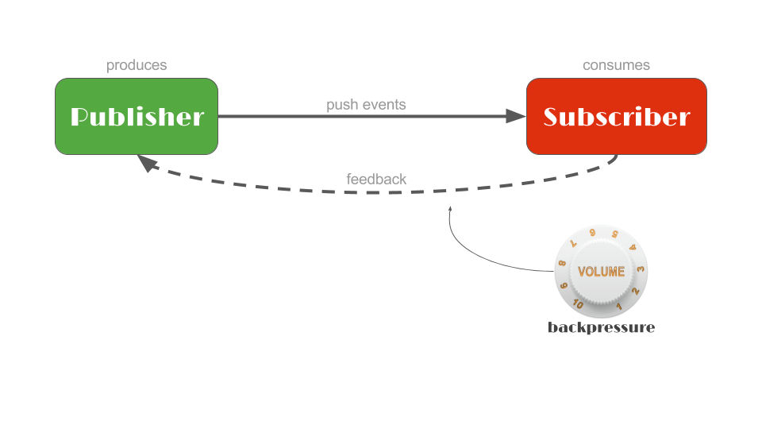

# 新手实践手册

Reactor 3 是一个围绕 Reactive Streams 规范构建的库，在 JVM 上引入了 Reactive Programming 的范例。
在本课程中，您将熟悉 Reactor API。因此，让我们快速介绍一下 Reactive Streams 和 Reactive Programming 中更通用的概念。

## 为什么
反应式编程是一种新的范式，在这种范式中，你使用声明性代码（以类似于函数式编程的方式），以建立异步处理管道。这是一个基于事件的模型，数据被推送给消费者，因为它是可用的：我们处理的是事件的异步序列。
这对于更有效地利用资源和提高应用程序为大量客户提供服务的能力是非常重要的，而不必为编写低级别的并发或/和并行代码而头痛。
围绕着完全异步和非阻塞的核心支柱，反应式编程是JDK中异步代码的一种替代方法：即基于回调的API和Future。
它还促进了组合，这反过来又使异步代码更可读和可维护。

## Reactive Streams
Reactive Streams 规范是一项行业驱动的努力，旨在标准化 JVM 上的 Reactive Programming 库，更重要的是指定它们必须如何行为才能互操作。实现者包括 Reactor 3，还有版本 2 及更高版本的 RxJava、Akka Streams、Vert.x 和 Ratpack。
它包含 4 个非常简单的接口以及一个 TCK，这一点不容忽视，因为规范的规则为其带来了最大的价值。
然而，从用户的角度来看，它是相当低级的。 Reactor 3 旨在提供可以在广泛情况下利用的更高级别的 API，将其构建在 Reactive Streams Publisher 之上。

## 交互
在反应流序列中，源发布者产生数据。但默认情况下，在订阅者注册（订阅）之前它什么都不做，此时它将向其推送数据。

Reactor 添加了运算符的概念，它们被链接在一起以描述在每个阶段对数据应用什么处理。应用一个算子会返回一个新的中间发布者（实际上它可以被认为既是上游算子的订阅者，又是下游的发布者）。数据的最终形式最终出现在最终的订阅者中，它从用户的角度定义了要做什么。


## Flux

### 描述

Flux<T> 是一个 Reactive Streams Publisher，增加了许多可用于生成、转换、编排 Flux 序列的运算符。

它可以发出 0 到 n 个 <T> 元素（onNext 事件），然后完成或出错（onComplete 和 onError 终端事件）。如果没有触发终端事件，则 Flux 是无限的。

Flux 上的静态工厂允许创建源，或从多种回调类型生成它们。

实例方法，运算符，让你构建一个异步处理管道，将产生一个异步序列。

每个 Flux#subscribe() 或多播操作（例如 Flux#publish 和 Flux#publishNext）都将具体化管道的专用实例并触发其中的数据流。

在下面的Flux 部分中:
```java
Flux.fromIterable(getSomeLongList())
    .delayElements(Duration.ofMillis(100))
    .doOnNext(serviceA::someObserver)
    .map(d -> d * 2)
    .take(3)
    .onErrorResumeWith(errorHandler::fallback)
    .doAfterTerminate(serviceM::incrementTerminate)
    .subscribe(System.out::println);
```

它将一组long 值数组作为序列 并且每一个元素延迟 100毫秒,并且在订阅的时候,每一个元素将调用serviceA的someObserver方法 并且 将每一个映射 *2 并只需要三个 ..
在发生错误的时候,通过错误处理器调用fallback 方法, 并且在最终中断之后 调用serviceM的 增加中断次数,订阅的时候尝试打印每一个元素 ..

### 练习
这一节使用不同的工厂方法创建Flux
> 如果你想要一些启发(例如在Flux或者Mono中发生什么,你可以在这些练习返回之后总是追加一个.log()方法到flux中(在它返回之前) 去查看发生了什么) .. 


首先我们可以创建一个空的 flux ..
```java
static <T> Flux<T> empty()
```

或者通过已经好可用的数据去创建Flux
```java
static <T> Flux<T> just(T... data)
// Create a new Flux that emits the specified item(s) and then complete.
```

或者使用迭代器去将这些数据发送到flux中
```java
static <T> Flux<T> fromIterable(Iterable<? extends T> it)
// Create a Flux that emits the items contained in the provided Iterable.
```

在声明式的同步代码中,很容易管理异常(通过try - catch 块,抛出命令 / 指示)

但是在一个异步上下文中, 我们可能做的事情有一点不同, reactive Stream 定义了 onError 信号去处理异常,注意到这些事件都是终态的(这是Flux中产生的最后一个事件)

Flux#error 产生一个Flux(简单的弹射了此信号,立即中断)
```java
static <T> Flux<T> error(Throwable error)
```
为了完成Flux,例如需要尝试去创建一个Flux(产生10个元素) - 按照规律的步伐. 为了定义发布,需要使用interval 操作符,但是这会产生一个无穷流(就像时钟的滴答声),并且我们想要仅仅产生10个元素,因此不要忘记去严格管控它 ..
```java
static Flux<Long> interval(Duration period)
// Create a new Flux that emits an ever incrementing long starting with 0 every period on the global timer.
```
此函数会创建一个从0开始增加一个Long值的无穷序列 (根据这定义的周期来不断增加)

## Mono

Mono<T> 是一个 Reactive Streams Publisher，还增加了许多可用于生成、转换、编排 Mono 序列的运算符。
它是 Flux 的一种特殊化，最多可以发出 1 个 <T> 元素：Mono 要么是有值的（完整的元素）、空的（完整的没有元素）或失败的（错误）。

Mono<Void> 可用于仅对完成信号感兴趣的情况（Reactive Streams 等同于 Runnable 任务完成）。

本意就是,要么成功 / 要么失败(就像一个runnable 任务一样)

就像Flux一样,操作符能够定义异步管道,那么也会重新订阅到这些管道上 ..(也就是说这些管道 本质上通过订阅一一连接对应) ..
每加入了一个操作符,就重新物化了对订阅的实现 ..

请注意，某些更改序列基数的 API 将返回一个 Flux（反之亦然，将 Flux 中的基数减少到 1 的 API 将返回一个 Mono）。

```java
Mono.firstWithValue(
        Mono.just(1).map(integer -> "foo" + integer),
        Mono.delay(Duration.ofMillis(100)).thenReturn("bar")
    )
    .subscribe(System.out::println);
```

上面的代码表示了取任何一个完成的第一个Mono 作为当前Mono异步队列,很显然,Mono.just(1) 很明显将会被打印输出 ..

### 练习

- 创建空的Mono
```java
static <T> Mono<T> empty()
// Create a Mono that completes without emitting any item.
```

- 创建一个不会弹射任何事情的Mono,不像empty(), 它不会弹射onComplete 事件 ..
```ajva
static <T> Mono<T> never()
```

- 从一个普通值上创建Mono
```java
Mono.just(...)
```

- 传播异常
```java
Mono.error(throwable)
```

## StepVerifier
### 描述

到目前为止，您的每个练习的解决方案都是通过使用 StepVerifier 将您定义的 Publisher 传递给测试来检查的。

reactor-test 工件中的此类能够订阅任何 Publisher（例如 Flux 或 Akka Stream ...），然后断言一组用户定义的关于序列的期望。

如果触发了任何与当前预期不匹配的事件，StepVerifier 将产生一个 AssertionError。

您可以从静态工厂的create方法中获取 StepVerifier 的实例。它提供了一个 DSL 来设置对数据部分的期望，并以单个终端期望（完成、错误、取消......）结束。

请注意，您必须始终调用 verify() 方法或结合最终期望和验证的快捷方式之一，如 .verifyErrorMessage(String)。否则 StepVerifier 不会订阅您的序列，也不会断言任何内容。

代码形式如下:
```java
StepVerifier.create(T<Publisher>).{expectations...}.verify()
```

查看[参考文档](https://projectreactor.io/docs/core/release/reference/docs/index.html#_testing_a_scenario_with_code_stepverifier_code) 了解更多可能的期望 ..

### 练习
在这些练习中，方法获取 Flux 或 Mono 作为参数，您需要测试其行为。您应该创建一个使用上述 Flux/Mono 的 StepVerifier，描述对它的期望并验证它。

让我们验证传递给第一个测试方法的序列发出两个特定元素“foo”和“bar”，然后 Flux 成功完成。
```java
void expectFooBarComplete(Flux<String> flux) {
		StepVerifier.create(flux).expectNext("foo").expectNext("bar").expectComplete().verify();
	}
```

现在使用相同测试验证在结尾传递了一个异常 ..
```java
void expectFooBarError(Flux<String> flux) {
		StepVerifier.create(flux).expectNext("foo").expectNext("bar").verifyError(RuntimeException.class);
	}
```

让我们尝试创建一个对用户的 getUsername() getter 有期望的 StepVerifier。一些期望可以通过检查下一个值的 Predicate 来工作，或者甚至通过将下一个值传递给断言库（如 AssertJ 的 Assertions.assertThat(T)）来使用下一个值。
试试这些基于 lambda 的版本（例如 StepVerifier#assertNext 和一个使用 AssertJ 断言的 lambda，比如 assertThat(...).isEqualTo(...)）：
```java
// TODO Use StepVerifier to check that the flux parameter emits a User with "swhite"username
	// and another one with "jpinkman" then completes successfully.
	void expectSkylerJesseComplete(Flux<User> flux) {
		StepVerifier.create(flux).assertNext((User ele) -> "swhite".equals(ele.getUsername())).assertNext((User ele) -> "jpinkman".equals(ele.getUsername())).verifyComplete();
	}
    
    或者 // import org.assertj.core.api.Assertions;
        void expectSkylerJesseComplete(Flux<User> flux) {
        StepVerifier.create(flux).assertNext(ele -> assertThat(ele.getUsername()).isEqualTo("swhite")).assertNext(ele -> assertThat(ele.getUsername()).isEqualTo("jpinkman")).verifyComplete();
        }
```

验证Flux 完成花费了多少时间
```java
// TODO Expect 10 elements then complete and notice how long the test takes.
	void expect10Elements(Flux<Long> flux) {
		StepVerifier.create(flux).expectNextCount(10).verifyComplete().toMillis();
	}
```

下一个更糟：它每秒发射 1 个元素，仅在发射 3600 个元素后才完成！
由于我们不希望我们的测试运行数小时，因此我们需要一种方法来加快速度，同时仍然能够断言数据本身（消除时间因素）。
幸运的是，StepVerifier 带有一个虚拟时间选项：通过使用 StepVerifier.withVirtualTime(Supplier<Publisher>)，验证器将临时替换默认的核心调度器（在 Reactor 中定义执行上下文的组件）。所有这些默认的调度程序都被 VirtualTimeScheduler 的单个实例所取代，它有一个可以被操纵的虚拟时钟。

为了让操作者能够接收到该Scheduler，你应该在传递给withVirtualTime的lambda中懒散地建立你的操作者链。

然后，您必须通过调用 thenAwait(Duration) 或 expectNoEvent(Duration) 来提前时间作为测试场景的一部分。前者只是简单地提前时钟，而后者如果在提供的持续时间内触发任何意外事件也会失败（请注意，几乎所有时间都会至少有一个“订阅”事件，即使时钟没有提前，所以你应该通常在 .withVirtualTime() 之后放置一个 expectSubscription() 如果你打算在之后立即使用 expectNoEvent）。
```java
StepVerifier.withVirtualTime(() -> Mono.delay(Duration.ofHours(3)))
            .expectSubscription()
            .expectNoEvent(Duration.ofHours(2))
            .thenAwait(Duration.ofHours(1))
            .expectNextCount(1)
            .expectComplete()
            .verify();
```

现在让我们来快速的测试一小时长的推送者 ..
```java
// TODO Expect 3600 elements at intervals of 1 second, and verify quicker than 3600s
	// by manipulating virtual time thanks to StepVerifier#withVirtualTime, notice how long the test takes
	void expect3600Elements(Supplier<Flux<Long>> supplier) {
		StepVerifier.withVirtualTime(() -> Flux.interval(Duration.ofSeconds(1)).take(3600))
		.expectSubscription()
		.thenAwait(Duration.ofHours(1))
		.expectNextCount(3600)
		.verifyComplete();
	}
```

## 学习转换异步数据
Reactor 附带了几个可用于转换数据的运算符。

### 练习

例如map的使用(非阻塞的情况下,没有任何延迟的使用方式) !!

```java
	Mono<User> capitalizeOne(Mono<User> mono) {
		return mono.map(ele -> {
                String username = ele.getUsername();
                String firstname = ele.getFirstname();
                String lastname = ele.getLastname();
                return new User(username.toUpperCase(),
                        firstname.toUpperCase() ,
                        lastname.toUpperCase() 
                        );
            });
	}
```

现在想象一下，我们必须调用一个网络服务来大写我们的字符串。这个新调用可能有延迟，所以我们不能再使用同步映射。相反，我们希望将异步调用表示为 Flux 或 Mono，并使用不同的运算符：flatMap。
flatMap 采用返回 Publisher<U> 而不是 U 的转换函数。此发布者表示要应用于每个元素的异步转换。如果我们将它与地图一起使用，我们将获得 Flux<Publisher<U>> 的流。不是很有用。
但另一方面，flatMap 知道如何处理这些内部发布者：它将订阅它们，然后将它们全部合并到一个全局输出中，这是一个更有用的 Flux<U>。请注意，如果来自内部发布者的值在不同时间到达，它们可以交错在生成的 Flux 中。

整个练习的完整示例
```java
public class Part04Transform {

//========================================================================================

	// TODO Capitalize the user username, firstname and lastname
	Mono<User> capitalizeOne(Mono<User> mono) {
		return mono.map(ele -> {
                String username = ele.getUsername();
                String firstname = ele.getFirstname();
                String lastname = ele.getLastname();
                return new User(username.toUpperCase(),
                        firstname.toUpperCase() ,
                        lastname.toUpperCase() 
                        );
            });
	}

//========================================================================================

	// TODO Capitalize the users username, firstName and lastName
	Flux<User> capitalizeMany(Flux<User> flux) {
		return flux.map(ele -> {
                String username = ele.getUsername();
                String firstname = ele.getFirstname();
                String lastname = ele.getLastname();
                return new User(username.toUpperCase(),
                        firstname.toUpperCase() ,
                        lastname.toUpperCase() 
                        );
            });
	}

//========================================================================================

	// TODO Capitalize the users username, firstName and lastName using #asyncCapitalizeUser
	Flux<User> asyncCapitalizeMany(Flux<User> flux) {
		return flux.flatMap(this::asyncCapitalizeUser);
	}

	Mono<User> asyncCapitalizeUser(User u) {
		return Mono.just(new User(u.getUsername().toUpperCase(), u.getFirstname().toUpperCase(), u.getLastname().toUpperCase()));
	}

}


public class User {

    public static final User SKYLER = new User("swhite", "Skyler", "White");
    public static final User JESSE = new User("jpinkman", "Jesse", "Pinkman");
    public static final User WALTER = new User("wwhite", "Walter", "White");
    public static final User SAUL = new User("sgoodman", "Saul", "Goodman");

    private final String username;

    private final String firstname;

    private final String lastname;

    public User(String username, String firstname, String lastname) {
        this.username = username;
        this.firstname = firstname;
        this.lastname = lastname;
    }

    public String getUsername() {
        return username;
    }

    public String getFirstname() {
        return firstname;
    }

    public String getLastname() {
        return lastname;
    }

    @Override
    public boolean equals(Object o) {
        if (this == o) {
            return true;
        }
        if (o == null || getClass() != o.getClass()) {
            return false;
        }

        User user = (User) o;

        if (!username.equals(user.username)) {
            return false;
        }
        if (!firstname.equals(user.firstname)) {
            return false;
        }
        return lastname.equals(user.lastname);

    }

    @Override
    public int hashCode() {
        int result = username.hashCode();
        result = 31 * result + firstname.hashCode();
        result = 31 * result + lastname.hashCode();
        return result;
    }

    @Override
    public String toString() {
        return "Person{" +
                "username='" + username + '\'' +
                ", firstname='" + firstname + '\'' +
                ", lastname='" + lastname + '\'' +
                '}';
    }
}


```
#### 合并(Merge)
合并序列是一种操作，包括监听来自多个发布者的值并在单个 Flux 中发出它们。
在第一个练习中，我们将从两个 Flux 的元素一到达就开始合并它们。这里需要注意的是，来自 flux1 的值会延迟到达，因此在生成的 Flux 中，我们首先会看到来自 flux2 的值。


但是如果我们想保持源的顺序，我们可以使用 concat 运算符。 Concat 将等待 flux1 完成，然后才能订阅 flux2，确保已发出 flux1 的所有值，从而保留与源对应的顺序。

您可以将 concat 与多个 Publisher 一起使用。例如，你可以得到两个 Mono 并根据连接顺序组合成 Flux：

完整代码:
```java
public class Part05Merge {

//========================================================================================

	// TODO Merge flux1 and flux2 values with interleave
	Flux<User> mergeFluxWithInterleave(Flux<User> flux1, Flux<User> flux2) {
		return flux1.mergeWith(flux2);
	}

//========================================================================================

	// TODO Merge flux1 and flux2 values with no interleave (flux1 values and then flux2 values)
	Flux<User> mergeFluxWithNoInterleave(Flux<User> flux1, Flux<User> flux2) {
		return flux1.concatWith(flux2);
	}

//========================================================================================

	// TODO Create a Flux containing the value of mono1 then the value of mono2
	Flux<User> createFluxFromMultipleMono(Mono<User> mono1, Mono<User> mono2) {
		return Flux.concat(mono1,mono2);
	}

}
```

#### 请求

这张图中我们漏了一个方面的细节,那就是容量控制,在reactive Stream 术语中叫做 反压 .. 它存在一个反馈算法 -允许订阅者发送信号到Publisher(表示它准备能够处理多少数据),限制
推送者生产数据的频率 ..

这种对需求的控制是在订阅级别完成的：为每个 subscribe() 调用创建一个订阅，并且可以对其进行操作以取消 () 数据流或使用 request(long) 调整需求

发出请求（Long.MAX_VALUE）意味着无限制的需求，因此 Publisher 将以最快的速度发出数据。

- 练习

也可以在 StepVerifier 中调整需求，方法是使用相关参数创建初始请求并使用 withVirtualTime，然后在您对进一步请求的期望中链接 thenRequest(long)。
在第一个示例中，创建一个 StepVerifier，它产生一个初始的无界需求并在完成之前验证要接收的 4 个值。这等同于您目前使用 StepVerifier 的方式。

接下来我们将一个一个地请求值：为此您需要一个初始请求，但在您收到并断言第一个元素后还需要第二个单个请求。
如果没有更多请求，源将永远不会完成，除非您取消它。这可以通过使用 .thenCancel() 而不是终端期望来完成。如果您还想确保在持续时间内没有接收到传入信号，您可以改用 .expectTimeout(Duration)。

- 调试中的注意事项

使用存储库获取所有用户的 Flux，然后对其应用日志。在下面的控制台中观察底层测试如何请求它，以及订阅、onNext 等其他事件......

如果你想在不真正修改序列中的元素的情况下执行自定义操作，你可以使用以 do/doOn 开头的“副作用”方法。

例如，如果你想在运营商每次收到请求时打印 "Requested"，就使用doOnRequest。如果你想在收到任何信号之前的订阅时首先打印 "开始"，则使用doFirst，等等。

每个 doOn 方法都接受一个相关的回调，表示相应事件的自定义操作。

请注意，您不应该在这些回调中阻塞或调用具有延迟的操作（这对于其他操作符回调也是如此，例如 map）：它更适合快速操作。

完整示例:
```java
ublic class Part06Request {

	ReactiveRepository<User> repository = new ReactiveUserRepository();

//========================================================================================

	// TODO Create a StepVerifier that initially requests all values and expect 4 values to be received
	StepVerifier requestAllExpectFour(Flux<User> flux) {
		return StepVerifier.create(flux).expectSubscription().expectNextCount(4).expectComplete();
	}

//========================================================================================

	// TODO Create a StepVerifier that initially requests 1 value and expects User.SKYLER then requests another value and expects User.JESSE then stops verifying by cancelling the source
	StepVerifier requestOneExpectSkylerThenRequestOneExpectJesse(Flux<User> flux) {
		return StepVerifier.create(flux).expectSubscription().assertNext(User.SKYLER::equals).thenRequest(1).assertNext(User.JESSE::equals).thenCancel();
	}

//========================================================================================

	// TODO Return a Flux with all users stored in the repository that prints automatically logs for all Reactive Streams signals
	Flux<User> fluxWithLog() {
		return repository.findAll().log();
	}

//========================================================================================

	// TODO Return a Flux with all users stored in the repository that prints "Starring:" at first, "firstname lastname" for all values and "The end!" on complete
	Flux<User> fluxWithDoOnPrintln() {
		return repository.findAll().doFirst(() -> System.out.println("Starring:"))
                    .doOnNext(ele -> {
                        System.out.println(ele.getFirstname() +" " + ele.getLastname());
                    })
                    .doOnComplete(() -> {
                        System.out.println("The end!");
                    });
	}

}

```

## 错误

Reactor 附带了几个可用于处理错误的运算符：传播错误但也从错误中恢复（例如，通过回退到不同的序列或通过重试新的订阅）。

在第一个示例中，当原始 Mono 发生错误时，我们将使用 onErrorReturn 方法返回一个包含默认用户 Saul 的 Mono。如果需要，您甚至可以将该回退限制为 IllegalStateException 类。使用 User#SAUL 常量。

让我们用 Flux 做同样的事情。在这种情况下，我们不只是想要一个单一的回退值，而是一个完全独立的序列（想想从缓存中获取陈旧数据）。这可以通过返回到 Publisher<T> 的 onErrorResume 来实现。
每当原始 FLux 中出现错误时，都会发出 User#SAUL 和 User#JESSE：

处理已检查的异常有点复杂。每当在运算符中使用一些抛出检查异常的代码时（例如，地图的转换函数），您都需要对其进行处理。最直接的方法是使用 try-catch 块创建一个更复杂的 lambda，它将检查的异常转换为可以向下游发出信号的 RuntimeException。
有一个 Exceptions#propagate 实用程序可以将已检查的异常包装到一个特殊的运行时异常中，该异常可以由 Reactor 订阅者和 StepVerifier 自动解包：这避免了在堆栈跟踪中看到不相关的 RuntimeException。
尝试在地图中的 capitalizeMany 方法上使用它：您需要捕获已检查的 GetOutOfHereException，但相应的测试仍然直接需要 GetOutOfHereException。

完整示例:
```java
public class Part07Errors {

//========================================================================================

	// TODO Return a Mono<User> containing User.SAUL when an error occurs in the input Mono, else do not change the input Mono.
	Mono<User> betterCallSaulForBogusMono(Mono<User> mono) {
		return mono.onErrorReturn(User.SAUL);
	}

//========================================================================================

	// TODO Return a Flux<User> containing User.SAUL and User.JESSE when an error occurs in the input Flux, else do not change the input Flux.
	Flux<User> betterCallSaulAndJesseForBogusFlux(Flux<User> flux) {
		return flux.onErrorResume(ex -> Flux.just(User.SAUL,User.JESSE));
	}

//========================================================================================

	// TODO Implement a method that capitalizes each user of the incoming flux using the
	// #capitalizeUser method and emits an error containing a GetOutOfHereException error
	Flux<User> capitalizeMany(Flux<User> flux) {
		return flux.map(ele -> {
            try {
                return this.capitalizeUser(ele);
            }catch(Exception e) {
                throw Exceptions.propagate(e);
            }
        });
	}

	User capitalizeUser(User user) throws GetOutOfHereException {
		if (user.equals(User.SAUL)) {
			throw new GetOutOfHereException();
		}
		return new User(user.getUsername(), user.getFirstname(), user.getLastname());
	}

	protected final class GetOutOfHereException extends Exception {
	    private static final long serialVersionUID = 0L;
	}

}

```

## 适配

你能够让RxJava3 和Reactor 3 类型相互交互且不需要单个外部的库 ..

在前两个示例中，我们将从 Flux 适配为实现 Publisher 的 Flowable，反之亦然。
这很简单，因为两个库都提供了一个工厂方法来从任何发布者进行转换。下面的检查器一次运行两个相反的转换：


接下来的两个例子有点棘手：我们需要在 Flux 和 Observable 之间进行适配，但后者没有实现 Publisher。
在第一种情况下，您可以将任何发布者转换为 Observable。在第二种情况下，你必须首先将 Observable 转换为 Flowable，这迫使你定义一个策略来处理背压（RxJava 3 Observable 不支持背压）。

接下来，让我们尝试将 Mono 转换为 RxJava Single，反之亦然。您可以简单地从 Observable 调用 firstOrError 方法 得到Single。另一方面，您将再次需要先将 Single 转换为 Flowable。


最后，您可以轻松地将 Mono 转换为 Java 8 CompletableFuture，反之亦然。请注意这些转换方法都是如何以 from（将外部类型转换为 Reactor 类型时）和 to（将 Reactor 类型转换为外部类型时）开头的。

完整示例代码:
```java
/**
 * Learn how to adapt from/to RxJava 3 Observable/Single/Flowable and Java 8+ CompletableFuture.
 *
 * Mono and Flux already implements Reactive Streams interfaces so they are natively
 * Reactive Streams compliant + there are {@link Mono#from(Publisher)} and {@link Flux#from(Publisher)}
 * factory methods.
 *
 * For RxJava 3, you should not use Reactor Adapter but only RxJava 3 and Reactor Core.
 *
 * @author Sebastien Deleuze
 */
public class Part09Adapt {

//========================================================================================

	// TODO Adapt Flux to RxJava Flowable
	Flowable<User> fromFluxToFlowable(Flux<User> flux) {
		return Flowable.fromPublisher(flux);
	}

	// TODO Adapt RxJava Flowable to Flux
	Flux<User> fromFlowableToFlux(Flowable<User> flowable) {
		return Flux.from(flowable);
	}

//========================================================================================

	// TODO Adapt Flux to RxJava Observable
	Observable<User> fromFluxToObservable(Flux<User> flux) {
		return Observable.fromPublisher(flux);
	}

	// TODO Adapt RxJava Observable to Flux
	Flux<User> fromObservableToFlux(Observable<User> observable) {
		return Flux.from(Flowable.fromObservable(observable,BackpressureStrategy.BUFFER));
	}

//========================================================================================

	// TODO Adapt Mono to RxJava Single
	Single<User> fromMonoToSingle(Mono<User> mono) {
		return Single.fromPublisher(mono);
	}

	// TODO Adapt RxJava Single to Mono
	Mono<User> fromSingleToMono(Single<User> single) {
		return Mono.from(single.toObservable().toFlowable(BackpressureStrategy.BUFFER));
	}

//========================================================================================

	// TODO Adapt Mono to Java 8+ CompletableFuture
	CompletableFuture<User> fromMonoToCompletableFuture(Mono<User> mono) {
		return mono.toFuture();
	}

	// TODO Adapt Java 8+ CompletableFuture to Mono
	Mono<User> fromCompletableFutureToMono(CompletableFuture<User> future) {
		return Mono.fromFuture(future);
	}

}

```

## 其他操作

在本节中，我们将了解一些更有用的运算符，它们不属于我们之前探讨的大类。 Reactor 3 包含很多运算符，所以不要犹豫，查看 Flux 和 Mono javadocs 以及参考指南](https://projectreactor.io/docs/core/release/reference/docs/index.html#which-operator)以了解更多信息。

- 练习
  在第一个练习中，我们将收到 3 个 Flux<String>。它们的元素可能会延迟到达，但每次三个序列都发出一个元素时，我们想要组合这 3 个元素并创建一个新的用户。这种连接和转换操作称为 zip：

如果你有 3 个可能的 Mono 源，而你只想保留发出值最快的那个，你可以使用 firstWithValue 静态方法：

Flux 也有 firstWithValue 静态方法。只有每个 Flux 发射的第一个元素被认为是选择最快的 Flux（然后在输出中反映）：

Reactive Streams 不允许在 onNext 中使用空值。有一个运算符只允许发出一个值，除非它为 null，在这种情况下它将恢复为空的 Mono。你能找到吗？

有时您对 Flux<T> 的元素不感兴趣。如果您仍想保留 Flux<T> 类型，可以使用 ignoreElements()。但是如果你真的只是想要完成，表示为 Mono<Void>，你可以使用 then() 来代替：

同样，如果您想通过回退到另一个不同的情况来防止出现空的 Mono 情况，您可以找到一个执行此切换的运算符：

有时您希望将 Flux 发出的所有值捕获到单独的列表中。在这种情况下，您可以使用 collectList 运算符，它会返回包含该列表的 Mono。
完整的示例:

```java
ublic class Part08OtherOperations {

//========================================================================================

	// TODO Create a Flux of user from Flux of username, firstname and lastname.
	Flux<User> userFluxFromStringFlux(Flux<String> usernameFlux, Flux<String> firstnameFlux, Flux<String> lastnameFlux) {
		return Flux.zip((Function<Object[], User>) values -> new User(values[0].toString(),values[1].toString(),values[2].toString()), usernameFlux, firstnameFlux, lastnameFlux);
    }

//========================================================================================

	// TODO Return the mono which returns its value faster
	Mono<User> useFastestMono(Mono<User> mono1, Mono<User> mono2) {
		return Mono.firstWithValue(mono1,mono2);
	}

//========================================================================================

	// TODO Return the flux which returns the first value faster
	Flux<User> useFastestFlux(Flux<User> flux1, Flux<User> flux2) {
		return Flux.firstWithValue(flux1,flux2);
	}

//========================================================================================

	// TODO Convert the input Flux<User> to a Mono<Void> that represents the complete signal of the flux
	Mono<Void> fluxCompletion(Flux<User> flux) {
		return flux.ignoreElements().then();
	}

//========================================================================================

	// TODO Return a valid Mono of user for null input and non null input user (hint: Reactive Streams do not accept null values)
	Mono<User> nullAwareUserToMono(User user) {
		return Mono.justOrEmpty(user);
	}

//========================================================================================

	// TODO Return the same mono passed as input parameter, expect that it will emit User.SKYLER when empty
	Mono<User> emptyToSkyler(Mono<User> mono) {
		return mono.defaultIfEmpty(User.SKYLER);
	}

//========================================================================================

	// TODO Convert the input Flux<User> to a Mono<List<User>> containing list of collected flux values
	Mono<List<User>> fluxCollection(Flux<User> flux) {
		return flux.collectList();
	}

}
```

## 反应式回到阻塞世界
有时您只能将部分代码迁移为响应式，并且您需要在更多命令式代码中重用响应式序列。
因此，如果您需要阻塞直到 Mono 的值可用，请使用 Mono#block() 方法。如果触发 onError 事件，它将抛出异常。
请注意，您应该通过尽可能支持端到端的反应式代码来避免这种情况。您必须在其他反应代码中间不惜一切代价避免这种情况，因为这有可能锁定您的整个反应管道。

也就是说 这是不建议的 ..

同样，您可以使用 blockFirst()/blockLast() 阻塞 Flux 中的第一个或最后一个值。您还可以使用 toIterable 将 Flux 转换为 Iterable。与上述相同的限制仍然适用。

完整代码:
```java
public class Part10ReactiveToBlocking {

//========================================================================================

	// TODO Return the user contained in that Mono
	User monoToValue(Mono<User> mono) {
		return mono.block();
	}

//========================================================================================

	// TODO Return the users contained in that Flux
	Iterable<User> fluxToValues(Flux<User> flux) {
		return flux.toIterable();
	}

}

```

## 阻塞到响应式

最大的问题是“如何处理遗留的、非反应性代码？”。 

最好的做法是通过调度程序将这些本质上阻塞的代码部分隔离到它们自己的执行上下文中，保持管道其余部分的高效率，并且只在绝对需要时才创建额外的线程。

在 JDBC 示例中，您可以使用 fromIterable 工厂方法。但是如何防止调用阻塞管道的其余部分呢？

最好的做法是通过调度程序将这些本质上阻塞的代码部分隔离到它们自己的执行上下文中，保持管道其余部分的高效率，并且只在绝对需要时才创建额外的线程。
在 JDBC 示例中，您可以使用 fromIterable 工厂方法。但是如何防止调用阻塞管道的其余部分呢？

subscribeOn 方法允许在提供的调度程序上从头开始隔离序列。例如， Schedulers.boundedElastic() 将创建一个按需增长的线程池，自动释放一段时间内未使用的线程。为了避免由于滥用这个简单的选项而导致过多的线程，boundedElastic Sc​​heduler 对其可以创建和重用的线程数设置了上限（与现在已弃用的 elastic() 不同）。
在第一个练习中使用该技巧慢慢地从阻塞存储库中读取所有用户。请注意，您需要将对存储库的调用包装在 Flux.defer lambda 中。

这是因为我们仅在需要的时候才需要调用它们 ..


对于慢速订阅者（例如，保存到数据库），您可以使用 publishOn 运算符隔离序列的一小部分。与 subscribeOn 不同，它只影响它下面的链部分，将其切换到新的 Scheduler。
例如，您可以使用 doOnNext 在存储库上执行保存，但首先使用上面的技巧将保存隔离到它自己的执行上下文中。您可以通过在末尾链接 then() 运算符来更明确地表明您只对了解保存是成功还是失败感兴趣，它返回一个 Mono<Void>。

```java
/**
 * Learn how to call blocking code from Reactive one with adapted concurrency strategy for
 * blocking code that produces or receives data.
 *
 * For those who know RxJava:
 *  - RxJava subscribeOn = Reactor subscribeOn
 *  - RxJava observeOn = Reactor publishOn
 *  - RxJava Schedulers.io <==> Reactor Schedulers.elastic
 *
 * @see Flux#subscribeOn(Scheduler)
 * @see Flux#publishOn(Scheduler)
 * @see Schedulers
 */
public class Part11BlockingToReactive {

//========================================================================================

	// TODO Create a Flux for reading all users from the blocking repository deferred until the flux is subscribed, and run it with a bounded elastic scheduler
	Flux<User> blockingRepositoryToFlux(BlockingRepository<User> repository) {
		return Flux.defer(() -> Flux.fromIterable(repository.findAll()))
		           .subscribeOn(Schedulers.boundedElastic()); // TO BE REMOVED
	}

//========================================================================================

	// TODO Insert users contained in the Flux parameter in the blocking repository using a bounded elastic scheduler and return a Mono<Void> that signal the end of the operation
	Mono<Void> fluxToBlockingRepository(Flux<User> flux, BlockingRepository<User> repository) {
		return flux
                .log()
				.publishOn(Schedulers.boundedElastic())
                .log()
				.doOnNext(repository::save)
				.then(); // TO BE REMOVED
	}

}
```

根据日志
```text
2023-06-11 15:24:50 [main] INFO  reactor.Flux.Zip.1 - onSubscribe(FluxZip.ZipCoordinator)
2023-06-11 15:24:50 [main] INFO  reactor.Flux.Map.2 - onSubscribe(FluxMap.MapSubscriber)
2023-06-11 15:24:50 [main] INFO  reactor.Flux.PeekFuseable.3 - | onSubscribe([Fuseable] FluxPeekFuseable.PeekFuseableSubscriber)
2023-06-11 15:24:50 [main] INFO  reactor.Flux.PeekFuseable.3 - | request(unbounded)
2023-06-11 15:24:50 [main] INFO  reactor.Flux.Map.2 - request(256)
2023-06-11 15:24:50 [main] INFO  reactor.Flux.Zip.1 - request(256)
2023-06-11 15:24:50 [parallel-1] INFO  reactor.Flux.Zip.1 - onNext(Person{username='swhite', firstname='Skyler', lastname='White'})
2023-06-11 15:24:50 [parallel-1] INFO  reactor.Flux.Map.2 - onNext(Person{username='swhite', firstname='Skyler', lastname='White'})
2023-06-11 15:24:50 [parallel-1] INFO  reactor.Flux.Zip.1 - onNext(Person{username='jpinkman', firstname='Jesse', lastname='Pinkman'})
2023-06-11 15:24:50 [parallel-1] INFO  reactor.Flux.Map.2 - onNext(Person{username='jpinkman', firstname='Jesse', lastname='Pinkman'})
2023-06-11 15:24:50 [boundedElastic-1] INFO  reactor.Flux.PeekFuseable.3 - | onNext(Person{username='swhite', firstname='Skyler', lastname='White'})
2023-06-11 15:24:50 [parallel-1] INFO  reactor.Flux.Zip.1 - onNext(Person{username='wwhite', firstname='Walter', lastname='White'})
2023-06-11 15:24:50 [parallel-1] INFO  reactor.Flux.Map.2 - onNext(Person{username='wwhite', firstname='Walter', lastname='White'})
2023-06-11 15:24:50 [boundedElastic-1] INFO  reactor.Flux.PeekFuseable.3 - | onNext(Person{username='jpinkman', firstname='Jesse', lastname='Pinkman'})
2023-06-11 15:24:50 [parallel-1] INFO  reactor.Flux.Zip.1 - onNext(Person{username='sgoodman', firstname='Saul', lastname='Goodman'})
2023-06-11 15:24:50 [parallel-1] INFO  reactor.Flux.Map.2 - onNext(Person{username='sgoodman', firstname='Saul', lastname='Goodman'})
2023-06-11 15:24:50 [parallel-1] INFO  reactor.Flux.Zip.1 - onComplete()
2023-06-11 15:24:50 [parallel-1] INFO  reactor.Flux.Map.2 - onComplete()
2023-06-11 15:24:50 [boundedElastic-1] INFO  reactor.Flux.PeekFuseable.3 - | onNext(Person{username='wwhite', firstname='Walter', lastname='White'})
2023-06-11 15:24:50 [boundedElastic-1] INFO  reactor.Flux.PeekFuseable.3 - | onNext(Person{username='sgoodman', firstname='Saul', lastname='Goodman'})
2023-06-11 15:24:50 [boundedElastic-1] INFO  reactor.Flux.PeekFuseable.3 - | onComplete()
```

可以发现, publishOn 确实控制了它下面的命令的执行上下文(有一部分位于boundedElastic-1中 ..)


### 参考正确代码 文档如下

https://github.com/reactor/lite-rx-api-hands-on/tree/solution/src/main/java/io/pivotal/literx