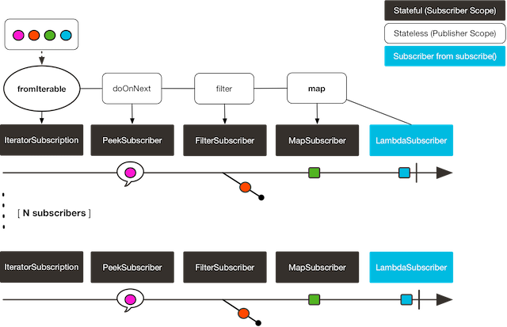
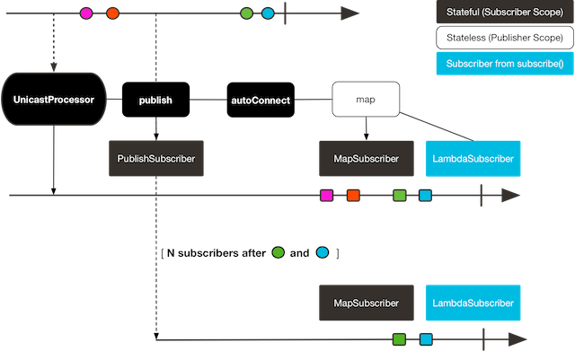

## 高级特性和概念

### 9.2 热 和 冷 序列

在reactor中存在, 序列的冷和热, 区别就是有无状态 ..

以下使用示例说明 冷热的工作方式
```java
Flux<String> source = Flux.fromIterable(Arrays.asList("blue", "green", "orange", "purple"))
                          .map(String::toUpperCase);

source.subscribe(d -> System.out.println("Subscriber 1: "+d));
source.subscribe(d -> System.out.println("Subscriber 2: "+d));
```

输出结果:

```text
Subscriber 1: BLUE
Subscriber 1: GREEN
Subscriber 1: ORANGE
Subscriber 1: PURPLE
Subscriber 2: BLUE
Subscriber 2: GREEN
Subscriber 2: ORANGE
Subscriber 2: PURPLE
```

以下图片是工作方式:



可以看到,在发布者范围内, 这些操作都是无状态的,也就是每一次订阅都会导致这些操作执行 .. 但是订阅者范围 那些东西都是有状态的
(如果订阅者范围的也是无状态 流根本无法进行下去,因为它如果也是无状态,每一次执行都重头开始,会发生类似 99 乘法表的那种结构消费,因为订阅者或许有一些自己的状态,
有关这个的理解,查看下面的详细解释示例,没有状态就会重复执行 ...)

最终就是lambda 订阅(也是 有多少次订阅,就有多少个) ...

但是具体细节,我们不太了解 ..

热:
```java
Sinks.Many<String> hotSource = Sinks.unsafe().many().multicast().directBestEffort();

Flux<String> hotFlux = hotSource.asFlux().map(String::toUpperCase);

hotFlux.subscribe(d -> System.out.println("Subscriber 1 to Hot Source: "+d));

hotSource.emitNext("blue", FAIL_FAST); 
hotSource.tryEmitNext("green").orThrow(); 

hotFlux.subscribe(d -> System.out.println("Subscriber 2 to Hot Source: "+d));

hotSource.emitNext("orange", FAIL_FAST);
hotSource.emitNext("purple", FAIL_FAST);
hotSource.emitComplete(FAIL_FAST);
```

> side note: orThrow() here is an alternative to emitNext + Sinks.EmitFailureHandler.FAIL_FAST that is suitable for tests, since throwing there is acceptable (more so than in reactive applications).
> 说明,orThrow 仅仅是emitNext  + Sinks.EmitFailureHandler.FAIL_FAST 在测试情况的一种好的替代方式 .. 直接抛出异常,在这里应该是一种好的方式 ..

输出结果:
```
Subscriber 1 to Hot Source: BLUE
Subscriber 1 to Hot Source: GREEN
Subscriber 1 to Hot Source: ORANGE
Subscriber 2 to Hot Source: ORANGE
Subscriber 1 to Hot Source: PURPLE
Subscriber 2 to Hot Source: PURPLE
```
下图说明了工作方式:



可以看到在发布者范围 它是无状态的,在订阅者范围是有状态的(订阅者之间有状态,能够做出比较, 做出一些额外的动作,如果没有状态,那么多个订阅者之间的处理完全是互不相干的) .

也就是发布者范围内仅仅处理一次 ..

也就是订阅者1: 接收到了4个元素,由于第一个订阅者不管有无订阅,发布者都会继续, 那么就导致第二个订阅者 丢失了之前的元素 ..

#### 详细解释
```java
 AtomicInteger count = new AtomicInteger(0);
        Flux<Integer> defer = Flux.defer(() -> {
            count.incrementAndGet();
            return Flux.fromStream(Stream.iterate(0, e -> e + 1).limit(count.get()));
        });

        // cold 多次订阅,将会导致 存在不同的流数据 ..

        defer.subscribe(e -> {
            System.out.print("cold one: " + e);
            System.out.print(" ");
        });

        System.out.println();

        defer.subscribe(e -> {
            System.out.print("cold two: " + e);
            System.out.print(" ");
        });
        System.out.println();

        defer.subscribe(e -> {
            System.out.print("cold two: " + e);
            System.out.print(" ");
        });
        System.out.println();

        // 转为热
        // 并没有重复执行 count1 的增长 ..
        AtomicInteger count1 = new AtomicInteger(1);
        Flux<Integer> defer1 = Flux.defer(() -> {
            count1.incrementAndGet();
            return Flux.fromStream(Stream.iterate(0, e -> e + 1).limit(count1.get()));
        })
                .replay().autoConnect();

        defer1.subscribe(e -> {
            System.out.println("hot one: " + e);
        });

        defer1.subscribe(e -> {
            System.out.println("hot two: " + e);
        });
```

在这个示例中,冷流导致map 也会重复执行(因为发布者范围内 它是无状态的) ...

订阅者无状态必然是不可能的(因为要保证流的流程正确执行, 流程也就是有状态的) ...

// 有关订阅者的状态 以后再详细学习 ..

