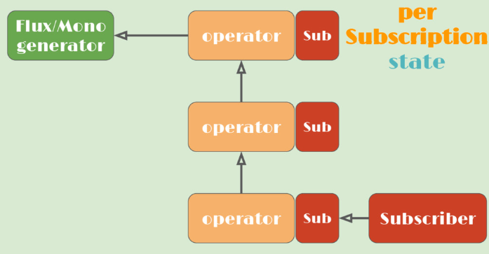
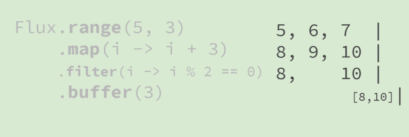
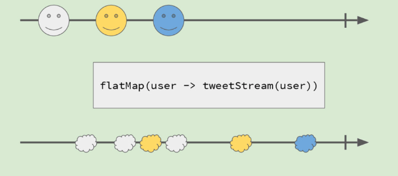

# reactor document

reactor 是一个反应式编程框架

## 介绍

1. reactive code

    reactor 是一个完全非阻塞 并且提供了高效的需求管理 .. 它直接和 java的函数式api,CompletableFuture,Stream 以及 Duration 交互 ..
2. 类型序列

    0 | 1 | N 序列, reactor 提供了两种api,分别是 反应式以及 组合式的API, Flux[n] 以及 Mono[0 | 1],它们广泛的实现了反应式的扩展 ..
3. 非阻塞 IO

    微服务架构的良好套件,reactor 提供了准备好反压的网络引擎(包括http / websocket,tcp,udp) ..

4. 高效的消息传输

   reactor操作员和调度程序可以维持高吞吐率，大约每秒 10 条数百万条消息。它的低内存占用量不受大多数人的关注。 Reactor Core 是第一个基于联合响应式研究成果的响应式库，也由 RxJava 2 实现。
5. 一个适用于所有人的微型反应工具包

    不需要你自己写reactor streams, reactor的模块是可内嵌的 并且可相互交互的, 他们主要提供丰富以及功能性的reactive Streams api ..
    
    你能够在任何粒度下使用Reactor ..

    - 例如 spring boot 以及 webflux 框架中
    - 例如 [cloudfoundry java client](https://github.com/cloudfoundry/cf-java-client)的驱动和客户端
    - 例如[RSocket](http://rsocket.io/) 以及 [R2DBC](https://r2dbc.io/) 的约定或者协议
6.延迟的守护者

   横向扩展是克服延迟和缓慢微服务的重要工具。云原生应用程序和无服务器功能有更好的机会通过异步架构进行有效的横向扩展。为了协助异步设计，Reactor 基于强大的 Netty 框架提供非阻塞和背压就绪的网络运行时，包括本地 TCP/HTTP/UDP 客户端和服务器。


## reactor3 introduction

此介绍中包含了 反应式编程  以及 reactor3 类型操作符,reactor 和 spring 以及 反压和其他 beasts(野兽?) 以及 测试和调试,以及 reactor-netty 以及 reactor-kafka库实现的一些内容

### reactive programming 101
为什么要使用反应式编程? 因为阻塞是有害的 ..(evil),sync/blocking is bad,例如 主线程 发生io阻塞(此时app 不能做任何事) 然后处理恢复之后才能继续做事情 ..


然后,异步与阻塞is bad,主线程通过开启新的线程进行异步执行某些动作,但是主线程尝试等待这些工作线程任务完成,这导致更加复杂并且,有更多的线程消费 ..


异步以及非阻塞,是一个好的选择,处理是非阻塞的,而且不需要更多的线程,分块处理


如何实现这一切而不需要你自己的想法:

   那就是响应式编程,组合异步的基于事件的序列,使用非阻塞操作符 .. 不需要任何牺牲, 例如callbacks? 简直是地狱(例如 圣诞树比喻,可读性非常差) .. 例如
   Futures? 容易阻塞很难组合 ..
   
   此时模型有所变化,并不是拉,而是推 .. 推? 拉(或者两者具有)
   
   
   那么迭代器必然是拉取式的api, 但是我们通过发布/订阅模式能够能更好的原因是? 我们能够通过自身压力反压生产者,(但是拉取式api 也许也能够有类似的能力)..
   但是或许设计上有可能会更加复杂 ..
   
- 在Flux中的数据

   

   发布订阅从图中可以看到,推送事件可以在订阅者方进行反馈给推送者 ..
   这些都是来自Reactive Streams 规范的接口,  例如订阅者的接口如下:

   ```java
      onNext(T)
      onComplete()
      onError(Throwable)
   ```
  
   推送事件中可以存在 0..N 个元素, 0..1(complete | error),在反馈上能够通过承载容量上直接反压 ..
- Reactor3 类型  以及 操作符

   1.Flux<T>

   0 .. N 元素

  

   Flux的时间线,从左到右的时间线, 这些项都是通过Flux 弹射, 这垂直线指示了Flux 已经完全成功了 ..
   这些带点的线 以及 这个盒子指示了一个转换将会应用到Flux. 这个盒子中文本表示了转换的本质 .
 
   2.Mono<T>

   表示最多一个元素
   

   它和Flux的本质区别是 Mono 最多只会发送一个事件项(最终会通过一个错误或者正常信号结束,错误在图中通过一个X 代替)
- reactive stream 聚焦于 java 8

  duration,completableFuture,Stream 以及 受rx 启发的api(以及类似于RxJava的操作符的词汇),类似,但并不是完全相同 ..

   工作流程如下:

   

   也就是说,在你订阅之前不会发生任何事情,定订阅之后:
   
   

   我们能够发现,他会订阅每一个操作符结果 .(也就是说订阅的数据流向是反向的),于是每一个操作符的订阅,都会被生产者反馈,于是生产者就推送数据到每一个操作符
   进行转换,最终到达订阅者

   
- examples

   

   在这张图中,我们能够发现操作符 map,将一个圆圈转换为方框 ..

   

   在这张图中,我们能够发现操作符filter,进行过滤(只需要圆圈元素)

   

   这张图可以看出,在request(int.max)的情况下(也就是说请求所有序列中的元素)通过buffer 操作符,能够缓存一些元素,也就是说一次可以给订阅者多个元素 ..

   ```java
    Flux.range(5,3).map(i -> i + 3).filter(i -> i % 2 == 0).buffer(3)
   ```
  
   图解这一段代码就是:
   

   在过滤的过程中,将会产生3种序列 ..

   

   下图中展示了一个来自Http 反应式客户端的发布者
   

   它可以在请求失败的时候,重试请求 ..
   

   上图可以发现,一旦我们开始订阅,那么订阅者开始request(n)的情况下,发布者连续发送了三个元素,当发生错误的时候,重试操作符可以重新发送订阅信号,并尝试request(n-3),这是代替订阅者发送的信息,
   其次继续发布者传递了3个元素, 直到再次发生了错误,重复此过程 ..

   

   当任何一个地方出现问题的时候,retry 操作符将尝试重新订阅

   
   
- 进一步 示例(flatMap)
   
   
   
   它可以异步的进行后续处理,上图中可以发现,通过flatMap,导致一个圆圈产生了两个方框(这是一个新的序列,将扁平化到操作符之后转换的序列中)

   
   也是同理 ..

   这个规律,可能比较难找,但是其实 一个白脸 等于 三朵白云, 一个黄脸等价于 2朵黄云,一个蓝脸,等价于一个蓝云 ..

   还有更多的操作符可以使用 ..
- 线程上下文

   reactor 是不可知的?
   如何让它促进切换 .
- schedulers

   elastic(弹性的) / parallel(并发性的) / single(单个) / timer(定时)
- publishOn

   将flux的剩余部分放置在另一个线程上
- subscribeOn

   做出订阅并在一个特定的线程中发生请求 ..
   
   
   
   上图我们可以发现, 操作符 / subscribeOn / publishOn 都是可以直接进行订阅的 ..

   并且这些过程都是可以串联起来的
   

   然后可以发现,生产者可以在通过publishOn 在其他线程上实现 操作符的组装和处理, 并后续能够进行操作符处理并通过订阅者订阅 ..
   

   猜测是可以在subscribeOn()之后 继续操作符处理 ??(有待证明)
- 测试和调试(在异步世界中)
   
   测试一个发布者,可以通过StepVerifier, 也可以通过虚拟的时间支持猜测是发布者, 模拟一个源(TestPublisher),调试问题(堆栈更难去辨认),通常仅仅展示订阅发生在哪里
   
- 发现Flux在哪里实例化(装配)

   Checkpoint() 或者完全装配跟踪 ..  但是代价比较高

   

### 反压和 other beasts

当一个订阅者订阅到发布者的时候, 推送的消息是尽可能快的(如果request的越多), 但是我们可以通过反压来调节,推送者的推送频率, 让订阅者保持健康状态 ..

- 内部的最优化

宏的融合,避免不必要的请求往返 .. 共享内部的结构减少分配 ..

- 无锁操作符 以及 工作窃取


### reactor and spring

reactor 和 spring只是相互组合的过程, 并不是说需要spring 才能使用reactor ..

reactor3 其实是spring 55的依赖

spring 5 以及 java8 基准线 ,聚焦反应式 . 新的web 栈(webFlux)

```java
@RestController
public class UserController {
    
    @GetMapping("/{id}")
   Mono<User> getUser(String id) {...}
}
```

函数式选择 - 进行路由 / spring data 反应式仓库

```java
@GetMapping("/{id}")
Mono<User> getUser(String id) {
    return reactiveRepo.findOne(id)    
}
```

### reactor and the network(reactor-netty)

reactor-netty 构建与netty 之上去提供反应式i/o .

- Client / Server
- TCP 或者 udp
- Http and WebSockets
```java
HttpServer.create(0)
        .newHandler((int,out) -> out.sendWebsocket((i,o) -> 
        o.options(opt-> opt.flushOnEach())
        .sendString(Flux.just("test")
        .delayElementsMillis(100)
        .repeat())
        )
).block();
```

### reactor-kafka

基于Kafka 生产者 / 消费者 之上的反应式 API,send(Flux) 到 Kafka中 .. 来自Kafka 的Flux receive() ..


