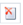

# 基础原理
主要是学习在FastReport中和报表工作的原理,需要一点时间了解报表元素,例如报表页,(数据带[bands]) 以及报表对象。

## 报表
报表构建过程能够如图展示:


报表模版(以后的报表,最终的报表),也就是说,我们在设计器中所看到的那些内容。

保存在文件中的报表使用`.FRX` 扩展,一个报表能够通过设计者或者编程式的帮助创建。

数据能够可以是任意的,可以是程序定义的,或者来源于DBMS,例如,MS SQL,FastReport 也能够与业务逻辑对象一起工作(之后的, 业务对象)。

准备好的报表 - 它是我们在预览窗口中看到的,准备好的报表能够预览,打印,已任何一种支持的格式保存(`.doc` ,`.xls`,`.pdf`以及其他),或者能够通过邮件发送。

## 报表设计器
为了创建一个报表模版,需要使用报表设计器,一个设计器能够给与用户丰富的功能去设计报表并且允许实时预览。

报表设计器是FastReport的组成部分并且不依赖于开发环境(例如,MS Visual Studio). 如果你是一个软件开发者,你能够包含报表设计器到你的应用中,这能够让终端用户有能力去对现有
报表做改变或者创建一个新的报表。


1. 左边是快捷方式区
2. 功能区页面
3. 数据带和报表对象
4. 报表树窗口
5. 数据窗口
6. 属性窗口
7. 报表脚本(代码)
8. 报表页面

## 报表选项

报表选项的窗口能够通过`Report|Options..` 菜单调用,然后可以看到以下内容:

1. 在`General` 通用标签页中,你能够控制如下的报表参数:
- 双重渲染(double pass) 允许启动两次报表渲染, 当你使用总页数系统变量的时候应该很有必要。
- 压缩报表文件 参数允许已压缩形式保存报表,对于压缩,使用的是zip压缩算法,这就是为什么你能够很容易借助任何归档的帮助下抓取原始内容。
- 使用文件缓存 - 允许你去节约内存 - 当你创建一个报表的时候,如果你的报表有大量的页面的时候可以使用此参数。
- 转换空值 - 控制转换空值数据字段列到默认值(0,空字符串,false - 取决于列的数据类型);
- 文本质量 - 允许选择在报表中文本展示的模式,这个模型将不会影响报表的打印。
- 平滑图片 参数允许你启用平滑模式 - 当绘画图形对象的时候(线,边框,照片)

2. 在`Description` 标签页中,你能够获得报表的描述,所有参数都是非必要的,并且这些参数提供了信息相关的目的:

3. 在`Script` 脚本标签页中,你能够选择报表的脚本语言,关于使用脚本工作的详细内容能够在`Script` 章节找到。
4. 在`Security` 安全标签页中,你能够设置一个密码 - 在打开报表的时候将会请求输入密码。
    
    一个报表有一个密码,以编码的形式保存,因此不要忘记密码,在这种情况下恢复一个报表密码实际上不可能。
5. 在`Inheritance` 继承标签页中,你能够控制报表的继承性,这个功能将在后面看到。

## 报表页面
模版由一个(大多数)或者各个报表页面组成,依序,包含数据带. 报表对象例如文本、照片以及其他对象能够放在数据带中。

报表模版能够由多个页面组成,举个例子,你能够创建一个包含标题页以及具有数据页的模版。
当创建这样的一个报表的时候,第一个页面将会先打印,然后打印第二个页面以及其他页面。
模版的每一个页面能够生成一个准备好的报表的一个或者多个页面,这取决于页面所包含的数据。


报表页也能够和子报表一起工作,相比于其他报表生成器,子报表在FastReport中将保存在一个单独的模版页面中,并不是一个单独的页面。

说白了子报表也是一个报表页。

除了报表页面,一个模版能够包含一个或者多种对话形式,对话形式能够在创建一个报表之前要求某些参数的时候很有必要,有关对话形式的工作的详情在`Dialogue forms` 章节。

## 管理页面
当你创建了一个新的报表的时候,它已经包含了一个具有各种报表带的页面。
> 前面说的数据带,其实就是报表带,报表带可以理解为报表页面的基本组成元素,所以报表对象都需要放在对应的报表带中,最终形成报表页面。

为了增加一个新的页面,点击新建页面按钮(),一个页面也能够通过点击按钮,然后选择窗口中的新建报表页面(`New Report Page`)。


以相似的方式,对话表格也能够增加到报表中,使用按钮。

模版页面在设计器中显示为标签页:


第一个标签页中的内容是报表代码,它既不能移动也不能删除。

为了切换到需要的页面,简单的点击对应的标签页. 改变页面的顺序能够通过鼠标的帮助下完成。
对此,左击标签页而不需要释放鼠标,移动标签页到想要的位置。

为了删除一个页面,则点击按钮,这个按钮不会激活 - 如果这个报表仅有一个页面组成。

## 页面的属性
每一个报表页面有自己的设置,例如页面尺寸,方向(横向或者纵向),页边距,列,页来源(纸来源)以及其他内容。

报表模版能够包含各种不同方向和不同页面尺寸的页面,页面配置的窗口能够通过点击按钮调用或者选择`File|Page setup...`(文件|页面配置)菜单项调用。


1. `Paper` 组允许设置页面的尺寸和方向,它可能选择一种支持的尺寸,通过使用下拉框列表选择即可. 它包含了当前打印机所支持的所有页面尺寸。

   当前打印机能够通过 `File|Printer Setup` 菜单配置。
2. `Margins` 组允许配置页面边距, `Mirror margins on even pages` 选项能够被用来打印成册的时候使用镜像边距.

   例如,奇数页的左偏距,在偶数页的时候,其实是翻页,换了一个方向,则表示右边距,那么此时应该镜像右边距为奇数页的左边距,使得保持一致。
   
3. `Source` 组(表示纸张的来源可以选择). 注意到来源可以单独选择,也就是说对于最终报表的第一页,以及其他页面还有最后一页都可以单独选择。
   
   
   这个纸张来源也可以在`Print` 打印弹窗中选择。
4. `Columns`列分组对于多个列的报表来说可以设置列参数,列的数量需要被指定并且(可选的配置列的宽度以及每一个列的位置);


5.`Other` 组允许给出某些有帮助的页面属性. 它可能指出了双面模式(双面打印) - 如果你的打印机支持这个模式的话。

   然后也能够设置水印,这将会打印在准备好的报表页面上。
6. `Extra design width`(额外设计宽度 - 扩展设计宽度) 选择框允许去增加设计模式中的页面的宽度,如果你使用`Table` 或者`Matrix` 这样的对象时非常有用。
7. 双面模式也能在打印对话框中选择。

## 报表带(Bands)

它是一个对象直接位于报表页面中并且是其他对象的一个容器,可以说它是一种的布局容器,它可以容纳`Text`,`Picture` 以及其他对象。

总计,在FastReport中存在13中类型的报表带,取决于它的类型,然后打印在报表的某个位置。

- 报表头(Report Title)

   会在报表开始打印一次,你能够选择打印的顺序,可以在`页头带` 之前或者之后,通过`TitleBeforeHeader` 页属性即可。
   
   改变这个属性通过`Properties` 属性窗口的帮助完成,默认情况下这个属性等于`true`. 那就是报表头将会在页头之前打印。
- 报表尾(Report Summary)

   会在报表结束时打印一次,位于最后一个数据行之后,但是位于`Page Footer` (页尾) 带之前。
- 页头(Page Header)
   
   在报表的每一个页的头部打印。
- 页尾(Page Footer)

   在报表的每一页的尾部打印。
- 列头(Column Header)

   这个列头带将会在打印多个列的报表的时候使用(当列的数量在页的配置中指定的时候).

   它将会在每一个页头带之后的每一个列的顶部打印。
- 列尾(Column Footer)

   每一个列的末尾会打印,在页尾带之前。(例如可以是总计金额等。)
- 数据(DATA)

    数据带将会连接到数据源并且打印正如数据源中的行一样多。
- 数据头(DATA Header)

    这个带将会连接到数据带并且在第一行数据之前打印。
- 数据尾(Data Footer)

    这个带将会连接到数据带并且在最后一行数据之后打印。
- 分组头(Group Header)

    它将会在每一组之前打印,当这个分组的条件的值发生改变的时候.
- 分组尾(Group Footer)

    它将会在每一组结尾打印。
- 孩子(CHILD)

    这个带能够连接到任何带,包括其他CHILD 带,它将会在它的父亲打印之后立即打印。
- 背景(Overlay)

    将会作为背景打印在每一个报表页上。

## 在设计器中的带

设计器中的带表现形式为一个长方体形式的区域,一个带,就许多其他报表对象,可以有边框并且可以被填充(默认是禁用的).
除此之外,一个带会显示网格(grid),为了设置栅格模式,点击`View|Option` (视图|选项)菜单并选择`Report page`(报表页面).

然后可以选择启用或者禁用栅格模式。

你能够通过三种方式设置带的高度:

1. 将鼠标指针放置在带的底部,然后光标(cursor)形状将会改变为`水平分割器`然后你可以调整一个带的尺寸。
2. 拖动左边标尺上的带柄。
3. 使用`Properties` 属性窗口去设置带的`Height` 高度属性。

设计器有两种显示带的模式,你可以随时两者之间切换。

第一种模式,每一个带都有一个头,这包含了带的标题以及一些有用的信息(例如,带所连接的数据源的名称)。


在第二种模式,这个带没有头,取而代之,位于窗口左边,展示带的结构;这个模式帮助去理解报表的结构,特别是如果报表不是你创建的。


你能够切换这个模式 - 通过点击 按钮。

## 配置带

你能够配置这个报表带,通过`Configure Bands` 配置带窗口,通过`Report|Configure Bands...`(报表|配置带) 菜单唤起或者通过`Configure bands` 按钮,
在带树结构上配置带。


在这个窗口中,它能够增加带到报表中,又或是删除报表带或者改变它们的顺序。

为了增加报表带,点击`Add` 按钮或者右击报表带树,一个包含带列表的上下文菜单将会出现,如果带是灰色的则无法增加。


`Add` 增加操作依赖于你从报告树中选择的是什么带? 增加`Data Header` 数据头以及`Data Footer` 数据尾带仅当之前选择的是`Data` 数据(带).

同样也有其他方式配置某些带,通过`Report` 报表菜单完成。


为了删除一个band(带),选择它并点击`Delete` 删除按钮就可。

> 当配置带的时候,FastReport 并不允许做一些会导致创建错误报表模版的操作。
> 例如,你不能删除`Data` 带,这是因为它连接到组,对此,首先需要删除分组.
> 另一个示例是,当删除`Data` 带的时候,它的头部和尾部都会自动删除,同样如果带是页面中的唯一一个元素(没有其他带),则无法删除它。

## 打印带
首先,这里有各种带放置在页面中,那么FastReport如何组合一个最终的报表呢? 查看以下示例:


首先,报表标题将会首先打印,然后页面头部将会立即在之后打印,后续,`Data` 数据带将会被打印(同数据源(此带中连接的数据源)中的行一样多).

在数据带的所有行打印之后,会打印报表的尾部带以及页尾,然后报表的打印至此结束。

一个最终的报表看起来像这样:


在打印的过程中,FastReport 会检查(如果最终报告的当前页具有足够空间),那么带将会打印,如果没有足够的空间,则发生以下事情:

- 页尾将会打印
- 新页将会增加
- 页头将会打印
- 继续打印那些无法放置到之前页面的带。

## 带属性
每一个带都有各种有用的属性,这能够影响打印过程. 它能够通过使用带的上下文菜单进行配置。

为了这样做,右击带的空白区域,不能是被其他对象所占用的.

同样,它也可能通过点击带的头部(如果使用经典展示模式) 或者点击带的结构(否则,其他展示模式).

另一个方法是,选择一个带并且选择属性窗口中的相关属性。

### 属性

1. CanGrow,CanShrink

    这些属性能够确定一个带是否能够增长或者收缩(退缩) 依赖于带中的对象的大小。

    如果属性同时禁用,带将总是需要再设计器中指定,在报告创建章节读取更多信息。
2. CanBreak

    如果属性是启动的情况下,FastReport尝试打印带的内容的一部分在可用的空间,然后断开带。
3. StartNewPage

    打印具有这样属性的带到新的页,这个属性通常当打印分组的时候才会使用,那就是每一个分组将打印在新页。
4. PrintOnBottom

    一个使用这个属性的带将会打印在页的底部,将会在`Page Footer` 页尾带之前。
    
    这是有用的,当打印某些文档的时候,假设总量假设能够打印到页面的底部。
5. RepeatOnEveryPage

    `Data Header`(数据头) 以及 `Data Footer`(数据尾) 以及 `Group Header`(分组头) 以及 `Group Footer`(分组尾),这些带都具有这个属性.

    在每一个新的页面这种类型的带都会打印,直到数据打印结束。

## 报表对象基础知识

1. 文本
2. 照片
3. svg(矢量图片)
4. 线条(Line),可以是竖向、横向或者斜线。
5. 形状(Shape),展示几何图形, 长方形,椭圆,其他。
6. 多段线(Polyline), 展示一条具有不同定点的多段线(支持线片段的弯曲) 

    具有弯曲情况的不同数量顶点的多段线。
7. 多边形

   显示具有不同顶点数和曲率支持的多边形。
8. 富文本(展示RTF 模式)
9. 二维码  展示一个二维码
10. 选择框(展示一个具有两个状态的选择框 `ON` 或者 `OFF`)
11. 表格

    展示一个由行、列以及单元格组成的表格。
12. Matrix(矩阵)

    展示一个矩阵(已知是一个数据透视表(根据枢轴可以横向或者纵向),或者交叉表);
13. 图表 - 展示一个图表
14. Zipcode 展示一个邮政编码
15. 单元格文本

    将每一个字符展示到单独的单元格中的文本。
16. 仪表对象(线性仪表,简单仪表,球形仪表,简单进度仪表)

    这些对象具有相同的功能用于可视化一个值。
17. 数字签名

    用于展示电子签名的可见位。

## 常见的对象属性

所有的报表对象继承于基本的类(ReportComponentBase),并且具有某些常见属性。

在学习每一个对象之前,可以查看一下这些属性。

你能够通过属性窗口界面改变这些属性,某些属性能够使用对象的上下文菜单或者工具条进行修改(例如,边框以及填充).

1. Left,Top,Width,Height

    一个报表对象,以经验来说,是一个长方形,它有坐标(属性`Left` ,`Top`) 以及尺寸(`Width` ,`Height`);

2. Anchor

   这个属性决定了当其所在的容器变大或变小时，物体的位置和/或大小将如何变化。

    通过使用`Anchor` 锚点, 它能够已这样的一种方式完成,对象扩展或者根据容器移动.
    
    更多内容了解动态布局章节。
3. Dock (停靠)

    决定了对象应该停靠在容器的那一边。
4. Border,Fill(边框和填充)

    这个属性将会控制对象的边框和填充,它们可以通过`边框和填充`工具条进行改变。
5. CanGrow,CanShrink

    这个属性允许调整对象的高度 - 以这样的方式适应整个文本。
6. ShiftMode

    如果一个对象启用了这个属性,它能够上下移动,如果此对象上方变大或者变小的时候,跟随,
    更多内容查看动态布局。
7. GrowToBottom

    如果启用这个属性的对象,能够延伸到一个带的底部,查看动态布局了解更多。
6. CanBreak

    文本以及富文本对象拥有这个属性,决定这个对象的内容是否能够拆开。
7. PrintOn

    这个属性决定那个这个对象打印在哪些页面上。

    在成册类型的报表章节了解更多。
8. Cursor

    这个属性决定光标(指针)的类型 - 当放到一个对象上的时候.
    这个属性仅在预览窗口上工作。
9. Visible(可见性)
    这个属性决定了对象是否能够展示在报表中,不可见对象永远不会在预览窗口中展示并且同样不会在打印机上打印。
10. Printable

    这个属性决定了是否这个对象能够在打印机上打印。
    
    如果这个属性禁用了,那么这个对象可以在预览界面上展示,但是不会打印。
11. Hyperlink(超链接)

    这个属性决定了能够让报表对象变得具有交互性,在交互性报表中了解更多。
12. Bookmark(书签)

    这个属性可以结合超链接属性使用,它能够包含一个表达式,表达式能够在报表工作时进行计算,并且它的值将作为书签的名称。
13. Restrictions

    这个属性限制某些操作,例如移动,调整大小,删除对象。
14. Style

    能够设置样式名称到这个属性,然后这个对象将会根据样式名称进行样式渲染,如果这个属性的参数发生改变,那么对象的外观也同样会改变。
## Text

    文本对象是经常会使用的对象,它看起来像:
    

    这个对象能够显示任何文本内容,特别是:
    
    - 一行或者多行文本.
    - 数据列
    - 报表参数
    - 总值
    - 表达式
    - 上面所有项的任何合并(组合);

### 文本编辑

为了编辑一个对象的文本,仅仅双击它即可,你能够看到一个文本编辑器。


编辑器的右边展示了数据树,它的元素能够增加到文本中,能够通过拖动元素到需要放置的位置即可(通过鼠标拖动);

另一种方式是双击这个元素,它将自动插入到光标当前位置。

为了保存改变并关闭编辑器窗口,点击OK按钮 或者输入Ctrl+Enter 快捷键。

另一种编辑文本的方法是,就地编辑,它的尺寸能够通过鼠标进行改变。

### 显示表达式

文本对象能够包含简单的文本以及表达式,例如
```text
Today is [Date]
```

当打印这样的一个对象的时候,包含在文本中的所有表达式能够计算,因此将会打印出当前时间。

如你所见,表达式通过方括号标识,这在`Brackets` 属性中设置,默认包含字符串`[,]` ,当需要的时候,你能够使用不同的符号,例如`<,>` 或者
`<!,!>`,在后者的情况下是,文本中的表达式可以看起来是:
```text
Today is <!Date!>
```
除此之外,也能够禁用所有表达式,为了这样做,设置`AllowExpressions` 属性为false,在这种情况下文本展示为`as is`(原样);

在方括号中,你能够使用任何有效的表达式,在表达式的章节中了解更多内容,一个具有以下内容的对象:
```text
2 * 2 = [2 * 2]
```

将打印出:
```text
2 * 2 = 4
```

常见错误,尝试在括号外部写一个表达式,记住,它将考虑为一个表达式并执行的情况是 - 位于方括号内部,例如
```text
2 * 2 = [2] * [2]
```
这将原样输出
```text
2 * 2 = 2  * 2
```
这也许是在表达式中的元素需要有自己的方括号的情况,例如,引用一个系统变量,看以下示例:
```text
The next page: [[Page] + 1]
```

这里面的Page 是一个系统变量,返回当前报表页的页码,它包括在自己的方括号中,这些括号必须是方括号,不管文本对象设置如何。

严格来说,在上面的实力中我们本应该使用双括号(当`Date` 系统变量):
```text
Today is [[Date]]
```

> 然而FastReport 允许允许移除不必要的括号对 - <font color='red'>如果表达式中仅有一个成员</font>。

## 显示数据列

你能够根据以下方式打印数据列:
```text
[Datasource name.Column name]
```
正如你所见,这里使用了方括号,数据源名称以及数据列名称是通过点分割的.
```text
[Employees.FirstName]
```
有关数据列,查看表达式章节。

这里有各种方式插入一个表达式列到文本对象中.
1. 在文本对象编辑器中,我们能够手动写入数据列的名称,这个方法是最不方便的 - 因为它很容易导致错误。
2. 在对象编辑器中,我们选择需要的数据列并拖动到文本中。
3. 点击文本对象的右上角的小按钮并从列表中选择数据列。
4. 从报表页中的`Data` 窗口拖动并放置数据列,这种情况下`Text` 对象会创建(包含了一个列的链接);

## 在文本中支持HTML 标签

    之前,在FastReport中,在文本对象中,能够通过`HtmlTags` 属性去使用某些简单的Html 标签.
    
    然而,这个属性已经通过新`TextRenderType` 属性的替换,这个新的属性提供了更大范围的功能(相比于处理HTML 标签).

`TextRenderType` 属性具有三个值:
- Default 仅文本,没有标签约定
- HtmlTags 具有Html标签,标签列表十分有限: `<b>`,`<i>`,`<u>` ,`<strike>`,`<br>`,`<sub>`,`<sup>`,``;
- HtmlParagraph 允许你调整行间隔,红线 以及和`HtmlTags` 相同的标签。
- Inline 在简单的格式去展示文本,仅内部使用,不推荐外部化使用。

有一些标签在之前的`HtmlTags` 属性中可用的是`<font>` 标签,这个标签现在不建议了并且不保证能够在所有浏览器中支持,
新的渲染引擎已经引入能够允许特定的CSS风格能够应用 - 例如使用`style` 属性为`span` 标签设置。

让我们更加仔细的查看HTML 标签处理模式:
### HtmlTags

正如之前提供的,`Text` 对象支持以下的HTML标签:
- `<b>` 加粗高亮文本

使用示例:
```text
<b>FastReport</b>
```
- `<i>` 斜体字体风格

使用示例:
```text
<i>FastReport</i>
```
- `<u>` - 下划线文本
```text
<u>FastReport</u>
```
- `<strike>` 删除线文本
```text
<strike>FastReport</strike>
```

- `<br>` 断行符
```text
Fast<br>Report
```

- `<sub>` 下标中展示文本
```text
Fast<sub>Report</sub>
```

- `<sup>` 上标中展示文本
```text
Fast<sup>Report</sup>
```

- `` 插入图片到文本
此标签仅支持`src` 属性,能够包含一个链接到文本,http,https,base64格式都行,同样还包含`width` 以及 `height` 属性,这能够指定图片的 像素规格(尺寸大小);

在这种情况下,图片能够直接插入到文本中,使用http以及https协议的图片链接对于web报表来说是合适的。

使用示例:
```text

```


### HtmlParagraph

此模式包含了一个新的Html标签处理器,和`HtmlTags` 的相同标签集合以及`span` 标签也能够处理。

尽管实际此模式拥有基本上相同的标签,他们渲染是完全不同的,这尤其是能够在`<sub>` 以及`<sup>` 标签上能够体现。

`<span>` 标签提供了能力能够去使用`style` 属性. 这允许你去应用各种CSS样式风格,例如文本颜色,文本字体,对齐方式,以及其他格式化选项 - 直接对文本的指定部分。

因此,替代遗留的`<font>` 标签, 它功能存在限制并且缺乏灵活性,你能够通过使用在`style`属性中具有基本CSS样式的 `<span>` 标签.

```text
<span style="font-size:20pt;">FastReport</span>
<span style="color:red;">Fast</span>Report
<span style="font-family:Consolas;">FastReport</span>
<span style="background-color:yellow;">FastReport</span>
```
结果如下：


### ParagraphFormat

此属性值得考虑,它可以联合`HtmlParagraph` 属性联合使用,并且为了显示段落也提供了配置(行间隔,缩进行),比如说:

- FirstLineIndent
    首行缩进
- LineSpacing

    两行之间的距离(厘米);
- LineSpacingMultiple
    由前一个参数的值所决定的乘法因素,与多行类型工作。
- LineSpacingType

    行间隔类型
  1. 单个
  2. 至少
  3. 精确
  4. 多间隔

  示例设置:
    
  

    结果就是:
    

## 对象属性

1. AllowExpressions

    此属性允许开启或者关闭表达式处理,默认开启.
2. Angle

    此属性指定文本的旋转,角度为单位。
3. AutoShrink

    此属性允许收缩字体的尺寸或者字体的宽度去适应文本(放置文本。);
4. AutoShrinkMinSize

    此属性决定了字体的字体的最小大小,或者最小的宽度比例, - 如果使用了`AutoShrink` 属性。
5. AutoWidth

    此属性允许自动的计算对象的宽度。
6. Brackets

    此属性包含了用于命名表达式的一对符号。
7. BreakTo

    使用此属性你能够组织从一个文本对象到另一个对象的文本流。

    例如,当你存在A和B文本对象的时候,A对象包含长文本并且它并不适应对象的范围。
    你能够设置`A.BreakTo` 到 B,那么`B` 对象将展示无法放置在A中的部分文本。
8. Clip

    这个属性决定是否它有必要将对象范围之外的文本剪切掉,默认是开启的.
9. Duplicates

    这个属性决定了重复的数据怎样打印,查看格式化章节了解更多。
10. FirstTabOffset

    这个属性决定了第一个Tab符号的偏距,像素为单位。
11. Font
    字体设置。

12. FontWidthRatio

    使用此属性去让字体变得更宽或者更窄,默认情况下属性设置为1,为了让字体更宽,那么设置此属性的值 > 1,
    为了让字体更窄,设置此属性的值为 0 -1
13. HideValue

    此属性表示字符串类型,它允许隐藏等于此属性值的对象,格式化章节了解更多。
14. HideZeros

    此属性允许隐藏0值,查看格式化章节了解更多。
15. Highlight
    此属性允许设置条件性高亮.
16. HorzAlign,VertAlign

    这些属性决定文本对齐方式。
17. HtmlTags

    不建议,通过`TextRenderType` 替代。
18. LineHeight

    此属性允许显式的设置文本行的高度,默认是设置为0,因此作为默认行间隔使用。
19. MergeMode

    具有相同内容的文本对象合并方式,两个值:

    1. 水平合并
    2. 垂直合并

    支持单独和同时设置两个方向上的合并。

    注意,这些对象应该相互接近(靠近)。
20. NullValue

    这个文本将打印给定配置值而不是打印null值,你需要取消选择`Report|Options` (报表|选项菜单中的 转换null值选项。)
21. Padding

    这个属性允许你配置内边距,像素为单位。
22. ParagraphFormat

    设置显示文本的配置(行间距,红线缩进). 在文本中支持的`Html 标签` 章节了解更多。
23. ParagraphOffset

    段落偏距,像素尺寸,对于`TextRenderType.HtmlParagraph`, 使用`ParagraphFormat.FirstLineIndent` 属性即可。
24. RightTopLeft

    这个属性指示是否文本应该从右向左展示.
25. TabPositions
    tab字符位置的集合,像素,负值不影响这个值。
26. TabWidth

    这个属性决定了Tab符号的宽度,像素单位。
27. Text
    属性决定了这个对象包含的文本
28. TextFill

    这个属性决定了文本的填充方式,使用这个属性编辑器去选择不同的填充类型。
29. TextOutline

    围绕文本的边框用于强调或样式化。
30. TextRenderType

    此属性允许你在对象文本中使用HTML 标签,在文本中支持的Html标签章节了解更多。
31. Trimming

    此属性决定处理不在对象范围内容的文本应该如何修剪,仅当`WorkWrap` 属性设置为`false`的时候才会使用。
32. Underlines

    这个属性允许在每一个文本行下面展示一个下划线,仅当文本是顶部对齐的时候才可以使用此i属性。
33. WordWrap

    这个属性决定是否有必要根据单词换行文本。
34. Wysiwyg
    
    what you see is what you get
    这个属性改变文本对象的显示模式去匹配屏幕和最终的打印输出,这个模式仅当你使用两端对齐或者非标准的行高时。

## 富文本对象

此对象显示格式化文本,基于(RTF格式),看起来像这样:


尝试使用文本对象去展示一个文本,当你导出报告为某些文档格式,那么富文本对象将会导出为图片。

此对象仅支持实线填充类型,梯度,该对象仅支持实心填充类型。不支持渐变填充、网格填充和玻璃填充。

为了编辑这种对象,双击它,然后你能够看到一个编辑器窗口:


你也能够使用Word 创建一个文本,当你完成之后将它保存为RTF格式,然后,你需要打开富文本编辑器然后使用加载RTF文件。

富文本对象不支持Microsoft Word所有的格式特性。

你能够以以下方式展示数据到此对象中:

- 你能够在对象文本中插入一个表达式,就像是在文本对象中操作一样,插入必要的数据列到此对象中。
- 使用DataColumn 属性来绑定此对象到给定列。

此对象具有以下属性:

- AllowExpressions 此属性允许开启或者关闭表达式处理,默认开启。
- Brackets 命名一个表达式的一对符号。
- DataColumn 此对象所限定的数据列。
- Text    此属性包含的RTF 文本
- Padding 内边距(像素单位)


## 其他报表对象

.. 省略


