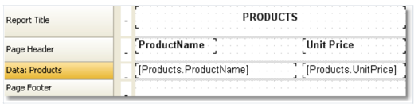

# 第一个报表

此报表非常简单,打印一个产品的所有列表,使用的产品表的数据能够在示例数据库中发现。

假设,你需要在编写的下面的示例程序中去执行这个动作,调起报表设计器。

## 手动创建一个报表

此示例中, 手动创建报表:

- 点击向导程序,然后在`ADD New Item` 增加一个新项窗口中,选择`Blank report`(空白报表);
- 在数据菜单中,选择数据源,并选择`Products` (产品数据源);

- 第二种方式是你能够 从XML文件中增加你的数据:

    - 在`Data` 菜单中,选择增加数据源,然后数据向导表格将会打开
    - 然后选择新连接按钮(New Connection ...);
    - 选择连接类型: Xml 数据源,点击数据文件或者URL的图片。

       

    - 在打开的对话框中,你可以选择相关的数据文件
    - 然后检测是否连接到了数据库,点击测试连接按钮,如果连接测试完全成功,那么可以关闭连接窗口。
    - 在数据向导中,点击下一步
    - 然后展开`表格列表`(Tables) 的根节点,然后选择产品表并点击完成。

    
    - 切换到数据服务窗口(如果没有出现,可以选择`Data|Show Data Window` 菜单项目),展开`Data Sources` 项,然后选择产品表即可。
    - 拖动想想要的字段到数据带中,然后FastReport会创建一个文本对象,它会连接到列以及此列的头部。
    - 我们能够通过另一种方式创建`UnitPrice` 数据列,点击工具栏中的`Text` 文本对象;
      
      
       移动鼠标并拖动指针到`Data` 数据带,能够看到FastReport提议插入一个对象,选择需要的位置并且点击鼠标去插入这个对象。
    - 将鼠标指针放到对象上然后点击此对象上的右上角小按钮,你将能够看到一个数据列的列表,从列表中选择`UnitPrice`
    
    - 创建文本对象 - 作为`UnitPrice` 列的头,放到页头带中,点击对象并填写文本`Unit Price`(单价);
    - 创建文本对象 - 作为报表的标题,放置在报表标题带中并且填入文本`PRODUCTS`(商品);
    - 设置所有放置在页头以及报表头带中的所有对象的字体风格加粗,对此,通过按压`Shift` 按钮并 选择对象,然后点击`Text` 工具条中的`B` 按钮

      在这之后,报表应该看起来如下:
      
    - 有几种方式运行报表:
      1. 使用控制面板中的预览按钮。
      2. 使用键盘快捷键 CTRL+P.

    这个报表将构建好冰展示在预览窗口。
    
## 通过向导程序创建一个报表

我们通过借助标准报表程序的帮助下创建报表,需要以下步骤:

1. 点击工具条上的向导按钮, 在打开的窗口中选择标准报表向导

2. 然后第一步我们需要选择数据源`Products` 并点击下一步按钮

3. 在向导的第二步中,我们选择ProductName 以及 UnitPrice 数据列。

4. 然后其余步骤跳过,点击下一步按钮
5. 在向导的最后一步中,选择`Blue` 蓝色风格并选择`Finish(完成)` 按钮。

最终FastReport将会创建以下报表:

点击预览按钮查看构建好的报表。

    