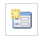
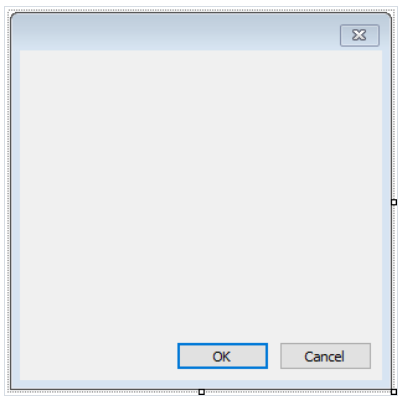

# 控件

除了一个正常的页面之外, 报表能够包含一个或者多个对话窗口.

这种对话窗口将在报表开始时展示, 在对话框中你能够输入任何类型的信息,被用来创建报表所需要的。
同样的,一个对话框也可以用来过滤数据,那些数据将在报表中展示。

为了增加对话框到报表, 点击设计器中的工具栏,一个新的对话框看起来像:

一个报表, 有一个或者多个对话框, 工作流程如下:

1. 当开始时,这个报表显示第一个对话框.
2. 如果对话框通过`ok` 按钮关闭,则显示下一个对话框,否则报表停止工作。
3. 当所有对话框已经显示完毕之后,报表将会构建。

在对话框中你有以下控件能够使用:

1. `ButtonControl` 表现为一个windows 平台下的按钮控件。
2. `CheckBoxControl` 表现为一个windows 平台下的选择框
3. `CheckedListBoxControl` 显示一个列表盒 - 其中每一项的左边都有一个选择框.
4. `ComboBoxControl` 呈现为一个windows 组合框(或者下拉列表框)
5. `DataGridViewControl` 在可自定义栅格的情况下显示数据。
6. `DataSelectorControl` 显示两个列表 - 允许从一方分配项到另一项。
7. `GroupBoxControl` 呈现了一个windows 控件(显示围绕一组具有可选标题的控件的框)
8. `LabelControl` 标准的window 标签(文本)控件
9. `ListBoxControl` 呈现一个显示一组列表项的windows 控件。
10. `ListViewControl` 呈现一个windows 列表视图控件, 项目集合能够使用4种不同视图中的一种显示。
11. `MaskedTextBoxControl` 使用一个`#` 掩盖用户的正确和不正确的输入。
12. `MonthCalendarControl` 表示让用户使用可视化的月份日历显示来选择一个日期的 windows 控件。
13. `NumericUpDownControl` 表示一个windows 显示数值的选值框(已知为上下控件按钮)
14. `PanelControl` 被用来对控件分组(也就是这是一个控件容器, 面板组件)
15. `PictureBoxControl` 显示一个图片的图片框。
16. `RadioButtonControl` 让用户能够从一组选择中选择一个选项(当和其他`RadioButton` 控件成对时)
17. `RichTextBoxControl` 表示window 富文本盒控件
18. `TextBoxControl` 表示一个文本框控件
19. `TreViewControl` 表示一组具有层次化的标签化项目的集合。

所有控件, 除了`DataSelectorControl` 都类似于在`.NET` 框架中可用的标准控件。

控件名称有前缀Control为了避免命名冲突, 那就是, `ButtonControl` 对应了`NET` 框架中的`Button` 元素。