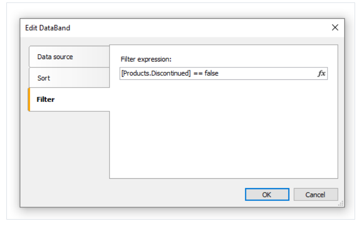

# 数据过滤

能够被用来过滤那些数据可以被打印, 如果 你要打印一组员工, 通过对话框,你能够选择一个或者多个需要打印的员工, 然后当构建报表的时候,
数据将会过滤然后仅有选择的员工被打印。

> 对于数据过滤, 必要的是初始化报表包含所有数据, `filtering` 自身的名称, 当构建报表的时候不必要的数据将不会打印。

最简单进行数据过滤的方式就是使用数据带中的`Filter` 属性, 在带编辑器中你能够指定过滤器表达式,例如:

使用这个对话框, 你能够向用户询问一个值, 然后将它使用在过滤器表达式中, 查看`示例部分的简单过滤示例`了解更多。

这个方法能够被使用 - 如果值很简单,   如果任务是显示一些数据 并且需要选择其中一两个, 这可能实现变得困难, 你可能觉得这是一个简单的任务,
展示员工在`ListBoxControl` 控件元素中,然后从中选择一两个值即可, 为了实现这种方式, 你需要使用脚本, 根据以下方式:
1. 根据名称获取数据源
2. 初始化数据
3. 将数据加载到ListBoxControl
4. 在选择员工之后, 构建一个将在数据带中使用的过滤表达式

FastReport 能够自动做这些事情, 对此,自动过滤将被使用, 我们现在就能观察到。

