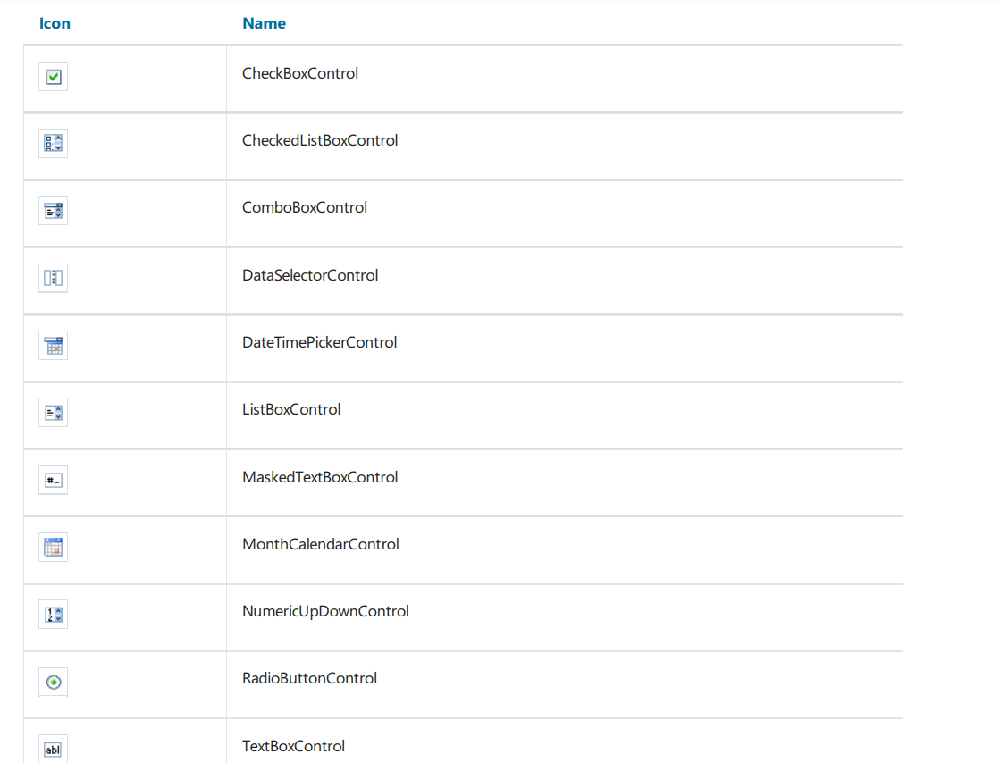

# 自动过滤

将控件关联到数据列 是通过`DataColumn` 属性, 如果控件能够显示一组值(例如,ListBoxControl), 它将从指定的数据列加载值, 当弹窗显示的时候这能够
自动发生,然后,用户使用对话框工作,在控件中选择一个或者多个项 然后关闭对话框, 此时,指定在`DataColumn` 属性中的数据源将会自动过滤。

> 这个方法的优势是, 你能够在任何报表中使用且不需要写任何代码。

自动过滤被以下的控件支持:

这些控件名称不在赘述。

