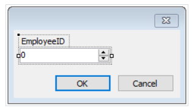
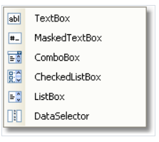
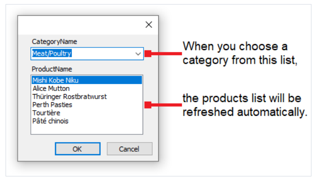

# 增加过滤器

FastReport 的对话框设计器有着非常丰富的能力 - 可以增加控件, 支持数据过滤.

对此,从数据窗口中拖拽数据列到对话窗中, 然后FastReport 自动创建控件头(LabelControl 控件)然后有一个实际的控件被用来进行数据过滤:


控件类型依赖于数据列的类型,如果列是字符串类型, 那么插入之后, 你被主动提供去选择控件类型:


如果你插入了两个类似的控件并且连接到相同数据列, FastReport 会自动的在`FilterOperation` 属性的帮助下配置数据范围, 第一个控件将是
`FilterOperation = GreaterThanOrEqual` ,第二个是`LessThanOrEqual` , 如果插入的列不是字符串类型,那么将自动完成.

照这样而言, 为了增加数据过滤到报表中, 你需要做以下事情:

1. 增加新对话框到报表
2. 然后为对话框增加需要进行过滤的数据列。

## 数据范围过滤

这种过滤方式对于具有数量特征的一些值工作来说是合适的, 例如,价格, 你能够过滤商品(小于或者大于),为了指定怎样解释在元素中出现的值, 使用`FilterOperation` 属性,正如上面看到的。

使用两个控件,这能够连接到相同数据列 可以有不同`FilterOperation` 属性的配置, 能能够指定数据范围的开始和结束, 对于第一个控件,你需要设置
`FilterOperation = GreaterThanOrEqual`, 对于第二个`FilterOperation=LessThanOrEqual` .


## 过滤相关的数据列(利用关联)

正如我们所知, 两个数据源之间可以建立关联, 通过这种关联关系 我们能在数据源中过滤数据, 通过使用一个来自不同源的数据列。

假设,你在对话框上放置了一个`ListBoxControl` 然后在它的`DataColumn` 属性上设置了以下数据列:
```text
Products.Categories.CategoryName
```

过滤如何工作:

1. 当通过控件过滤这些值的时候, 来自`Categories` 分类数据源的`CategoryName` 列将会被使用
2. 然后过滤器将会应用到`Products` 表, 那些数据行将会过滤 - 根据用户所选择的那些分类。
```text
the [Products.Categories.CategoryName] contains one of the values, selected by the user
```

## 使用级联列表进行过滤

这仅仅更换了用户选择过滤数据的方式, 根据用户在另一个列表中选择的值来改变此列表的值列表,例如在表格中有两个列表, 一个是分类另一个是产品,
当你在第一个列表中选择分类的时候,你能够看到在第二个列表显示了选择分类下的产品。



为了创建一个级联列表,你需要使用具有主从关系的两个数据源, 附加主列表到主数据源的一个列上, 附加详列表到详细数据源的一个列上.

同样能够设置主列表的`DetailControl` 属性到详细列表。


