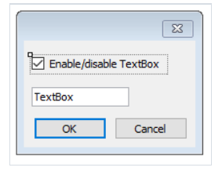
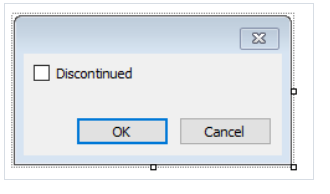
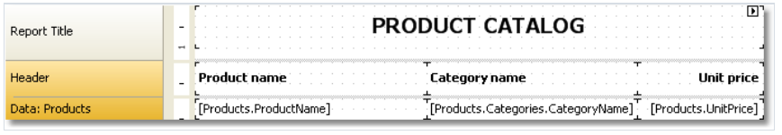

# 示例

## 1. Hello - FastReport

这个示例,我们创建一个对话框, 然后展示一个问候, 创建一个新报表然后增加对话框, 对此点击工具栏上的即可,


然后在对话框中,我们增加一个`LabelControl` 来设置它的`Text` 属性


当我们运行报表的时候,能够看到这个弹窗, 点击OK关闭即可, 然后报表将会构建, 如果对话框通过`Cancel` 或者`X` 关闭,那么报表将会停止工作, 并且返回到设计器。

## 示例2. 从用户获取文本

在这个示例中,我们能够创建一个对话框, 能够从用户哪里获取一段任意文本,之后将输入的文本打印在报表上。

创建一个新报表然后增加对话框到其中, 在对话框中, 放置`LabelControl` 以及`TextBoxControl` 控件:


在给定情况下,用户输入的值将包含在`TextBoxControl` 的`Text` 属性, 为了在报表中打印这些值,
增加一个新的文本对象到`Report Title`带中 然后输入以下内容:
```text
You have entered: [TextBox1.Text]
```

## 3. 处理对话控件

通过使用脚本和控件的事件, 你能够处理控件(就像在Visual Studio中那样), 我们将举例, 怎样让CheckboxControl 能够处理TextBoxControl的访问性。

创建一个新报表然后增加对话框到其中, 在对话框中, 放置`CheckBoxControl` 以及 `TextBoxControl` 控件, 正如下图所见:


现在选择`CheckBoxControl` ,打开它的属性窗口,然后增加一个事件,`CheckedChanged` 事件, 这将会在选择框改变状态之后触发, FastReport 将会创建
一个空的事件处理器,然后编写以下代码:
```text
private void CheckBox1_CheckedChanged(object sender, EventArgs e)
{
TextBox1.Enabled = CheckBox1.Checked;
}
```
如果我们运行报表,你能够看到`TextBoxControl` 的启用情况根据选择框设置。

## 4. 处理报表对象

假设有一个报表根据它的分类来打印一组产品,如下所示:


我们将展示如何停止打印产品并且仅打印分类, 根据对话框的帮助下, 于是我们可以先增加一个对话框到报表中:


双击`OK` 按钮, FastReport 能够创建`Click` 事件处理器, 写以下代码:
```text
private void btnOk_Click(object sender, EventArgs e)
{
Data2.Visible = CheckBox1.Checked;
}
```

我们能够控制带的可见性(对于打印产品列表的带), 在我们的示例中,这个带是`Data2`(这是他的名称), 如果报表运行,那么取消选择框,那么能够看到仅打印分类:


## 5. 简单过滤

现在有一个示例,如下所示, 打印一组产品:


现在我们将展示如何根据产品的首字符进行产品过滤, 在这个期间, 我们将不使用自动数据过滤功能,对此我们增加一个对话框,然后放置两个控件到其中 - `LabelControl` 
以及`TextBoxControl` .


现在打开数据带编辑器 然后在其中指定过滤表达式:


运行报表并确保一切事情正确工作:


## 6. 自动过滤

下面的示例展示了如何增加一个过滤器到报表中,我们根据`Products.Discontinued` 列来过滤数据


增加对话框到报表,然后拖拽`Products.Discontinued` 列到对话框中:


这就是我们需要做的所有事情, 我们仅双击,然后FastReport 自动的连接控件到数据列 ..

运行报表并且启动`Discontinued` 标志, 之后,点击`OK` 按钮, 你能够看到仅包含`Discontinued` 标志的产品会打印。


## 7. 根据范围进行自动过滤


在前面的示例中,我们已经了解了如何过滤指定范围的费用的商品, 对此我们能够增加对话框到报表中然后拖拽`Products.UnitPrice` 数据列到它,
之后我们修正标签文本。


现在同样的方式,增加另一个控件(同样连接到`Products.UnitPrice` 列) 然后修正它的头:


那就是我们所做的全部,剩余的FastReport 将自动完成, 连接到数据列以及设置它们的`FilterOperation` 属性, 弟弟一个控件得到了`FilterOperation = GreaterThanOrEqual` .

第二个,`LessThanOrEqual` .

运行报表并指定值范围, 例如 20 -30, 那么点击OK, 报表将会构建, 然后它包括指定范围的值.


## 8.根据关联数据列过滤

在这个示例中,将对相关联的数据源执行数据过滤.

例如有一个简单列表的报表,它打印一组产品，分类名称将打印到每一个产品的旁边, 这完全根据关联的帮助下完成。
```text
[Products.Categories.CategoryName]
```

这个报表将如下展示:


当我们运行这个报表的时候,我们能够看见:


现在让我们根据分类名进行过滤, 增加一个新的对话框, 然后拖动`Products.Categories.CategoryName` 列到其中:


当创建控件的时候, 你能够选择它的类型,选择CheckedListBoxControl, 如果运行报表,你能够看到如下对话框:


选择各种分类然后点击OK, 之后数据将会被过滤,你将得到以下报表:


正如所见, 仅有给定分类下的产品得到了保留。


