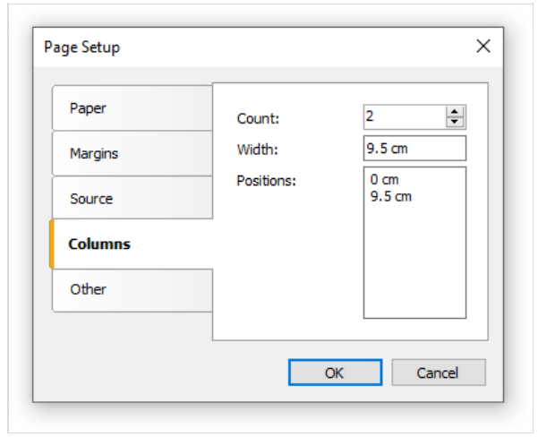
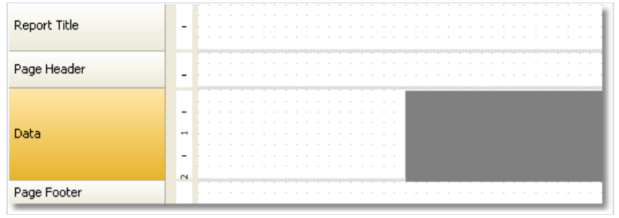
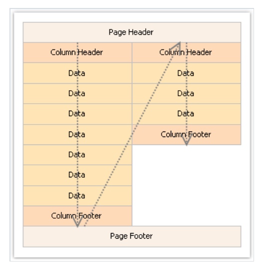
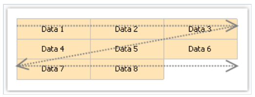
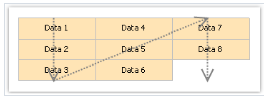

# 多列报表

一个原始的报表打印数据会一直打印,只要它没到达页的尾部, 此后,一个新页面会产生并且继续打印, 一个具有列的报表打印数据到各个列中。

当页面的结尾已经到达的时候,会在相同页上通过新列继续打印,在这种情况下,一个原始的报表能够是看做具有一个列的报表。

在FastReport中这里有两种方法打印列。

## 页列

第一个方法是基于报表页面的列的数量设置,这能够在页面配置窗口中的列标签页中完成:

正如你所见,你能够设置以下列参数:
1. 列数量
2. 列宽度
3. 每一个列的位置

为了转换一个原始的报表到具有列的报表,你仅需要再页上设置列的数量, FastReport 会计算其余的参数. 当你启用这些列的时候,带的模式在设计器中发生了改变:

有一个块区域是灰色的 应该绝不可能被用来放置对象在它之上,它被用来打印接下来的列的对象。

为了让列工作, 列头和列尾带将被使用,正如它们的名称,它们将会分别的打印在每一个列的顶部和尾部,下图说明

## 数据带列

另一种打印多个列的报表的方式是数据带的列使用, 带的剩余部分将在一个列中进行打印。

列的参数能够使用`Columns` 属性配置, 这能够在属性窗口中进行改变,你能够设置以下的参数:

1. 列的数量,
2. 列的宽度
3. 列的打印模式
4. 你能够在两种模式中二选一: `AcrossThenDown`(先横向然后再竖向) 以及 `DownThenAcross`(先竖向然后横向);
5. 在一个列中的最小行数, - 仅当你选择`DownThenAcross` ;

列带能够在两种模式中打印,在`AcrossThenDown` 模式中(默认格式),列数据将以下方式打印:

在`DownThenAcross` 模式,列打印应该以以下方式发生:

在这种模式中,FastReport 会计算数据行的数量 ,列将会均匀填充,你能够设置最小行数 - 通过列的`Columns.MinRowCounts` 属性。

