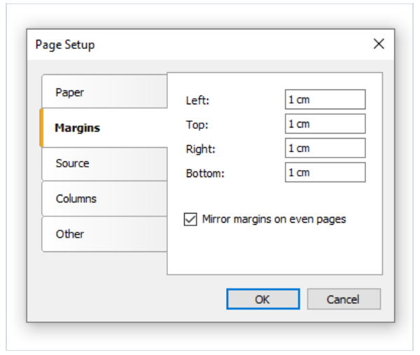
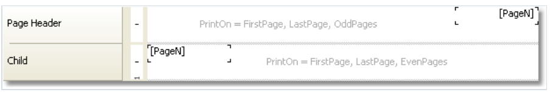

# 成册类型报表

当你打印成册类型的报表,你可能会面临以下要求:

1. 独立的报表页 - 封面,目录, 报表内容,封底,
2. 对于奇偶页具有不同的页面偏距。
3. 在奇偶页上有不同的头部和尾部。

## 增加页面到报表中

你能够增加任何数量的页面到报表模版, 每一种页面你能够放置一个单独的报表,为了增加一个新的页面,点击工具条上的按钮,
一个页面能够增加, 点击`Add New` 按钮即可 然后在窗口中选择`Report page` 项目即可。

> 为了创建目录部分,你能够使用`交互式报表章节中` 的技术。

## 页面设置

在页面设置中,能够在FastReport中指示应该对偶数页进行 左右偏距进行镜像。

如果你需要从奇数页开始, 设置`StartOnOddPage` 属性为true,当需要时,FastReport 会在打印指示页之前打印空页。

## 奇偶页打印

所有的打印对象都有`PrintOn` 属性,使用这个对象,你能够在奇偶页上打印不同对象。
> 此属性能够在属性窗口中设置.

这个属性决定那些页面才打印这个对象,这个属性具有以下的值以及它们之间的任何合并:
1. FirstPage
2. LastPage 此报表必须是双通道
3. OddPages;
4. EvenPages;
5. RepeatedBand  这个指的是设置`RepeatOnEveryPage` 属性为true的带。
6. SinglePage  这个报表必须是开启二次渲染的

默认情况下, 这个属性的值等于`FirstPage, LastPage, OddPages, EvenPages, RepeatedBand, SinglePage`,这意味着这个对象将会打印到报表的所有页面上。

在仅有一个页面的报表情况下,这个对象的可见性将由`SinglePage` 值进行确定。

我们将给出使用此属性的各种典型的示例:
1. FirstPage
    仅第一页
2. LastPage,OddPages,EvenPages,RepeatedBand

    在所有页面上显示,除了第一页
3. FirstPage,OddPages,EvenPages,RepeatedBand

    在所有页面上显示,除了最后一页
4. RepeatedBand

    仅在属性`RepeatOnEveryPage` 设置为true的情况下显示。
5. FirstPage,LastPage,OddPages,EvenPages

    在所有带上显示,除了重复的带。
6. FirstPage,LastPage,OddPages,RepeatedBand
    仅在奇数页上显示。
7. FirstPage,LastPage,EvenPages,RepeatedBand
    仅在偶数页上展示。

> 奇偶页通过在渲染中的报表的页码来确定, 页码从0开始,例如,在预览中展示的第二页将会是奇数页(因为它的页面在报表中渲染为1);

例如,为了在奇偶页中打印不同文本,放置两个文本对象在带中然后以以下方式设置它们:
- 第一个对象在奇数页中打印,设置`PrintOn` 属性为`FirstPage`,`LastPage`,`OddPages`,`RepeatedBand`(例如,所有值,除了`EvenPages`)
- 第二个对象在偶数页中打印,设置`PrintOn` 属性为`FirstPage`,`LastPage`,`EvenPages` ,`RepeatedBand` (例如,所有值,除了`OddPages`)

这些对象绝不会同时打印,你能够将它们重叠在一起.

所有带都有这个属性, 为了在奇偶页上打印不同带,使用`Child` 带,你能够将它附加到任何带,这能够在`Configure Bands` 窗口中进行设置, 设置主带然后根据以下方式设置它的子带:
设置子带的`PrintOn` 属性为:
1. `FirstPage`,`LastPage`,`OddPages`,`RepeatedBand`(例如,所有值,除了`EvenPages`)
2. `FirstPage`,`LastPage`,`EvenPages` ,`RepeatedBand` (例如,所有值,除了`OddPages`)

带能够有不同的高度,外观和内容, 查看以下例子 它能够打印不同的页高度：

