## 分组和总和

前面我们已经看过主从报表类型,它从两个相关的数据源打印数据,FastReport 允许你创建一个报表(看起来以相同方式),但是仅使用一个数据源,对此,我们需要使用分组。

一个分组是三个带的集合(分组头,数据带,分组尾),在设计器中,这看起来像下面这样:
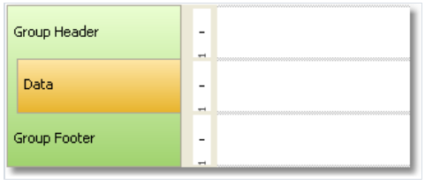

> 一个分组总是包含了一个头和数据, 分组尾是可选的,你能够删除它。

为了使用分组,你应该为分组头设置分组条件, 并且将数据源关联到数据带, 这个条件可以是任何表达式,但是一般来说,它是数据源列的其中一个.

分组打印是通过以下方式完成的:
1. 分组头打印
2. 数据行打印
3. 如果分组条件已经改变则检查
4. 如果条件没有改变,那么打印下一行(p.2)
5. 如果条件已经改变,那么分组尾打印,然后从头开始打印分组(p.1)

假设我们具有以下数据的产品表:
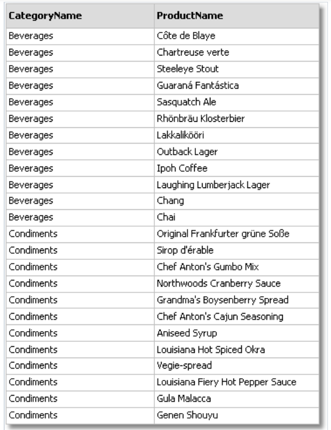

数据能够通过`CategoryName` 列分组,这个列能够在分组头中打印,这个数据自身通过`ProductName` 字段呈现,报表如下展示:
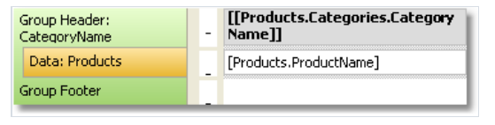
如果开启预览,那么能够得到以下报表内容:
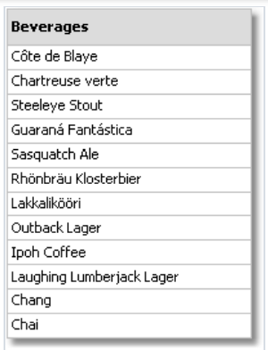
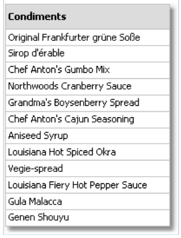

## 创建分组

增加一个分组到报表能够通过使用两个方法完成:

1. 第一个方法, 在配置带窗口中增加分组头带, 为了这样做, 点击`Add` 按钮并选择`分组头带`, FastReport 增加分组到可用的数据带或者创建一整个新分组(如果没有对应带在报表中),
其中包括了数据带,分组头,分组尾。

为了配置一个分组,双击分组头带,然后你能够看见一个分组头编辑器窗口:
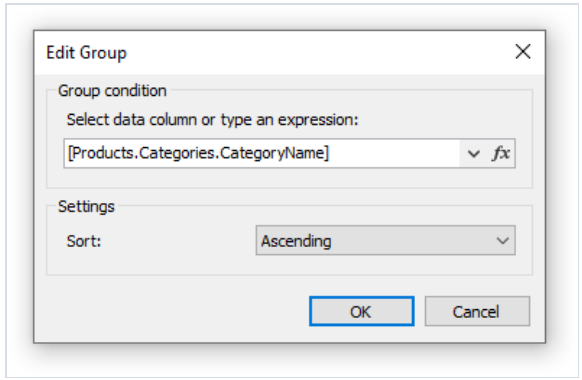

你需要设置分组条件,这可以是任何表达式或者数据源列,同样可以选择排序,默认情况下数据是升序。

2. 第二个方法是,你能够使用向导程序,这能够从`Report|Group Expert..` 菜单(报表|分组专家), 为了创建一个分组,输入分组表达式,然后选择添加按钮。

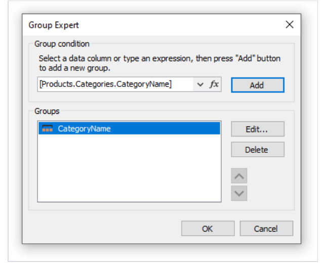

这个向导程序将会增加此分组的所有元素到报表中, 同样它会在分组头中添加文本对象,其中分组条件将会打印。
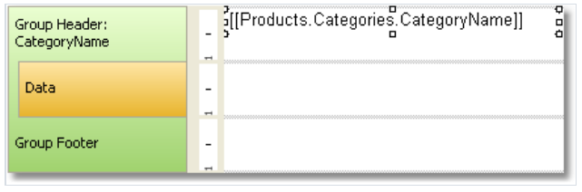

## 排序数据

为了让分组正确工作, 它需要满足一下条件,数据源必须基于分组条件中使用的列来排序,如果条件不能满足,你能够看到大量的分组包含1-2个数据行。
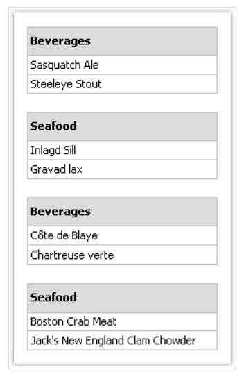

幸运的是, 这里有两种方式来排序数据源:
1. 你能够在分组编辑器中设置数据排序,数据源将会自动的在分组条件中排序。
2. 你能够在数据带编辑器中设置排序。

两种方法都是等价的,然而使用第一种方法是更合适的, 当创建分组的时候,你能够设置数据分组以及弹窗中设置排序。

某种情况下, 第一个方法应该不会使用,假设,我们将根据产品的名称的首字母进行分组, 这种情况下,产品将会仅根据首字母排序,这是无法接受的,
你应该使用第二种方法并且指示根据产品的全名进行排序。

## 内嵌分组

一个内嵌分组可以有多个分组头带, 最后一个带包含数据带.

这有点像多级分组.
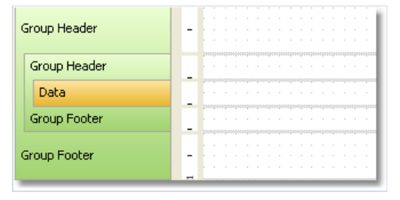

每一个分组头都有自己的分组条件:

创建一个内嵌的分组能够以相似的方式(就像普通方式)完成, 在第一种情况下,你能够创建一个简单的分组并且在配置带窗口中增加内嵌分组,对此,选择存在的分组头带,
然后在它之后增加一个内嵌的分组头带。

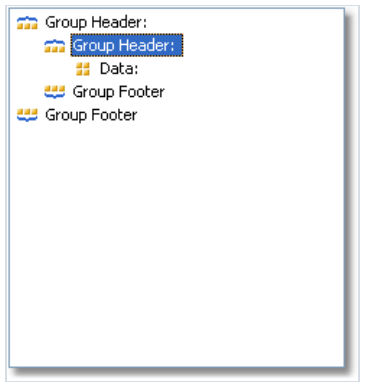

在此之后,调用新增的分组的编辑器然后设置分组条件.

在第二种情况下,你能够使用分组专家,然后设置分组条件然后点击增加按钮,然后向导会增加新分组到存在分组头。

内嵌分组的打印和普通的分组打印没有什么不同,当打印数据的时候,FastReport将检查所有分组的所有分组条件,如果条件发生改变,则相关的分组打印完成然后新分组开始打印。

## 管理分组

为了管理分组,分组专家也可以使用,它能够在`Report|分组专家...` 菜单中调用:
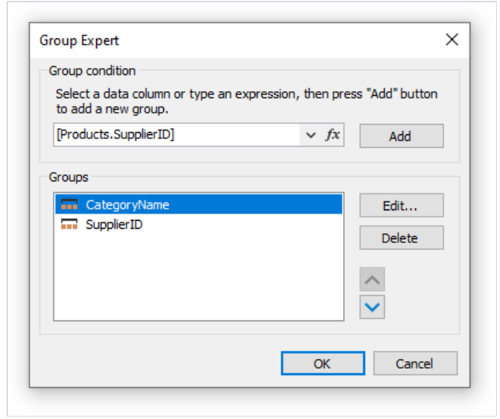

随着向导的帮助你能够要增加或者删除一个分组, 同样也能够改变一个分组顺序,为了改变分组的顺序,可以通过上下按钮进行调整,通过`Edit` 按钮的帮助,你能够
改变选择当前选择分组的分组条件。

## 打印总值

分组经常被用来打印每一个分组中的某些总值.   

例如,在分组中打印行的数量, 或者一个数据列求和,为了打印这些值,将使用总值, 总值的使用在`Data` 章节进行描述。

为了在分组中打印总值,你需要做以下内容:
1. 创建一个总值, 通过选择`Data` 数据窗口中的 `Actions|New total..` 动作|新总值菜单项.
2. 在`Evaluate on each row of the band` 下拉列表中选择分组数据带.
3. 然后再`Print on the band` (打印的带)下拉框中选择分组尾.
4. 设置文本对象,它将打印总值 - 在分组尾上。

例如,为了打印每一个分组的行数,配置总值如下所示:
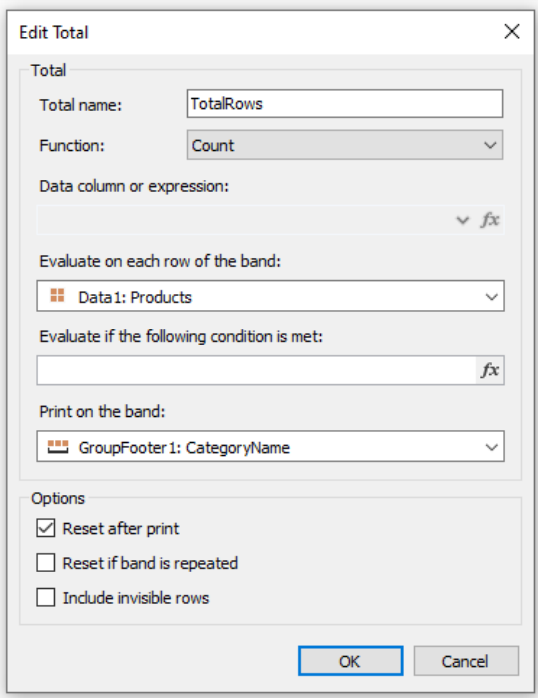

为了显示这个总值,然后把它拖到分组尾
 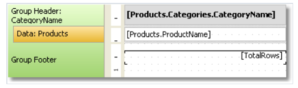

预览报表将看起来像这样:
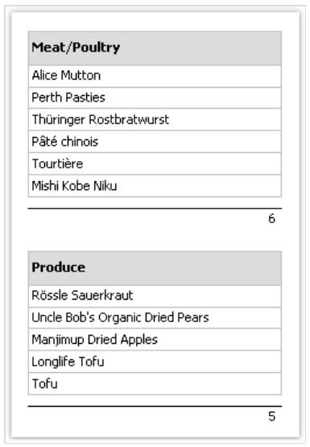

## 重复头和尾

分组头和尾都有`RepeatOnEveryPage` 属性, 如果分组不能够在一个最终报表的页面上存在, 通过使用此属性, 能够在每一页上打印分组头和尾,当对应分组打印时.

当打印头和尾的时候, FastReport 设置它的`Repeated` 重复标志, 这能够被用来在普通分组头上打印不同的对象并是否决定重复,例如,在新页上面打印`continue.. ` 文本,
对此,使用文本对象的`PrintOn` 属性(更多详情,了解成册报表类型部分);

为了打印不同的文本,放置两个对象在分组头上,将它们叠加在一起:
1. 第一个对象将打印在原始头上, 设置它的`PrintOn` 属性值为`FirstPage,LastPage,OddPages,EvenPages` - 除了`RepeatedBand` ..
2. 第二个对象仅当重复的时候再头上打印,设置它的`PrintOn` 属性到`RepeatedBand` ,然后再头上增加使用`continue` 文本的文本对象。

报表将打印为如下形式: 
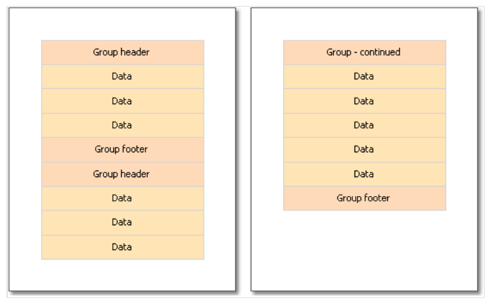

分组尾也能够在每一页上进行重复:
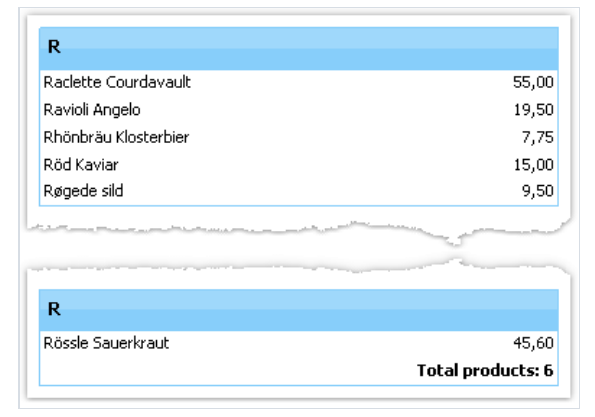

在这个报表中,分组尾有两个对象,一个放置到另一个的上面。

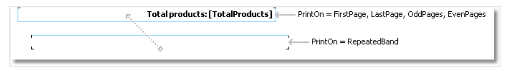

## 分组属性

分组头带有很多有用的属性.

`StartNewPage` 属性允许产生一个新的页面(当打印分组之前),因此,每一个分组能够在一个新页面上进行放置。

> 新页面将不会在第一个分组之前添加,这是为了避免有一个空白的第一页。

`ResetPageNumber` 属性能够让你在打印分组的时候重置当前的页码, 通常它将结合`StartNewPage` 属性一起使用, 因此如果这两个属性都启用了,那么每一个分组
将打印在新页面上并且它们将会有自己的页编号.
