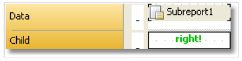

# 子报表

有些时候,在主报表的某一部分, 有额外的数据需要展示,它可以是具有非常复杂结构的独立报表, 你能够尝试通过FastReport的带的丰富集合来解决这个任务.

然而,在某些情况下,更偏向于使用子报表对象。

子报表对象是一个普通的报表对象, 它能够放置在任何一个带上, 当你这样做的时候,FastReport 会增加一个额外的页面到报表中,然后把它和子报表进行关联。

在这个页面上它能够创建额外的报表，可以有任意结构。

当打印这个报表的时候,当遇到子报表对象的时候,以下步骤将会完成:
1. 主报表将会打印,然而子报表对象不会。
2. 子报表带将会打印。
3. 主报表的打印继续。

> 因为子报表构成主报表的一块,它不能包含以下带: `Report Header/footer`,`Page header/footer`,`Column header/footer`,`Overlay` ..

# 打印模式

子报表能够以两种模式进行打印.

在第一种打印模式中，子报表的带和对象能够打印在主报表中的页面上,但是有一些限制:
1. 子报表 对象必须位于带下边界。
2. 不能够在子报表对象上放置任何其他对象, 当报表工作的时候,这些对象将会子报表的对象进行重叠。

为了在子报表中上放置其他对象,使用Child 带(子带),根据以下方式放置

第二种打印模式不同于子报表的对象将会在带中打印,可以包含了子报表对象,你能够从子报表对象的上下文菜单中启用这个模式, 为了这样做,选择`Print On Parent`(打印在父..上) 项.

这个模式将不会限制对象的位置(放置),除此之外,在这种模式中, 一个父带能够伸缩 - 取决于子报表上已经有多少数据已经打印了。

使用第二种模式仅有一个问题 - 那就是在子报表中可能有大量的数据, 当打印它的时候,则个父带可能会很高,为了让带正确打印,它需要断开它的内容(通过`CanBreak` 属性);

这个分开算法并不提供100%的质量,并且 在某些情况下 它能够导致对象移位.

## 并排子报表

在同一个带上可以放置两个子报表对象(并排), 能能够打印两个独立的数据列表,  当打印这种报表的时候,FastReport 表示为如下形式：
1. 打印主报表(如果没有遇见子报表)
2. 打印第一个子报表
3. 调整页面 - 子报表从哪开始打印, 然后打印下面的子报表
4. 在所有的子报表已经打印之后, 这个主报表继续打印(从给定位置-最后一个子报表已经停止)

## 内嵌的子报表
对于一个子报表的页面上,你能够放置其他子报表对象, 因此这种子报表叫做内嵌的, 内嵌程度通常是没有限制的, 然而不可能做到如此,
多个内嵌是非常难以理解的, 如果你有需要, 使用数据带来打印内嵌数据, 一个数据带能够有一个或者多个内嵌数据带.

如果你需要打印主从类型的报表或者主从从类型的报表,也不需要使用子报表。