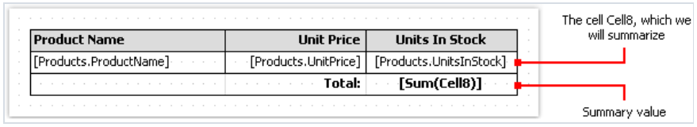

# 表格类型的报表

表格对象由行、列、以及单元格组成.

它是Microsoft Excel 表格的简化类似物, 它看起来像:


## 配置列

你能够增加或者删除列 - 通过上下文菜单的帮助,对此:
1. 选择表格或者它的元素然后将鼠标放到需要的列上, 然后鼠标的形式将会改变为一个小黑箭头:

2. 左击,为了选择列
3. 右击去展示列的上下文
4. 如果你需要选择多个相邻的列,左击 然后不要离开它,移动鼠标到右或者移动鼠标到左,为了选择相邻的列。

列的上下文菜单也能够在`Report tree` 窗口中唤起, 打开窗口,选择需要的列然后右击鼠标。

## 管理列的尺寸

你能够设置列的宽度通过使用以下方法:

1. 选择表格或者它的任何元素 然后放置鼠标到两个列的边框上,鼠标的形式将会改变为一个水平分割器。

2. 选择一个列并且通过`Width` 属性指定需要的宽度,属性能够在属性窗口中访问。

你能够启用`AutoSize` 列属性,当你运行报表的时候,列的宽度将自动计算,为了限制列的宽度,你能够设置`MinWidth` 以及`MaxWidth` 属性。
> 列的宽度应该绝不可能大于页面的宽度。

## 配置行
行同样可以配置,为了选择一个行, 做以下事情:

1. 选择表格或者它的元素然后将鼠标放置到需要行的左边,然后鼠标的形式将变为一个小黑箭头:
2. 然后左击鼠标,为了选中当前行
3. 然后右击鼠标为了选择展示行的上下文菜单

如果你需要选择相邻行,只需要左击鼠标,然后上下文移动去选择相邻行。

## 管理行的尺寸

你能够设置行的高度 - 通过以下方式之一:

1. 选择表格或者它的任意元素 然后放置鼠标到两个行之间的边上,鼠标将会变成一个垂直分割器。

    左击并移动鼠标,然后改变行的尺寸
2. 选择给定行,然后对`Height` 属性设置为需要的高度,这个属性能够在`Properties` 窗口中访问

你也能够设置行的`AutoSize` 属性,当报表运行的时候, 行的高度将会自动计算, 为了限制行的高度, 你能够使用最小高度/最大高度(MinHeight/MaxHeight)属性.

> 行的高度应该绝不可能打印页的高度。

## 配置单元格
单元格是文本对象,换句话说,单元格类就是继承于文本对象,有关文本对象相关的一切事情都可以应用到表格的单元格上。

编辑单元格的文本能够就像文本对象一样完成, 除此之外,你能够拖动一个数据(`Data`)窗口中的元素到单元格中。

单元格的边框和填充能够通过`Border and Fill` 工具条的帮助下配置。

为了唤起一个单元格的上下文菜单,仅仅在单元格上右击。

## 合并或者分割单元格

你能够合并表格的相邻单元格, 因此, 它可以变成一个大的单元格, 为了这样做:
1. 选择需要合并的单元格
2. 然后在选择范围内,右击鼠标为了展示单元格的上下文。
3. 然后选择合并单元格即可。

为了取消合并,直接唤起上下文选择取消合并即可。

## 在单元格中插入对象

在单元格中,你能够插入其他对象,举个例子, 图片, 下面的对象绝不会添加到单元格中:
1. Table(表格)
2. Matrix(矩阵)
3. Subreport(子报表)

为了增加一个对象到单元格中,简单的拖动它到单元格中,你能够在单元格之间随意的移动一个对象,并且也能够移除表格的边界之外。


一个单元格表现为一个容器能够放入对象到它的内部, 这意味着,你能够在单元格内部使用对象的`Dock` 以及 `Anchor` 属性.

这允许你改变对象的尺寸,当单元格的尺寸发生变化之后。

## 打印一个表格
一个表格能够以两种形式打印:

1. 表格打印在带中, 并且和设计器中看到的相同,此模式中,表格将不会跨页,如果它的宽度大于页面的宽度,这是默认模式。
2. 第二种模式是动态的,此模式中,表格是在脚本的帮助下构建的, 在此之间, 最终表格和初始表格可能有所不同,就像fastreport的最终报表和报表模版有所不同.

    在动态模式中,表格可以分离到多个页面上(如果在报表页上无法放下。)

在动态模式下,表格不能打印在带上,相反,表格自己会生成一组带,它包含了最终表格的部分,这种工作模式利用了以下的限制:
1. 不能在表格上放置其他对象或者在它附近防止,相反,使用Child band(子带);
2. 绝不能在一个带上放置两个表格对象。

让我们更加详细的看一下动态模式:
> 此模式可以联动编程并且可以对报表开发者有更高的要求。

表格的形式完全是通过脚本完成的,为了此创建一个脚本,选择表格对象,在属性窗口中点击事件按钮然后双击`ManualBuild` 事件:
然后就会在报表代码中添加一个空的事件处理器:
```text
private void Table1_ManualBuild(object sender, EventArgs e)
{
}
```

在这个模式中,这个源表将作为模版,在事件代码中,你能够根据打印和原表一样多的行和列- 只要你需要,在这个过程中,最终表格将会产生,
它将包含不限制的行和列,例如一个表格能够分割在多个页上(如果它无法全部放在一个页面上);

为了打印一个表格, 表格对象的以下方法能够被使用:
1. PrintRow(int index) 打印指定下标的行,行号从0开始.
2. PrintColumn(int index) 打印指定下标的列, 列从0开始
3. PrintRows(int[] indices) 打印一个表格的多行(给定下标列表)
4. PrintRows 打印所有行
5. PrintColumns(int[] indices) 打印表格的多个列(给定下标列表)
6. PrintColumns 打印表格的所有列
7. PageBreak 在打印下一列或者行的时候插入一个分页符

打印一个表格能够通过以下方法完成:

1. 从上到下打印,然后从左向右打印,这个方法可以使用可变数量的行数来更好的填充一个表,你必须根据以下顺序调用这些方法:
   1. PrintRow(int row);
   2. 为了打印指定列调用PrintColumn(int column) 或者PrintColumns(int[] columns);
   3. 或者直接调用PrintColumns 打印所有列
   4. 然后重复这些步骤去打印所有需要的行.

> 表格的每一行必须包含相同数量的列,记住,在使用以下两个方法的时候: `PrintColumn(int index)` ,`PrintColumns(int[] indexs)`

2. 从左向右然后从上到下, 这个方法是更棒的,你必须根据以下顺序调用这些方法:
   1. PrintColumn(column index);
   2. 为了打印指定行,调用一次或者多次 PrintRow(int row), PrintRows(rows indices);
   3. 为了打印所有行,直接调用PrintRows()
   4. 重复这些步骤去打印所需的所有行。

> 这个表的所有列必须包含相同数量的行,也就是说在使用`PrintRow(int row)` 以及 `PrintRows(int[] indices)`的时候。

这些打印方法的违反顺序调用这将导致错误 - 在执行报表打印的时候,下面是一种错误,将尝试以下代码打印表格:
```text
Table1.PrintRows();
Table1.PrintColumns();
```
这些方法的顺序不对,你必须在打印表格的开始 通过PrintRow 或者 PrintColumn方法。

## 打印复杂的头

这里我们讨论那些包含多单元格的头, 当打印一个表格的行或者列的时候,它可能存在跨度单元格(多个单元格合并在一起),这个单元格将自动的增加它的尺寸,例如:


我们将创建一个`ManualBuild` 事件处理器, 这将打印第一个列三次,然后第二个列一次.
```text
private void Table1_ManualBuild(object sender, EventArgs e)
{
// printing row 1 and columns 0, 0, 0, 1
Table1.PrintRow(0);
Table1.PrintColumn(0);
Table1.PrintColumn(0);
Table1.PrintColumn(0);
Table1.PrintColumn(1);
// printing row 1 and columns 0, 0, 0, 1
Table1.PrintRow(1);
Table1.PrintColumn(0);
Table1.PrintColumn(0);
Table1.PrintColumn(0);
Table1.PrintColumn(1);
}
```
> 注意到我们对于每一行都有相同数量的列,如果规则违反了,那么我们将得到不可预知的结果.

此代码的结果是,我们将得到以下内容:


正如所见, 这个标题头单元格将自动的合并, 我们可以将这个代码变得稍微复杂一点, 打印具有两个分组的列:

```text
private void Table1_ManualBuild(object sender, EventArgs e)
{
// print 0 row and two groups of 0, 0, 0, 1 columns
Table1.PrintRow(0);
// group 1
Table1.PrintColumn(0);
Table1.PrintColumn(0);
Table1.PrintColumn(0);
Table1.PrintColumn(1);
// group 2
Table1.PrintColumn(0);
Table1.PrintColumn(0);
Table1.PrintColumn(0);
Table1.PrintColumn(1);
// print 1 row and two groups of 0, 0, 0, 1 columns
Table1.PrintRow(1);
// group 1
Table1.PrintColumn(0);
Table1.PrintColumn(0);
Table1.PrintColumn(0);
Table1.PrintColumn(1);
// group 2
Table1.PrintColumn(0);
Table1.PrintColumn(0);
Table1.PrintColumn(0);
Table1.PrintColumn(1);
}
```
当运行这个报表的时候,我们能够看到以下结果:


当我们使用以下代码打印第二列的时候:
```text
Table1.PrintColumn(1);
```
这个头将会完成然后后续的第一列的打印将会从新头开始。
```text
// group 2
Table1.PrintColumn(0);
```

## 使用汇总

在表格的动态模式下, 我们可以使用以下函数:
1. sum(tableCell cell) 用于获取单元格包含的值的汇总
2. Min(tableCell cell) 用于获取包含在单元格中的最小值
3. Max(tableCell cell) 用于获取包含在单元格中的最大值
4. Avg(tableCell cell) 用于获取包含在单元格中的平均值
5. Count(TableCell cell) 用户返回包含指定的单元格的行数。

在一个普通的打印模式中(非动态),这些函数不可能工作.

为了使用汇总函数,将它放置在表格的单元格中,例如,下面的函数会计算包含在`Cell1` 中的单元格的汇总值。
```text
[Sum(Cell1)]
```
在此过程中，所有位于当前单元格上方和左侧的单元格（即我们正在计算总和的单元格）都会被分析。

## 表格布局

表格是动态构建的,能够分割到多个页面上,这个行为能够通过表格的`Layout` 属性进行控制,你能够选择以下值:
1. AcrossThenDown 从左到右从上到下渲染
2. DownThenAcross 从上到下从左到右
3. Wrapped  大表格将会包装并且渲染到相同页面。

### 示例
让我们查看一些示例,例如,模版中我们使用以下内容:


首先,选择表格然后创建一个`ManualBuild` 手动构建事件的事件处理器
#### 整体表格从上到下打印
```text
private void Table1_ManualBuild(object sender, EventArgs e)
{
// printing row 0 and all of its columns
Table1.PrintRow(0);
Table1.PrintColumns();
// printing row 1 and all of its columns
Table1.PrintRow(1);
Table1.PrintColumns();
// Printing row 2 and all of its columns
Table1.PrintRow(2);
Table1.PrintColumns();
}
```
最终结果是,打印如下,它和模版没有什么不同:


#### 打印表格从上到下 且重复行
```text
private void Table1_ManualBuild(object sender, EventArgs e)
{
// Printing row 0 and all of its columns
Table1.PrintRow(0);
Table1.PrintColumns();
// Printing 3 copies of row 1 and all of its columns
for (int i = 0; i < 3; i++)
{
Table1.PrintRow(1);
Table1.PrintColumns();
}
// printing row 2 and all of its columns
Table1.PrintRow(2);
Table1.PrintColumns();
}
```

这个示例中,将中间行重复了三次,因此,得到以下内容:


#### 打印整个表格从左到右
```text
private void Table1_ManualBuild(object sender, EventArgs e)
{
// printing column 0 and all of its rows
Table1.PrintColumn(0);
Table1.PrintRows();
// printing column 1 and all of its rows
Table1.PrintColumn(1);
Table1.PrintRows();
// printing column 2 and all of its rows
Table1.PrintColumn(2);
Table1.PrintRows();
}
```

因此,最终结果和模版没有什么不同:


#### 从左到右打印且重复列
```text
private void Table1_ManualBuild(object sender, EventArgs e)
{
// printing column 0 and all of its rows
Table1.PrintColumn(0);
Table1.PrintRows();
// printing 3 copies of column 1 and all of its rows
for (int i = 0; i < 3; i++)
{
Table1.PrintColumn(1);
Table1.PrintRows();
}
// printing column 2 and all of its rows
Table1.PrintColumn(2);
Table1.PrintRows();
}
```

这个示例中,将中间列重复打印3次,因此,得到以下内容:


#### 重复列和重复行的表格
```text
private void Table1_ManualBuild(object sender, EventArgs e)
{
// --------- printing row 0
Table1.PrintRow(0);
// printing column 0
Table1.PrintColumn(0);
// printing 3 copies of column 1
for (int i = 0; i < 3; i++)
Table1.PrintColumn(1);
// printing column 2
Table1.PrintColumn(2);
// --------- printing 3 copies of row 1
for (int j = 0; j < 3; j++)
{
Table1.PrintRow(1);
// printing column 0
Table1.PrintColumn(0);
// printing 3 copies of column 1
for (int i = 0; i < 3; i++)
Table1.PrintColumn(1);
// printing column 2
Table1.PrintColumn(2);
}
// --------- printing row 2
Table1.PrintRow(2);
// printing column 0
Table1.PrintColumn(0);
// printing 3 copies of column 1
for (int i = 0; i < 3; i++)
Table1.PrintColumn(1);
// printing column 2
Table1.PrintColumn(2);
}
```
> 注意到每一行都需要有相同数量的列,如果违反规则,将得到不可预知的结果

在这个示例中,我们将中间行和中间列进行重复打印3次,因此,我们将得到以下内容:


#### 使用数据源
前面的示例中都是包含了普通文本, 这个示例中展示怎样使用数据源产生一个表格, 对此,我们能够根据以下形式创建表格:


我们能够创建`ManualBuild` 事件处理器,它需要做以下事情:
1. 和获取数据源,定义在报表中的
2. 通过数据初始化它.
3. 打印表格行 - 根据数据源中的行数。

```text
private void Table1_ManualBuild(object sender, EventArgs e)
{
// get the data source by its name
DataSourceBase rowData = Report.GetDataSource("Products");
// initialize it
rowData.Init();
// printing the table header
Table1.PrintRow(0);
Table1.PrintColumns();
// loop through the data source rows
while (rowData.HasMoreRows)
{
// printing the table row
Table1.PrintRow(1);
Table1.PrintColumns();
// select the next data row
rowData.Next();
}
// printing the table footer
Table1.PrintRow(2);
Table1.PrintColumns();
}
```
如果我们运行表格, 我们能够得到以下内容:


#### 插入分页符

使用表格的`PageBreak` 方法,你能够在 打印表格的时候插入分页符. 在打印行或者列的时候调用它即可。

我们使用示例1来说明`PageBreak` 方法如何工作,让我们在新页上打印第三行。

```text
private void Table1_ManualBuild(object sender, EventArgs e)
{
// print the row 0 with all its columns
Table1.PrintRow(0);
Table1.PrintColumns();
// print the row 1 with all its columns
Table1.PrintRow(1);
Table1.PrintColumns();
// insert page break before the row 2
Table1.PageBreak();
// print the row 2 with all its columns
Table1.PrintRow(2);
Table1.PrintColumns();
}
```
最终结果就是:


#### 打印总计
让我们查看以下示例6中的总计函数,我们根据以下方式修改它.


cell8 用来汇总,展示最终的汇总值。

如果我们运行这个报表,那么得到以下内容
