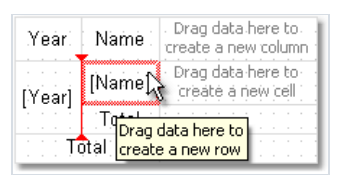
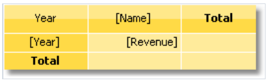

# 矩阵类型报表

矩阵对象是一种变种表格 并且类似于表格, 由行、列、单元格组成, 同时,在处理之前不知道有多少行和列会存在于矩阵中,这依赖于它所连接的数据。

这个对象看起来像:


当打印的时候,矩阵会填充数据并在上下方向上扩展,结果如图所示:


## 一点理论


在上图中,我们看到了2*4的矩阵, 这里的a,b 是行的头, 1,2,3,4 是列的头,然后a1... a4,b1...b4,是单元格,为了构建这样的报表,我们仅需要一个数据源,它
有单个列并且包含以下数据:


正如所见,第一个列表示矩阵的行,第二个表示矩阵的列,然后第三个表示给定位置上的行和列交集上的单元格的内容.

当创建一个报表的时候,FastReport 在内存中创建了一个矩阵然后使用数据填充它,在此期间, 矩阵动态增加,如果给定行或者列不存在.


在这个示例中,一个列存在组合(复合),让我们查看以下示例:


在这个示例中,一个列是复合的,但是它有两个值,这个报表需要以下数据


这里的第一列表示这一行, 第二和第三列表示矩阵的列,最后一个数据列包含了单元格的值。

下一种矩阵元素, 小计和总计,下图说明了它:


这个报表使用前面示例中的相同数据, 图中行里包含的灰色的单元格,最终都是自动计算的.

## 配置矩阵

当你在某一块放置了新的矩阵对象之后,它展示如下:


矩阵能够通过鼠标的帮助下配置. 为了这样做,从数据窗口中拖动一个数据源列到矩阵中去创建行、列、单元格。

矩阵高亮为红色的框表示去新数据所需要放置的位置。

如果矩阵已经包含了某些元素,那么当放置一个新元素的时候,指示器将会展示,在给定的情况下,新数据能够放置在`Year` 和`Name` 元素之间。


你也能够改变现有元素的顺序, 为了这样做, 点击元素的边框(展示为黑色)然后将它拖到需要的位置:


为了删除一个元素,使用鼠标选择它,然后在键盘上点击`Delete` 键。

## 配置头
为了配置头对象, 选择它然后右击并展示它的上下文菜单:


默认情况下,在矩阵头中的数据按照升序, 你能够改变排序,通过选择`Sort` 排序项。

通常情况系,在矩阵头中的项都有一个total(汇总) - 叫做汇总文本。 你能够删除这个文本,为了再次启用total,选择对应的元素,然后在它的上下文菜单中选择
`Total` 总计项即可。

`从新页开始`菜单项告诉矩阵去在打印每一个头的值后面之后插入换行符, 例如,如果为`Year` 项启用断页(正如上图所展示那样),每一个年份值都会在它自己的页面上打印。

`Suppress Totals` 压制总计项允许去压制总计 - 当分组(总计值是计算的)仅包含一个值。

## 配置单元格
对于矩阵单元格,你能够选择函数去用来计算总计,下面列出了能被使用的函数:
1. None 不处理单元格的值
2. Sum 求和(矩阵单元格的值)
3. Min 返回最小值
4. Max  返回最大值
5. Average 返回平均值
6. Count 返回非空值的数量
7. CountDistinct 返回去重值的数量

默认情况下, Sum函数使用, 你能够改变它 - 通过选择cell 然后从上下文菜单中选择Function - 选择需要的函数。


选择`None` 函数,如果你不打算在给定单元格中打印总计。

在矩阵中, 可以有一个或者多个数据单元格, 在具有多个单元格的矩阵中, 他们能够并排排列,或者重叠, 矩阵的`CellsSideBySide`的属性控制单元格应该怎么排列,
它能够根据矩阵对象的上下文进行改变, 你能够选择排列顺序(当在矩阵中增加第二个单元格的时候), 当这样做的时候,能够看到一个红色的指示器来展示是否需要将第二个值
放置到红框位置。


在你增加了第二个值之后, 剩下的值根据选择的顺序进行增加。

## 矩阵样式

为了改变矩阵单元格的样式,点击需要的单元格,在工具条的帮助下你能够设置字体,边框并填充,为了一次改变多个单元格的外观, 选择一组单元格.

为了这样做, 从单元格左上角开始选择,然后不要放开鼠标, 移动鼠标去选择一组单元格.

你能够使用样式去改变整个矩阵的外观, 为了这样做, 唤起矩阵的上下文并选择样式.

## 管理行和列的尺寸

由于矩阵类似于表格, 允许以相同的方式设置行和列的尺寸。

默认情况下,一个矩阵存在`AutoSize` 模式启动, 在这个模式中, 矩阵自动计算行/列尺寸.

你同样能够手动的改变对象的尺寸, 为了这样做,禁用矩阵的`AutoSize` 属性, 行和列都有相同的属性, 你能够使用它(如果矩阵的autosize 被禁用了).

为了限制列的最大或者最小宽度, 选择一个列区设置它的最小宽度和最大宽度。

为了限制一个行的最小或者最大高度, 选择一个行并配置它的`MinHeight` 和`MaxHeight` 属性。

## 示例
让我们看一下矩阵对象的使用, 从创建一个新报表开始,然后放置矩阵对象到报表头带中,你也能够使用数据带, 在这种情况下不需要连接带到数据源.

在给定情况下,使用那种带都不重要,因为当报表开始时这些带仅会打印一次, 这个报表看起来如下所示:


> 不要将矩阵对象放置在那些会在每一页上打印的带上, `页头,`页尾`等等。
> 矩阵在这种情况下每次都会创建 - 当带在新页中打印,这将导致堆栈溢出。

大多数示例使用`MatrixDemo` 表格(矩阵), 它和FastReport包捆绑了. 这个表格包含了以下数据:


## 示例1.简单矩阵

矩阵将在行和列、数据、单元格上都包含值,为了构建一个矩阵你需要根据以下方式增加`MatrixDemo` 数据列:
1. 增加`Year` 数据列到行头
2. 增加`Name`  数据列到列头
3. 增加`Revenue` 数据列到矩阵单元格

增加之后矩阵看起来如下:


让我们优化矩阵的外观:
1. 为矩阵选择黄色样式
2. 为所有的矩阵单元格选择`Tahoma,8' 字体。
3. 选择加粗类型的'总计'单词.
4. 选择`Glass`(玻璃) 填充类型 - 为标题行
5. 禁用矩阵的自动尺寸设置并且增加行和列的尺寸。

然后矩阵展示如下:


运行报表你将得到以下结果


在矩阵中以下事情是缺少的:
1. 对于`Name` 数据列没有标题
2. 汇总并没有以货币形式大阿姨

你能够根据以下形式增加`Name` 数据列的标题
1. 文本`Year/Employee` 能够放置在矩阵的左上角.
2. 斜线以及第二个文本对象能够放置在这,正如下图所示:

3. 启用矩阵标题
   为了这样做,选择在矩阵对象的上下文菜单中展示标题,任何文本能够包括在标题中


为了设置数据格式化,选择整个单元格区域,正如下表所示,然后在它的上下文中选择`格式` 项。


处理之后,最终报表看起来如下所示:


## 示例2.多级header

你将在 Matrix（矩阵）报表中添加新数据，矩阵将展示一个行、两列的结构，以及一个数据单元格。根据前面提到的例子，你将基于原来的结构，并增加一个新的数据项。

1. 我们将增加`Month` 数据列到行头的`Year` 项的右边.

在增加新项之后,优化矩阵的外观, 它也能够必要的为单元格设置格式。
之后,矩阵看起来像下面这样:


运行报表然后我们能够有以下结果:


### 打印月份的名字

在前面的示例中,矩阵打印中存在多个月份, 当发生的时候,因为`Month` 数据列包含了月份的数字,不是名字, 为了打印月份的名字, 能够做以下事情:
1. 选择打印月份数字的单元格, 在示例中单元格名称叫做`Cell8`;
2. 在属性窗口中点击()事件按钮 并双击`BeforePrint` 事件。
3. FastReport 将增加一个空的事件处理器到报表脚本中,写以下代码:
```text
private void Cell8_BeforePrint(object sender, EventArgs e)
{
string[] month Names = new string[] {
"January", "February", "March", "April",
"May", "June", "July", "August",
"September", "October", "November", "December" };
// Cell8 is a cell that prints the month number.
// Cell8.Value is a value printed in the cell (i.e. the month number).
// This value is of System.Object type, so we need to cast it to int
Cell8.Text = monthNames[(int)Cell8.Value - 1];
}
```
当你运行脚本的时候,你能够包含以下结果:


## 示例4. 条件高亮

你能够为矩阵单元格设置条件性高亮, 就像是`Text` 文本对象,大多数详情能够在`条件高亮` 部分发现。

让我们查看下示例2, 并且查看如何让数量大于3000的高亮为红色, 对此,选择具有`Revenue` 文本的单元格,然后选择文本工具条的按钮,
在条件编辑器中,增加以下条件:
```text
Value > 3000
```
为条件选择红文本颜色, 最终报表展示如下:


正如所见, 总计并没有高亮, 这是必然的,因为我们仅选择为一个单元格高亮, 为了对剩余值进行高亮, 我们需要为所有的矩阵单元格设置高亮。

在这个示例中我们使用的条件高亮值依赖于单元格值本身, 除此之外, 你能够根据矩阵头的值来高亮单元格, 我们将会在下面的示例中进行演示,怎样让单元格高亮,
这属于2000年,高亮为红色, 对此,选择矩阵单元格(在下图中展示的):


设置以下高亮条件:
```text
(int)Matrix1.RowValues[0] == 2000
```
在此情况下,Matrix1 是矩阵的名称,  矩阵的`RowValues` 属性具有一个`object[]` 类型,它包含了当前打印行的行头的值列表,在数组中的值数字等价于在头部中的层级。

在我们的示例中有两个值，第一个值是`Year`,第二个是`Month` .

上面代码的意思是,我们获取行头0,也就是`Year`,当这个头的打印的当前行值是2000的时候,则高亮。

> 不要高亮下一行,`RowValues` 属性对于下一行是不确定,这将导致一个错误(当构建报表时);

当我们运行报表的时候,我们能够得到以下结果:


> 你也能够使用矩阵的`ColumnValues` 属性来获取列值的引用。
## 示例5. 高亮偶数行

为了改善矩阵的外观, 你能够高亮偶数行或者列为其他颜色, 我们将使用示例2展示它如何做.

选择整个矩阵数据的部分,正如下图所展示:


调用条件高亮编辑器, 增加以下条件:
```text
Matrix1.RowIndex % 2 != 0
```

然后选择背景颜色稍微比之前暗一点,在这个示例中,`Matrix1`  是我们的矩阵的名称, 这个矩阵的`RowIndex` 属性返回当前打印行的行号:
> 为了让高亮,也可以通过相同方式使用矩阵的`ColumnIndex` 属性。

当我们运行报表的时候,我们能够看到以下内容:


## 示例6. 使用表达式

在前面的示例中,我们通过在数据窗口中拽动列来创建矩阵, 你能够使用表达式(为了创建矩阵), 为了创建一个表达式到矩阵中需要做以下事情:
1. 增加任何来自数据窗口中的元素到矩阵, 它能够是任何元素, 例如,系统变量`Date` ,我们仅使用它创建一个矩阵元素。
2. 双击元素然后在表达式编辑器窗口中选择需要的表达式。

> 如果你矩阵有表达式而不是数据字段, 你能够检查矩阵`DataSource` 属性是否正确设置, 当通过数据列工作时, 这个属性会自动填充(加载) - 当你拖动列到矩阵时。

让我们考虑下面的示例 - 如何使用表达式, 对此, 我们将使用订单详情表(作为数据源), 这包含一组固体产品,通过员工分组.
在这个表中有大量的关系, 它能够访问员工、产品名称以及它的分类。

我们的矩阵将展示每一个员工的销售额,通过产品分类, 为了构建这个矩阵, 做以下事情:
1. 增加`[Order Details.Products.Categories.CategoryName]` 数据列到列头。
2. 增加任何项到行头为了去创建一个矩阵元素,然后为这个行头元素增加表达式.

    ```text
       [Order Details.Orders.Employees.FirstName] + " " + [Order Details.Orders.Employees.LastName]
    ```
3. 增加任何对象到数据单元格中为了创建矩阵元素, 然后为单元格设置表达式:
```text
[Order Details.UnitPrice] * [Order Details.Quantity] * (decimal)(1 - [Order Details.Discount])
```

为啥我们需要使用这么长的数据列来作为员工的名称 - 尽管我们能够从`Employees.FirstName` 获取一个名字?

我们这样做的原因是因为矩阵时连接到订单详情数据源, 在数据源和其他表之间使用关系, 它能够容易的去引用它的字段(更多详细信息能够在数据章节了解更多),
如果我们直接引用`Employees.FirstName` 数据列,我们将获取表中的第一个员工的名称。

设置矩阵的外观,然后我们能够看到此矩阵如下所示:

当我们运行报表, 我们能够看到相当大的矩阵它占据了2页.


## 示例7. 单元格中的图片
矩阵单元格继承于文本对象并且能够显示文本数据,但是这不够, 我们可以在单元格中放置任何对象,让我们看一下如何在矩阵中展示图片。

对此,我们以示例6作为基础, 然后增加员工的照片`Employees.Photo` 数据列,然后增加分类图片(`Categories.Picture`),做以下事情:
1. 选择包含员工名称的单元格并增加它的尺寸.
2. 增加照片对象到这个单元格
3. 为了展示一个员工的图片,绑定图片到以下的数据列(这能够在对象编辑器中完成)
```text
Order Details.Orders.Employees.Photo
```
4. 选择包含分类的单元格并增加它的尺寸
5. 增加图片到这个单元格中
6. 为了展示分类图片,绑定图片到下面的数据列(能够在对象编辑器中完成).
```text
Order Details.Products.Categories.Picture
```

之后,矩阵看起来如下所示:


当我们运行报表的时候,我们能够看到以下内容:


## 示例8.单元格中的对象
在矩阵列中插入对象你能够有各种各样的视觉效果, 在如下示例中展示.

怎样画一个简单的刻度(指示条)指示员工的销售等级。

矩阵将使用`MatrixDemo` 数据源, 为了构建一个矩阵, 根据以下方式增加数据列:
1. 增加`Year` 数据列到行头
2. 增加`Name` 数据列到列头
3. 增加`Revenue` 数据头到矩阵单元格。

然后设置外观:


让我们增加3个`Shape` 形状对象到包含`Revenue` 值的单元格中, 这些对象将作为指示器 - 根据以下方式:
1. 如果单元格中的值小于100, 那么仅展示红色.
2. 如果值小于3000, 那么2个对象展示为黄色.
3. 如果大于等于3000, 3个对象将展示为绿色。

例如矩阵如下所示:


为了控制对象, 我们需要为矩阵单元格使用事件处理器, 对此,选择`Revenue` 单元格, 然后在它的属性窗口创建`BeforePrint` 事件处理器,
在处理器中写以下代码:
```text
private void Cell4_BeforePrint(object sender, EventArgs e)
{
// In our example, a cell has the Cell4 name.
// Get cell value which is in the Cell4.Value property.
// Some cells in our matrix will be empty. We'll take it into account (null check).
// The value should be cast to decimal type, because data source column
// [MatrixDemo.Revenue] is of System.Decimal type.
decimal value = Cell4.Value == null ? 0 : (decimal)Cell4.Value;
// Switch shape objects on or off depending on the value:
// value < 100 - one object is visible;
// value < 3000 - two objects are visible;
// value >= 3000 - all objects are visible
Shape1.Visible = true;
Shape2.Visible = value >= 100;
Shape3.Visible = value >= 3000;
// Choose the color of objects:
// value < 100 - red color;
// value < 3000 - yellow color;
// value >= 3000 - green color
Color color = Color.Red;
if (value >= 100)
color = Color.Yellow;
if (value >= 3000)
color = Color.GreenYellow;
// Set the objects' color
Shape1.Fill = new SolidFill(color);
Shape2.Fill = new SolidFill(color);
Shape3.Fill = new SolidFill(color);
}
```
当我们运行报表的时候,我们能够看到以下内容:


## 示例9.手动填充一个矩阵

在所有示例中,我们是通过数据源自动填充数据, 我们可以手动的通过脚本来手动填充, 对此,我们需要创建矩阵的`ManualBuild` 事件处理器.

在处理器代码中调用`AddValue` 方法去增加一个值, 让我们展示怎样创建一个打印以下分类的10*10 表格的矩阵。


步骤:
1. 增加一个空的矩阵到报表中
2. 从数据窗口中放置任何一个元素到行、列、单元格中,这里说的行、列、单元格(是矩阵在X,Y轴上的组成,行、列方向,以及它们的交集位置),然后双击矩阵元素调用表达式编辑器(然后在需要的位置上清理表达式)。
3. 清理矩阵的`DataSource` 属性。

这些步骤是必要的为了创建一个仅有一行、一列、一个单元格的(假的)矩阵, 因此一个矩阵将会如下展示:


现在就可以创建`ManualBuild` 事件处理器了,对此 选择矩阵, 然后查看它的窗口并点击按钮, 双击`ManualBuild` 事件然后
FastReport将会创建一个空的事件处理器,然后写入以下代码:
```text
private void Matrix1_ManualBuild(object sender, EventArgs e)
{
// Our matrix has one level in row, column and cell.
// Create 3 arrays of object[] type, each with one element
// (per number of levels).

// 当前矩阵仅有一行、一列、一个单元格(位于对角线上)
// 所以创建一个3*3的二维数组(也可以是3个一维数组), 每一个层级上(也就是每一个数组上只有一个元素)
object[] columnValues = new object[1];
object[] rowValues = new object[1];
object[] cellValues = new object[1];
for (int i = 1; i <= 10; i++)
{
// Filling arrays
columnValues[0] = i;
rowValues[0] = i;
cellValues[0] = i;
// Adding data into the matrix
Matrix1.AddValue(columnValues, rowValues, cellValues);
}
}
```
在这个处理器中, 使用了矩阵的`AddValue` 方法来使用数据填充矩阵,这个方法有三个参数,每一个参数都是`System.Object` 类型, 第一个参数是列值,第二个值是行值,第三个值就是单元格的值。

注意到值的数量(每一个数组中)应该遵从矩阵对象的规矩, 在当前示例中矩阵在行、列、单元格中都有一个层级（有时可能会有多个层级,例如行一个层级,而列，单元格可能存在笛卡尔积的 n*n的层级）.

详细来说,就是假设1月可能存在多个商品,而每个月可能存在小计,那么此时行可能是一层,但是月作为列就是多层。

对应的我们需要为对应的行、列、单元格都提供一个对应的值,当我们运行报表的时候,我们能看到以下内容:


让我们说明怎样增加值21到矩阵中, 它位于 列7 和行三的交汇处, 对此我们根据以下方式改变代码:

```text
private void Matrix1_ManualBuild(object sender, EventArgs e)
{
object[] columnValues = new object[1];
object[] rowValues = new object[1];
object[] cellValues = new object[1];
for (int i = 1; i <= 10; i++)
{
columnValues[0] = i;
rowValues[0] = i;
cellValues[0] = i;
Matrix1.AddValue(columnValues, rowValues, cellValues);
}
columnValues[0] = 7;
rowValues[0] = 3;
cellValues[0] = 21;
Matrix1.AddValue(columnValues, rowValues, cellValues);
}
```

// 现在只是在原有基础上增加了一行, 它将如下展示:


你也能够使用`ManualBuild` 事件处理器 - 对于那些连接了数据的矩阵, 在这种情况下, 事件处理器首先会调用,然后矩阵将会从数据源填充数据。

