`# 高级的矩阵对象

这种对象类似于矩阵,允许你构建一个总结报表.

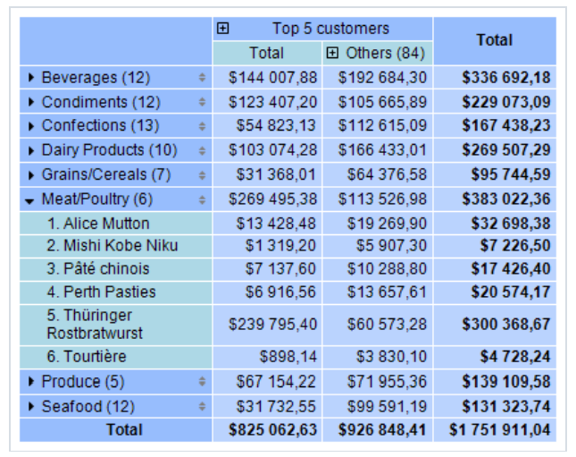
这里列出了它的关键特性:
1. 行和列头能够包含分组以及简单的元素 - 可排序,这允许你构建非对称报表。
2. 折叠按钮允许交互式管理个别元素的可见性。
3. 排序按钮允许你交互式排序矩阵(根据选中的值,包括总值.)
4. 顶级N 分组允许你在头部展示N个值, 并且分组剩余值到一个单独的元素 - 具有展开能力的元素。
5. 将矩阵的表头输出为阶梯状或者分步形式。
6. 根据总值排序表头
7. 更加广阔的范围的聚合能力。
8. 支持自定义聚合能力.
9. 各种各样的特定功能 - 能够让你获取汇总、相邻单元格的值,同样计算百分比的能力。
10. 在数据单元格中支持 （Sparkline） 迷你图 以及(仪表)对象。

## 矩阵(结构)

这种高级的矩阵对象由以下元素组成:
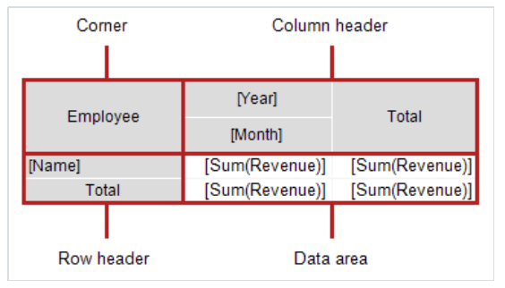

### 角

位于矩阵的角的单元格可以包含任意的信息,你能够分割或者合并他们。

### 头
矩阵头可以包含两种类型的元素
1. 简单元素:  展示一些总计文本的静态信息
2. 分组(根据特殊条件分组的一组值)

这个头是一个树形结构, 根元素是不可见的,它包含了可见性的第一层元素。

元素的任何安排都是允许的, 例如,一个头可能没有组, 或者它可能有多个临近的组,总计也能以随意的方式编排。

在设计模式下, 矩阵的头部区域会展示一个可见的提示.

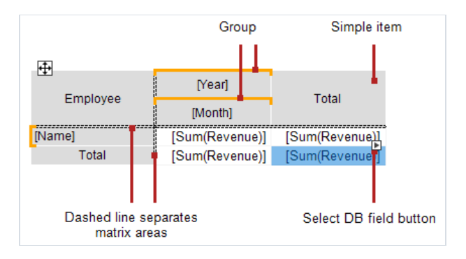

在这种情况下, 表头结构如下:
```text
Row header
    - "Name" group
    - "Total" element
Column header
    - "Year" group
        - "Month" group
    - "Total" element
```

有关更多信息查看表头设置了解更多。
## 数据区

在数据区的单元格通常包含了一个聚合函数,查看数据区配置。

## 矩阵设置

### 结构设置
1. 设置头
2. 设置数据单元
3. 增加汇总,这部分最好是最后设置这样能够节约新数据单元的配置时间。

> 这个矩阵必须连接到数据源, 数据源属性`DataSource` 负责这个事情,通常情况下这个属性都会自动的配置 - 在头和单元格配置的情况下。

### 上下文菜单
为了打开上下文菜单, 选择矩阵的任意一个元素, 然后右击矩阵的左上角区域:
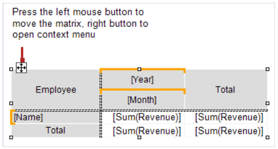

下面的命令在菜单中是可用的:
1. Style  选择一种可用样式
2. 交换列和行  允许你矩阵中快速切换列并且行.
3. 重复头 - 列和行头将会在每一页上打印 - 如果矩阵可能有多页。

### 属性窗口中的可用设置

1. DataRowPriority  值是Rows  头的优先级 - 当从数据单元格访问数据库字段的时候的优先级, 查看来自数据单元格的必要属性了解更多。
2. DataSource    数据源
3. EvenStylePriority Rows   对于启用`EvenStyle` 属性的行或者列优先级设置。
4. Filter                   数据过滤表达式, 查看过滤数据。
5. Layout            AcrossThenDown(横向然后竖向)  查看表格布局了解更多.
6. PrintIfEmpty     True        如果矩阵是空的则打印.
7. RepeatHeaders    True        在新页上面重复头
8. ResetDataOnRun    False      每次打印报表的时候重置数据, 默认情况下, 矩阵在交互式操作期间不会重新构建(查看交互式选项部分了解更多。)
9. Style    矩阵的样式
10. WrappedGap        0       在`Layout = Wrapped` 模式下矩阵各个部分之间的间隙。


## 头部设置
### 增加一项

这里有两种方式增加元素到头部.
1. 通过从数据窗口中抓取字段, 当你拖动的时候, 你能够看到头部的那一部分可以有新元素增加。
   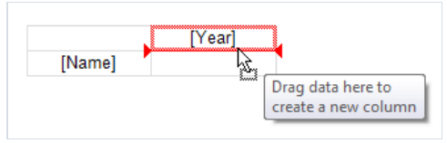
2. 使用头上下文菜单, 选择想要增加下一个新元素的元素然后 从它的上下文菜单中选择`Add a new element`(增加新元素之一的命令), 一个空的新元素增加的.
3. 你能够增加一个`Total` 汇总元素(放置在在选择元素前后) - 使用上下文菜单,一个使用`汇总`文本的新元素将会增加(这个文本依赖于当前的本地化);
> 增加一个汇总等价于增加一个空项然后编辑它的文本。

> 当你从数据窗口增加一个数据库字段到空矩阵的时候,它的`DataSource` 属性能够自动的配置。

### 移除一个元素

你能够通过在上下文菜单中选择删除一项, 你能够删除仅选择的元素,或者元素树(选择的元素和它的子项);

你能够通过按压`Delete` 删除键来删除元素, 在这种情况下, 仅仅选择的元素会删除。
> 具有锁图标的元素不能够删除, 查看 TopN 分组;

### 移除一个元素
为了移动元素到新位置,通过鼠标主键选择它, 然后元素将通过一个厚黑框标记.
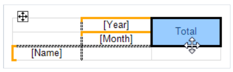

通过框抓取元素然后将它移动到新位置, 当你拖动的时候,它将展示这个头的那一部分新元素可以增加进去。
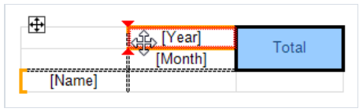

释放鼠标按钮然后元素将移动到新位置:
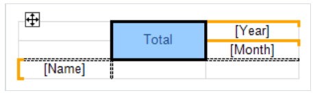
> 如果元素有子元素,它将跟随主元素移动,如果它可能的话.

### 编辑元素
为了调用元素编辑器, 鼠标左键双击, 或者在上下文菜单中选择编辑, 你能能够敲击Enter来调用编辑器。

### 分组
正如上面所描述的那样, 矩阵的头能够包含两种类型的元素, 一个分组和简单元素, 能够在头部编辑器中设置元素的类型.
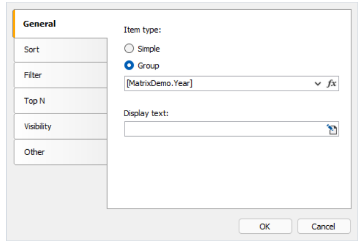

> 你能够调整简单元素为分组,或者反之亦然, 在编辑器窗口的某些设置对于简单元素来说不可用。

分组允许你根据条件分组的一组值, 在上面的示例中, 指定了`[MatrixDemo.Year]` , 这意味着元素将根据年份展示,这个列表(年份列表)将不会包含重复值,
相同值将会分组。

默认情况下, 分组将会根据分组条件中指定的那些值, 例如,如果指定了`[MatrixDemo.Month]` 的条件, 月份将会展示, `展示文本` 属性允许你展示一个不同的值,例如:
```text
[MonthName([MatrixDemo.Month])]
```
将会展示月份的名称而不是数字。

在这个属性中, 你能够调用矩阵的特定函数( 查看来自头单元格的可访问属性),例如:
```text
[Matrix1.RowNo].[MatrixDemo.Name]
```

### 排序

对于输出值的排序设置可以在头部编辑器中进行找到, 这个设置是激活的(如果元素类型是分组);
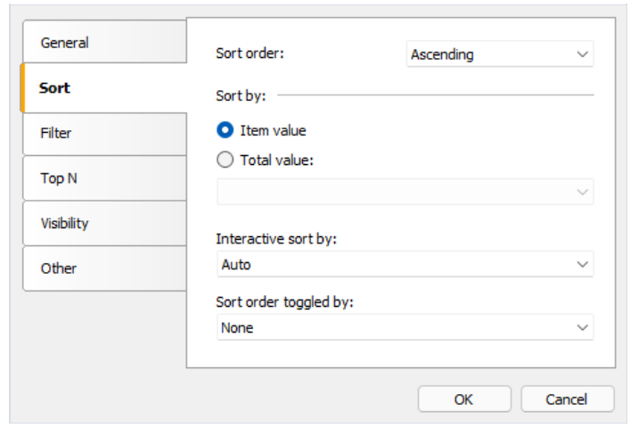

配置描述:
1. 排序顺序,升序还是降序,或者不排序
2. 排序字段 选择两种排序选项之一即可:  通过显示的值,或者汇总值, 下面的图片展示`Year` 元素是怎么排序的。

通过元素值:
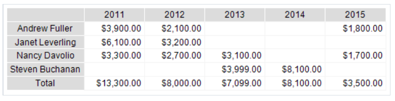

按照字母顺序排序..

通过总值:
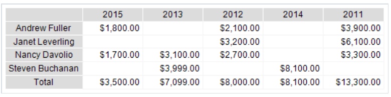

3. 通过总值交互式排序 定义了怎样排序头部值(如果交互式排序启用),查看交互式排序部分了解更多。
4. 根据按钮切换排序

   此按钮(`MatrixSortButton` 的名字是指定的), 它位于矩阵的边缘或者它的外边, 当你在报表预览中点击这个按钮,排序顺序将会改变并且矩阵将会更新。

### 数据过滤
这里两种方式来过滤展示在矩阵中的数据:

1. 通过`Filter` 矩阵属性过滤, 为了这样做, 选择矩阵元素然后填充此属性:
```text
[MatrixDemo.Year] == 2015
```
2. 在头编辑器中的`Filter`中使用类似的表达式
   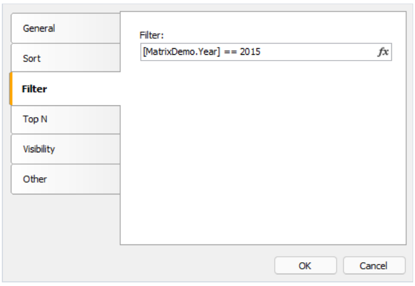

两种情况下,过滤器表达式返回 类型是bool.

两种方法的不同点是怎样从矩阵中获取数据, 第一种情况下, 所有数据将会抛弃, 除了年份等于2015的,结果看起来像:
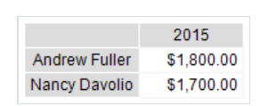

第二种是,过滤表头中特定元素的值, 不像前面那种, 结果能够包含空值:
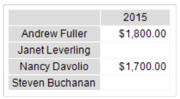

### TopN 分组

如果在头部分组的值数量很多,它将生成大量的报表页, TopN 分组允许你仅展示前N个值, 然后在折叠的形式中展示剩余的值:
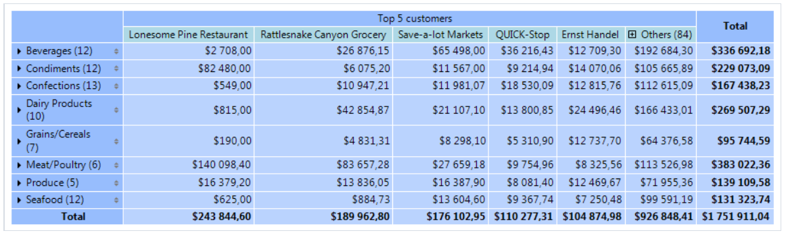

#### 它怎么工作

TopN 功能使用4个元素去展示数据:
1. TopN 分组是一个源分组(包含大量值).
2. TopN Total, 它将展示TopN值的汇总
3. 其他分组, 这将展示那些不在TopN中包含的值.
4. 其他分组的结果

如果原分组相比于`TopN.Count` 属性中指定值更少, 它将正常展示,而不会TopN 分组, 否则以下情况将会发生:
1. N个值将位于主分组的左边。
2. 剩余的值将会转移到其他分组。
3. 包含的值将会展示为`TopN的汇总` 并且`其他分组的汇总`。

#### 配置
TopN 是为主分组设置的, 为了这样做,双击元素(头)或者从上下文菜单中选择编辑:
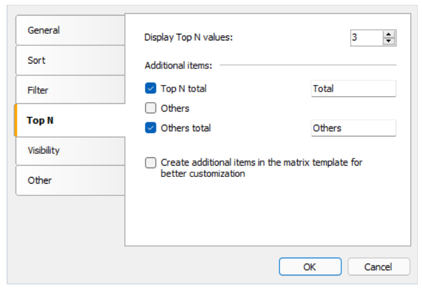

为了和额外的元素一同工作,有两个选项:
1. `TopN total`,`Others` ,`Others total` 将会在构建矩阵的时候自动创建, 它们的可视化设计是根据主元素复制而来的, 你能够管理这些元素的可见性,通常为
它们的`total` 元素指定文本, 这里没有其他选项去自定义外观。
2. 上述的元素将增加到矩阵模版中, 这允许你完全自定义外观, 同样去改变元素的顺序, 你能够增加折叠按钮去交互式管理个别元素的可见性。

下面展示了矩阵模版中能够看到什么(当你增加到额外的元素到它之后):
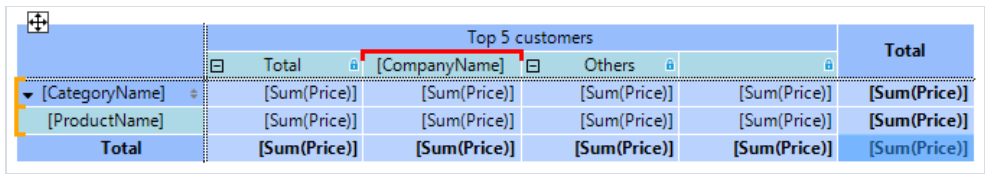

在这种情况下, 主分组会高亮为红色, 额外的元素将会通过锁图标标记,你能够在主元素的编辑器窗口中通过反选`Create additional Items` 选择框删除它们。

#### TopN,BottomN,FirstN,LastN

TopN 引擎在源分组中使用前N个值, 这意味着最终值依赖于原始分组如何排序。

1. 根据头的值排序分组:  前n个升序,后n个 降序显示。
2. 根据总计值排序,最大值n个排序(降序),最小值n个排序(升序)

### 元素可见性

能能够在可见性标签页中管理元素的可见性。
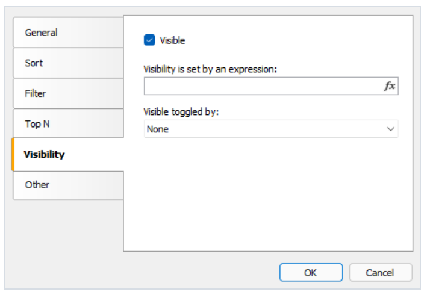

1. `Visible` - 管理初始的可见性(是否可见)
2. `Visibility set by an expression` - 根据表达式返回一个bool 类型的值来设置可见性, 如果表达式不为空,则使用它的值来替代`Visible` 选项。
3. `Visible toggled by button` 名称 - 用来管理此元素（`MatrixCollapseButton` 类型的按钮）的可见性的名称.

### 其他设置

其他设置能够在头部编辑器中的`Other` 标签页进行设置。

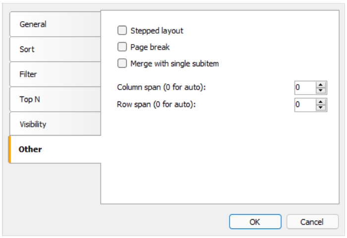

`Stepped layout` 步进式布局可以将内嵌元素的布局在`block` (默认)块和步进式布局之间切换。

让我们查看一个具有内嵌行头部的矩阵示例(Year,Month). 这个block 布局看起来像这样:
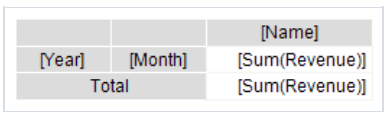

最终完成的报表看起来像:
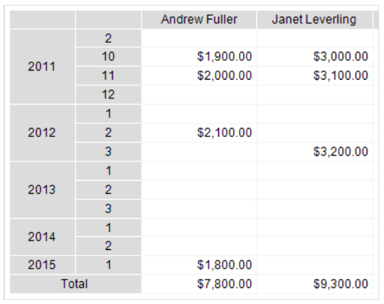

如果你对`Year` 元素启用了`Stepped layout`, 元素的排列将会展示为如下形式:
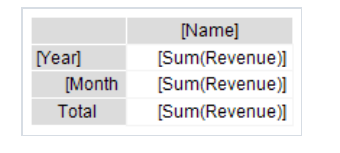
最终报表看起来像这样:
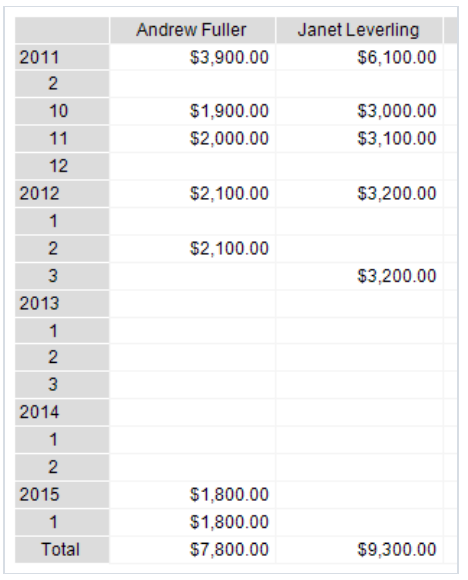
> 当你启用`Stepped layout` 选项时, 内嵌元素改变了`Padding.Left` 属性, 这能够改变文本缩进。
> 你能够在属性窗口中调整。
> 此选项能够在任何内嵌元素上使用。

1. `Page break` 选项(断页) - 在打印元素之前能够插入分页符, 第一个元素之前不会插入新页。

2. `Merge with signle subitem` 和单个子项进行合并被用在动态可折叠的头部情况(查看折叠和扩展元素了解更多), 这个选项允许你隐藏Total 元素。

   下面使禁用这个选项(默认情况)的完成的报表:
   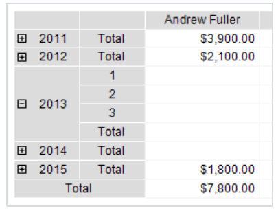
   启用之后, 注意到`Year` 元素的输出:
   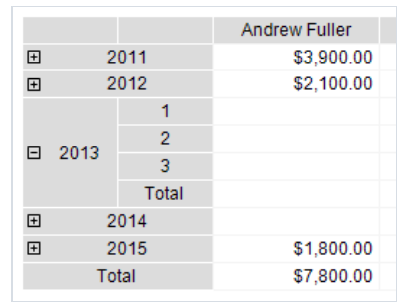

3. `Column span` 以及 `Row span` (行、列合并) 允许你去合并行、列中的单元格(当元素打印的时候), 默认情况下,元素会自动控制这些参数。

## 来自头单元格的可访问属性

矩阵包含了一些能够在打印头单元格的时候使用的属性, 矩阵的名称将被用来访问这个属性:
```text
[Matrix1.RowNo]
```
1. RowNo  返回值(int)  头元素的顺序
2. ItemCount (int) 当前头元素的子元素个数。

这些属性能够被用在头部单元格的`Displayed Text` 字段,例如:
```text
[Matrix1.RowNo].[MatrixDemo.Name]
```

将展示文本
```text
1. Andrew Fuller
```
## 数据区域设置
### 增加一项

通过从数据窗口中抓取一个DB 字段来增加一个元素, 当你拖动的时候, 能够看到数据区域的哪一部分能够让新元素增加。

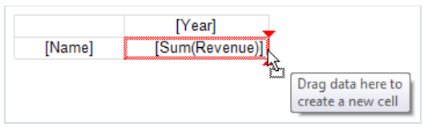
> 当你增加元素到空矩阵中, 属性`DataSource` 将会自动的配置。

当增加一个新项之后,它的标题也能够增加到存在的项的旁边:
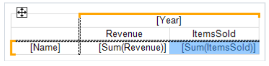

### 移除一个元素
你能够清理元素的文本 - 通过选择它的菜单`Clear` 清理,或者直接点击`Delete` 删除键。

这数据元素自身不能被删除, 对此, 你应该删除矩阵头中的相关元素。

在上面的示例中, 你必须从头部中移除`Revenue` 元素 - 为了删除`[SUM(Revenue)]` .

### 编辑一个项
为了编辑元素的文本, 双击或者右击点击编辑,然后打开文本编辑器窗口,或者点击`Enter` 键即可。

能够快速选择一个DB 字段(通过智能标签) - 快速(快捷)按钮, 当鼠标光标在元素内的时候,它将会显示。
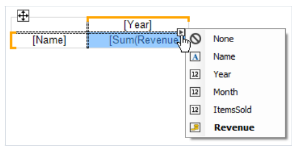

你能够根据此元素的上下文菜单执行下面的操作:
1. 调用元素的编辑器
2. 自定义数据的格式
3. 改变聚合函数的类型(查看聚合函数了解更多)
4. 增加感兴趣的计算
5. 插入进度指示器或者迷你图到单元格中。
### 编辑多个元素

为了批量编辑单元格,能能够选择整个数据区域或者多个单元格, 这能够通过`Shift` 键或者鼠标完成:
1. 选择开始的单元格
2. 点击鼠标左键 然后保持不放,移动鼠标去选择一组单元格。

对于已经选择的单元格,你能够调用上下文菜单或者使用快捷选择按钮去设置数据库字段。
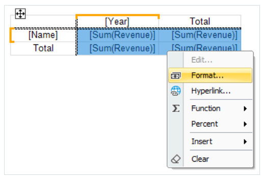

### 聚合函数

在数据单元格中我们能够使用聚合函数去聚合单元格值并计算汇总,  一个聚合函数看起来像这样:
```text
[Function(Expression)]
```
> 方括号被用来在单元格文本中指定表达式, 你能够在单个单元格中使用多个聚合函数和普通文本。

表达式通常可以是一个数据源字段, 使用聚合函数的示例是:
```text
[Sum([MatrixDemo.Revenue])]
```

下面列出了聚合函数:
1. Sum  返回汇总值
2. Min   返回最小值
3. Max   返回最大值
4. Avg   返回平均值
5. Count 返回值有多少
6. CountDistinct 返回去重的值的数量
7. StDev   返回一个样本的标准差(standard deviation)
8. StDevP  返回总体的标准差
9. Var    返回样本的方差
10. VarP   返回总体的方差
11. First  返回第一个值
12. Last   返回最后一个值
13. ValuesList 返回在单元格中发现的所有值的列表, 这个聚合函数能够与图表和迷你图一起工作。
14. _name  定义在报表代码中自定义聚合函数

一个自定义函数需要以下划线开头命名,  它的代码应该放置在主报表类的区域(主体部分):
```text
object _FuncName(List<dynamic> l)
```

自定义聚合函数`_Sum`示例:
```text
public class ReportScript
{
public object _Sum(List<dynamic> l)
{
dynamic value = 0;
foreach (dynamic v in l)
value += v;
return value;
}
}
```

### 特殊函数
特殊函数能够在矩阵的数据单元格中使用, 这允许你获取相同行或者列中的其他单元格的值。
#### GrandColumnTotal

返回列的总体汇总值。

1. `aggregate` 可选的聚合函数, 参数能够省略(如果聚合已经在单元格中访问过)

示例:
```text
GrandColumnTotal(Sum([MatrixDemo.Revenue]))
Sum([MatrixDemo.Revenue]) / GrandColumnTotal()
```
#### GrandRowTotal

返回一个行的整体汇总值
1. `aggregate` 可选的聚合函数,参数能够省略,如果聚合已经在单元格中访问。

示例:
```text
GrandRowTotal(Sum([MatrixDemo.Revenue]))
Sum([MatrixDemo.Revenue]) / GrandRowTotal()
```

### GrandTotal

返回整体聚合的值
1. `aggregate` 一个可选的聚合函数,参数能够省略,如果已经在单元格中访问过 ..

示例:
```text
GrandTotal(Sum([MatrixDemo.Revenue]))
Sum([MatrixDemo.Revenue]) / GrandTotal()
```

#### ColumnTotal

返回当前分组的列的汇总的值

1. aggregate ,可选的聚合值, 这个参数能够省略,如果聚合已经在单元格中访问过。

示例:
```text
ColumnTotal(Sum([MatrixDemo.Revenue]))
Sum([MatrixDemo.Revenue]) / ColumnTotal()
```

#### RowTotal

返回当前分组的行汇总结果

1. `aggregate` 聚合值, 这个参数能够省略, 如果...

示例:
```text
RowTotal(Sum([MatrixDemo.Revenue]))
Sum([MatrixDemo.Revenue]) / RowTotal()
```
#### ColumnMaxValue

返回当前分组的列汇总最大值
1. `aggregate` 可选的汇总值 .

示例:
```text
ColumnMaxValue(Sum([MatrixDemo.Revenue]))
Sum([MatrixDemo.Revenue]) / ColumnMaxValue()
```

#### ColumnMinValue

同上,返回最小值

#### RowMaxValue

返回当前分组的行汇总的最大值

1. `aggregate` 可选聚合函数,如果 ...

示例:
```text
RowMaxValue(Sum([MatrixDemo.Revenue]))
Sum([MatrixDemo.Revenue]) / RowMaxValue()
```
#### RowMinValue

同上,返回最小值

#### FirstColumn

返回列中的第一个单元格的值

1. `aggregate` (可选)聚合函数 ..
2. `useInteractiveSort=false`  (可选的) 包括可交互式排序的结果,元素的顺序可以改变。
3. `useThisGroup=true` (可选的)  使用相同层级的分组去发现一个值

返回值依赖于函数如何使用:

1. 汇总单元格:  返回当前分组的第一个单元格的值(如果`useThisGroup` = true,否则返回第一个汇总值)
2. 分组单元格:  返回分组中的第一个值

示例: 
```text
FirstColumn(Sum([MatrixDemo.Revenue]))
FirstColumn(Sum([MatrixDemo.Revenue]), true)
Sum([MatrixDemo.Revenue]) / FirstColumn()
```

### FirstRow

返回行中的第一个单元格的值

1. aggregate 聚合函数(可选)
2. `useInteractiveSort=false`  包含可交互式排序的结果,其中元素的顺序能够改变。
3. `useThisGroup=true` 使用相同层级的分组去发现值..

这个返回值依赖于函数在哪里使用:
1. 汇总单元格:   如果参数`useTHisGroup` = true, 那么返回组中的第一个单元格值, 否则返回`total` 的第一个值.
2. 分组单元格:   返回当前分组中的第一个单元的值 ..

示例：
```text
FirstRow(Sum([MatrixDemo.Revenue]))
FirstRow(Sum([MatrixDemo.Revenue]), true)
Sum([MatrixDemo.Revenue]) / FirstRow()
```

#### LastColumn

返回列中的最后一个单元格的值

同上相同参数.

返回值依赖于函数在哪里使用:

1. total cell:  如果`useThisGroup` = true,那么返回这个分组中的最后一个单元格的值,否则返回最后一个汇总的值。
2. group cell:  返回当前分组中的最后一个单元格的值.

示例:
```text
LastColumn(Sum([MatrixDemo.Revenue]))
LastColumn(Sum([MatrixDemo.Revenue]), true)
Sum([MatrixDemo.Revenue]) / LastColumn()
```

####  LastRow

同上,返回行中的最后一个单元格的值

示例:
```text
LastRow(Sum([MatrixDemo.Revenue]))
LastRow(Sum([MatrixDemo.Revenue]), true)
Sum([MatrixDemo.Revenue]) / LastRow()
```

#### previousColumn

返回列中之前单元格的值,同上参数

返回值依赖于使用地方:

1. 汇总单元格:      如果参数`useThisGroup`  = true,那么返回当前分组的前一个单元格的值,否则返回前一个汇总值.
2. 分组单元格:     返回分组中的前一个单元格的值

示例:
```text
PreviousColumn(Sum([MatrixDemo.Revenue]))
PreviousColumn(Sum([MatrixDemo.Revenue]), true)
Sum([MatrixDemo.Revenue]) / PreviousColumn()
```

#### previousRow

同上,返回一行中前一个单元格的值..

同上参数.

返回值同上一个函数,仅仅不同的是根据行作为分组.

示例:
```text
PreviousRow(Sum([MatrixDemo.Revenue]))
PreviousRow(Sum([MatrixDemo.Revenue]), true)
Sum([MatrixDemo.Revenue]) / PreviousRow()
```
#### NextColumn

返回列中的下一个单元格的值 ..

示例:
```text
NextColumn(Sum([MatrixDemo.Revenue]))
NextColumn(Sum([MatrixDemo.Revenue]), true)
Sum([MatrixDemo.Revenue]) / NextColumn()
```

#### NextRow

同上,返回一个行中的下一个单元格的值

示例:
```text
NextRow(Sum([MatrixDemo.Revenue]))
NextRow(Sum([MatrixDemo.Revenue]), true)
Sum([MatrixDemo.Revenue]) / NextRow()
```

#### SpecificColumn

发挥指定列下标的单元格的值

1. `index` 下标值
2. `aggregate` 可选的聚合函数

返回值依赖函数如何使用:
1. 汇总单元格:    返回分组中单元格的汇总值
2. 否则: 它返回当前分组的列中的单元格的值.

示例:

```text
SpecificColumn("Andrew Fuller", Sum([MatrixDemo.Revenue]))
SpecificColumn(2011, Sum([MatrixDemo.Revenue]))
Sum([MatrixDemo.Revenue]) / SpecificColumn(2011)
```

#### SpecificRow

同上, 返回一个行中的特定下标的单元格的值

同上参数,

返回值同上.

示例:
```text
SpecificRow("Andrew Fuller", Sum([MatrixDemo.Revenue]))
SpecificRow(2011, Sum([MatrixDemo.Revenue]))
Sum([MatrixDemo.Revenue]) / SpecificRow(2011)
```

#### PercentOfColumnTotal

返回当前单元格的值除以列汇总值的百分比.
1. `aggreate` 可选的聚合函数

函数调用:
```text
PercentOfColumnTotal(Sum([MatrixDemo.Revenue]))
```

它等价于
```text
Sum([MatrixDemo.Revenue]) / ColumnTotal()
```

示例:
```text
PercentOfColumnTotal(Sum([MatrixDemo.Revenue]))
[Sum([MatrixDemo.Revenue])] [PercentOfColumnTotal()]
```

#### PercentOfRowTotal

返回当前单元格除以行汇总值的百分比

示例:
```text
PercentOfRowTotal(Sum([MatrixDemo.Revenue]))
[Sum([MatrixDemo.Revenue])] [PercentOfRowTotal()]
```

#### PercentOfGrandTotal

返回当前单元格的值除以 整体汇总值的百分比..

示例:
```text
PercentOfGrandTotal(Sum([MatrixDemo.Revenue]))
[Sum([MatrixDemo.Revenue])] [PercentOfGrandTotal()]
```

#### PercentOfPreviousColumn

返回当前单元格的值除以列中的前一个单元格的百分比

1. `aggreate` 可选-聚合函数
2. `useInteractiveSort=false`, (可选的)是否包括交互式排序的结果, 其中元素的顺序能够改变。
3. `useThisGroup=true` 可选的 使用相同层级的分组去发现一个值

返回值取决于使用的地方:

1. total cell: 如果`useThisGroup =true` ,那么则返回分组中的前一个单元格的值,否则返回前一个汇总值
2. group cell:  返回当前分组中的前一个单元格的值.

示例:
```text
PercentOfPreviousColumn(Sum([MatrixDemo.Revenue]))
PercentOfPreviousColumn(Sum([MatrixDemo.Revenue]), true)
[Sum([MatrixDemo.Revenue])] [PercentOfPreviousColumn()]
```


#### PercentOfPreviousRow

返回当前单元格的值除以行中的前一个单元格的值 ..

同上参数.

示例:
```text
PercentOfPreviousRow(Sum([MatrixDemo.Revenue]))
PercentOfPreviousRow(Sum([MatrixDemo.Revenue]), true)
[Sum([MatrixDemo.Revenue])] [PercentOfPreviousRow()]
```

### 能够从数据列中访问的属性

矩阵中当打印数据列的时候有一些属性可以使用,矩阵的名称被用来访问属性:
```text
[Matrix1.RowIndex]
```

1. ColumnIndex 返回值(int) 返回当前列的下标
2. RowIndex  int  返回当前行的下标
3. ColumnValues  object[]  返回列头的数组
4. RowValues object[] 从行头中返回的值数组

这些属性在例如基于条件高亮单元格的时候比较有用。

你也能够从单元格中访问数据源列, 一般来说为了启用条件高亮这也是必要的(查看条件高亮部分了解更多), 因此,对于一个数据单元格, 你能够指定以下条件去高亮和2012相关的值。
```text
[MatrixDemo.Year] == 2012
```
DB字段的值 能够被用来打印由矩阵头产生的单元格,由于这里有两种头, 你必须那些头的值具有优先级, 矩阵的属性`DataRowPriority` 能够用来处理这个问题。

默认情况下这个属性设置为`Rows` .

## 交互选项

这部分讨论了高级矩阵对象的可交互选项.

1. 折叠或者展开头元素
2. 交互式排序

### 折叠/展开元素

能够使用`MatrixCollapseButton` 来管理个别头元素的可见性(交互式管理), 这个按钮将插入到头元素,然后用来管理其他元素的可见性.

下面的照片展示了这个按钮以及它能够管理的元素(当按钮选择的时候,标记为红框):
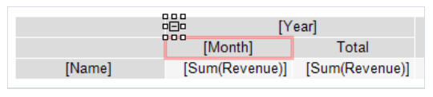

当在预览窗口中点击此按钮的时候,相关的元素隐藏或者展示,例如,报表会重新构建为要求的样子:
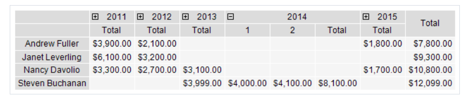

### 增加它

通过上下文菜单增加即可, 默认情况下按钮增加到元素的左边.
> 当按钮增加后,属性`Padding.Left` 可以改变,这样按钮就不会和文本重叠.

### 按钮自定义

当按钮增加之后,FastReport 自动配置一个链接 到按钮和相关管理元素。

某些情况下你可能需要手动关联,  为了这样做打开元素（应该依赖于这个按钮）的编辑器,然后在`可见性切换` 标签页中指定按钮的名称。

> 这个按钮能够同时管理多个元素

这个按钮能够放置在被管理的元素的上方.

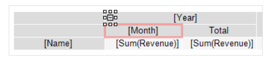

或者和它同级:

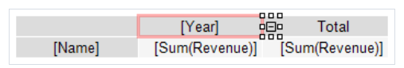

受控元素的初始展示状态可以通过按钮元素的编辑器  -`Visibility/Visible` 标签页设置..

### 删除它

1. 直接`Delete` 键
2. 从元素的上下文菜单中取消选择折叠按钮。

### 移动按钮
默认情况下,按钮停靠在左边(`Dock=Left`), 你能够设置`Dock` 属性来移动按钮到其他位置。

### 自定义按钮的外观

使用边框工具栏,  能够定制按钮的图标,框的颜色以及样式, 背景颜色, 除此之外, 能能够在属性窗口中设置按钮的以下属性:
1. Cursor 光标(默认值  Hand(手))  鼠标光标形状
2. Exclusive  False, 如果为true, 仅有一个元素能够展开
3. Exportable False  如果为true, 当导出此报表的时候 展示此按钮
4. Printable  False,如果为true, 按钮将会在打印的时候 展示
5. ShowCollapseExpandMenu   false  决定具有`折叠/展开全部` 项的菜单应该展示 - 当右击此按钮的时候
6. symbol         PlusMinus   符号展示在按钮内部
7. symbolSize     5            按钮的符号尺寸

### 交互式排序

排序按钮`MatrixSortButton` 允许你交互式的排序矩阵的行或者列,按钮应该插入到更低层的头部元素中。

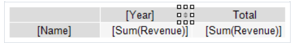

当在预览窗口中点击此按钮的时候, 对应的头将会排序, 下面的示例将会根据选择列的值进行排序行。
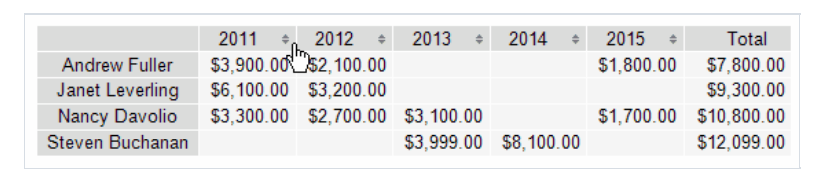

这个按钮的每一次按压会在三种排序模式中切换:  `升序/降序/不排序`;

### 增加排序按钮

能够根据上下文菜单进行增加.(默认添加到右边);

> 当增加此按钮的时候,此按钮的属性`Padding.Right` 可以改变,那样将不会和文本重叠.

### 按钮自定义

表头的排序模式可以在汇总标签页中的`Sort/Interactive Sort` 中进行设置,下面的值是可能的:

1. `No` 不排序
2. 'Auto', 默认的排序模式, 排序根据聚合的第一个汇总值排序.
3. `Total(聚合) 名`: 如果头有多个输出值, 你能够选择他们中其中一个进行排序,在下面的示例中, 我们可以根据`ItemSold` 值排序行头,选择`Sum([MatrixDemo.ItemsSold])` 聚合即可:

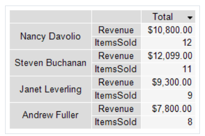

### 删除此按钮

1. `Delete` 按钮
2. 不选中`Sort button` (排序按钮) - 此元素的上下文菜单中


### 移动此按钮

调整`Dock` 属性即可..

### 自定义样式

使用边框工具条,你能够自定义按钮的图标: 框颜色, 样式,和背景,你也能够在属性窗口中设置按钮的以下属性:

1. AllowInactiveSort  默认值(true)  决定按钮是否处于不激活状态..
2. Cursor   Hand(手),鼠标光标形状
3. Exportable False 是否可导出
4. InactiveSortColor  Gray 按钮处于非激活状态的颜色(默认灰色)
5. Printable False 是否可打印(默认false)
6. Symbol   Arrow 符号(默认箭头)
7. SymbolSize 按钮符号尺寸  7

## 示例

### 简单矩阵
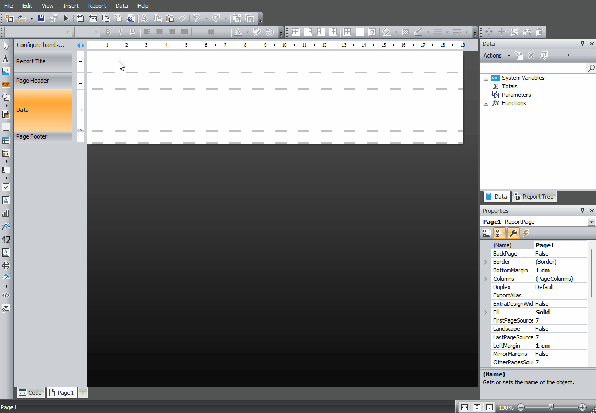

### 复杂表头的矩阵

创建具有复杂表头,增加汇总 ,使用`DisplayText` 属性,头的层次展示、折叠/展开按钮的矩阵:
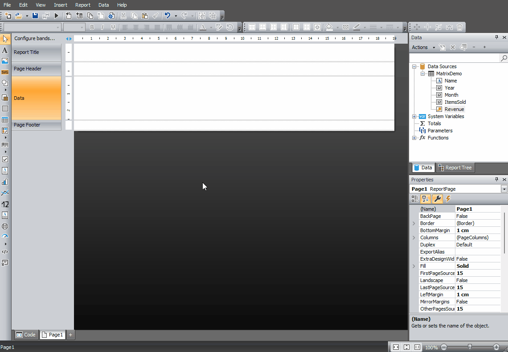

### TopN

创建并配置TopN 分组(两个变种, 简单和自定义化的),展开项,使用矩阵属性`ItemCount`的矩阵:


### 交互式排序
增加交互式排序按钮,增加第二个数据库字段到数据区(ItemsSold), 通过此字段配置交互式排序

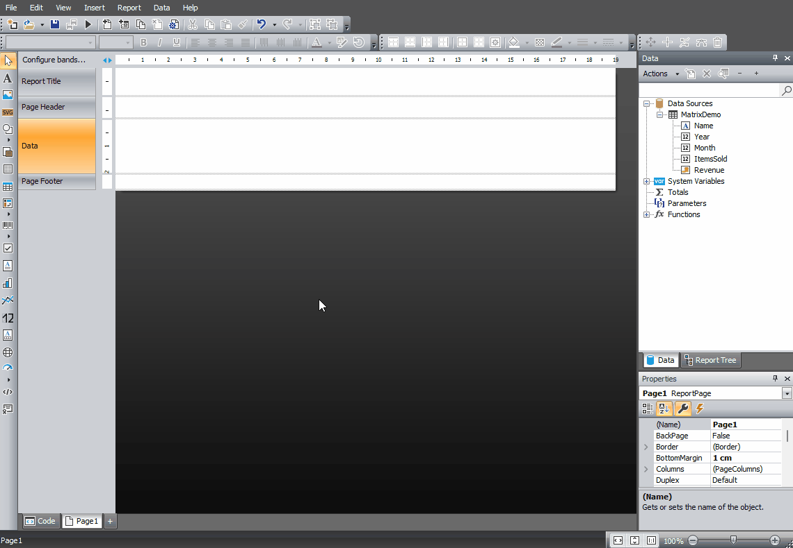