# 交互式报表

在FastReport中准备好的报表能够具备交互性,这意味着它能够反应用户的动作到预览窗口上,你能够使用以下交互:
1. 当点击报表对象的时候, 执行某些类型的操作,例如,你能够运行详细报表,然后在单独的窗口中显示它。
2. 预览窗口能够展示报表轮廓,能够用来在报表中进行导航。

## 超链接

几乎所有的报表对象有`Hyperlink` 属性, 使用这个属性能够定义一个对象去响应鼠标点击(在预览窗口的鼠标动作)

当点击这样的一个动作时,下面的动作能够发生:

1. 导航到一个URL 地址
2. 发送一个e-mail
3. 执行任何形式的系统命令
4. 导航到指定页的报表页
5. 导航到书签(定义在其他报表对象中的)
6. 在单独的预览窗口显示详细报表
7. 自定义的动作 - 在脚本中定义的.

### 超链接配置

选择需要让对象变得可交互的上下文菜单, 选择`Hyperlink...` 选项, 然后超链接编辑窗口将打开:
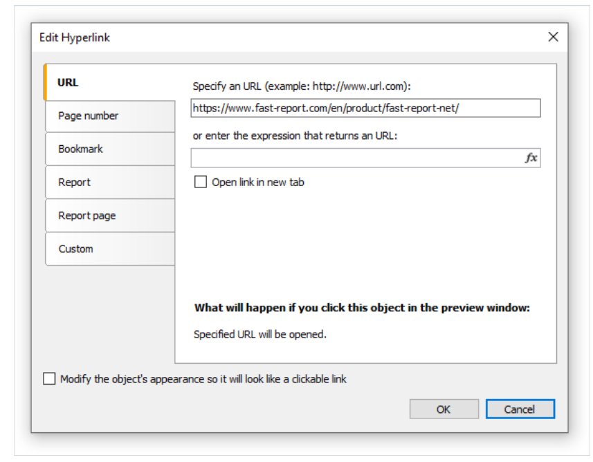

可以选择超链接的类型,完成之后 你可以点击`Modify the object's appearance..` 修改对象的外观按钮, 然后能够 根据以下方式修改对象的外观:

1. 为文本设置蓝色并且它具有下划线 ..
2. 手型光标形式应该需要设置.
在某些情况下,超链接需要再预览窗口中展示,  但是它不需要打印,  只需要禁用`Printable` 对象属性即可, 这能够在属性窗口中完成..

### Link 到URL
这种类型的超链接,能够:
1. 导航到互联网地址
2. 执行某些类型的系统命令, 例如 `mailto: ...` 发送电子邮件

> 当点击这种类型的链接时,`System.Diagnositics.Process.Start` 方法将会执行 - 并且link的值将作为参数.


能能够通过下面两种方式指定链接的值:

1. 简单指定值
2. 表达式指定 (返回值将作为链接的值)

### 链接到给定页码

使用此类型, 能够导航的其他最终报表的其他页面, 大多数情况下,用于导航到首页, 对此,指示页面1 作为链接值 ..


你能够根据两种方式指定页码:

1. 直接指定
2. 这表达式指定


### 链接到书签

这种类型,能够连接到书签, 由其他报表对象定义的书签.

这在Html语言中是著名的, 可以说书签作为一个锚点, 它有一个名字以及一个定义的位置(页码和页面中的位置), 当通过名字移动书签的时候,你能够导航到给定位置.

为了使用这种类型的链接,首先定义书签,先选择对象, 这表示点击链接的时候想要移动的位置,基本上所有的报表对象都有一个`Bookmark` 属性,改变这个属性能够在
属性窗口中完成.

`Bookmark` 包含一个表达式
1. 直接指定名称
2. 表达式指定(也可以使用数据列作为表达式)

在书签定义之后, 你能够在超链接配置窗口中指定它的名称, 能够根据两种方法设定:

1. 直接指定书签的名称
2. 表达式指定 (可以是根据数据列表达式指定的)

### 链接到详细报表

这种类型, 能够展示一个其他报表到单独的预览窗口:

你必须设置下面的参数:

1. 详细报表名称
2. 报表参数的名称, 它将携带超链接的值
3. 超链接的值

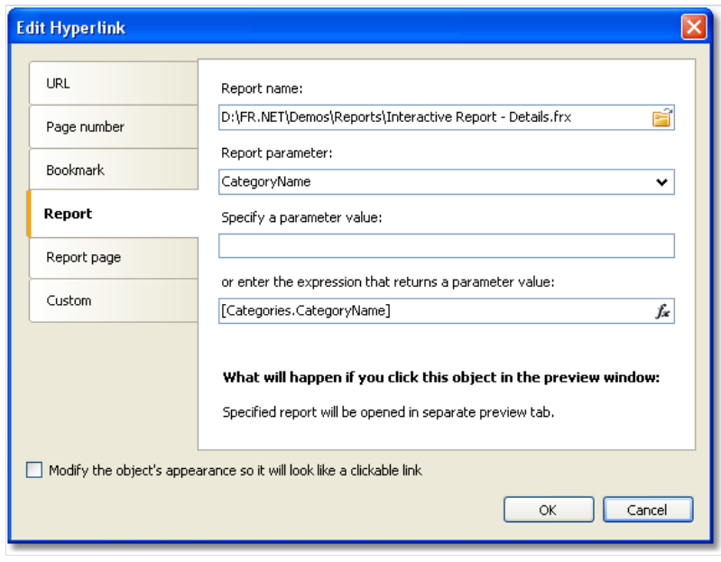

当点击链接的时候,下面的动作将会发生:

1. 指定的报表将会加载
2. 报表的参数将设置为超链接的值
3. 报表将会构建并展示在单独的预览窗口

报表参数的值能够根据两种方法设置:

1. 直接指定
2. 表达式

### 链接到详细报表页
同上, 导航到当前报表的某一页,对此, 报表必须至少有2页, 一个是主报表,另一个为详情报表.

此类链接必须设置以下参数:
1. 报表的页面名称
2. 报表参数的名称
3. 超链接值
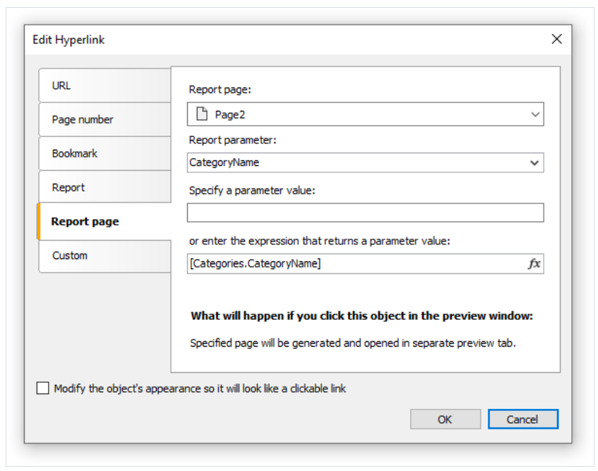

当点击链接时, 下面的事情将会发生:

1. 报表参数设置为超链接的值
2. 指定的报表页将会构建并展示在独立的窗口。

报表参数能够根据两种方式指定:
1. 直接指定
2. 表达式
> 当选择报表页的时候,它的`Visible` 属性将设置为false, 这意味着当主报表构建的时候,此页面将会跳过。

### 自定义链接

这种类型你能够定义自己的反应 - 当点击鼠标的时候, 通过对象的`Click` 事件处理器来做想要的事情:

1. 选择对象并打开属性窗口
2. 增加对象的点击事件处理器
3. 编写处理器代码,例如 你需要链接的目标对象, 超链接的值, 等等相关的必要设置.

下面的处理器设置了超链接的值, 以及想要链接的目标对象.
```text
private void Text2_Click(object sender, EventArgs e)
{
// sender - this is the object which was clicked.
// In order to receive the value of the hyperlink, you need
// to cast the sender to ReportComponentBase type.
object hyperlinkValue = (sender as ReportComponentBase).Hyperlink.Value;
MessageBox.Show("Hyperlink value = " + hyperlinkValue.ToString());
}
```

## 报表大纲

报表轮廓也称为`文档地图` 是一个树视图 - 可以在预览窗口中展示

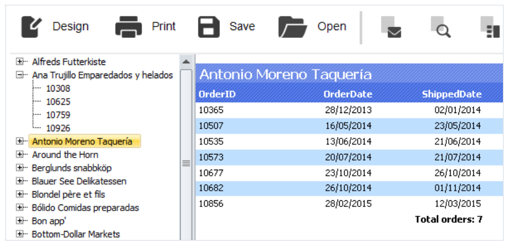

它控制将展示一个树结构, 在报表构建的过程中形成, 如果你点击树元素,你将导航到响应的报表元素上.

如果报表具有大纲, 它将自动的展示, 能能够展示或者隐藏大纲 - 通过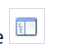 工具栏上的按钮, 这个报表将不会自动的创建大纲,你应该关心这个.

报表页以及它的所有带都有`OutlineExpression` 属性, 为了加载大纲, 指定表达式 -在属性中返回元素的文本,  此表达式将在打印带的时候自动计算, 并且它的值将会加入到大纲中,
如果你的报表是主从或者分组类型, 那么大纲的结构类似于报表的结构.

此属性可以在属性窗口中设置.

这里推荐如何为不同的报表配置大纲:

1. 如果你想要展示准备好的报表的页面到大纲中, 设置报表页的`OutlineExpression`属性, 这个表达式返回页面的数字。
2. 在简单列表的报表类型(具有一个带)中, 设置带的`OutlineExpression` 属性,例如使用打印在带中的数据列.
3. 在主从报表类型中(具有两个带), 设置相关带的`OutlineExpression` 属性, 例如`Category/Product` 报表类型中, 第一个带的`OutlineExpression` 将包含分类的名称,
第二个包含产品的名称.
4. 在分组报表中, 配置分组头和数据带的`OutlineExpression` 属性,分组头的表达式,使用分组条件, 对于数据带, 使用在带中打印的任何数据列.

## 示例

### 构建一个详细报表

在这个示例中,我们构建一个报表它将展示分类列表, 当点击分类名称的时候,详情报表(包含产品列表的报表) - 所属给定分类 将会展示:

1. 首先创建详情报表
2. 定义报表参数 - 它等价于一个分类
3. 对此参数设置数据过滤
4. 创建主报表
5. 在主报表中配置超链接, 详细报表能够使用设置为选择分类的参数去运行

首先,我们创建详情报表, 它包含了一组产品列表,首先创建一个新报表,然后选择产品表作为数据源, 然后根据以下方式放置对象:
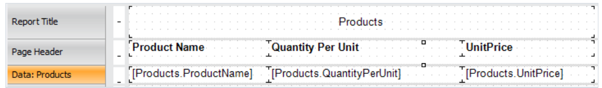

然后创建一个参数被用来传递选择的分类从主报表中到详细报表中, 为了分类识别,使用`CategoryId` 列 - 它同时被分类和产品表包裹,根据以下形式配置此参数:

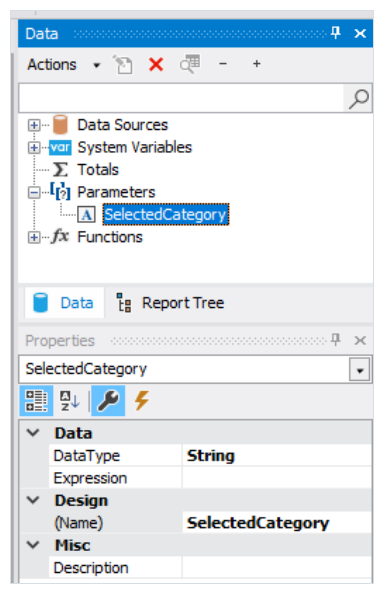

现在我们需要设置数据过滤 - 过滤为给定分类的产品,为了这样做,双击数据带,切换到`Filter` 标签 然后指定下面的条件:
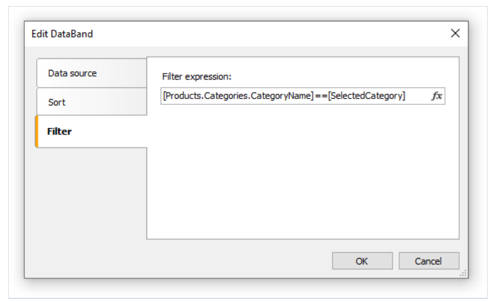

现在可以创建主报表, 使用`Categories` 报表作为数据源, 根据以下形式放置这个对象:

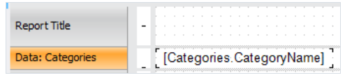

右击文本对象然后选择超链接菜单项, 根据以下方式设置连接:

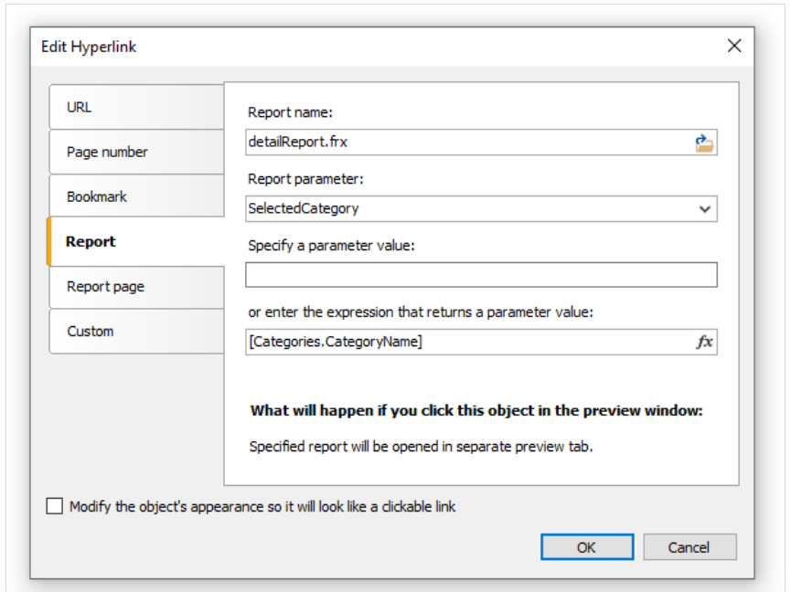

对于报表名称,选择详情报表文件的名称, 报表参数能够在下拉列表中选择,通过点击列表右边的按钮, 对于参数值, 设置`[Categories.CategoryID]` 表达式。

运行报表,你能够看到分类列表:
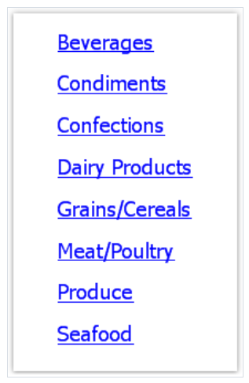

当你点击其中一个分类的时候, 一个详情报表将会构建, 它将展示在预览窗口的独立标签页中.
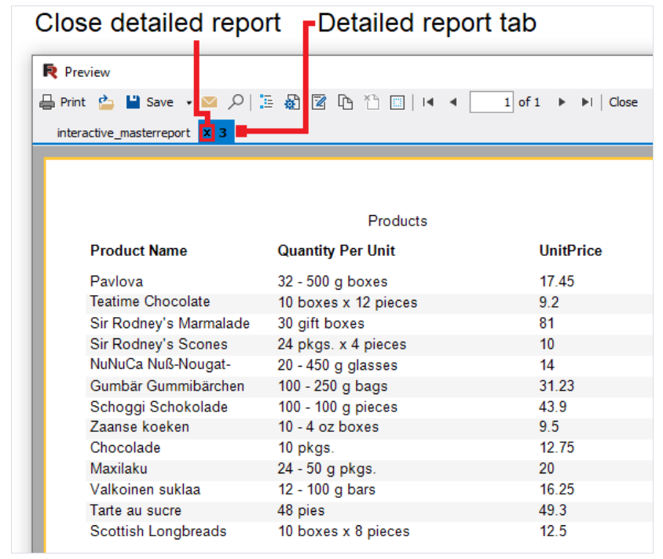

正如图片中看到的, 标签的标题设置为超链接的值, 在我们的示例中 是包含在`CategoryID` 数据列中的数字化值, 这看起来并没有提供信息且不好看, 可以改变为
使用分类名去替代它的值, 对此,做以下内容:
在详情报表中:

1. 改变参数的`DataType` 属性为`String` ..
2. 增加`Categories` 数据源到报表中, 它将被用来关联`CategoryName` 列 - 当过滤数据的时候.
3. 改变`Data` 带的过滤表达式
```text
[Products.Categories.CategoryName] == [SelectedCategory]
```

在主报表中,改变超链接设置,  现在传递`[Categories.CategoryName]` 值作为报表参数。

如果运行报表, 我们能够看到标签页的标题是分类名称, 我们能够改善详情报表, 增加`Text` 对象, 它能够在报表标题中打印出选择分类的名称.

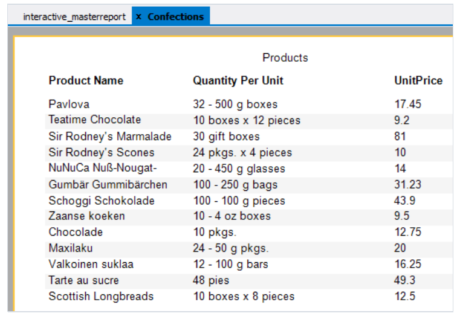

当我们使用这个示例工作的时候,我们创建了两个报表并且可以在他们之间多次切换, 这不是很合适,两个报表可以放在一起, 主报表放在第一页, 详情放在第二页,
在这种情况下 超链接需要根据以下方式设置:
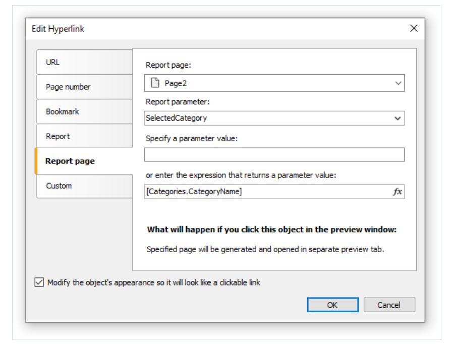

我们进需要选择页面2作为详情报表页面即可。

### 示例3. 交互式矩阵对象

这个示例展示了交互式矩阵对象, 例如,我们下面的示例中我们使用矩阵展示员工的销售额 - 按年分组

矩阵的数据源是`MatrixDemo` , 它呈现了员工的销售额 - 根据年和月分组:

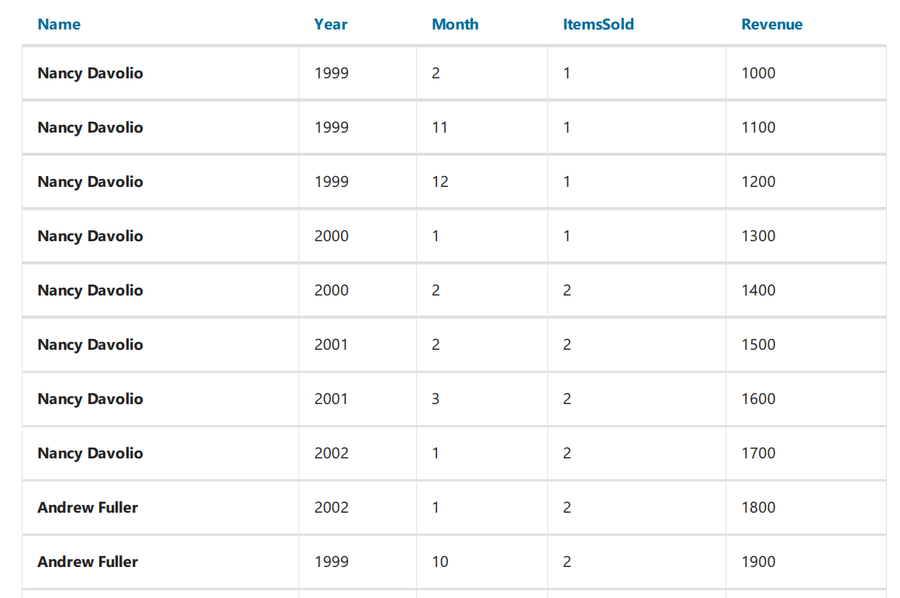

根据以下方式配置矩阵：

1. `MatrixDemo.Year` 作为列头中的数据列
2. `MatrixDemo.Name` 作为行头的数据列
3. `MarixDemo.Revenue` 作为单元格的数据列

最终展示如下:
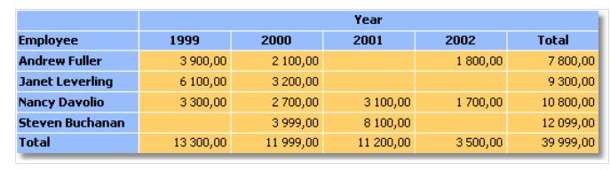

现在我们能够看到 一整年的员工的销售额通过`Total` 汇总显示,  我们可以创建详情报表 - 当点击单元格的时候展示详情报表, 在这个示例中我们的详情报表能够包含
选择(给定年的每一个月的)员工的销售额;

怎样让数据和单元格关联, 它如何打印, 矩阵的每一个单元格可以有自己的地址, 它是列和行头的值合并.  在我们的示例中,单元格的地址是员工的名称和年份的合并.
这个数据可以完全传递到详情报表, 怎么做呢, 非常简单,设置超链接,  仅展示参数和报表的名称, 参数值不需要指定, 对于矩阵单元格,FastReport 自己产生这个值并传递它到这个参数。

也就是说, 我们点击单元格的左上角(包含数字3900), 那么这是员工`Andrew Fuller` 以及 `1999` 年的销售额, 那么传递这个值到参数的形式是什么呢?

FastReport 会合并列和行值, 通过分割符组合:
```text
1999;Andrew Fuller
```

这意味着我们必须从这个字符串抓取年份和员工的名称,然后转换年份为int, 然后使用这些值来进行数据过滤?  不,可以更加简单, 那就是我们创建一个具有内嵌参数的参数,
在这种情况下,父参数看起来如下所示:
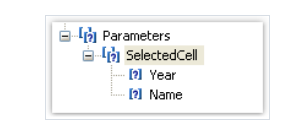

当我们创建这个参数的时候,考虑以下情况:

1. 不需要配置父参数, 仅给他名字
2. 一个父参数可以有多个内嵌参数, 他们的值都可以从矩阵中传递, 在当前示例中, 是2个值
3. 内嵌参数的顺序必须和矩阵传递的值的顺序必须对应,在当前示例中, year作为第一个参数, 员工名称作为第二个参数
4. 内嵌参数可以是你想要的名称, 但是更好是和矩阵元素对应的名称。
5. 重要的是为每一个内嵌参数设置正确的数据类型, 数据类型必须和值相对应, 因为将传递到参数中, 在当前示例中, 第一个参数Year 必须是整型(Int32), 第二个参数(员工名称) - `String`

在我们清楚了所有需要事情之后, 我们将创建一个报表, 选择矩阵的单元格并使用超链接编辑器。
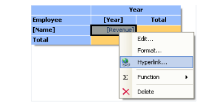

在超链接的配置中,包含父参数作为报表参数,在当前示例中是`SelectedCell` ..

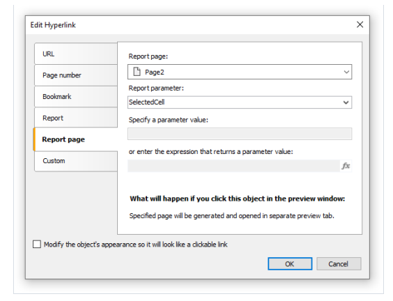

FastReport 传递值到`SelectedCell.Year` 和`SelectedCell.Name` 内嵌参数, 这些值将会转换为对应的数据类型(根据参数配置), 这就是为什么需要正确的配置参数类型

详细报表可以放在主报表的单独页 然后使用相同数据源。

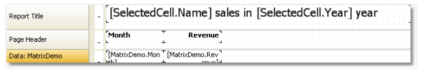

(详情报表)为了展示选择员工某一年的销售额, 设置过滤, 对此,打开带编辑器i 然后指定下面的过滤表达式:

```text
[MatrixDemo.Year] == [SelectedCell.Year] && [MatrixDemo.Name] == [SelectedCell.Name]
```

现在报表已经准备好了, 现在预览并点击单元格超链接, 则打开详情报表并具有以下值:
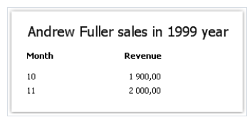

正如你所见,(1900 + 2000)的汇总值对应了矩阵上的单元格 - 我们所打开的详情报表上。

## 示例4. 具有目录的报表，导航以及大纲

在这个示例中, 我们创建一个具有以下特性的报表:

1. 第一页我们将打印 TOC(table of contents) - 具有交互性, 例如能能够点击这些元导航到对应的页面.
2. 在预览创建中, 它将展示在大纲中, 同样具有交互性。

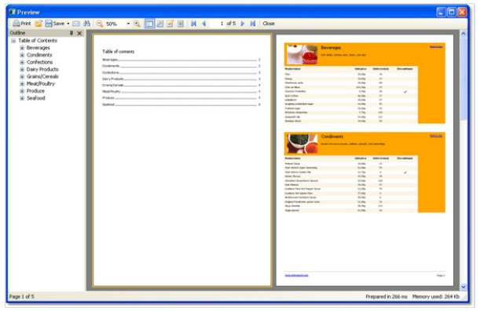

报表将使用分类和产品表,  在TOC中, 我们将打印分类列表, 报表的剩余内容将打印分类的产品列表, 报表模版将由两个页面组成,  第一页将被用来打印TOC,第二页作为报表的主要部分。

我们首先讨论TOC,  创建一个新报表然后增加分类以及产品数据源到它, 链接数据带到分类表 然后根据以下方式放置对象:
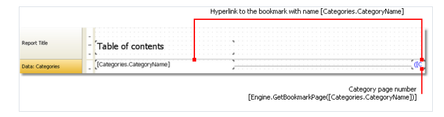

为了让TOC 对象具有交互性, 配置它的`Hyperlink` 属性
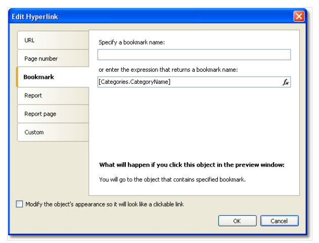

将分类名作为书签, 我们稍后定义对象的书签。

为了在TOC中打印行号, 我们需要做以下事情:

1. 启用`double pass` 二次渲染,  因为TOC页面需要在其他页面之前打印, 此时FastReport 还不知道分类将打印。
2. 使用`Engine.GetBookmarkPage` 函数,这个函数将会返回指定书签的页码, 在当前示例中,我们能够使用`[Categories.CategoryName]` 表达式作为书签名,因此函数调用将如下所示:
```text
[Engine.GetBookmarkPage([Categories.CategoryName])]
```

在报表的第二页中, 我们创建一个主从报表,如下所示:
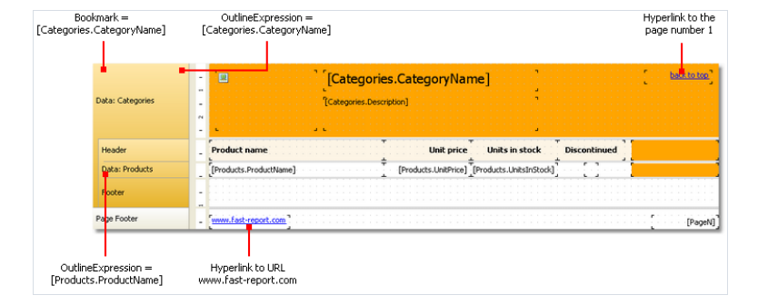

配置书签 - 当我们点击TOC的元素时应该导航到.. 对此,选择第一个数据带然后在它的`Bookmark` 属性上设置以下表达式:
```text
[Categories.CategoryName]
```
为了配置报表大纲,做以下事情:
1. 选择第一个报表页,这能够通过切换页面完成
2. 在属性窗口中, 设置以下值到`OutlineExpression` 属性上
```text
"Contents"
```
3. 切换到第二个报表页
4. 选择第一个数据带 然后设置它的`OutlineExpression` 属性
```text
[Categories.CategoryName]
```
5. 设置第二个数据带然后设置它的`OutlineExpression` 属性
```text
[Products.ProductName]
```